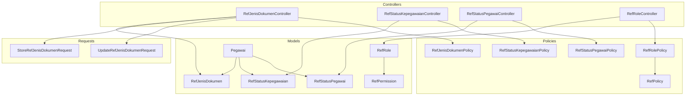
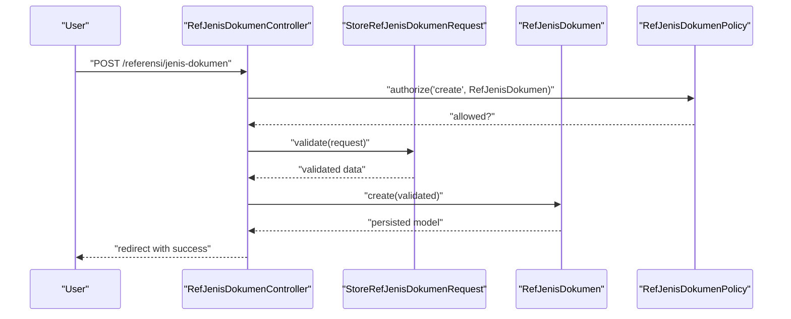
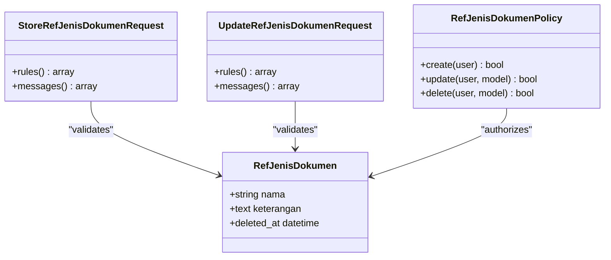
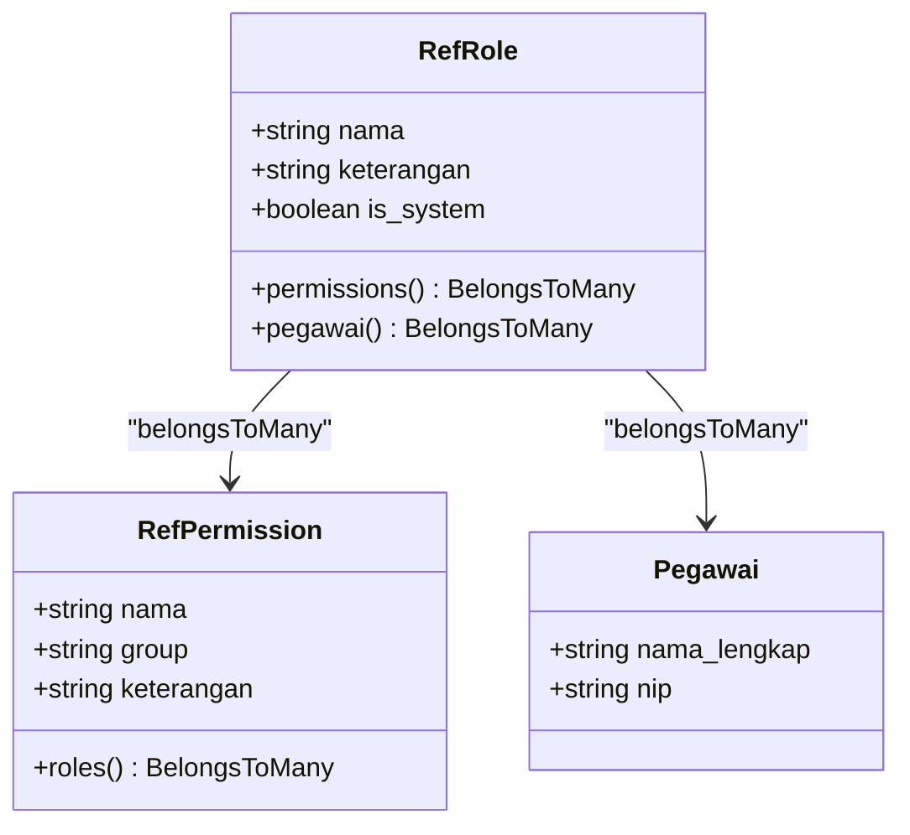
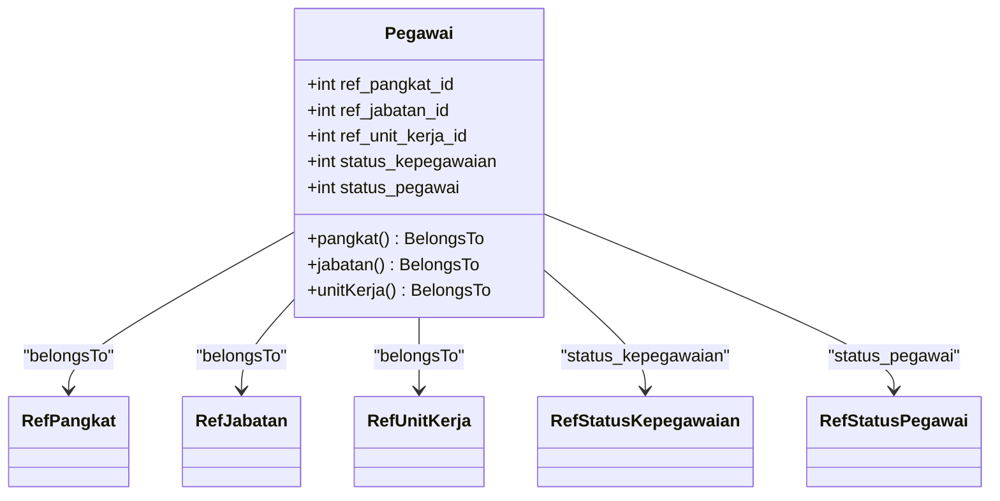
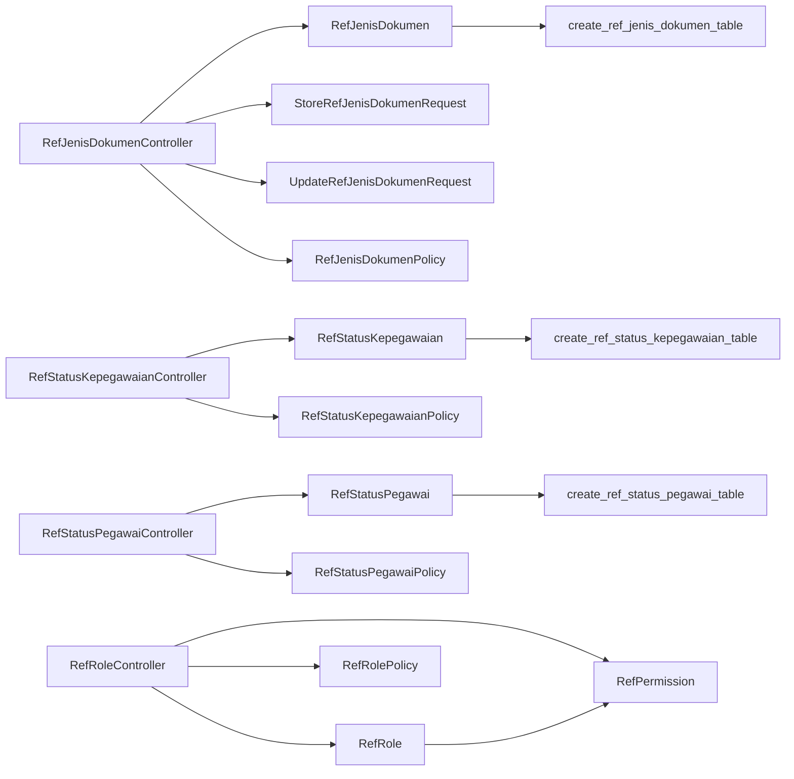

# Reference Data Management

<cite>
**Referenced Files in This Document**
- [RefJenisDokumenController.php](file://app/Http/Controllers/Referensi/RefJenisDokumenController.php)
- [RefStatusKepegawaianController.php](file://app/Http/Controllers/Referensi/RefStatusKepegawaianController.php)
- [RefStatusPegawaiController.php](file://app/Http/Controllers/Referensi/RefStatusPegawaiController.php)
- [RefRoleController.php](file://app/Http/Controllers/Referensi/RefRoleController.php)
- [RefJenisDokumen.php](file://app/Models/RefJenisDokumen.php)
- [RefStatusKepegawaian.php](file://app/Models/RefStatusKepegawaian.php)
- [RefStatusPegawai.php](file://app/Models/RefStatusPegawai.php)
- [RefRole.php](file://app/Models/RefRole.php)
- [RefPermission.php](file://app/Models/RefPermission.php)
- [Pegawai.php](file://app/Models/Pegawai.php)
- [StoreRefJenisDokumenRequest.php](file://app/Http/Requests/Referensi/StoreRefJenisDokumenRequest.php)
- [UpdateRefJenisDokumenRequest.php](file://app/Http/Requests/Referensi/UpdateRefJenisDokumenRequest.php)
- [RefJenisDokumenPolicy.php](file://app/Policies/RefJenisDokumenPolicy.php)
- [RefStatusKepegawaianPolicy.php](file://app/Policies/RefStatusKepegawaianPolicy.php)
- [RefStatusPegawaiPolicy.php](file://app/Policies/RefStatusPegawaiPolicy.php)
- [RefRolePolicy.php](file://app/Policies/RefRolePolicy.php)
- [RefPolicy.php](file://app/Policies/RefPolicy.php)
- [create_ref_jenis_dokumen_table.php](file://database/migrations/2026_03_15_162757_create_ref_jenis_dokumen_table.php)
- [create_ref_status_kepegawaian_table.php](file://database/migrations/2026_03_15_163309_create_ref_status_kepegawaian_table.php)
- [create_ref_status_pegawai_table.php](file://database/migrations/2026_03_15_163309_create_ref_status_pegawai_table.php)
</cite>

## Table of Contents
1. [Introduction](#introduction)
2. [Project Structure](#project-structure)
3. [Core Components](#core-components)
4. [Architecture Overview](#architecture-overview)
5. [Detailed Component Analysis](#detailed-component-analysis)
6. [Dependency Analysis](#dependency-analysis)
7. [Performance Considerations](#performance-considerations)
8. [Troubleshooting Guide](#troubleshooting-guide)
9. [Conclusion](#conclusion)
10. [Appendices](#appendices)

## Introduction
This document describes the Reference Data Management system that maintains standardized static lookup tables and classification hierarchies used across the HRIS. It focuses on reference tables prefixed with ref_ and classification data that underpin employee records and system access control. The system supports CRUD operations with strict validation and authorization, integrates with employee records through foreign keys, and provides a consistent taxonomy for positions, ranks, statuses, and document types.

The system is organized around:
- Reference controllers implementing standard CRUD actions with Inertia rendering
- Form requests enforcing validation rules and uniqueness constraints
- Eloquent models with soft deletes and ULIDs for immutable identifiers
- Policies governing access to reference data operations
- Migrations defining normalized relational schemas

## Project Structure
The Reference Data Management module is structured by domain and follows Laravel conventions:
- Controllers under app/Http/Controllers/Referensi handle UI flows and persistence
- Models under app/Models represent reference entities and relationships
- Form requests under app/Http/Requests/Referensi validate inputs per entity
- Policies under app/Policies enforce authorization rules
- Migrations under database/migrations define reference table schemas

**Diagram sources**
- [RefJenisDokumenController.php:1-78](file://app/Http/Controllers/Referensi/RefJenisDokumenController.php#L1-L78)
- [RefStatusKepegawaianController.php:1-81](file://app/Http/Controllers/Referensi/RefStatusKepegawaianController.php#L1-L81)
- [RefStatusPegawaiController.php:1-69](file://app/Http/Controllers/Referensi/RefStatusPegawaiController.php#L1-L69)
- [RefRoleController.php:1-132](file://app/Http/Controllers/Referensi/RefRoleController.php#L1-L132)
- [RefJenisDokumen.php:1-29](file://app/Models/RefJenisDokumen.php#L1-L29)
- [RefStatusKepegawaian.php:1-30](file://app/Models/RefStatusKepegawaian.php#L1-L30)
- [RefStatusPegawai.php:1-30](file://app/Models/RefStatusPegawai.php#L1-L30)
- [RefRole.php:1-44](file://app/Models/RefRole.php#L1-L44)
- [RefPermission.php:1-30](file://app/Models/RefPermission.php#L1-L30)
- [Pegawai.php:1-200](file://app/Models/Pegawai.php#L1-L200)
- [StoreRefJenisDokumenRequest.php:1-33](file://app/Http/Requests/Referensi/StoreRefJenisDokumenRequest.php#L1-L33)
- [UpdateRefJenisDokumenRequest.php:1-42](file://app/Http/Requests/Referensi/UpdateRefJenisDokumenRequest.php#L1-L42)
- [RefJenisDokumenPolicy.php:1-44](file://app/Policies/RefJenisDokumenPolicy.php#L1-L44)
- [RefStatusKepegawaianPolicy.php:1-44](file://app/Policies/RefStatusKepegawaianPolicy.php#L1-L44)
- [RefStatusPegawaiPolicy.php:1-44](file://app/Policies/RefStatusPegawaiPolicy.php#L1-L44)
- [RefRolePolicy.php:1-49](file://app/Policies/RefRolePolicy.php#L1-L49)
- [RefPolicy.php:1-44](file://app/Policies/RefPolicy.php#L1-L44)

**Section sources**
- [RefJenisDokumenController.php:1-78](file://app/Http/Controllers/Referensi/RefJenisDokumenController.php#L1-L78)
- [RefStatusKepegawaianController.php:1-81](file://app/Http/Controllers/Referensi/RefStatusKepegawaianController.php#L1-L81)
- [RefStatusPegawaiController.php:1-69](file://app/Http/Controllers/Referensi/RefStatusPegawaiController.php#L1-L69)
- [RefRoleController.php:1-132](file://app/Http/Controllers/Referensi/RefRoleController.php#L1-L132)

## Core Components
This section outlines the primary reference data entities and their responsibilities:

- RefJenisDokumen: Static lookup for document type classifications used across employee documents.
- RefStatusKepegawaian: Classification hierarchy for employment status codes and names.
- RefStatusPegawai: Classification for current employment status of staff.
- RefRole: RBAC role definitions linked to permissions and assigned employees.
- RefPermission: Permission definitions grouped for role assignment.
- Pegawai: Employee record that references multiple ref_ tables for standardized attributes.

Key implementation characteristics:
- All reference models use ULIDs for globally unique identifiers and soft deletes for auditability.
- Controllers implement standard CRUD with Inertia rendering and pagination.
- Validation ensures uniqueness and length constraints per field.
- Authorization policies gate access based on permission slugs.

**Section sources**
- [RefJenisDokumen.php:1-29](file://app/Models/RefJenisDokumen.php#L1-L29)
- [RefStatusKepegawaian.php:1-30](file://app/Models/RefStatusKepegawaian.php#L1-L30)
- [RefStatusPegawai.php:1-30](file://app/Models/RefStatusPegawai.php#L1-L30)
- [RefRole.php:1-44](file://app/Models/RefRole.php#L1-L44)
- [RefPermission.php:1-30](file://app/Models/RefPermission.php#L1-L30)
- [Pegawai.php:67-82](file://app/Models/Pegawai.php#L67-L82)

## Architecture Overview
The Reference Data Management architecture follows a layered pattern:
- Presentation: Inertia-driven pages render lists, forms, and edits for reference entities.
- Controllers: Handle HTTP requests, apply authorization, orchestrate validation, and persist changes.
- Models: Define schema, relationships, and casting; enforce soft deletes.
- Validation: Form requests encapsulate rules and localized messages.
- Authorization: Policies derive from a shared base policy and delegate to permission checks.

**Diagram sources**
- [RefJenisDokumenController.php:40-47](file://app/Http/Controllers/Referensi/RefJenisDokumenController.php#L40-L47)
- [StoreRefJenisDokumenRequest.php:16-22](file://app/Http/Requests/Referensi/StoreRefJenisDokumenRequest.php#L16-L22)
- [RefJenisDokumen.php:15-20](file://app/Models/RefJenisDokumen.php#L15-L20)
- [RefJenisDokumenPolicy.php:19-22](file://app/Policies/RefJenisDokumenPolicy.php#L19-L22)

**Section sources**
- [RefJenisDokumenController.php:1-78](file://app/Http/Controllers/Referensi/RefJenisDokumenController.php#L1-L78)
- [RefJenisDokumenPolicy.php:1-44](file://app/Policies/RefJenisDokumenPolicy.php#L1-L44)
- [StoreRefJenisDokumenRequest.php:1-33](file://app/Http/Requests/Referensi/StoreRefJenisDokumenRequest.php#L1-L33)

## Detailed Component Analysis

### RefJenisDokumen: Document Type Classification
Purpose:
- Maintain standardized document type classifications used by employee document records.

CRUD Implementation:
- Index: Paginated listing with search by name.
- Create/Edit: Inertia-rendered forms bound to model data.
- Store/Update: Persist validated attributes.
- Destroy: Soft-delete to preserve referential integrity.

Validation Rules:
- Unique name constraint enforced at database level.
- Name length limited; optional description text.

Authorization:
- Delegates to RefJenisDokumenPolicy, inheriting from RefPolicy.

**Diagram sources**
- [RefJenisDokumen.php:17-20](file://app/Models/RefJenisDokumen.php#L17-L20)
- [StoreRefJenisDokumenRequest.php:16-22](file://app/Http/Requests/Referensi/StoreRefJenisDokumenRequest.php#L16-L22)
- [UpdateRefJenisDokumenRequest.php:17-30](file://app/Http/Requests/Referensi/UpdateRefJenisDokumenRequest.php#L17-L30)
- [RefJenisDokumenPolicy.php:19-32](file://app/Policies/RefJenisDokumenPolicy.php#L19-L32)

**Section sources**
- [RefJenisDokumenController.php:1-78](file://app/Http/Controllers/Referensi/RefJenisDokumenController.php#L1-L78)
- [RefJenisDokumen.php:1-29](file://app/Models/RefJenisDokumen.php#L1-L29)
- [StoreRefJenisDokumenRequest.php:1-33](file://app/Http/Requests/Referensi/StoreRefJenisDokumenRequest.php#L1-L33)
- [UpdateRefJenisDokumenRequest.php:1-42](file://app/Http/Requests/Referensi/UpdateRefJenisDokumenRequest.php#L1-L42)
- [RefJenisDokumenPolicy.php:1-44](file://app/Policies/RefJenisDokumenPolicy.php#L1-L44)

### RefStatusKepegawaian: Employment Status Classification
Purpose:
- Standardized classification for employment status with unique code and name.

CRUD Implementation:
- Search supports both code and name matching.
- Unique code enforced at schema level.

Validation Rules:
- Unique code and name; optional description.

Authorization:
- Inherits from RefPolicy with view/create/update/delete gates.

**Section sources**
- [RefStatusKepegawaianController.php:1-81](file://app/Http/Controllers/Referensi/RefStatusKepegawaianController.php#L1-L81)
- [RefStatusKepegawaian.php:1-30](file://app/Models/RefStatusKepegawaian.php#L1-L30)
- [create_ref_status_kepegawaian_table.php:14-21](file://database/migrations/2026_03_15_163309_create_ref_status_kepegawaian_table.php#L14-L21)
- [RefStatusKepegawaianPolicy.php:1-44](file://app/Policies/RefStatusKepegawaianPolicy.php#L1-L44)

### RefStatusPegawai: Current Staff Status Classification
Purpose:
- Classify the current working status of staff members.

CRUD Implementation:
- Search across code and name.
- Unique code enforcement.

Validation Rules:
- Unique code and name; optional description.

Authorization:
- Inherits from RefPolicy.

**Section sources**
- [RefStatusPegawaiController.php:1-69](file://app/Http/Controllers/Referensi/RefStatusPegawaiController.php#L1-L69)
- [RefStatusPegawai.php:1-30](file://app/Models/RefStatusPegawai.php#L1-L30)
- [create_ref_status_pegawai_table.php:14-21](file://database/migrations/2026_03_15_163309_create_ref_status_pegawai_table.php#L14-L21)
- [RefStatusPegawaiPolicy.php:1-44](file://app/Policies/RefStatusPegawaiPolicy.php#L1-L44)

### RefRole: RBAC Role Management
Purpose:
- Define roles with metadata and assign permissions and employees.

CRUD Implementation:
- Index: Lists roles with counts of permissions and assigned employees; searchable by name or description.
- Create: Builds role with optional permission assignments.
- Edit: Loads role with permissions and paginated employee search for assignment.
- Update: Syncs permissions and employee assignments.
- Destroy: Prevents deletion of system roles and roles with assigned employees.

Relationships:
- Many-to-many with RefPermission via pivot table.
- Many-to-many with Pegawai via pivot table.

Authorization:
- Extends RefPolicy; denies delete for system roles.

**Diagram sources**
- [RefRole.php:18-37](file://app/Models/RefRole.php#L18-L37)
- [RefPermission.php:18-28](file://app/Models/RefPermission.php#L18-L28)
- [Pegawai.php:84-95](file://app/Models/Pegawai.php#L84-L95)

**Section sources**
- [RefRoleController.php:1-132](file://app/Http/Controllers/Referensi/RefRoleController.php#L1-L132)
- [RefRole.php:1-44](file://app/Models/RefRole.php#L1-L44)
- [RefRolePolicy.php:1-49](file://app/Policies/RefRolePolicy.php#L1-L49)

### Employee Records and Reference Data
Purpose:
- Employee records reference standardized classification data to maintain consistency and integrity.

Relationships:
- Employee belongs to RefPangkat, RefJabatan, and RefUnitKerja via foreign keys.
- Employee’s status fields reference RefStatusKepegawaian and RefStatusPegawai.

**Diagram sources**
- [Pegawai.php:69-82](file://app/Models/Pegawai.php#L69-L82)
- [RefStatusKepegawaian.php:1-30](file://app/Models/RefStatusKepegawaian.php#L1-L30)
- [RefStatusPegawai.php:1-30](file://app/Models/RefStatusPegawai.php#L1-L30)

**Section sources**
- [Pegawai.php:67-82](file://app/Models/Pegawai.php#L67-L82)

## Dependency Analysis
This section maps dependencies among reference controllers, models, requests, policies, and migrations.

**Diagram sources**
- [RefJenisDokumenController.php:1-78](file://app/Http/Controllers/Referensi/RefJenisDokumenController.php#L1-L78)
- [RefStatusKepegawaianController.php:1-81](file://app/Http/Controllers/Referensi/RefStatusKepegawaianController.php#L1-L81)
- [RefStatusPegawaiController.php:1-69](file://app/Http/Controllers/Referensi/RefStatusPegawaiController.php#L1-L69)
- [RefRoleController.php:1-132](file://app/Http/Controllers/Referensi/RefRoleController.php#L1-L132)
- [RefJenisDokumen.php:1-29](file://app/Models/RefJenisDokumen.php#L1-L29)
- [RefStatusKepegawaian.php:1-30](file://app/Models/RefStatusKepegawaian.php#L1-L30)
- [RefStatusPegawai.php:1-30](file://app/Models/RefStatusPegawai.php#L1-L30)
- [RefRole.php:1-44](file://app/Models/RefRole.php#L1-L44)
- [RefPermission.php:1-30](file://app/Models/RefPermission.php#L1-L30)
- [create_ref_jenis_dokumen_table.php:11-17](file://database/migrations/2026_03_15_162757_create_ref_jenis_dokumen_table.php#L11-L17)
- [create_ref_status_kepegawaian_table.php:14-21](file://database/migrations/2026_03_15_163309_create_ref_status_kepegawaian_table.php#L14-L21)
- [create_ref_status_pegawai_table.php:14-21](file://database/migrations/2026_03_15_163309_create_ref_status_pegawai_table.php#L14-L21)

**Section sources**
- [RefJenisDokumenController.php:1-78](file://app/Http/Controllers/Referensi/RefJenisDokumenController.php#L1-L78)
- [RefStatusKepegawaianController.php:1-81](file://app/Http/Controllers/Referensi/RefStatusKepegawaianController.php#L1-L81)
- [RefStatusPegawaiController.php:1-69](file://app/Http/Controllers/Referensi/RefStatusPegawaiController.php#L1-L69)
- [RefRoleController.php:1-132](file://app/Http/Controllers/Referensi/RefRoleController.php#L1-L132)

## Performance Considerations
- Pagination: Controllers paginate listings to limit payload sizes and improve responsiveness.
- Search filters: Use targeted LIKE queries on indexed columns; consider adding database indexes for frequently searched fields.
- Soft deletes: Enable audit trails without hard deletions; ensure appropriate indexing on deleted_at.
- Relationship loading: Use eager loading where necessary to avoid N+1 queries in listing contexts.
- Unique constraints: Enforce uniqueness at the database level to prevent race conditions during concurrent writes.

## Troubleshooting Guide
Common issues and resolutions:
- Duplicate name errors on creation/updating: Ensure unique constraints are respected; validation messages guide users to resolve conflicts.
- Authorization failures: Confirm user permissions include referensi.* or rbac.manage slugs; policies gate all CRUD operations.
- Role deletion blocked: System roles cannot be removed; roles with assigned employees require reassignment before deletion.
- Search yields unexpected results: Verify filter logic matches intended column combinations (code/name).

**Section sources**
- [StoreRefJenisDokumenRequest.php:24-31](file://app/Http/Requests/Referensi/StoreRefJenisDokumenRequest.php#L24-L31)
- [UpdateRefJenisDokumenRequest.php:32-40](file://app/Http/Requests/Referensi/UpdateRefJenisDokumenRequest.php#L32-L40)
- [RefRolePolicy.php:32-36](file://app/Policies/RefRolePolicy.php#L32-L36)
- [RefJenisDokumenPolicy.php:19-32](file://app/Policies/RefJenisDokumenPolicy.php#L19-L32)

## Conclusion
The Reference Data Management system provides a robust foundation for standardized classifications across the HRIS. Through consistent controller patterns, strict validation, and comprehensive authorization, it ensures data integrity and controlled access. The modular design enables maintainability and scalability while supporting employee records with reliable foreign-key references to reference tables.

## Appendices

### Practical Examples

- Reference Data Maintenance (Document Types)
  - Create: Submit a form with a unique name and optional description; on success, the system persists the record and redirects to the list with a success message.
  - Update: Modify name or description; validation enforces uniqueness against existing records.
  - Delete: Soft-delete preserves historical linkage; system prevents duplicate names upon restoration.

- Lookup Operations
  - Search across reference lists using filters; controllers apply LIKE queries to relevant columns and paginate results.
  - Employee records reference standardized classifications via foreign keys; UI displays human-readable names derived from ref_ tables.

- Data Validation
  - Unique constraints on names/codes; length limits; optional text fields.
  - Localized error messages guide users to correct invalid entries.

**Section sources**
- [RefJenisDokumenController.php:15-31](file://app/Http/Controllers/Referensi/RefJenisDokumenController.php#L15-L31)
- [RefStatusKepegawaianController.php:15-34](file://app/Http/Controllers/Referensi/RefStatusKepegawaianController.php#L15-L34)
- [RefStatusPegawaiController.php:15-31](file://app/Http/Controllers/Referensi/RefStatusPegawaiController.php#L15-L31)
- [RefRoleController.php:17-37](file://app/Http/Controllers/Referensi/RefRoleController.php#L17-L37)
- [StoreRefJenisDokumenRequest.php:16-22](file://app/Http/Requests/Referensi/StoreRefJenisDokumenRequest.php#L16-L22)
- [UpdateRefJenisDokumenRequest.php:17-30](file://app/Http/Requests/Referensi/UpdateRefJenisDokumenRequest.php#L17-L30)