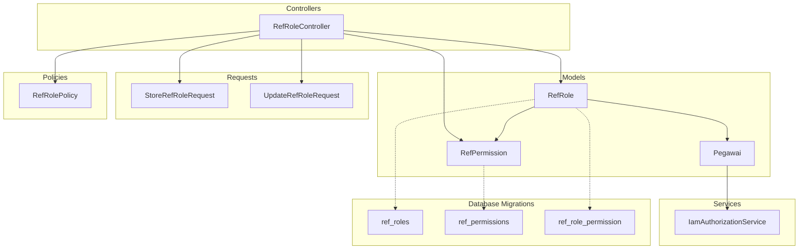
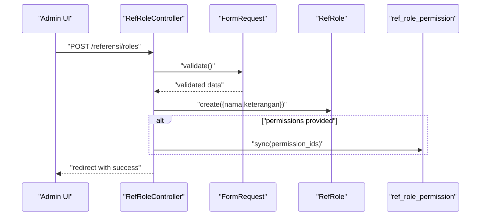
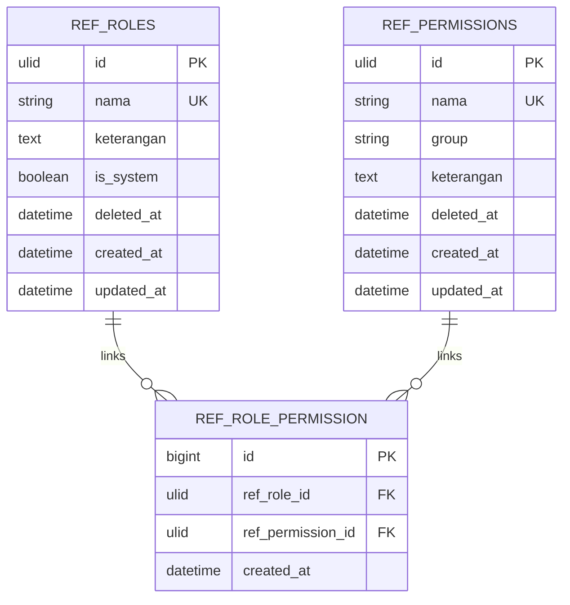
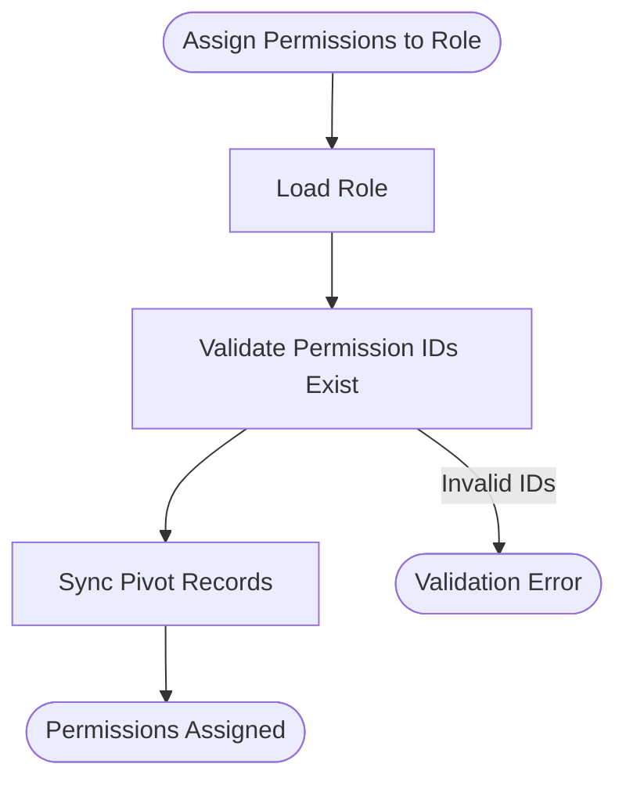
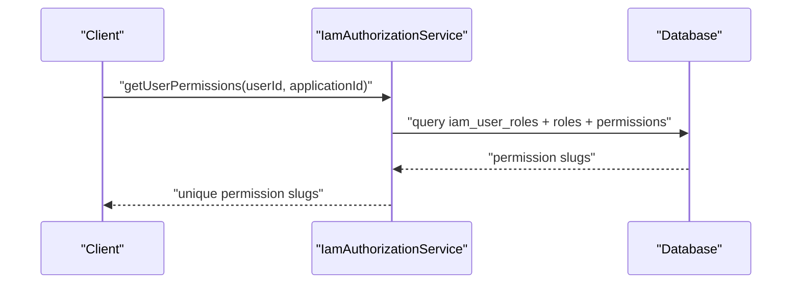
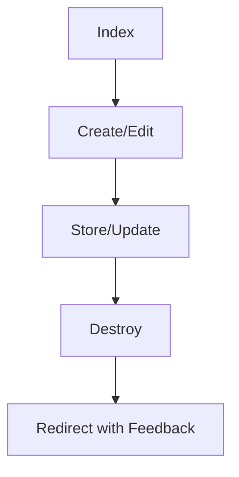
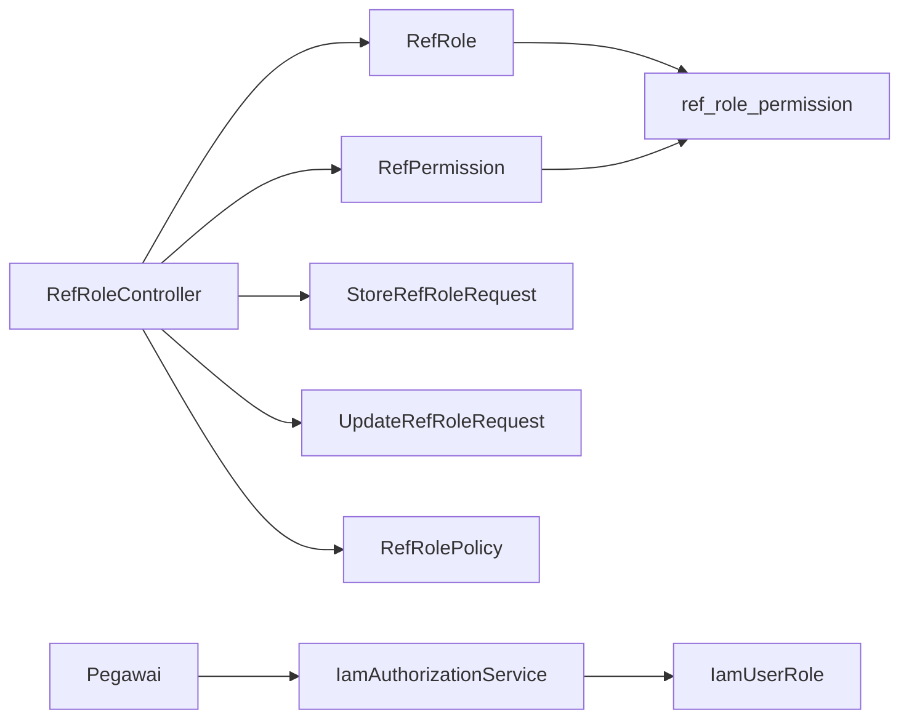

# Role and Permission Reference Data

<cite>
**Referenced Files in This Document**
- [RefRoleController.php](file://app/Http/Controllers/Referensi/RefRoleController.php)
- [StoreRefRoleRequest.php](file://app/Http/Requests/Referensi/StoreRefRoleRequest.php)
- [UpdateRefRoleRequest.php](file://app/Http/Requests/Referensi/UpdateRefRoleRequest.php)
- [RefRolePolicy.php](file://app/Policies/RefRolePolicy.php)
- [RefRole.php](file://app/Models/RefRole.php)
- [RefPermission.php](file://app/Models/RefPermission.php)
- [RefJabatan.php](file://app/Models/RefJabatan.php)
- [Pegawai.php](file://app/Models/Pegawai.php)
- [IamAuthorizationService.php](file://app/Services/IamAuthorizationService.php)
- [2026_03_15_164127_create_ref_roles_table.php](file://database/migrations/2026_03_15_164127_create_ref_roles_table.php)
- [2026_03_15_164127_create_ref_permissions_table.php](file://database/migrations/2026_03_15_164127_create_ref_permissions_table.php)
- [2026_03_15_164128_create_ref_role_permission_table.php](file://database/migrations/2026_03_15_164128_create_ref_role_permission_table.php)
</cite>

## Table of Contents
1. [Introduction](#introduction)
2. [Project Structure](#project-structure)
3. [Core Components](#core-components)
4. [Architecture Overview](#architecture-overview)
5. [Detailed Component Analysis](#detailed-component-analysis)
6. [Dependency Analysis](#dependency-analysis)
7. [Performance Considerations](#performance-considerations)
8. [Troubleshooting Guide](#troubleshooting-guide)
9. [Conclusion](#conclusion)

## Introduction
This document explains the Role and Permission Reference Data system used for managing organizational roles and permissions within the application. It covers the reference role and permission tables, many-to-many relationships, CRUD operations through the controller, validation rules, and how this data integrates with the IAM system and user access control. It also documents the database schema, pivot table relationships, constraints, and practical scenarios for assigning roles and permissions to support fine-grained access control.

## Project Structure
The Role and Permission Reference Data system spans controllers, models, requests, policies, and database migrations. The primary controller for reference roles is located under the Referensi namespace, while the IAM roles and permissions are managed under the Iam namespace. The reference roles and permissions are stored in dedicated tables with pivot tables linking roles to permissions and users to roles.



**Diagram sources**
- [RefRoleController.php:15-131](file://app/Http/Controllers/Referensi/RefRoleController.php#L15-L131)
- [RefRole.php:11-43](file://app/Models/RefRole.php#L11-L43)
- [RefPermission.php:11-29](file://app/Models/RefPermission.php#L11-L29)
- [Pegawai.php:24-208](file://app/Models/Pegawai.php#L24-L208)
- [StoreRefRoleRequest.php:9-35](file://app/Http/Requests/Referensi/StoreRefRoleRequest.php#L9-L35)
- [UpdateRefRoleRequest.php:8-45](file://app/Http/Requests/Referensi/UpdateRefRoleRequest.php#L8-L45)
- [RefRolePolicy.php:8-48](file://app/Policies/RefRolePolicy.php#L8-L48)
- [IamAuthorizationService.php:7-44](file://app/Services/IamAuthorizationService.php#L7-L44)
- [2026_03_15_164127_create_ref_roles_table.php:9-18](file://database/migrations/2026_03_15_164127_create_ref_roles_table.php#L9-L18)
- [2026_03_15_164127_create_ref_permissions_table.php:9-18](file://database/migrations/2026_03_15_164127_create_ref_permissions_table.php#L9-L18)
- [2026_03_15_164128_create_ref_role_permission_table.php:9-17](file://database/migrations/2026_03_15_164128_create_ref_role_permission_table.php#L9-L17)

**Section sources**
- [RefRoleController.php:15-131](file://app/Http/Controllers/Referensi/RefRoleController.php#L15-L131)
- [RefRole.php:11-43](file://app/Models/RefRole.php#L11-L43)
- [RefPermission.php:11-29](file://app/Models/RefPermission.php#L11-L29)
- [Pegawai.php:24-208](file://app/Models/Pegawai.php#L24-L208)
- [StoreRefRoleRequest.php:9-35](file://app/Http/Requests/Referensi/StoreRefRoleRequest.php#L9-L35)
- [UpdateRefRoleRequest.php:8-45](file://app/Http/Requests/Referensi/UpdateRefRoleRequest.php#L8-L45)
- [RefRolePolicy.php:8-48](file://app/Policies/RefRolePolicy.php#L8-L48)
- [IamAuthorizationService.php:7-44](file://app/Services/IamAuthorizationService.php#L7-L44)
- [2026_03_15_164127_create_ref_roles_table.php:9-18](file://database/migrations/2026_03_15_164127_create_ref_roles_table.php#L9-L18)
- [2026_03_15_164127_create_ref_permissions_table.php:9-18](file://database/migrations/2026_03_15_164127_create_ref_permissions_table.php#L9-L18)
- [2026_03_15_164128_create_ref_role_permission_table.php:9-17](file://database/migrations/2026_03_15_164128_create_ref_role_permission_table.php#L9-L17)

## Core Components
- Reference Roles and Permissions:
  - RefRole: Stores role metadata and links to permissions and users.
  - RefPermission: Stores permission metadata grouped for logical categorization.
- Many-to-Many Relationships:
  - RefRole ↔ RefPermission via ref_role_permission pivot.
  - RefRole ↔ Pegawai via pegawai_role pivot.
- Controllers and Validation:
  - RefRoleController handles listing, creating, editing, updating, and deleting roles with permission and user assignments.
  - StoreRefRoleRequest and UpdateRefRoleRequest define validation rules and authorization gates.
  - RefRolePolicy enforces authorization rules, including protection against modifying system roles.
- IAM Integration:
  - IamAuthorizationService aggregates effective permissions and roles for a user within a specific application context.
  - Pegawai model exposes helper methods to check permission slugs and built-in roles.

**Section sources**
- [RefRole.php:11-43](file://app/Models/RefRole.php#L11-L43)
- [RefPermission.php:11-29](file://app/Models/RefPermission.php#L11-L29)
- [RefRoleController.php:15-131](file://app/Http/Controllers/Referensi/RefRoleController.php#L15-L131)
- [StoreRefRoleRequest.php:9-35](file://app/Http/Requests/Referensi/StoreRefRoleRequest.php#L9-L35)
- [UpdateRefRoleRequest.php:8-45](file://app/Http/Requests/Referensi/UpdateRefRoleRequest.php#L8-L45)
- [RefRolePolicy.php:8-48](file://app/Policies/RefRolePolicy.php#L8-L48)
- [IamAuthorizationService.php:7-44](file://app/Services/IamAuthorizationService.php#L7-L44)
- [Pegawai.php:24-208](file://app/Models/Pegawai.php#L24-L208)

## Architecture Overview
The system separates reference roles/permissions from IAM roles/permissions. Reference roles and permissions are administrative constructs used to define baseline capabilities and user assignments. IAM roles and permissions are application-scoped and used for runtime authorization checks.

```mermaid
classDiagram
class RefRole {
+string nama
+string keterangan
+boolean is_system
+permissions()
+pegawai()
+hasPermission(name)
}
class RefPermission {
+string nama
+string group
+string keterangan
+roles()
}
class Pegawai {
+string nip
+string nama_lengkap
+iamRoles()
+hasPermission(slug)
+hasAnyPermission(slugs)
+isAdmin()
+isOperator()
+isViewer()
}
class IamAuthorizationService {
+getUserPermissions(userId, applicationId) string[]
+getUserRoles(userId, applicationId) string[]
}
RefRole ||--o{ RefPermission : "many-to-many via ref_role_permission"
RefRole ||--o{ Pegawai : "many-to-many via pegawai_role"
Pegawai ||..|| RefRole : "via permissions and roles"
IamAuthorizationService --> Pegawai : "aggregates permissions"
```

**Diagram sources**
- [RefRole.php:11-43](file://app/Models/RefRole.php#L11-L43)
- [RefPermission.php:11-29](file://app/Models/RefPermission.php#L11-L29)
- [Pegawai.php:24-208](file://app/Models/Pegawai.php#L24-L208)
- [IamAuthorizationService.php:7-44](file://app/Services/IamAuthorizationService.php#L7-L44)

## Detailed Component Analysis

### Reference Role Management (RefRoleController)
- Responsibilities:
  - List roles with counts of associated permissions and users.
  - Create roles with optional permission assignments.
  - Edit roles, update permission assignments, and manage user assignments.
  - Delete roles with safeguards against system roles and orphaned assignments.
- Authorization:
  - Uses policy gates for viewAny, create, update, delete, and restore.
  - Prevents deletion of system roles.
- Validation:
  - Uses form requests to enforce uniqueness of role names and existence of permission IDs.
  - Supports optional arrays for permissions and user IDs.



**Diagram sources**
- [RefRoleController.php:53-64](file://app/Http/Controllers/Referensi/RefRoleController.php#L53-L64)
- [StoreRefRoleRequest.php:9-35](file://app/Http/Requests/Referensi/StoreRefRoleRequest.php#L9-L35)
- [RefRole.php:11-43](file://app/Models/RefRole.php#L11-L43)

**Section sources**
- [RefRoleController.php:15-131](file://app/Http/Controllers/Referensi/RefRoleController.php#L15-L131)
- [StoreRefRoleRequest.php:9-35](file://app/Http/Requests/Referensi/StoreRefRoleRequest.php#L9-L35)
- [UpdateRefRoleRequest.php:8-45](file://app/Http/Requests/Referensi/UpdateRefRoleRequest.php#L8-L45)
- [RefRolePolicy.php:8-48](file://app/Policies/RefRolePolicy.php#L8-L48)

### Database Schema and Pivot Relationships
- ref_roles: Stores reference roles with unique names, optional system flag, soft deletes, and timestamps.
- ref_permissions: Stores reference permissions with optional grouping, unique names, soft deletes, and timestamps.
- ref_role_permission: Pivot table linking roles to permissions with unique constraint and timestamps.



**Diagram sources**
- [2026_03_15_164127_create_ref_roles_table.php:9-18](file://database/migrations/2026_03_15_164127_create_ref_roles_table.php#L9-L18)
- [2026_03_15_164127_create_ref_permissions_table.php:9-18](file://database/migrations/2026_03_15_164127_create_ref_permissions_table.php#L9-L18)
- [2026_03_15_164128_create_ref_role_permission_table.php:9-17](file://database/migrations/2026_03_15_164128_create_ref_role_permission_table.php#L9-L17)

**Section sources**
- [2026_03_15_164127_create_ref_roles_table.php:9-18](file://database/migrations/2026_03_15_164127_create_ref_roles_table.php#L9-L18)
- [2026_03_15_164127_create_ref_permissions_table.php:9-18](file://database/migrations/2026_03_15_164127_create_ref_permissions_table.php#L9-L18)
- [2026_03_15_164128_create_ref_role_permission_table.php:9-17](file://database/migrations/2026_03_15_164128_create_ref_role_permission_table.php#L9-L17)

### Permission Assignment Patterns and Hierarchical Role Structure
- Many-to-Many Assignments:
  - Roles to Permissions: Managed via ref_role_permission pivot.
  - Roles to Users: Managed via pegawai_role pivot (not covered in this document but part of the broader system).
- Hierarchical Role Structure:
  - The reference role model does not define a hierarchy among roles itself. Hierarchical behavior would require additional modeling (e.g., parent-child role relations) not present in the current schema.
- Permission Assignment:
  - Permissions are assigned by ID to roles. The system validates existence and supports bulk updates via sync operations.



**Diagram sources**
- [RefRoleController.php:53-64](file://app/Http/Controllers/Referensi/RefRoleController.php#L53-L64)
- [RefRole.php:34-37](file://app/Models/RefRole.php#L34-L37)

**Section sources**
- [RefRole.php:28-42](file://app/Models/RefRole.php#L28-L42)
- [RefRoleController.php:53-64](file://app/Http/Controllers/Referensi/RefRoleController.php#L53-L64)

### Integration with IAM System and User Access Control
- Effective Permissions:
  - IamAuthorizationService aggregates permission slugs for a user within a given application context.
- Runtime Checks:
  - Pegawai model exposes methods to check permission slugs and built-in role slugs (admin, operator, viewer).
- Practical Usage:
  - Use hasPermission(slug) to gate UI actions and API endpoints.
  - Use getUserPermissions(userId, applicationId) to build dynamic menus or feature toggles.



**Diagram sources**
- [IamAuthorizationService.php:16-26](file://app/Services/IamAuthorizationService.php#L16-L26)
- [Pegawai.php:141-153](file://app/Models/Pegawai.php#L141-L153)

**Section sources**
- [IamAuthorizationService.php:7-44](file://app/Services/IamAuthorizationService.php#L7-L44)
- [Pegawai.php:24-208](file://app/Models/Pegawai.php#L24-L208)

### CRUD Operations Through RefRoleController
- Index:
  - Paginated listing with search by name or description; includes counts of permissions and users.
- Create:
  - Renders a form pre-populated with available permissions grouped by group and name.
- Store:
  - Validates input via form request, creates role, optionally assigns permissions.
- Edit:
  - Loads role with permissions and paginated user list for assignment.
- Update:
  - Updates role metadata and resyncs permissions and user assignments.
- Destroy:
  - Prevents deletion of system roles and ensures no users are assigned before deletion.



**Diagram sources**
- [RefRoleController.php:17-131](file://app/Http/Controllers/Referensi/RefRoleController.php#L17-L131)

**Section sources**
- [RefRoleController.php:17-131](file://app/Http/Controllers/Referensi/RefRoleController.php#L17-L131)

## Dependency Analysis
- Controller depends on:
  - Models for persistence and relationship queries.
  - Form requests for validation and authorization.
  - Policies for authorization enforcement.
- Models depend on:
  - Pivot tables for many-to-many relationships.
  - Soft deletes for safe removal.
- Service depends on:
  - Pivot tables to compute effective permissions per application.



**Diagram sources**
- [RefRoleController.php:15-131](file://app/Http/Controllers/Referensi/RefRoleController.php#L15-L131)
- [RefRole.php:11-43](file://app/Models/RefRole.php#L11-L43)
- [RefPermission.php:11-29](file://app/Models/RefPermission.php#L11-L29)
- [StoreRefRoleRequest.php:9-35](file://app/Http/Requests/Referensi/StoreRefRoleRequest.php#L9-L35)
- [UpdateRefRoleRequest.php:8-45](file://app/Http/Requests/Referensi/UpdateRefRoleRequest.php#L8-L45)
- [RefRolePolicy.php:8-48](file://app/Policies/RefRolePolicy.php#L8-L48)
- [IamAuthorizationService.php:7-44](file://app/Services/IamAuthorizationService.php#L7-L44)

**Section sources**
- [RefRoleController.php:15-131](file://app/Http/Controllers/Referensi/RefRoleController.php#L15-L131)
- [RefRole.php:11-43](file://app/Models/RefRole.php#L11-L43)
- [RefPermission.php:11-29](file://app/Models/RefPermission.php#L11-L29)
- [StoreRefRoleRequest.php:9-35](file://app/Http/Requests/Referensi/StoreRefRoleRequest.php#L9-L35)
- [UpdateRefRoleRequest.php:8-45](file://app/Http/Requests/Referensi/UpdateRefRoleRequest.php#L8-L45)
- [RefRolePolicy.php:8-48](file://app/Policies/RefRolePolicy.php#L8-L48)
- [IamAuthorizationService.php:7-44](file://app/Services/IamAuthorizationService.php#L7-L44)

## Performance Considerations
- Use eager loading for permissions and users in listings to avoid N+1 queries.
- Apply pagination for large datasets (already implemented).
- Leverage database indexes on frequently filtered columns (e.g., group on permissions).
- Minimize redundant permission computations by caching aggregated slugs per application for active sessions.

## Troubleshooting Guide
- Cannot delete role:
  - System roles are protected; remove the is_system flag or use a non-system role.
  - Role still has users assigned; reassign users to another role before deletion.
- Permission assignment fails:
  - Ensure permission IDs exist and belong to the correct scope.
  - Confirm that the permission IDs array is passed correctly during update.
- Authorization errors:
  - Verify the requesting user has the appropriate policy permissions.
  - Check that the application context aligns with IAM roles and permissions.

**Section sources**
- [RefRoleController.php:109-130](file://app/Http/Controllers/Referensi/RefRoleController.php#L109-L130)
- [RefRolePolicy.php:30-37](file://app/Policies/RefRolePolicy.php#L30-L37)
- [StoreRefRoleRequest.php:16-24](file://app/Http/Requests/Referensi/StoreRefRoleRequest.php#L16-L24)
- [UpdateRefRoleRequest.php:17-34](file://app/Http/Requests/Referensi/UpdateRefRoleRequest.php#L17-L34)

## Conclusion
The Role and Permission Reference Data system provides a robust foundation for managing roles and permissions with clear separation between reference and IAM scopes. The controller-driven CRUD operations, strict validation, and policy enforcement ensure secure and maintainable role management. The many-to-many relationships enable flexible permission assignment and user role linkage, supporting fine-grained access control across the application. Administrators can efficiently manage roles and permissions, while developers can rely on consistent APIs and service abstractions for runtime authorization decisions.