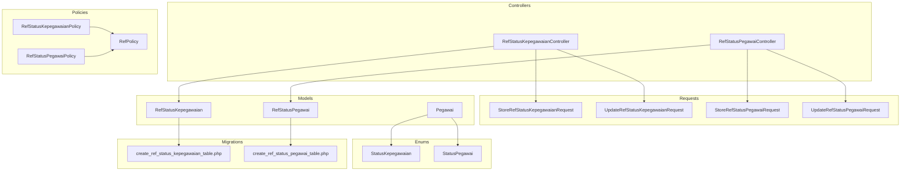
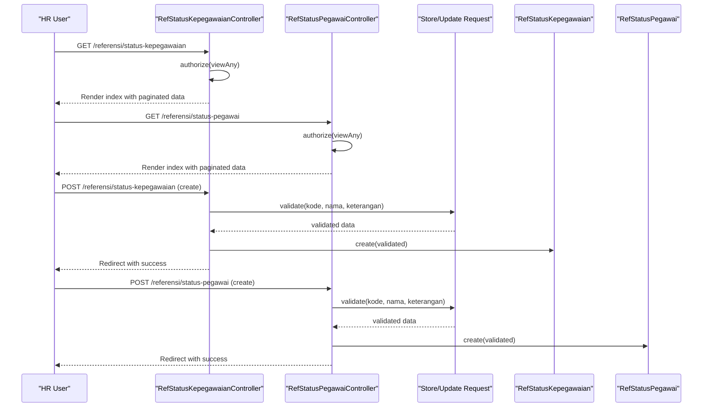
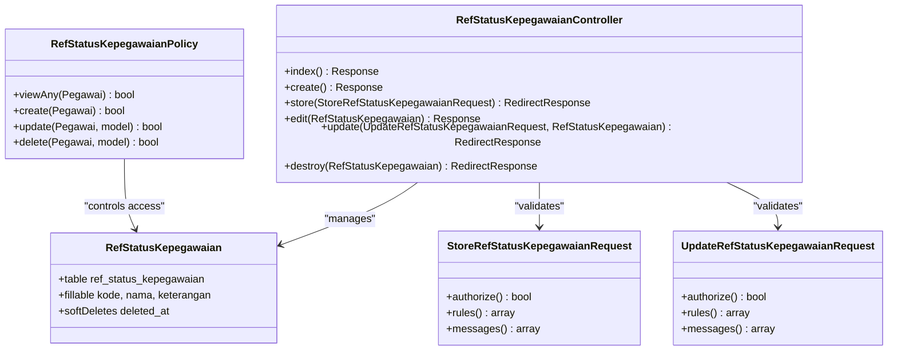
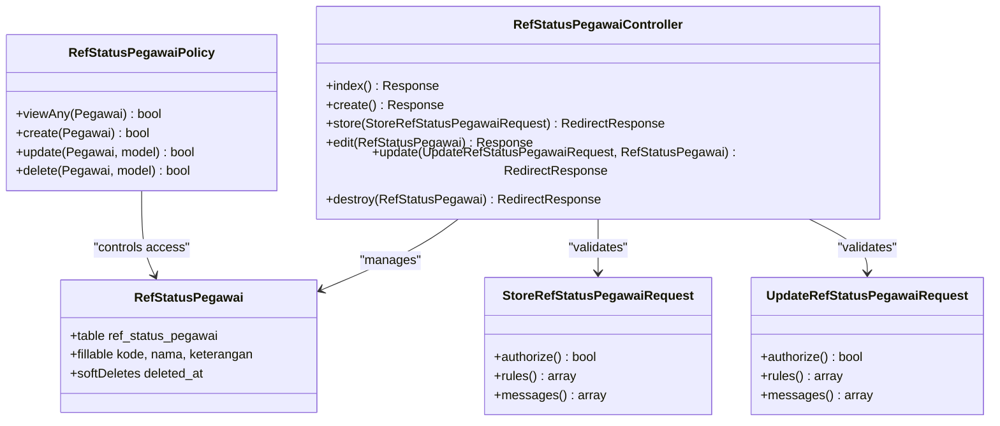
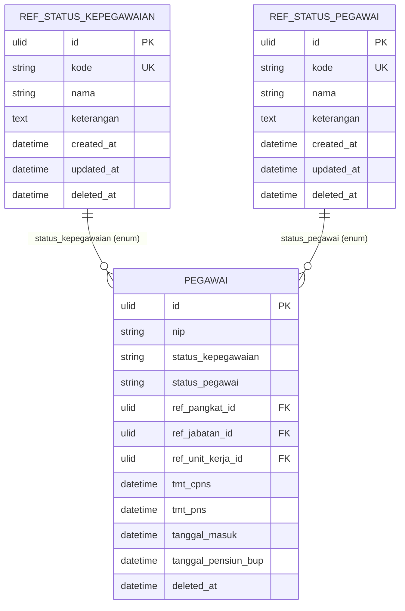
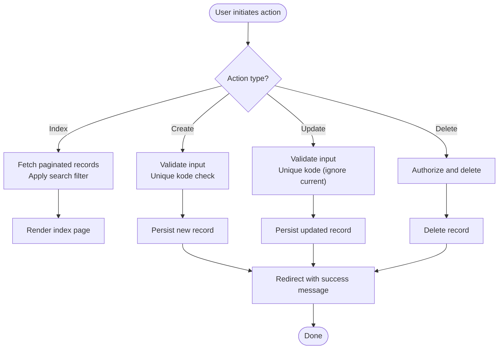
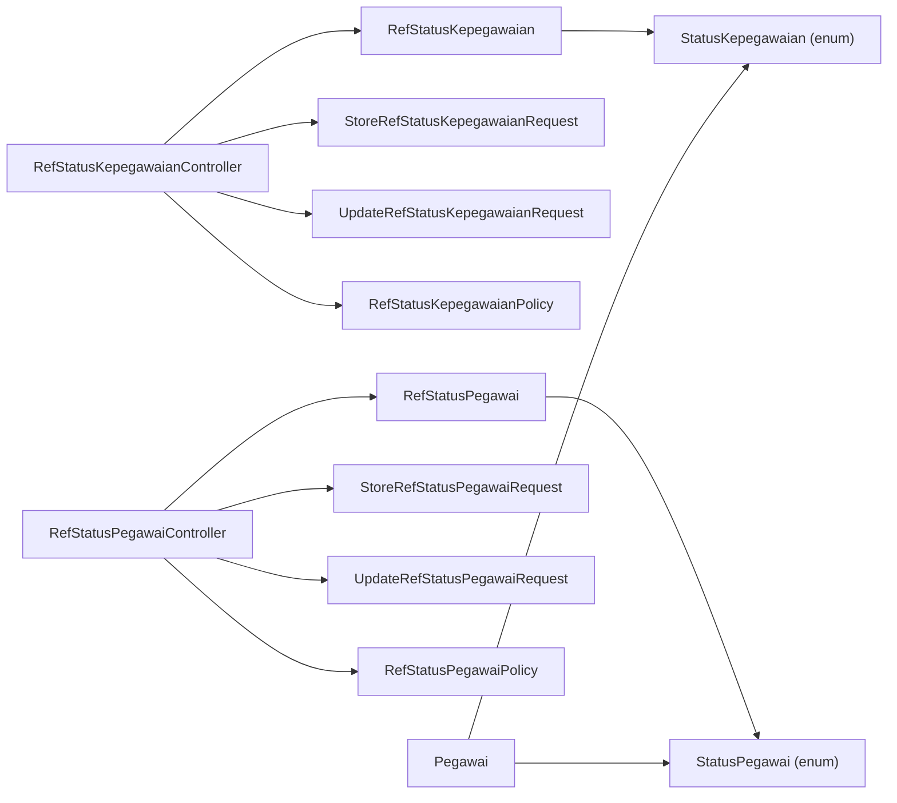

# Status and Classification Reference Data

<cite>
**Referenced Files in This Document**
- [RefStatusKepegawaianController.php](file://app/Http/Controllers/Referensi/RefStatusKepegawaianController.php)
- [RefStatusPegawaiController.php](file://app/Http/Controllers/Referensi/RefStatusPegawaiController.php)
- [RefStatusKepegawaian.php](file://app/Models/RefStatusKepegawaian.php)
- [RefStatusPegawai.php](file://app/Models/RefStatusPegawai.php)
- [RefStatusKepegawaianPolicy.php](file://app/Policies/RefStatusKepegawaianPolicy.php)
- [RefStatusPegawaiPolicy.php](file://app/Policies/RefStatusPegawaiPolicy.php)
- [RefPolicy.php](file://app/Policies/RefPolicy.php)
- [StoreRefStatusKepegawaianRequest.php](file://app/Http/Requests/Referensi/StoreRefStatusKepegawaianRequest.php)
- [UpdateRefStatusKepegawaianRequest.php](file://app/Http/Requests/Referensi/UpdateRefStatusKepegawaianRequest.php)
- [StoreRefStatusPegawaiRequest.php](file://app/Http/Requests/Referensi/StoreRefStatusPegawaiRequest.php)
- [UpdateRefStatusPegawaiRequest.php](file://app/Http/Requests/Referensi/UpdateRefStatusPegawaiRequest.php)
- [StatusKepegawaian.php](file://app/Enums/StatusKepegawaian.php)
- [StatusPegawai.php](file://app/Enums/StatusPegawai.php)
- [Pegawai.php](file://app/Models/Pegawai.php)
- [create_ref_status_kepegawaian_table.php](file://database/migrations/2026_03_15_163309_create_ref_status_kepegawaian_table.php)
- [create_ref_status_pegawai_table.php](file://database/migrations/2026_03_15_163309_create_ref_status_pegawai_table.php)
- [add_status_fk_to_pegawai_table.php](file://database/migrations/2026_03_15_164810_add_status_fk_to_pegawai_table.php)
- [add_ref_status_fks_to_pegawai_table.php](file://database/migrations/2026_03_15_164916_add_ref_status_fks_to_pegawai_table.php)
</cite>

## Table of Contents
1. [Introduction](#introduction)
2. [Project Structure](#project-structure)
3. [Core Components](#core-components)
4. [Architecture Overview](#architecture-overview)
5. [Detailed Component Analysis](#detailed-component-analysis)
6. [Dependency Analysis](#dependency-analysis)
7. [Performance Considerations](#performance-considerations)
8. [Troubleshooting Guide](#troubleshooting-guide)
9. [Conclusion](#conclusion)
10. [Appendices](#appendices)

## Introduction
This document describes the Status and Classification Reference Data system for employment and employee status within the HR application. It explains the business significance of employment status (status kepegawaian) and employee status (status pegawai), documents CRUD operations via dedicated controllers, validation rules, and data relationships. It also covers how these statuses integrate with core HR processes such as monitoring and reporting, and provides practical examples and maintenance procedures for HR administrators and developers.

## Project Structure
The status classification system is organized around:
- Reference tables for employment and employee status
- Controllers implementing CRUD operations
- Validation requests ensuring data integrity
- Policies governing access
- Eloquent models representing reference data
- Enumerations defining allowed values
- Migrations establishing schema and constraints

**Diagram sources**
- [RefStatusKepegawaianController.php:1-81](file://app/Http/Controllers/Referensi/RefStatusKepegawaianController.php#L1-L81)
- [RefStatusPegawaiController.php:1-69](file://app/Http/Controllers/Referensi/RefStatusPegawaiController.php#L1-L69)
- [StoreRefStatusKepegawaianRequest.php:1-36](file://app/Http/Requests/Referensi/StoreRefStatusKepegawaianRequest.php#L1-L36)
- [UpdateRefStatusKepegawaianRequest.php:1-45](file://app/Http/Requests/Referensi/UpdateRefStatusKepegawaianRequest.php#L1-L45)
- [StoreRefStatusPegawaiRequest.php:1-33](file://app/Http/Requests/Referensi/StoreRefStatusPegawaiRequest.php#L1-L33)
- [UpdateRefStatusPegawaiRequest.php:1-37](file://app/Http/Requests/Referensi/UpdateRefStatusPegawaiRequest.php#L1-L37)
- [RefStatusKepegawaian.php:1-30](file://app/Models/RefStatusKepegawaian.php#L1-L30)
- [RefStatusPegawai.php:1-30](file://app/Models/RefStatusPegawai.php#L1-L30)
- [Pegawai.php:1-209](file://app/Models/Pegawai.php#L1-L209)
- [RefStatusKepegawaianPolicy.php:1-44](file://app/Policies/RefStatusKepegawaianPolicy.php#L1-L44)
- [RefStatusPegawaiPolicy.php:1-44](file://app/Policies/RefStatusPegawaiPolicy.php#L1-L44)
- [RefPolicy.php:1-44](file://app/Policies/RefPolicy.php#L1-L44)
- [create_ref_status_kepegawaian_table.php:1-32](file://database/migrations/2026_03_15_163309_create_ref_status_kepegawaian_table.php#L1-L32)
- [create_ref_status_pegawai_table.php:1-32](file://database/migrations/2026_03_15_163309_create_ref_status_pegawai_table.php#L1-L32)

**Section sources**
- [RefStatusKepegawaianController.php:1-81](file://app/Http/Controllers/Referensi/RefStatusKepegawaianController.php#L1-L81)
- [RefStatusPegawaiController.php:1-69](file://app/Http/Controllers/Referensi/RefStatusPegawaiController.php#L1-L69)
- [RefStatusKepegawaian.php:1-30](file://app/Models/RefStatusKepegawaian.php#L1-L30)
- [RefStatusPegawai.php:1-30](file://app/Models/RefStatusPegawai.php#L1-L30)
- [create_ref_status_kepegawaian_table.php:1-32](file://database/migrations/2026_03_15_163309_create_ref_status_kepegawaian_table.php#L1-L32)
- [create_ref_status_pegawai_table.php:1-32](file://database/migrations/2026_03_15_163309_create_ref_status_pegawai_table.php#L1-L32)

## Core Components
- Employment status reference (status kepegawaian): Defines categories such as PNS, PPPK, and Honorer. Managed via RefStatusKepegawaianController and validated by StoreRefStatusKepegawaianRequest and UpdateRefStatusKepegawaianRequest.
- Employee status reference (status pegawai): Defines categories such as Aktif, Mutasi Keluar, Pensiun, Meninggal, and Diberhentikan. Managed via RefStatusPegawaiController and validated by StoreRefStatusPegawaiRequest and UpdateRefStatusPegawaiRequest.
- Enumerations: Strong-typed values for employment and employee statuses ensure consistent interpretation across the system.
- Policies: Access control for reference data CRUD operations derived from a shared RefPolicy.
- Integration with employee records: The Pegawai model uses enums for status_kepegawaian and status_pegawai, enabling filtering and reporting.

**Section sources**
- [RefStatusKepegawaianController.php:1-81](file://app/Http/Controllers/Referensi/RefStatusKepegawaianController.php#L1-L81)
- [RefStatusPegawaiController.php:1-69](file://app/Http/Controllers/Referensi/RefStatusPegawaiController.php#L1-L69)
- [StatusKepegawaian.php:1-20](file://app/Enums/StatusKepegawaian.php#L1-L20)
- [StatusPegawai.php:1-24](file://app/Enums/StatusPegawai.php#L1-L24)
- [Pegawai.php:46-65](file://app/Models/Pegawai.php#L46-L65)

## Architecture Overview
The system follows a layered architecture:
- Presentation: Inertia-driven pages render CRUD forms and lists for status references.
- Controllers: Handle HTTP requests, apply authorization, and orchestrate persistence.
- Validation: Form requests enforce field constraints and uniqueness.
- Persistence: Eloquent models map to reference tables with soft deletes.
- Authorization: Policies delegate permissions to RBAC roles.

**Diagram sources**
- [RefStatusKepegawaianController.php:15-50](file://app/Http/Controllers/Referensi/RefStatusKepegawaianController.php#L15-L50)
- [RefStatusPegawaiController.php:15-45](file://app/Http/Controllers/Referensi/RefStatusPegawaiController.php#L15-L45)
- [StoreRefStatusKepegawaianRequest.php:15-22](file://app/Http/Requests/Referensi/StoreRefStatusKepegawaianRequest.php#L15-L22)
- [StoreRefStatusPegawaiRequest.php:15-21](file://app/Http/Requests/Referensi/StoreRefStatusPegawaiRequest.php#L15-L21)
- [RefStatusKepegawaian.php:17-21](file://app/Models/RefStatusKepegawaian.php#L17-L21)
- [RefStatusPegawai.php:17-21](file://app/Models/RefStatusPegawai.php#L17-L21)

## Detailed Component Analysis

### Employment Status Reference (Status Kepegawaian)
- Purpose: Classifies employees by employment type (e.g., PNS, PPPK, Honorer).
- Business impact: Drives payroll processing, benefits eligibility, and regulatory compliance.
- Implementation:
  - Controller: Supports index, create, store, edit, update, and destroy with search and pagination.
  - Validation: Enforces unique kode, length limits, and optional keterangan.
  - Policy: Delegates permissions to RBAC manage/view/create/update/delete scopes.
  - Model: Soft-deleted reference with ULIDs and fillable attributes.

**Diagram sources**
- [RefStatusKepegawaianController.php:1-81](file://app/Http/Controllers/Referensi/RefStatusKepegawaianController.php#L1-L81)
- [RefStatusKepegawaian.php:1-30](file://app/Models/RefStatusKepegawaian.php#L1-L30)
- [StoreRefStatusKepegawaianRequest.php:1-36](file://app/Http/Requests/Referensi/StoreRefStatusKepegawaianRequest.php#L1-L36)
- [UpdateRefStatusKepegawaianRequest.php:1-45](file://app/Http/Requests/Referensi/UpdateRefStatusKepegawaianRequest.php#L1-L45)
- [RefStatusKepegawaianPolicy.php:1-44](file://app/Policies/RefStatusKepegawaianPolicy.php#L1-L44)

**Section sources**
- [RefStatusKepegawaianController.php:15-80](file://app/Http/Controllers/Referensi/RefStatusKepegawaianController.php#L15-L80)
- [StoreRefStatusKepegawaianRequest.php:15-34](file://app/Http/Requests/Referensi/StoreRefStatusKepegawaianRequest.php#L15-L34)
- [UpdateRefStatusKepegawaianRequest.php:17-43](file://app/Http/Requests/Referensi/UpdateRefStatusKepegawaianRequest.php#L17-L43)
- [RefStatusKepegawaianPolicy.php:9-42](file://app/Policies/RefStatusKepegawaianPolicy.php#L9-L42)
- [RefStatusKepegawaian.php:15-28](file://app/Models/RefStatusKepegawaian.php#L15-L28)

### Employee Status Reference (Status Pegawai)
- Purpose: Tracks lifecycle states of employees (e.g., Aktif, Mutasi Keluar, Pensiun, Meninggal, Diberhentikan).
- Business impact: Enables HR workflows, reporting, and system access controls.
- Implementation mirrors employment status with separate controller, validation, and policy.

**Diagram sources**
- [RefStatusPegawaiController.php:1-69](file://app/Http/Controllers/Referensi/RefStatusPegawaiController.php#L1-L69)
- [RefStatusPegawai.php:1-30](file://app/Models/RefStatusPegawai.php#L1-L30)
- [StoreRefStatusPegawaiRequest.php:1-33](file://app/Http/Requests/Referensi/StoreRefStatusPegawaiRequest.php#L1-L33)
- [UpdateRefStatusPegawaiRequest.php:1-37](file://app/Http/Requests/Referensi/UpdateRefStatusPegawaiRequest.php#L1-L37)
- [RefStatusPegawaiPolicy.php:1-44](file://app/Policies/RefStatusPegawaiPolicy.php#L1-L44)

**Section sources**
- [RefStatusPegawaiController.php:15-67](file://app/Http/Controllers/Referensi/RefStatusPegawaiController.php#L15-L67)
- [StoreRefStatusPegawaiRequest.php:15-31](file://app/Http/Requests/Referensi/StoreRefStatusPegawaiRequest.php#L15-L31)
- [UpdateRefStatusPegawaiRequest.php:17-25](file://app/Http/Requests/Referensi/UpdateRefStatusPegawaiRequest.php#L17-L25)
- [RefStatusPegawaiPolicy.php:9-42](file://app/Policies/RefStatusPegawaiPolicy.php#L9-L42)
- [RefStatusPegawai.php:15-28](file://app/Models/RefStatusPegawai.php#L15-L28)

### Database Schema and Constraints
- Reference tables:
  - ref_status_kepegawaian: ulid primary key, unique kode, nama, optional keterangan, timestamps, soft deletes.
  - ref_status_pegawai: ulid primary key, unique kode, nama, optional keterangan, timestamps, soft deletes.
- Employee table integration:
  - The Pegawai model defines status_kepegawaian and status_pegawai as enums.
  - Additional migration files indicate future foreign key additions to the pegawai table for referential integrity.

**Diagram sources**
- [create_ref_status_kepegawaian_table.php:14-21](file://database/migrations/2026_03_15_163309_create_ref_status_kepegawaian_table.php#L14-L21)
- [create_ref_status_pegawai_table.php:14-21](file://database/migrations/2026_03_15_163309_create_ref_status_pegawai_table.php#L14-L21)
- [Pegawai.php:30-64](file://app/Models/Pegawai.php#L30-L64)
- [add_status_fk_to_pegawai_table.php:1-29](file://database/migrations/2026_03_15_164810_add_status_fk_to_pegawai_table.php#L1-L29)
- [add_ref_status_fks_to_pegawai_table.php:1-29](file://database/migrations/2026_03_15_164916_add_ref_status_fks_to_pegawai_table.php#L1-L29)

**Section sources**
- [create_ref_status_kepegawaian_table.php:14-21](file://database/migrations/2026_03_15_163309_create_ref_status_kepegawaian_table.php#L14-L21)
- [create_ref_status_pegawai_table.php:14-21](file://database/migrations/2026_03_15_163309_create_ref_status_pegawai_table.php#L14-L21)
- [Pegawai.php:46-64](file://app/Models/Pegawai.php#L46-L64)
- [add_status_fk_to_pegawai_table.php:14-16](file://database/migrations/2026_03_15_164810_add_status_fk_to_pegawai_table.php#L14-L16)
- [add_ref_status_fks_to_pegawai_table.php:14-16](file://database/migrations/2026_03_15_164916_add_ref_status_fks_to_pegawai_table.php#L14-L16)

### CRUD Operations and Workflows
- Index: Searchable, paginated listing with filters.
- Create: Authorization check, form rendering, and persisted creation.
- Update: Validation with unique exclusion for kode, update record, and success feedback.
- Delete: Authorization check and deletion with success feedback.

**Diagram sources**
- [RefStatusKepegawaianController.php:15-80](file://app/Http/Controllers/Referensi/RefStatusKepegawaianController.php#L15-L80)
- [RefStatusPegawaiController.php:15-67](file://app/Http/Controllers/Referensi/RefStatusPegawaiController.php#L15-L67)
- [StoreRefStatusKepegawaianRequest.php:15-22](file://app/Http/Requests/Referensi/StoreRefStatusKepegawaianRequest.php#L15-L22)
- [UpdateRefStatusKepegawaianRequest.php:17-30](file://app/Http/Requests/Referensi/UpdateRefStatusKepegawaianRequest.php#L17-L30)
- [StoreRefStatusPegawaiRequest.php:15-21](file://app/Http/Requests/Referensi/StoreRefStatusPegawaiRequest.php#L15-L21)
- [UpdateRefStatusPegawaiRequest.php:17-25](file://app/Http/Requests/Referensi/UpdateRefStatusPegawaiRequest.php#L17-L25)

**Section sources**
- [RefStatusKepegawaianController.php:15-80](file://app/Http/Controllers/Referensi/RefStatusKepegawaianController.php#L15-L80)
- [RefStatusPegawaiController.php:15-67](file://app/Http/Controllers/Referensi/RefStatusPegawaiController.php#L15-L67)
- [StoreRefStatusKepegawaianRequest.php:15-22](file://app/Http/Requests/Referensi/StoreRefStatusKepegawaianRequest.php#L15-L22)
- [UpdateRefStatusKepegawaianRequest.php:17-30](file://app/Http/Requests/Referensi/UpdateRefStatusKepegawaianRequest.php#L17-L30)
- [StoreRefStatusPegawaiRequest.php:15-21](file://app/Http/Requests/Referensi/StoreRefStatusPegawaiRequest.php#L15-L21)
- [UpdateRefStatusPegawaiRequest.php:17-25](file://app/Http/Requests/Referensi/UpdateRefStatusPegawaiRequest.php#L17-L25)

### Validation Rules and Messages
- Unique kode enforcement per table.
- Length constraints for kode and nama.
- Optional keterangan with length limit.
- Clear localized messages for user feedback.

**Section sources**
- [StoreRefStatusKepegawaianRequest.php:15-34](file://app/Http/Requests/Referensi/StoreRefStatusKepegawaianRequest.php#L15-L34)
- [UpdateRefStatusKepegawaianRequest.php:17-43](file://app/Http/Requests/Referensi/UpdateRefStatusKepegawaianRequest.php#L17-L43)
- [StoreRefStatusPegawaiRequest.php:15-31](file://app/Http/Requests/Referensi/StoreRefStatusPegawaiRequest.php#L15-L31)
- [UpdateRefStatusPegawaiRequest.php:17-25](file://app/Http/Requests/Referensi/UpdateRefStatusPegawaiRequest.php#L17-L25)

### Integration with Core HR Processes
- Enum casting in Pegawai ensures consistent interpretation of status_kepegawaian and status_pegawai across queries and UI.
- Filtering helpers enable targeted reporting and monitoring (e.g., active employees).
- Future foreign keys in the pegawai table will strengthen referential integrity for status references.

**Section sources**
- [Pegawai.php:46-64](file://app/Models/Pegawai.php#L46-L64)
- [Pegawai.php:179-182](file://app/Models/Pegawai.php#L179-L182)
- [add_status_fk_to_pegawai_table.php:14-16](file://database/migrations/2026_03_15_164810_add_status_fk_to_pegawai_table.php#L14-L16)
- [add_ref_status_fks_to_pegawai_table.php:14-16](file://database/migrations/2026_03_15_164916_add_ref_status_fks_to_pegawai_table.php#L14-L16)

### Common Status Management Scenarios
- Adding a new employment category:
  - Use the create form and submit via the employment status controller.
  - Validation ensures kode uniqueness and proper lengths.
- Updating an existing employee status:
  - Edit the record and submit via the employee status controller.
  - Validation excludes the current record from unique checks.
- Bulk reporting:
  - Use the index page with search to filter by kode or nama.
  - Combine with application-level scopes (e.g., active employees) for reports.

**Section sources**
- [RefStatusKepegawaianController.php:36-50](file://app/Http/Controllers/Referensi/RefStatusKepegawaianController.php#L36-L50)
- [RefStatusPegawaiController.php:33-45](file://app/Http/Controllers/Referensi/RefStatusPegawaiController.php#L33-L45)
- [UpdateRefStatusKepegawaianRequest.php:22-30](file://app/Http/Requests/Referensi/UpdateRefStatusKepegawaianRequest.php#L22-L30)
- [UpdateRefStatusPegawaiRequest.php:22-25](file://app/Http/Requests/Referensi/UpdateRefStatusPegawaiRequest.php#L22-L25)
- [Pegawai.php:179-182](file://app/Models/Pegawai.php#L179-L182)

## Dependency Analysis
- Controllers depend on:
  - Models for persistence
  - Form requests for validation
  - Policies for authorization
- Models depend on:
  - Enumerations for typed status fields
  - Soft deletes for safe removal
- Policies inherit permissions from a base reference policy.

**Diagram sources**
- [RefStatusKepegawaianController.php:1-81](file://app/Http/Controllers/Referensi/RefStatusKepegawaianController.php#L1-L81)
- [RefStatusPegawaiController.php:1-69](file://app/Http/Controllers/Referensi/RefStatusPegawaiController.php#L1-L69)
- [RefStatusKepegawaian.php:1-30](file://app/Models/RefStatusKepegawaian.php#L1-L30)
- [RefStatusPegawai.php:1-30](file://app/Models/RefStatusPegawai.php#L1-L30)
- [StatusKepegawaian.php:1-20](file://app/Enums/StatusKepegawaian.php#L1-L20)
- [StatusPegawai.php:1-24](file://app/Enums/StatusPegawai.php#L1-L24)
- [Pegawai.php:46-64](file://app/Models/Pegawai.php#L46-L64)

**Section sources**
- [RefStatusKepegawaianController.php:1-81](file://app/Http/Controllers/Referensi/RefStatusKepegawaianController.php#L1-L81)
- [RefStatusPegawaiController.php:1-69](file://app/Http/Controllers/Referensi/RefStatusPegawaiController.php#L1-L69)
- [RefStatusKepegawaianPolicy.php:1-44](file://app/Policies/RefStatusKepegawaianPolicy.php#L1-L44)
- [RefStatusPegawaiPolicy.php:1-44](file://app/Policies/RefStatusPegawaiPolicy.php#L1-L44)
- [RefPolicy.php:1-44](file://app/Policies/RefPolicy.php#L1-L44)
- [Pegawai.php:46-64](file://app/Models/Pegawai.php#L46-L64)

## Performance Considerations
- Pagination: Controllers paginate results to avoid heavy loads on large datasets.
- Search: Indexes on kode and nama support efficient filtering.
- Soft deletes: Allow safe archival without cascading deletions.
- Enum casting: Reduces string comparisons and improves query performance for status-based scopes.

[No sources needed since this section provides general guidance]

## Troubleshooting Guide
- Authorization failures:
  - Ensure the user has required permissions (referensi.view, referensi.create, referensi.update, referensi.delete) or rbac.manage.
- Duplicate kode errors:
  - Unique constraint prevents duplicate codes; adjust kode or verify existing entries.
- Validation errors:
  - Review messages for required fields, length limits, and unique violations.
- Deletion issues:
  - Soft-deleted records can be restored; hard deletion requires appropriate permissions.

**Section sources**
- [RefPolicy.php:9-42](file://app/Policies/RefPolicy.php#L9-L42)
- [StoreRefStatusKepegawaianRequest.php:15-34](file://app/Http/Requests/Referensi/StoreRefStatusKepegawaianRequest.php#L15-L34)
- [UpdateRefStatusKepegawaianRequest.php:17-43](file://app/Http/Requests/Referensi/UpdateRefStatusKepegawaianRequest.php#L17-L43)
- [StoreRefStatusPegawaiRequest.php:15-31](file://app/Http/Requests/Referensi/StoreRefStatusPegawaiRequest.php#L15-L31)
- [UpdateRefStatusPegawaiRequest.php:17-25](file://app/Http/Requests/Referensi/UpdateRefStatusPegawaiRequest.php#L17-L25)

## Conclusion
The Status and Classification Reference Data system provides robust, auditable, and secure management of employment and employee statuses. Its design balances developer productivity with strong validation and authorization, while integrating seamlessly with HR workflows and reporting. Future enhancements, such as foreign key constraints on the pegawai table, will further strengthen data integrity.

[No sources needed since this section summarizes without analyzing specific files]

## Appendices
- Business value:
  - Employment status drives payroll and benefits eligibility.
  - Employee status enables lifecycle tracking and access control.
- Maintenance tips:
  - Keep kode values concise and meaningful.
  - Use keterangan for contextual notes without overloading the UI.
  - Regular audits of soft-deleted records help maintain data hygiene.

[No sources needed since this section provides general guidance]