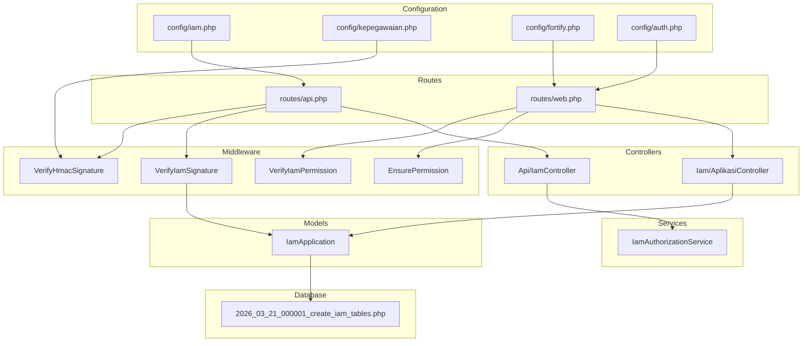
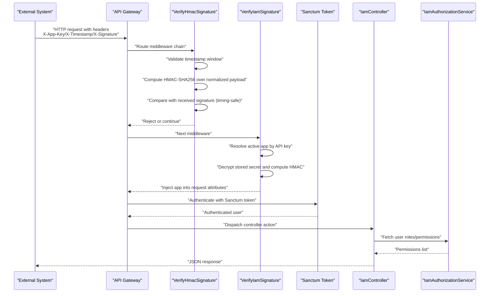
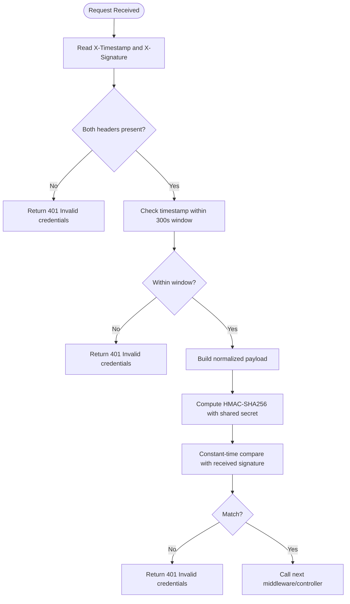
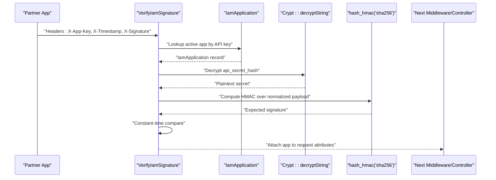
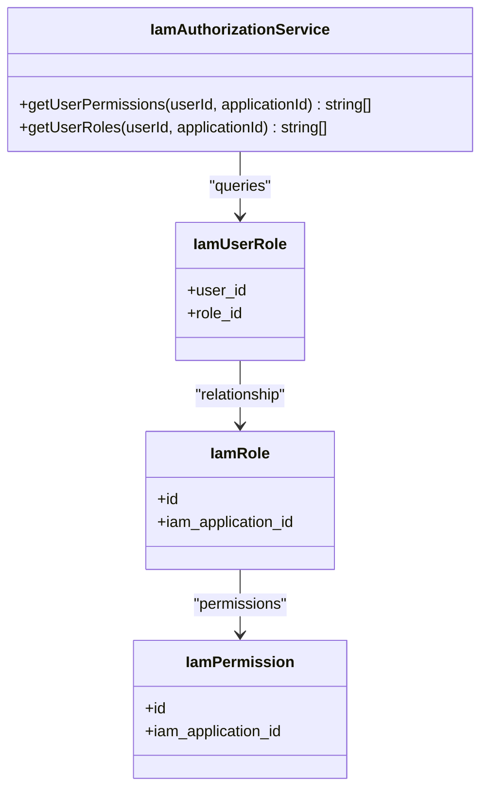
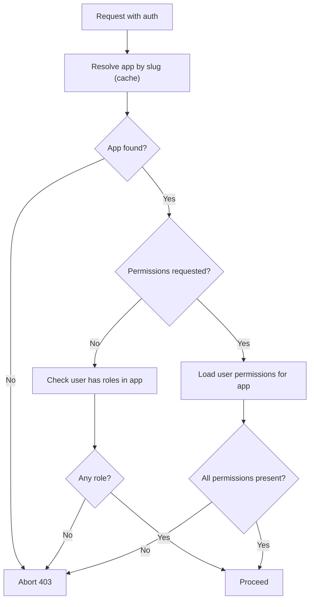
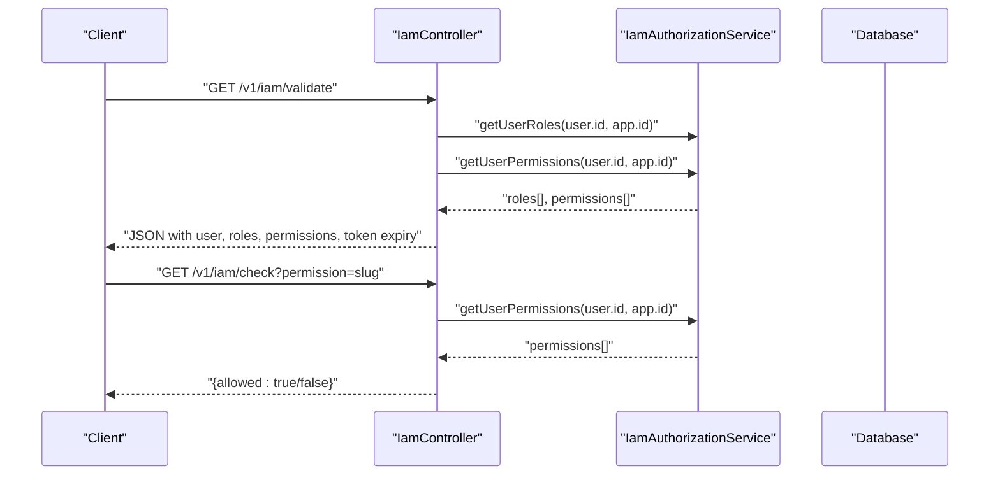
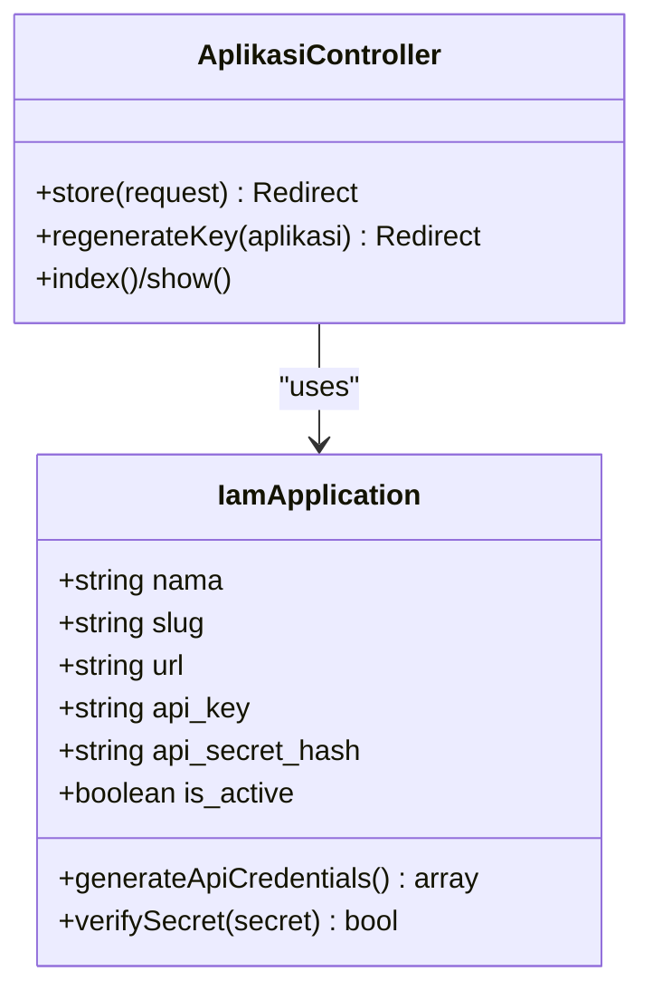
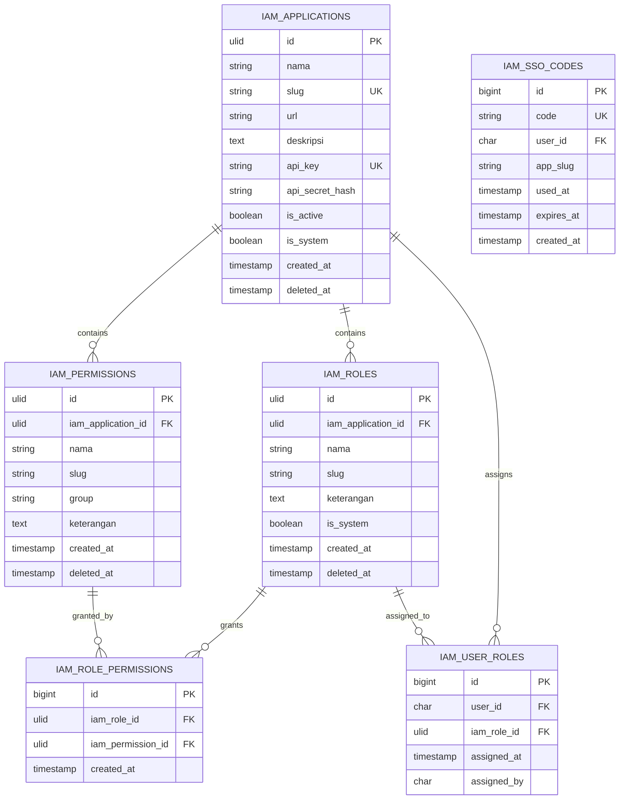
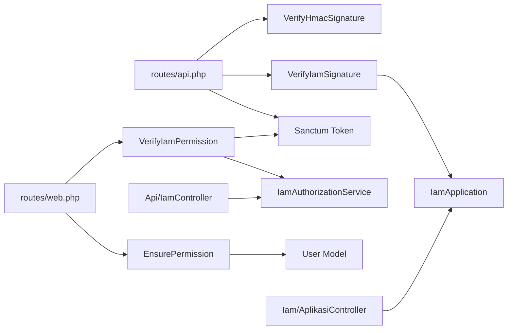

# Authentication Security

<cite>
**Referenced Files in This Document**
- [config/iam.php](file://config/iam.php)
- [config/kepegawaian.php](file://config/kepegawaian.php)
- [config/fortify.php](file://config/fortify.php)
- [config/auth.php](file://config/auth.php)
- [routes/api.php](file://routes/api.php)
- [routes/web.php](file://routes/web.php)
- [app/Http/Middleware/VerifyHmacSignature.php](file://app/Http/Middleware/VerifyHmacSignature.php)
- [app/Http/Middleware/VerifyIamSignature.php](file://app/Http/Middleware/VerifyIamSignature.php)
- [app/Http/Middleware/VerifyIamPermission.php](file://app/Http/Middleware/VerifyIamPermission.php)
- [app/Http/Middleware/EnsurePermission.php](file://app/Http/Middleware/EnsurePermission.php)
- [app/Http/Controllers/Api/IamController.php](file://app/Http/Controllers/Api/IamController.php)
- [app/Http/Controllers/Iam/AplikasiController.php](file://app/Http/Controllers/Iam/AplikasiController.php)
- [app/Http/Resources/IamValidateResource.php](file://app/Http/Resources/IamValidateResource.php)
- [app/Services/IamAuthorizationService.php](file://app/Services/IamAuthorizationService.php)
- [app/Models/IamApplication.php](file://app/Models/IamApplication.php)
- [database/migrations/2026_03_21_000001_create_iam_tables.php](file://database/migrations/2026_03_21_000001_create_iam_tables.php)
</cite>

## Table of Contents
1. [Introduction](#introduction)
2. [Project Structure](#project-structure)
3. [Core Components](#core-components)
4. [Architecture Overview](#architecture-overview)
5. [Detailed Component Analysis](#detailed-component-analysis)
6. [Dependency Analysis](#dependency-analysis)
7. [Performance Considerations](#performance-considerations)
8. [Troubleshooting Guide](#troubleshooting-guide)
9. [Conclusion](#conclusion)
10. [Appendices](#appendices)

## Introduction
This document provides comprehensive authentication security documentation for the Kepegawaian Apps system. It explains the multi-layered authentication approach, including:
- HMAC-SHA256 signature verification for external API integrations
- IAM signature validation for trusted partner applications
- Laravel Fortify-based user authentication and session management
- Anti-replay protections via timestamp validation
- Timing-safe hash comparison techniques
- Secret key management and rotation
- Practical examples of secure API integration patterns
- Credential validation workflows and middleware configuration
- Best practices for API key rotation, signature generation, and token management
- Troubleshooting guidance and security audit procedures

## Project Structure
The authentication and authorization stack spans configuration, middleware, controllers, services, models, and routes. Key areas:
- Configuration: IAM token lifetimes, app slug, and HMAC secret key
- Middleware: HMAC and IAM signature verification, permission checks
- Controllers: IAM validation, permission checks, logout, and SSO code exchange
- Services: Centralized authorization queries
- Models: IAM application credentials and secret handling
- Routes: Layered middleware applied to API endpoints

**Diagram sources**
- [config/iam.php:1-9](file://config/iam.php#L1-L9)
- [config/kepegawaian.php:1-17](file://config/kepegawaian.php#L1-L17)
- [config/fortify.php:1-157](file://config/fortify.php#L1-L157)
- [config/auth.php:1-118](file://config/auth.php#L1-L118)
- [routes/api.php:1-48](file://routes/api.php#L1-L48)
- [routes/web.php:1-139](file://routes/web.php#L1-L139)
- [app/Http/Middleware/VerifyHmacSignature.php:1-65](file://app/Http/Middleware/VerifyHmacSignature.php#L1-L65)
- [app/Http/Middleware/VerifyIamSignature.php:1-61](file://app/Http/Middleware/VerifyIamSignature.php#L1-L61)
- [app/Http/Middleware/VerifyIamPermission.php:1-54](file://app/Http/Middleware/VerifyIamPermission.php#L1-L54)
- [app/Http/Middleware/EnsurePermission.php:1-37](file://app/Http/Middleware/EnsurePermission.php#L1-L37)
- [app/Http/Controllers/Api/IamController.php:1-91](file://app/Http/Controllers/Api/IamController.php#L1-L91)
- [app/Http/Controllers/Iam/AplikasiController.php:1-129](file://app/Http/Controllers/Iam/AplikasiController.php#L1-L129)
- [app/Services/IamAuthorizationService.php:1-45](file://app/Services/IamAuthorizationService.php#L1-L45)
- [app/Models/IamApplication.php:1-96](file://app/Models/IamApplication.php#L1-L96)
- [database/migrations/2026_03_21_000001_create_iam_tables.php:1-113](file://database/migrations/2026_03_21_000001_create_iam_tables.php#L1-L113)

**Section sources**
- [routes/api.php:1-48](file://routes/api.php#L1-L48)
- [routes/web.php:1-139](file://routes/web.php#L1-L139)
- [config/iam.php:1-9](file://config/iam.php#L1-L9)
- [config/kepegawaian.php:1-17](file://config/kepegawaian.php#L1-L17)
- [config/fortify.php:1-157](file://config/fortify.php#L1-L157)
- [config/auth.php:1-118](file://config/auth.php#L1-L118)

## Core Components
- HMAC-SHA256 signature verification for external integrations:
  - Validates X-Timestamp and X-Signature headers
  - Enforces a 5-minute timestamp window for anti-replay
  - Uses timing-safe hash comparison
  - Derives shared secret from configuration
- IAM signature validation for trusted applications:
  - Validates X-App-Key, X-Timestamp, and X-Signature
  - Resolves active application by API key
  - Decrypts stored API secret hash and computes HMAC
  - Injects resolved application into request attributes
- IAM permission middleware:
  - Ensures authenticated user and resolves target application
  - Retrieves user roles/permissions scoped to the application
  - Supports both role presence and granular permission checks
- Fortify-based user authentication:
  - Session-based guard with Eloquent provider
  - Configurable username field and two-factor authentication
- Token lifecycle and SSO code exchange:
  - Personal access tokens scoped per application
  - SSO code exchange with atomic validation and expiration checks
- Secret key management:
  - Encrypted storage of API secrets
  - One-time reveal of plaintext secret during creation
  - Regeneration workflow for rotation

**Section sources**
- [app/Http/Middleware/VerifyHmacSignature.php:1-65](file://app/Http/Middleware/VerifyHmacSignature.php#L1-L65)
- [app/Http/Middleware/VerifyIamSignature.php:1-61](file://app/Http/Middleware/VerifyIamSignature.php#L1-L61)
- [app/Http/Middleware/VerifyIamPermission.php:1-54](file://app/Http/Middleware/VerifyIamPermission.php#L1-L54)
- [config/fortify.php:1-157](file://config/fortify.php#L1-L157)
- [config/auth.php:1-118](file://config/auth.php#L1-L118)
- [app/Http/Controllers/Api/IamController.php:1-91](file://app/Http/Controllers/Api/IamController.php#L1-L91)
- [app/Models/IamApplication.php:1-96](file://app/Models/IamApplication.php#L1-L96)

## Architecture Overview
The system enforces a four-layer security model for API integrations:
1. Transport security: HTTPS
2. Authentication: Laravel Sanctum personal access tokens
3. Request integrity: HMAC-SHA256 signatures
4. Rate limiting: Throttling middleware

**Diagram sources**
- [routes/api.php:21-47](file://routes/api.php#L21-L47)
- [app/Http/Middleware/VerifyHmacSignature.php:25-63](file://app/Http/Middleware/VerifyHmacSignature.php#L25-L63)
- [app/Http/Middleware/VerifyIamSignature.php:15-59](file://app/Http/Middleware/VerifyIamSignature.php#L15-L59)
- [app/Http/Controllers/Api/IamController.php:17-89](file://app/Http/Controllers/Api/IamController.php#L17-L89)
- [app/Services/IamAuthorizationService.php:16-43](file://app/Services/IamAuthorizationService.php#L16-L43)

## Detailed Component Analysis

### HMAC-SHA256 Signature Middleware
Purpose:
- Protect external integrations against tampering and replay
- Enforce strict timestamp validation
- Prevent timing attacks via constant-time comparison

Implementation highlights:
- Header validation: requires X-Timestamp and X-Signature
- Timestamp window: rejects timestamps older than 300 seconds
- Payload normalization: uppercase method, path, sorted query string, body SHA-256, timestamp
- Secret sourcing: reads shared secret from configuration
- Timing-safe comparison: uses constant-time hashing for signature verification

**Diagram sources**
- [app/Http/Middleware/VerifyHmacSignature.php:25-63](file://app/Http/Middleware/VerifyHmacSignature.php#L25-L63)
- [config/kepegawaian.php:15](file://config/kepegawaian.php#L15)

**Section sources**
- [app/Http/Middleware/VerifyHmacSignature.php:1-65](file://app/Http/Middleware/VerifyHmacSignature.php#L1-L65)
- [config/kepegawaian.php:1-17](file://config/kepegawaian.php#L1-L17)

### IAM Signature Middleware
Purpose:
- Authenticate trusted partner applications using API keys and HMAC signatures
- Prevent replay with timestamp validation
- Decrypt stored secrets securely and validate signatures

Implementation highlights:
- Header validation: requires X-App-Key, X-Timestamp, X-Signature
- Application resolution: finds active application by API key
- Decryption: decrypts stored encrypted secret hash
- Payload normalization: identical to HMAC middleware
- Constant-time comparison: timing-safe signature verification
- Attribute injection: attaches resolved application to request for downstream use

**Diagram sources**
- [app/Http/Middleware/VerifyIamSignature.php:15-59](file://app/Http/Middleware/VerifyIamSignature.php#L15-L59)
- [app/Models/IamApplication.php:85-94](file://app/Models/IamApplication.php#L85-L94)

**Section sources**
- [app/Http/Middleware/VerifyIamSignature.php:1-61](file://app/Http/Middleware/VerifyIamSignature.php#L1-L61)
- [app/Models/IamApplication.php:1-96](file://app/Models/IamApplication.php#L1-L96)

### IAM Authorization Service
Purpose:
- Centralize permission and role retrieval for a given user and application
- Eliminate duplication across controllers and middleware
- Provide optimized queries with eager loading

Implementation highlights:
- getUserPermissions: fetches permission slugs scoped to application
- getUserRoles: fetches role slugs scoped to application
- Uses joins and eager loading to minimize N+1 queries

**Diagram sources**
- [app/Services/IamAuthorizationService.php:16-43](file://app/Services/IamAuthorizationService.php#L16-L43)
- [database/migrations/2026_03_21_000001_create_iam_tables.php:68-84](file://database/migrations/2026_03_21_000001_create_iam_tables.php#L68-L84)

**Section sources**
- [app/Services/IamAuthorizationService.php:1-45](file://app/Services/IamAuthorizationService.php#L1-L45)

### IAM Permission Middleware
Purpose:
- Enforce IAM-based authorization for web routes
- Resolve target application by slug and verify user roles/permissions
- Support caching of application metadata

Implementation highlights:
- Unauthenticated handling: returns 401 for JSON, redirects for HTML
- Application caching: caches resolved application for 1 hour
- Role-only mode: allows access if user has any role in the application
- Permission enforcement: rejects if any requested permission is missing

**Diagram sources**
- [app/Http/Middleware/VerifyIamPermission.php:16-52](file://app/Http/Middleware/VerifyIamPermission.php#L16-L52)
- [config/iam.php:5-7](file://config/iam.php#L5-L7)

**Section sources**
- [app/Http/Middleware/VerifyIamPermission.php:1-54](file://app/Http/Middleware/VerifyIamPermission.php#L1-L54)
- [config/iam.php:1-9](file://config/iam.php#L1-L9)

### EnsurePermission Middleware
Purpose:
- Lightweight permission enforcement for web routes
- Accepts comma-separated permission lists and trims whitespace
- Returns 401 for unauthenticated JSON requests and redirects otherwise

Implementation highlights:
- Normalizes permission list from route parameters
- Uses built-in hasAnyPermission on the user model
- Straightforward enforcement without application scoping

**Section sources**
- [app/Http/Middleware/EnsurePermission.php:1-37](file://app/Http/Middleware/EnsurePermission.php#L1-L37)

### IAM Controller: Validation, Permission Checks, Logout, and SSO Code Exchange
Purpose:
- Expose IAM endpoints secured by Sanctum and signature middleware
- Provide user validation with roles/permissions and token expiry
- Allow permission checks for delegated authorization
- Invalidate current token on logout
- Exchange SSO codes for scoped personal access tokens

Key behaviors:
- validate: returns user info, roles, permissions, and token expiry
- check: verifies a single permission slug for the current user
- logout: deletes current token
- exchangeCode: atomic validation of SSO code, marks used, creates scoped token with TTL

**Diagram sources**
- [app/Http/Controllers/Api/IamController.php:17-44](file://app/Http/Controllers/Api/IamController.php#L17-L44)
- [app/Services/IamAuthorizationService.php:16-43](file://app/Services/IamAuthorizationService.php#L16-L43)

**Section sources**
- [app/Http/Controllers/Api/IamController.php:1-91](file://app/Http/Controllers/Api/IamController.php#L1-L91)
- [app/Http/Resources/IamValidateResource.php:1-19](file://app/Http/Resources/IamValidateResource.php#L1-L19)

### IAM Application Management and Secret Rotation
Purpose:
- Manage API keys and secrets for partner applications
- Provide one-time plaintext secret display upon creation
- Support regeneration of keys and secrets for rotation

Key behaviors:
- Creation: auto-generates API key and encrypted secret hash
- Regeneration: replaces API key and encrypted secret hash
- Display masking: masks API key for safe presentation
- Security: hidden fields prevent accidental exposure

**Diagram sources**
- [app/Models/IamApplication.php:72-94](file://app/Models/IamApplication.php#L72-L94)
- [app/Http/Controllers/Iam/AplikasiController.php:41-107](file://app/Http/Controllers/Iam/AplikasiController.php#L41-L107)

**Section sources**
- [app/Models/IamApplication.php:1-96](file://app/Models/IamApplication.php#L1-L96)
- [app/Http/Controllers/Iam/AplikasiController.php:1-129](file://app/Http/Controllers/Iam/AplikasiController.php#L1-L129)

### Database Schema for IAM
Purpose:
- Define relational model for applications, roles, permissions, and SSO codes
- Enforce uniqueness and referential integrity
- Support soft deletes and cascading actions

Highlights:
- iam_applications: stores API key and encrypted secret hash
- iam_roles and iam_permissions: hierarchical RBAC within an application
- iam_role_permissions and iam_user_roles: many-to-many relations
- iam_sso_codes: one-time use codes with expiry and app scoping

**Diagram sources**
- [database/migrations/2026_03_21_000001_create_iam_tables.php:14-97](file://database/migrations/2026_03_21_000001_create_iam_tables.php#L14-L97)

**Section sources**
- [database/migrations/2026_03_21_000001_create_iam_tables.php:1-113](file://database/migrations/2026_03_21_000001_create_iam_tables.php#L1-L113)

## Dependency Analysis
- Route middleware composition:
  - API v1 endpoints apply Sanctum, signature verification, and throttling
  - IAM endpoints apply signature verification and throttling
- Middleware interdependencies:
  - VerifyIamSignature depends on IamApplication model and encryption service
  - VerifyIamPermission depends on IamAuthorizationService and application caching
  - EnsurePermission depends on user model’s permission checks
- Controller dependencies:
  - IamController depends on IamAuthorizationService and configuration for token TTL
- Configuration dependencies:
  - IAM token TTL and SSO code TTL
  - HMAC shared secret
  - Fortify username/email and two-factor settings

**Diagram sources**
- [routes/api.php:21-47](file://routes/api.php#L21-L47)
- [routes/web.php:35-136](file://routes/web.php#L35-L136)
- [app/Http/Middleware/VerifyIamSignature.php:29](file://app/Http/Middleware/VerifyIamSignature.php#L29)
- [app/Http/Middleware/VerifyIamPermission.php:16-52](file://app/Http/Middleware/VerifyIamPermission.php#L16-L52)
- [app/Http/Controllers/Api/IamController.php:15](file://app/Http/Controllers/Api/IamController.php#L15)
- [app/Http/Controllers/Iam/AplikasiController.php:50](file://app/Http/Controllers/Iam/AplikasiController.php#L50)

**Section sources**
- [routes/api.php:1-48](file://routes/api.php#L1-L48)
- [routes/web.php:1-139](file://routes/web.php#L1-L139)

## Performance Considerations
- Middleware overhead:
  - HMAC and IAM signature computations are lightweight but should be cached where appropriate (e.g., application records)
- Database queries:
  - IamAuthorizationService uses eager loading; ensure indexes exist on foreign keys and unique constraints
- Caching:
  - Application metadata caching reduces repeated lookups
- Throttling:
  - Tune throttle rates per endpoint to balance security and throughput
- Encryption:
  - Decrypting secrets occurs per request; consider caching decrypted secrets per app if traffic permits and security posture allows

[No sources needed since this section provides general guidance]

## Troubleshooting Guide
Common failure scenarios and resolutions:
- Invalid credentials (401):
  - Missing headers: ensure X-Timestamp, X-Signature, and X-App-Key are present
  - Expired timestamp: align clocks and reduce drift; ensure within 300-second window
  - Incorrect signature: verify payload normalization and shared secret
- Invalid signature (401):
  - HMAC mismatch indicates tampered payload or wrong secret
  - For IAM: verify API key correctness and that the application is active
- Service configuration error (500):
  - Missing HMAC secret in configuration; set ATTENDANCE_HMAC_SECRET
- Unauthenticated (401):
  - Sanctum token missing or invalid; ensure client sends bearer token
- Forbidden (403):
  - IAM permission middleware denies access; verify user roles/permissions for the application
- SSO code exchange failures:
  - Code not found, expired, or already used; ensure atomic update and correct app slug
- API key rotation:
  - After regenerating, update partner systems immediately; avoid simultaneous use of old and new secrets

**Section sources**
- [app/Http/Middleware/VerifyHmacSignature.php:30-44](file://app/Http/Middleware/VerifyHmacSignature.php#L30-L44)
- [app/Http/Middleware/VerifyIamSignature.php:21-33](file://app/Http/Middleware/VerifyIamSignature.php#L21-L33)
- [app/Http/Middleware/VerifyIamSignature.php:51-53](file://app/Http/Middleware/VerifyIamSignature.php#L51-L53)
- [app/Http/Middleware/VerifyIamPermission.php:20-34](file://app/Http/Middleware/VerifyIamPermission.php#L20-L34)
- [app/Http/Controllers/Api/IamController.php:67-69](file://app/Http/Controllers/Api/IamController.php#L67-L69)
- [config/kepegawaian.php:15](file://config/kepegawaian.php#L15)

## Conclusion
The Kepegawaian Apps system implements a robust, layered authentication and authorization architecture:
- Transport, authentication, integrity, and rate-limiting controls work together to protect APIs
- HMAC-SHA256 and IAM signature verification ensure request authenticity and prevent replay
- Fortify-based user authentication integrates seamlessly with Sanctum tokens
- IAM permission middleware scopes authorizations to applications and caches metadata for performance
- Secret management and rotation are supported through encrypted storage and controlled exposure
Adhering to the best practices and troubleshooting steps outlined here will help maintain a secure and reliable authentication system.

[No sources needed since this section summarizes without analyzing specific files]

## Appendices

### Security Best Practices
- API key rotation:
  - Use the application regeneration endpoint to replace keys and secrets
  - Immediately update partner systems after rotation
  - Maintain a short-lived backup of old secrets only during transition windows
- Signature generation:
  - Normalize payload strictly: uppercase method, path, sorted query string, body SHA-256, timestamp
  - Use HMAC-SHA256 with a strong shared secret
  - Employ timing-safe comparison to mitigate timing attacks
- Token management:
  - Scope tokens per application using token abilities
  - Enforce token TTL via configuration and database expiry
  - Invalidate tokens on logout and monitor for misuse
- Audit procedures:
  - Log signature verification outcomes and timestamp validation results
  - Monitor throttling triggers and failed authentication attempts
  - Review IAM application activity and permission changes regularly

[No sources needed since this section provides general guidance]