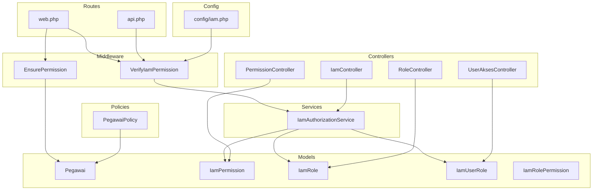
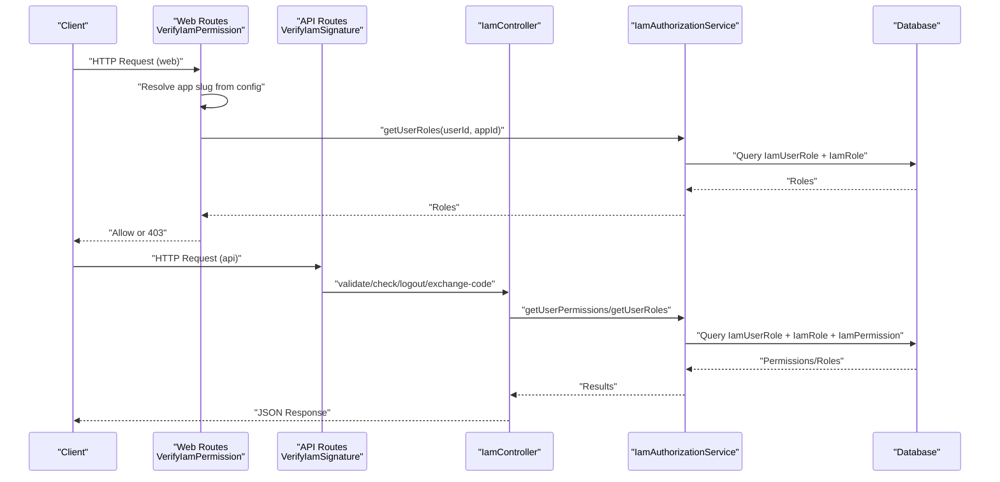
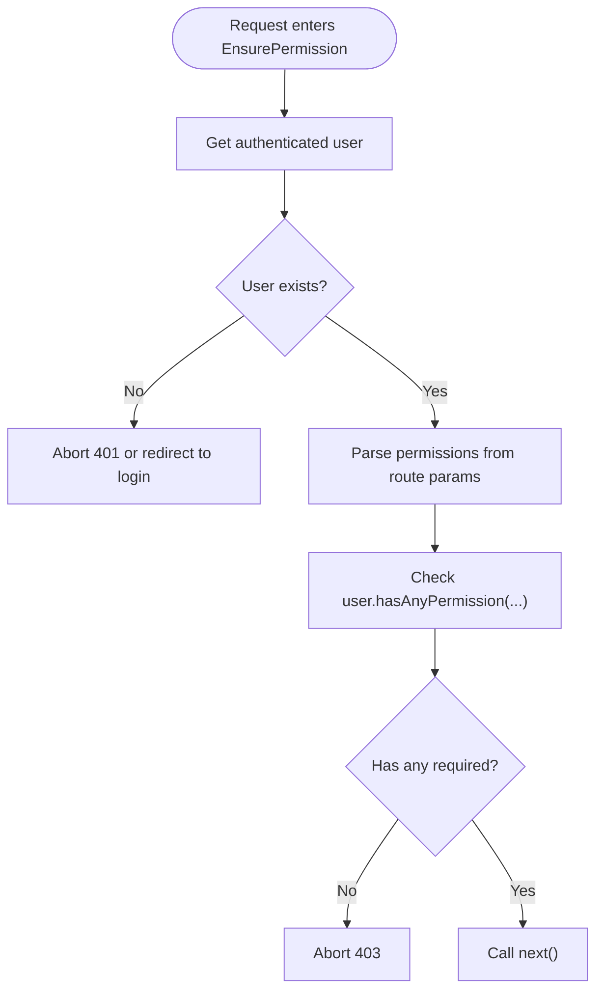
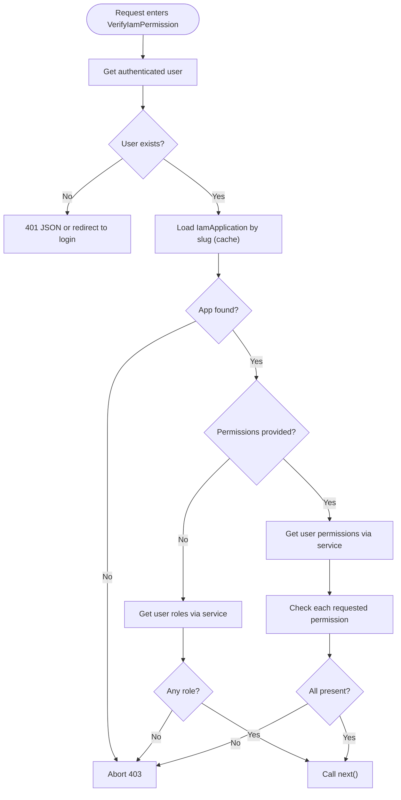
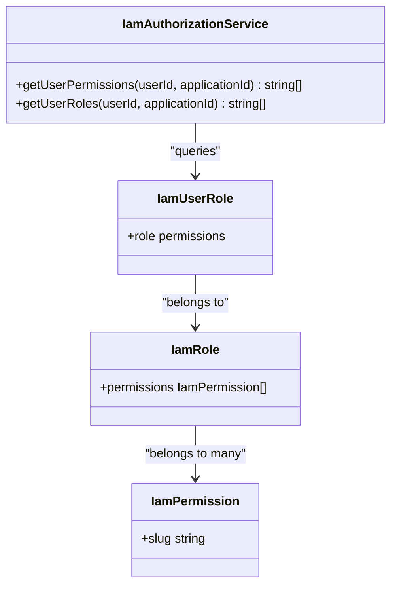
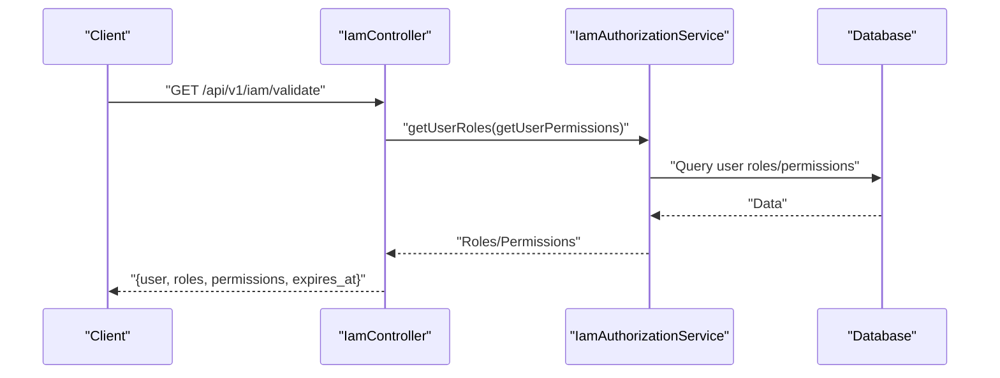
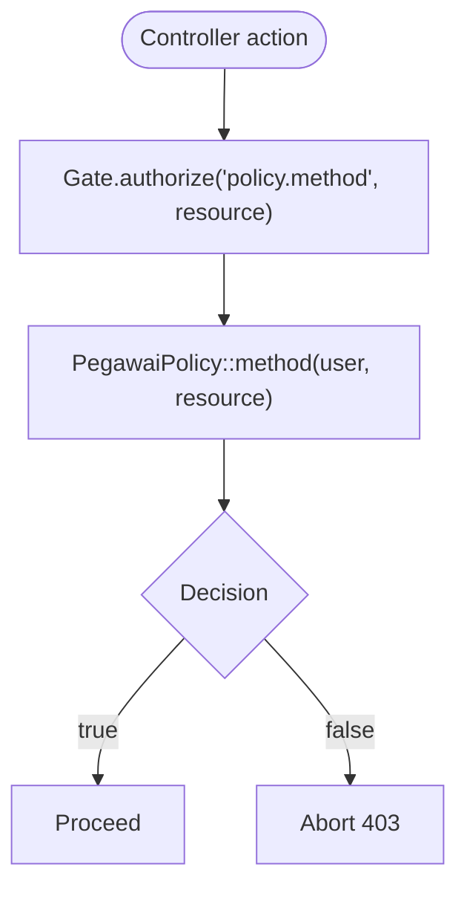
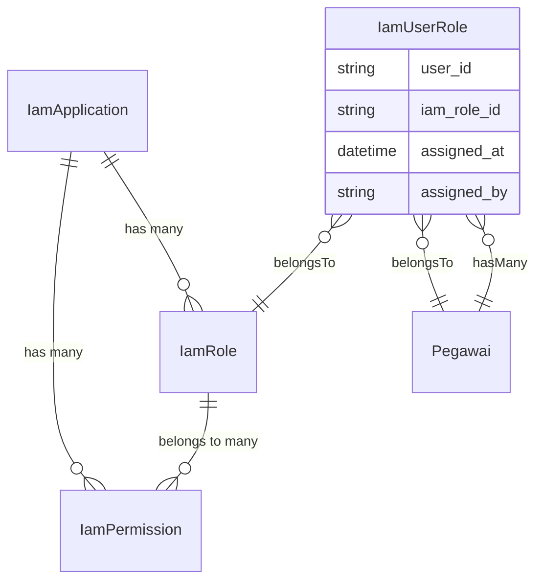
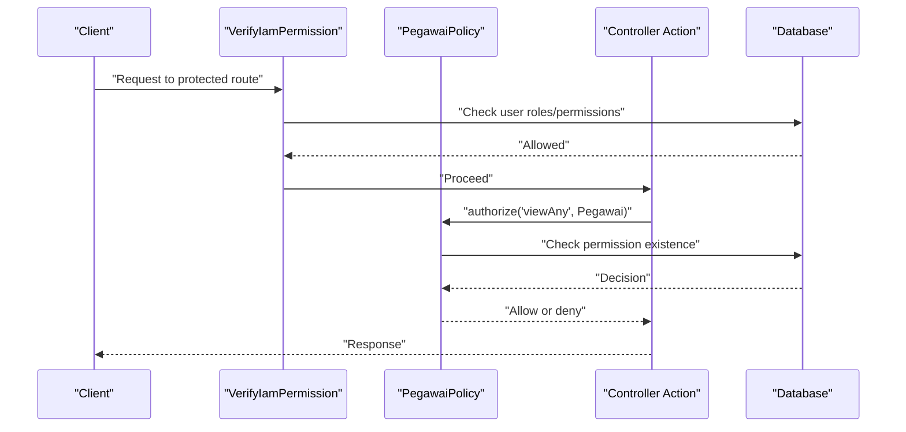
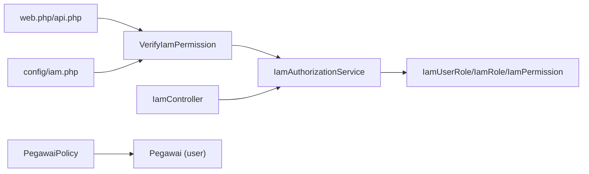

# Authorization Mechanisms

<cite>
**Referenced Files in This Document**
- [EnsurePermission.php](file://app/Http/Middleware/EnsurePermission.php)
- [VerifyIamPermission.php](file://app/Http/Middleware/VerifyIamPermission.php)
- [IamAuthorizationService.php](file://app/Services/IamAuthorizationService.php)
- [IamController.php](file://app/Http/Controllers/Api/IamController.php)
- [PermissionController.php](file://app/Http/Controllers/Iam/PermissionController.php)
- [RoleController.php](file://app/Http/Controllers/Iam/RoleController.php)
- [UserAksesController.php](file://app/Http/Controllers/Iam/UserAksesController.php)
- [PegawaiPolicy.php](file://app/Policies/PegawaiPolicy.php)
- [Pegawai.php](file://app/Models/Pegawai.php)
- [IamPermission.php](file://app/Models/IamPermission.php)
- [IamRole.php](file://app/Models/IamRole.php)
- [IamUserRole.php](file://app/Models/IamUserRole.php)
- [IamRolePermission.php](file://app/Models/IamRolePermission.php)
- [web.php](file://routes/web.php)
- [api.php](file://routes/api.php)
- [iam.php](file://config/iam.php)
- [IamSeeder.php](file://database/seeders/IamSeeder.php)
</cite>

## Table of Contents
1. [Introduction](#introduction)
2. [Project Structure](#project-structure)
3. [Core Components](#core-components)
4. [Architecture Overview](#architecture-overview)
5. [Detailed Component Analysis](#detailed-component-analysis)
6. [Dependency Analysis](#dependency-analysis)
7. [Performance Considerations](#performance-considerations)
8. [Troubleshooting Guide](#troubleshooting-guide)
9. [Conclusion](#conclusion)
10. [Appendices](#appendices)

## Introduction
This document explains the authorization mechanisms in the Kepegawaian Apps system with a focus on role-based access control (RBAC) and permission enforcement. It covers middleware-based permission validation, policy classes for granular access control, and IAM-based authorization services. The authorization flow includes permission checking, role validation, and resource-level access control. Practical examples illustrate policy implementation patterns, permission assignment workflows, and middleware configuration. Best practices for RBAC implementation, permission inheritance, and enforcement are provided, along with guidance for extending authorization rules, debugging permission issues, and maintaining consistency across the application.

## Project Structure
The authorization system spans middleware, controllers, services, models, policies, routes, and configuration. The following diagram maps the primary authorization-related components and their relationships.

**Diagram sources**
- [EnsurePermission.php:1-37](file://app/Http/Middleware/EnsurePermission.php#L1-L37)
- [VerifyIamPermission.php:1-54](file://app/Http/Middleware/VerifyIamPermission.php#L1-L54)
- [IamAuthorizationService.php:1-45](file://app/Services/IamAuthorizationService.php#L1-L45)
- [IamController.php:1-91](file://app/Http/Controllers/Api/IamController.php#L1-L91)
- [PermissionController.php:1-52](file://app/Http/Controllers/Iam/PermissionController.php#L1-L52)
- [RoleController.php:1-65](file://app/Http/Controllers/Iam/RoleController.php#L1-L65)
- [UserAksesController.php:1-50](file://app/Http/Controllers/Iam/UserAksesController.php#L1-L50)
- [Pegawai.php:1-209](file://app/Models/Pegawai.php#L1-L209)
- [IamPermission.php:1-22](file://app/Models/IamPermission.php#L1-L22)
- [IamRole.php:1-38](file://app/Models/IamRole.php#L1-L38)
- [IamUserRole.php:1-33](file://app/Models/IamUserRole.php#L1-L33)
- [IamRolePermission.php:1-23](file://app/Models/IamRolePermission.php#L1-L23)
- [web.php:1-139](file://routes/web.php#L1-L139)
- [api.php:1-48](file://routes/api.php#L1-L48)
- [iam.php:1-9](file://config/iam.php#L1-L9)

**Section sources**
- [web.php:1-139](file://routes/web.php#L1-L139)
- [api.php:1-48](file://routes/api.php#L1-L48)
- [iam.php:1-9](file://config/iam.php#L1-L9)

## Core Components
- Middleware-based permission validation:
  - EnsurePermission validates that the authenticated user possesses at least one of the required permissions for a route.
  - VerifyIamPermission integrates IAM application scoping, caches the application lookup, and enforces either role presence or permission checks depending on route parameters.
- Policy classes:
  - PegawaiPolicy defines resource-level permissions for employee records using permission slugs.
- IAM authorization service:
  - IamAuthorizationService centralizes permission and role retrieval for a given user and application, avoiding duplication across controllers and middleware.
- Controllers for IAM management:
  - IamController exposes endpoints to validate tokens, check permissions, logout, and exchange SSO codes.
  - PermissionController and RoleController manage permissions and roles scoped to an application.
  - UserAksesController manages user-role assignments across applications.
- Models:
  - Pegawai (user) encapsulates permission checks and role helpers.
  - IamPermission, IamRole, IamUserRole, and IamRolePermission define the RBAC schema and relationships.

**Section sources**
- [EnsurePermission.php:1-37](file://app/Http/Middleware/EnsurePermission.php#L1-L37)
- [VerifyIamPermission.php:1-54](file://app/Http/Middleware/VerifyIamPermission.php#L1-L54)
- [IamAuthorizationService.php:1-45](file://app/Services/IamAuthorizationService.php#L1-L45)
- [IamController.php:1-91](file://app/Http/Controllers/Api/IamController.php#L1-L91)
- [PermissionController.php:1-52](file://app/Http/Controllers/Iam/PermissionController.php#L1-L52)
- [RoleController.php:1-65](file://app/Http/Controllers/Iam/RoleController.php#L1-L65)
- [UserAksesController.php:1-50](file://app/Http/Controllers/Iam/UserAksesController.php#L1-L50)
- [PegawaiPolicy.php:1-34](file://app/Policies/PegawaiPolicy.php#L1-L34)
- [Pegawai.php:139-168](file://app/Models/Pegawai.php#L139-L168)
- [IamPermission.php:1-22](file://app/Models/IamPermission.php#L1-L22)
- [IamRole.php:1-38](file://app/Models/IamRole.php#L1-L38)
- [IamUserRole.php:1-33](file://app/Models/IamUserRole.php#L1-L33)
- [IamRolePermission.php:1-23](file://app/Models/IamRolePermission.php#L1-L23)

## Architecture Overview
The authorization architecture combines route-level middleware, policy-based resource checks, and centralized service logic. The flow ensures:
- Authentication via Sanctum tokens.
- IAM signature verification for API endpoints.
- Application-scoped permission evaluation.
- Resource-level checks via policies.

**Diagram sources**
- [web.php:35-63](file://routes/web.php#L35-L63)
- [api.php:34-47](file://routes/api.php#L34-L47)
- [VerifyIamPermission.php:16-51](file://app/Http/Middleware/VerifyIamPermission.php#L16-L51)
- [IamController.php:17-44](file://app/Http/Controllers/Api/IamController.php#L17-L44)
- [IamAuthorizationService.php:16-43](file://app/Services/IamAuthorizationService.php#L16-L43)

## Detailed Component Analysis

### Middleware: EnsurePermission
- Purpose: Enforce that the authenticated user has at least one of the required permissions declared on a route.
- Behavior:
  - Extracts permissions from route parameters, supports comma-separated lists and multiple parameters.
  - Checks user.hasAnyPermission(...) and aborts with 403 if missing.
  - Handles unauthenticated users by returning 401 or redirecting to login.

**Diagram sources**
- [EnsurePermission.php:11-35](file://app/Http/Middleware/EnsurePermission.php#L11-L35)
- [Pegawai.php:148-153](file://app/Models/Pegawai.php#L148-L153)

**Section sources**
- [EnsurePermission.php:1-37](file://app/Http/Middleware/EnsurePermission.php#L1-L37)
- [Pegawai.php:141-153](file://app/Models/Pegawai.php#L141-L153)

### Middleware: VerifyIamPermission
- Purpose: IAM-aware permission enforcement for web routes.
- Behavior:
  - Resolves application by slug from config and caches the application record.
  - If no permissions requested, verifies user has any role in the application.
  - If permissions requested, fetches user permissions via IamAuthorizationService and checks inclusion.
  - Supports caching to reduce repeated queries.

**Diagram sources**
- [VerifyIamPermission.php:16-51](file://app/Http/Middleware/VerifyIamPermission.php#L16-L51)
- [IamAuthorizationService.php:16-43](file://app/Services/IamAuthorizationService.php#L16-L43)
- [iam.php:7-8](file://config/iam.php#L7-L8)

**Section sources**
- [VerifyIamPermission.php:1-54](file://app/Http/Middleware/VerifyIamPermission.php#L1-L54)
- [IamAuthorizationService.php:1-45](file://app/Services/IamAuthorizationService.php#L1-L45)
- [iam.php:1-9](file://config/iam.php#L1-L9)

### Service: IamAuthorizationService
- Purpose: Centralized logic to compute effective permissions and roles for a user within a specific IAM application.
- Methods:
  - getUserPermissions(userId, applicationId): returns unique permission slugs.
  - getUserRoles(userId, applicationId): returns role slugs.

**Diagram sources**
- [IamAuthorizationService.php:16-43](file://app/Services/IamAuthorizationService.php#L16-L43)
- [IamUserRole.php:1-33](file://app/Models/IamUserRole.php#L1-L33)
- [IamRole.php:28-36](file://app/Models/IamRole.php#L28-L36)
- [IamPermission.php:1-22](file://app/Models/IamPermission.php#L1-L22)

**Section sources**
- [IamAuthorizationService.php:1-45](file://app/Services/IamAuthorizationService.php#L1-L45)

### Controllers: IAM Management and API
- IamController:
  - validate: returns user info, roles, permissions, and token expiry for the current application.
  - check: evaluates whether a user holds a specific permission.
  - logout: invalidates the current token.
  - exchangeCode: exchanges a one-time SSO code for a scoped token.
- PermissionController and RoleController:
  - Manage permissions and roles scoped to an application, with IDOR safeguards.
- UserAksesController:
  - Assigns roles to users and lists role assignments.

**Diagram sources**
- [IamController.php:17-44](file://app/Http/Controllers/Api/IamController.php#L17-L44)
- [IamAuthorizationService.php:16-43](file://app/Services/IamAuthorizationService.php#L16-L43)

**Section sources**
- [IamController.php:1-91](file://app/Http/Controllers/Api/IamController.php#L1-L91)
- [PermissionController.php:1-52](file://app/Http/Controllers/Iam/PermissionController.php#L1-L52)
- [RoleController.php:1-65](file://app/Http/Controllers/Iam/RoleController.php#L1-L65)
- [UserAksesController.php:1-50](file://app/Http/Controllers/Iam/UserAksesController.php#L1-L50)

### Policies: Resource-Level Access Control
- PegawaiPolicy:
  - viewAny, view, create, update, delete enforce permission slugs for employee records.
- Policy invocation:
  - Policies are invoked by Laravel’s gate/resolver when using authorize methods in controllers or Blade templates.

**Diagram sources**
- [PegawaiPolicy.php:9-32](file://app/Policies/PegawaiPolicy.php#L9-L32)

**Section sources**
- [PegawaiPolicy.php:1-34](file://app/Policies/PegawaiPolicy.php#L1-L34)

### Models: RBAC Schema and Helpers
- IamPermission: permission entity with slug, group, and application linkage.
- IamRole: role entity with application linkage and many-to-many permissions.
- IamUserRole: pivot linking users to roles with assignment metadata.
- IamRolePermission: pivot linking roles to permissions.
- Pegawai (user):
  - hasPermission, hasAnyPermission, and convenience helpers (isAdmin, isOperator, isViewer) leverage role-permission relationships.

**Diagram sources**
- [IamPermission.php:1-22](file://app/Models/IamPermission.php#L1-L22)
- [IamRole.php:1-38](file://app/Models/IamRole.php#L1-L38)
- [IamUserRole.php:1-33](file://app/Models/IamUserRole.php#L1-L33)
- [IamRolePermission.php:1-23](file://app/Models/IamRolePermission.php#L1-L23)
- [Pegawai.php:84-95](file://app/Models/Pegawai.php#L84-L95)

**Section sources**
- [IamPermission.php:1-22](file://app/Models/IamPermission.php#L1-L22)
- [IamRole.php:1-38](file://app/Models/IamRole.php#L1-L38)
- [IamUserRole.php:1-33](file://app/Models/IamUserRole.php#L1-L33)
- [IamRolePermission.php:1-23](file://app/Models/IamRolePermission.php#L1-L23)
- [Pegawai.php:139-168](file://app/Models/Pegawai.php#L139-L168)

### Authorization Flow: Permission Checking, Role Validation, and Resource-Level Access
- Web routes:
  - Grouped under auth, verified, and iam.permission middleware.
  - VerifyIamPermission enforces either role presence or permission checks per route.
- API routes:
  - Protected by Sanctum and IAM signature middleware.
  - IamController endpoints provide runtime permission checks and token management.
- Policies:
  - Enforce resource-level decisions using permission slugs.

**Diagram sources**
- [web.php:35-63](file://routes/web.php#L35-L63)
- [VerifyIamPermission.php:16-51](file://app/Http/Middleware/VerifyIamPermission.php#L16-L51)
- [PegawaiPolicy.php:9-32](file://app/Policies/PegawaiPolicy.php#L9-L32)

**Section sources**
- [web.php:35-63](file://routes/web.php#L35-L63)
- [api.php:34-47](file://routes/api.php#L34-L47)
- [VerifyIamPermission.php:1-54](file://app/Http/Middleware/VerifyIamPermission.php#L1-L54)
- [PegawaiPolicy.php:1-34](file://app/Policies/PegawaiPolicy.php#L1-L34)

## Dependency Analysis
- Middleware depends on:
  - User authentication state.
  - IamAuthorizationService for computed permissions/roles.
  - Config for application slug.
- Controllers depend on:
  - IamAuthorizationService for permission computations.
  - Models for persistence and relationships.
- Policies depend on:
  - User permission checks via model helpers.
- Routes depend on:
  - Middleware composition for layered enforcement.

**Diagram sources**
- [VerifyIamPermission.php:14-30](file://app/Http/Middleware/VerifyIamPermission.php#L14-L30)
- [IamAuthorizationService.php:16-43](file://app/Services/IamAuthorizationService.php#L16-L43)
- [IamController.php:15-29](file://app/Http/Controllers/Api/IamController.php#L15-L29)
- [PegawaiPolicy.php:9-32](file://app/Policies/PegawaiPolicy.php#L9-L32)
- [web.php:35-63](file://routes/web.php#L35-L63)
- [api.php:34-47](file://routes/api.php#L34-L47)
- [iam.php:7-8](file://config/iam.php#L7-L8)

**Section sources**
- [VerifyIamPermission.php:1-54](file://app/Http/Middleware/VerifyIamPermission.php#L1-L54)
- [IamAuthorizationService.php:1-45](file://app/Services/IamAuthorizationService.php#L1-L45)
- [IamController.php:1-91](file://app/Http/Controllers/Api/IamController.php#L1-L91)
- [PegawaiPolicy.php:1-34](file://app/Policies/PegawaiPolicy.php#L1-L34)
- [web.php:1-139](file://routes/web.php#L1-L139)
- [api.php:1-48](file://routes/api.php#L1-L48)
- [iam.php:1-9](file://config/iam.php#L1-L9)

## Performance Considerations
- Caching:
  - VerifyIamPermission caches the resolved application by slug for one hour to reduce repeated lookups.
- Eager loading:
  - IamAuthorizationService uses with() to eager load related permissions to minimize N+1 queries.
- Unique permissions:
  - getUserPermissions returns unique slugs to avoid redundant checks.
- Middleware efficiency:
  - EnsurePermission parses and filters permissions once per request.
- Recommendations:
  - Consider caching user permissions per request lifecycle in high-throughput scenarios.
  - Monitor database query counts for authorization-heavy endpoints.

**Section sources**
- [VerifyIamPermission.php:27-30](file://app/Http/Middleware/VerifyIamPermission.php#L27-L30)
- [IamAuthorizationService.php:18-25](file://app/Services/IamAuthorizationService.php#L18-L25)

## Troubleshooting Guide
- Common issues and resolutions:
  - 403 Forbidden on web routes:
    - Ensure the user has at least one role in the configured application slug.
    - Confirm VerifyIamPermission is applied to the route group.
  - 403 Forbidden on API endpoints:
    - Verify the IAM signature middleware is present.
    - Confirm the user has the required permission slug.
  - 401 Unauthorized:
    - Ensure Sanctum token is present and valid.
    - For API endpoints, verify HMAC signature and rate limiting constraints.
  - Permission not recognized:
    - Confirm the permission slug exists and is assigned to the user’s roles within the application.
    - Check IamSeeder for default permissions and ensure they match expected slugs.
  - IDOR concerns:
    - Controllers enforce IDOR checks by verifying ownership of application-scoped resources before updates/deletes.
- Debugging steps:
  - Inspect route middleware composition in web.php and api.php.
  - Log user roles and permissions via IamController endpoints.
  - Verify application slug resolution from config/iam.php.
  - Confirm database relationships in IamUserRole, IamRolePermission, and IamRolePermission.

**Section sources**
- [web.php:35-63](file://routes/web.php#L35-L63)
- [api.php:34-47](file://routes/api.php#L34-L47)
- [VerifyIamPermission.php:16-51](file://app/Http/Middleware/VerifyIamPermission.php#L16-L51)
- [IamController.php:17-44](file://app/Http/Controllers/Api/IamController.php#L17-L44)
- [PermissionController.php:29-50](file://app/Http/Controllers/Iam/PermissionController.php#L29-L50)
- [RoleController.php:35-62](file://app/Http/Controllers/Iam/RoleController.php#L35-L62)
- [IamSeeder.php:129-142](file://database/seeders/IamSeeder.php#L129-L142)
- [iam.php:7-8](file://config/iam.php#L7-L8)

## Conclusion
The Kepegawaian Apps authorization system integrates middleware-based enforcement, IAM-aware services, and policy-driven resource controls. By centralizing permission computation, enforcing application scoping, and leveraging robust controllers and models, the system achieves consistent and maintainable RBAC. Following the best practices and troubleshooting guidance herein will help extend authorization rules safely, debug issues efficiently, and keep authorization behavior coherent across the application.

## Appendices

### Practical Examples and Workflows
- Policy implementation pattern:
  - Define permission slugs in IamPermission and assign them to roles via IamRolePermission.
  - Use policies to gate controller actions with hasPermission checks.
- Permission assignment workflow:
  - Create permissions via PermissionController scoped to an application.
  - Create roles via RoleController and attach permissions.
  - Assign roles to users via UserAksesController.
- Middleware configuration:
  - Apply VerifyIamPermission to route groups requiring IAM-scoped permissions.
  - Use EnsurePermission for fine-grained permission checks on individual routes.

**Section sources**
- [PermissionController.php:14-50](file://app/Http/Controllers/Iam/PermissionController.php#L14-L50)
- [RoleController.php:14-63](file://app/Http/Controllers/Iam/RoleController.php#L14-L63)
- [UserAksesController.php:33-48](file://app/Http/Controllers/Iam/UserAksesController.php#L33-L48)
- [web.php:35-63](file://routes/web.php#L35-L63)
- [EnsurePermission.php:11-35](file://app/Http/Middleware/EnsurePermission.php#L11-L35)

### Best Practices for RBAC Implementation
- Permission inheritance:
  - Prefer role-based permissions; avoid per-user direct permissions for simplicity.
- Immutable identities:
  - Use stable permission slugs and role keys to prevent drift.
- Least privilege:
  - Grant minimal permissions required for job functions.
- Auditability:
  - Track role assignments and permission changes; ensure logs are retained per policy.
- Testing:
  - Include tests for permission checks, IDOR protections, and middleware composition.

[No sources needed since this section provides general guidance]