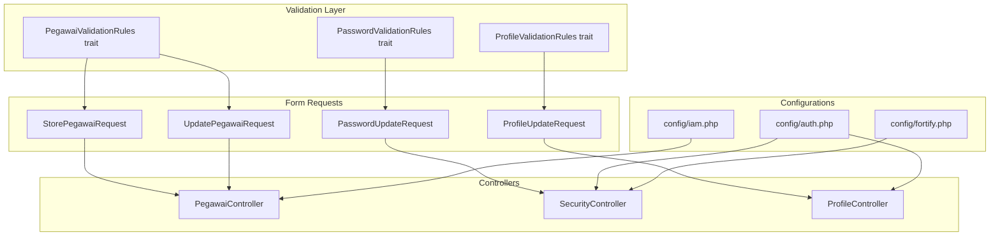
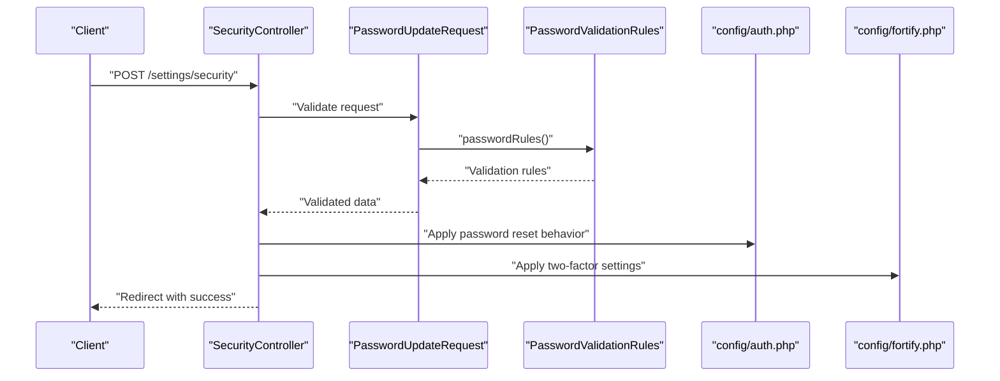
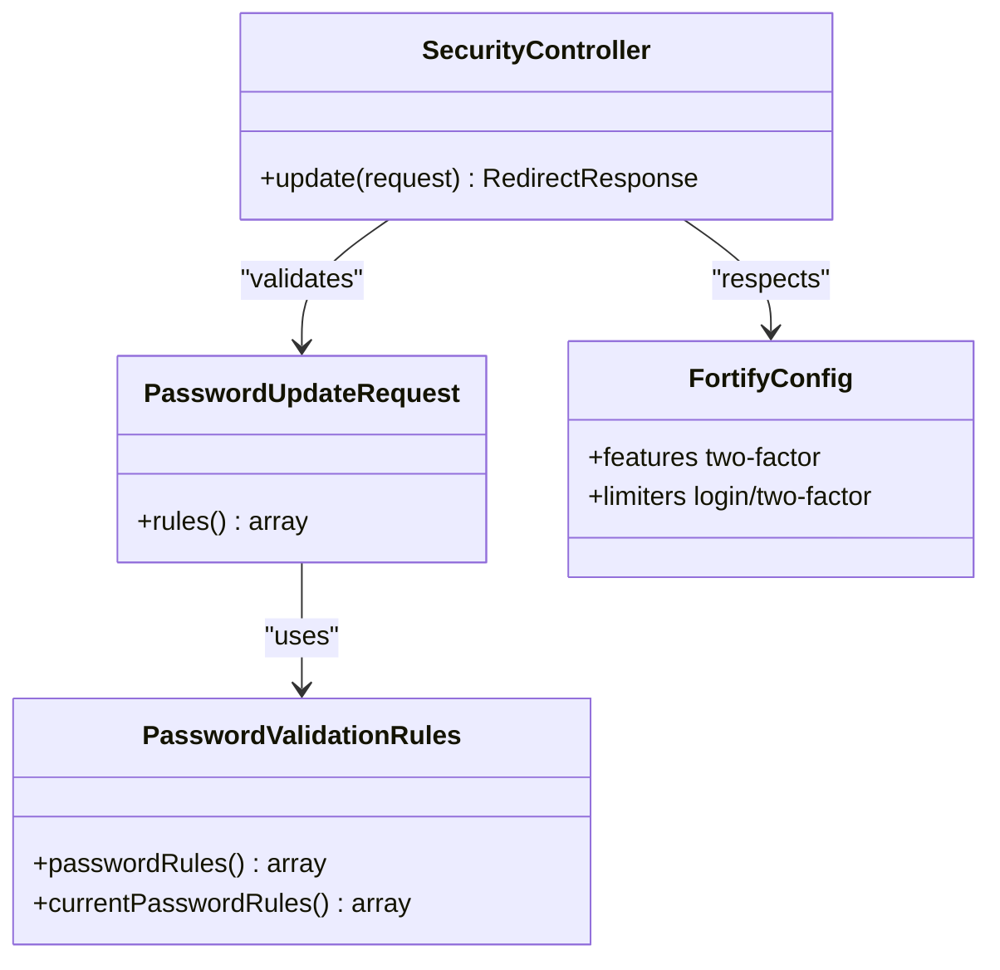
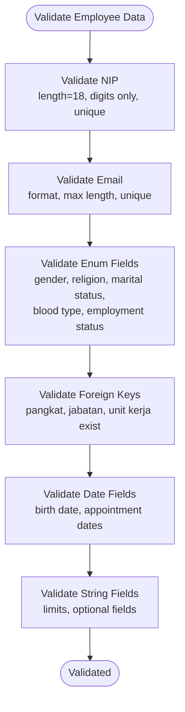
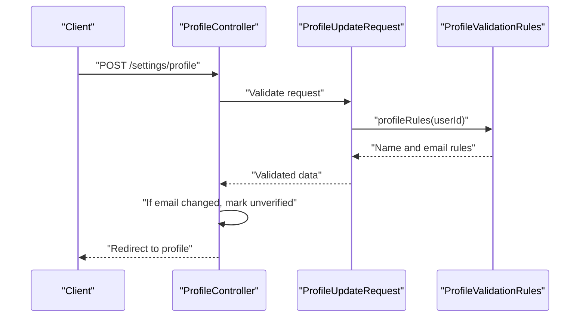
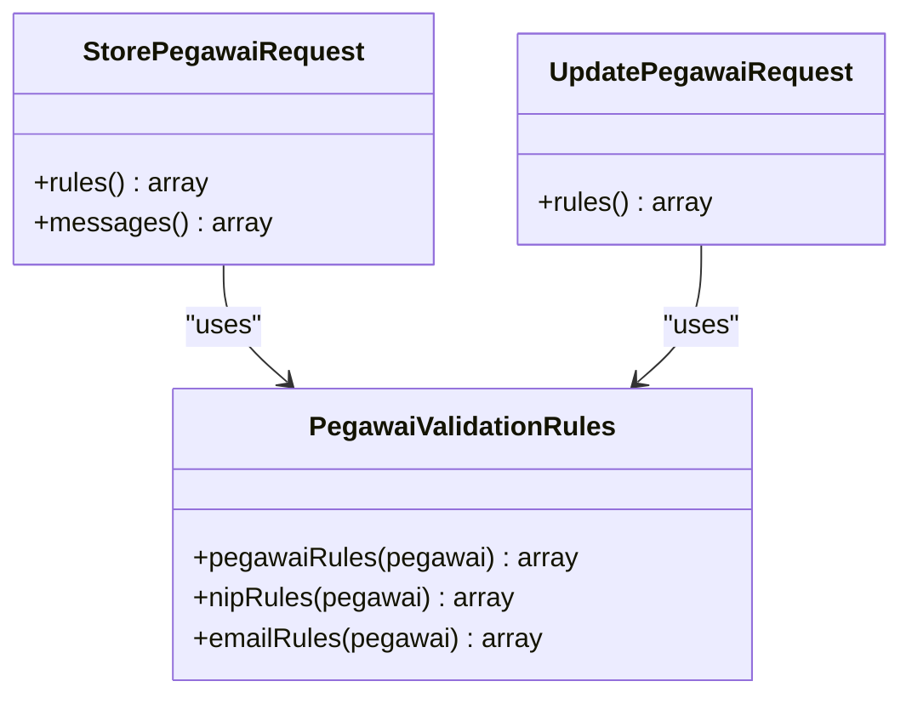
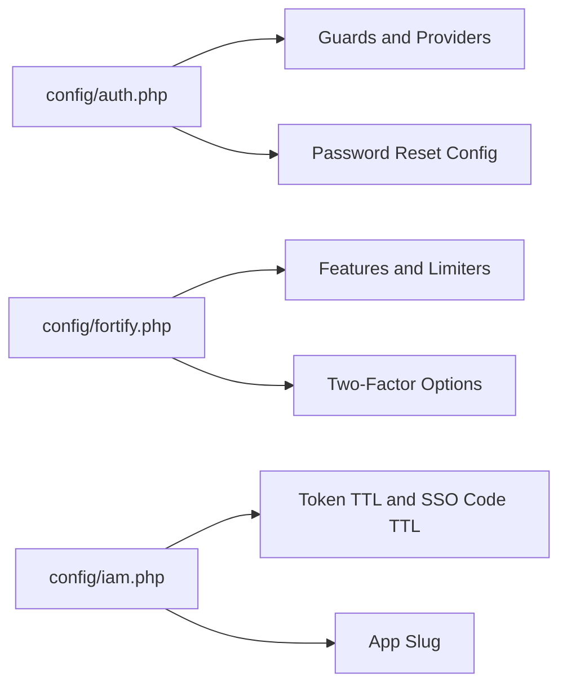
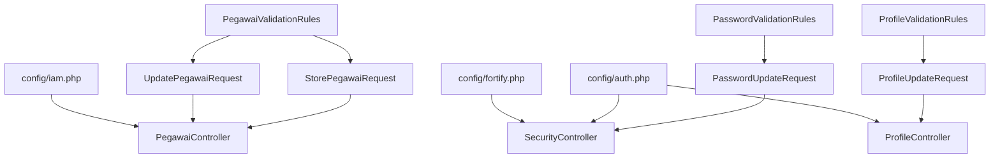

# Data Protection

<cite>
**Referenced Files in This Document**
- [PasswordValidationRules.php](file://app/Concerns/PasswordValidationRules.php)
- [PegawaiValidationRules.php](file://app/Concerns/PegawaiValidationRules.php)
- [ProfileValidationRules.php](file://app/Concerns/ProfileValidationRules.php)
- [PasswordUpdateRequest.php](file://app/Http/Requests/Settings/PasswordUpdateRequest.php)
- [ProfileUpdateRequest.php](file://app/Http/Requests/Settings/ProfileUpdateRequest.php)
- [StorePegawaiRequest.php](file://app/Http/Requests/Kepegawaian/StorePegawaiRequest.php)
- [UpdatePegawaiRequest.php](file://app/Http/Requests/Kepegawaian/UpdatePegawaiRequest.php)
- [StoreKeluargaRequest.php](file://app/Http/Requests/Kepegawaian/StoreKeluargaRequest.php)
- [UpdateKeluargaRequest.php](file://app/Http/Requests/Kepegawaian/UpdateKeluargaRequest.php)
- [SecurityController.php](file://app/Http/Controllers/Settings/SecurityController.php)
- [ProfileController.php](file://app/Http/Controllers/Settings/ProfileController.php)
- [PegawaiController.php](file://app/Http/Controllers/Kepegawaian/PegawaiController.php)
- [auth.php](file://config/auth.php)
- [fortify.php](file://config/fortify.php)
- [iam.php](file://config/iam.php)
</cite>

## Table of Contents
1. [Introduction](#introduction)
2. [Project Structure](#project-structure)
3. [Core Components](#core-components)
4. [Architecture Overview](#architecture-overview)
5. [Detailed Component Analysis](#detailed-component-analysis)
6. [Dependency Analysis](#dependency-analysis)
7. [Performance Considerations](#performance-considerations)
8. [Troubleshooting Guide](#troubleshooting-guide)
9. [Conclusion](#conclusion)
10. [Appendices](#appendices)

## Introduction
This document provides comprehensive data protection guidance for the Kepegawaian Apps system. It focuses on sensitive data handling, validation rules, and security configurations across employee information, profile management, and system settings. It explains the implementation of data validation patterns, password security measures, and protection of sensitive information. Practical examples illustrate secure data processing, validation rule implementation, and configuration management for sensitive settings. Guidance is also provided for data retention policies, audit logging, and compliance with data protection regulations.

## Project Structure
The Kepegawaian Apps system organizes data protection concerns across:
- Concern traits that encapsulate reusable validation rules for passwords, employee data, and profiles
- Form Request classes that enforce validation rules and authorization
- Controllers that orchestrate secure updates and rendering
- Configuration files that define authentication, password policies, and IAM behavior

**Diagram sources**
- [PegawaiValidationRules.php:14-78](file://app/Concerns/PegawaiValidationRules.php#L14-L78)
- [PasswordValidationRules.php:8-29](file://app/Concerns/PasswordValidationRules.php#L8-L29)
- [ProfileValidationRules.php:8-51](file://app/Concerns/ProfileValidationRules.php#L8-L51)
- [StorePegawaiRequest.php:10-51](file://app/Http/Requests/Kepegawaian/StorePegawaiRequest.php#L10-L51)
- [UpdatePegawaiRequest.php:7-32](file://app/Http/Requests/Kepegawaian/UpdatePegawaiRequest.php#L7-L32)
- [PasswordUpdateRequest.php:9-26](file://app/Http/Requests/Settings/PasswordUpdateRequest.php#L9-L26)
- [ProfileUpdateRequest.php:9-23](file://app/Http/Requests/Settings/ProfileUpdateRequest.php#L9-L23)
- [PegawaiController.php:25-224](file://app/Http/Controllers/Kepegawaian/PegawaiController.php#L25-L224)
- [SecurityController.php:15-59](file://app/Http/Controllers/Settings/SecurityController.php#L15-L59)
- [ProfileController.php:15-61](file://app/Http/Controllers/Settings/ProfileController.php#L15-L61)
- [auth.php:1-118](file://config/auth.php#L1-L118)
- [fortify.php:1-157](file://config/fortify.php#L1-L157)
- [iam.php:1-9](file://config/iam.php#L1-L9)

**Section sources**
- [PegawaiValidationRules.php:14-78](file://app/Concerns/PegawaiValidationRules.php#L14-L78)
- [PasswordValidationRules.php:8-29](file://app/Concerns/PasswordValidationRules.php#L8-L29)
- [ProfileValidationRules.php:8-51](file://app/Concerns/ProfileValidationRules.php#L8-L51)
- [StorePegawaiRequest.php:10-51](file://app/Http/Requests/Kepegawaian/StorePegawaiRequest.php#L10-L51)
- [UpdatePegawaiRequest.php:7-32](file://app/Http/Requests/Kepegawaian/UpdatePegawaiRequest.php#L7-L32)
- [PasswordUpdateRequest.php:9-26](file://app/Http/Requests/Settings/PasswordUpdateRequest.php#L9-L26)
- [ProfileUpdateRequest.php:9-23](file://app/Http/Requests/Settings/ProfileUpdateRequest.php#L9-L23)
- [PegawaiController.php:25-224](file://app/Http/Controllers/Kepegawaian/PegawaiController.php#L25-L224)
- [SecurityController.php:15-59](file://app/Http/Controllers/Settings/SecurityController.php#L15-L59)
- [ProfileController.php:15-61](file://app/Http/Controllers/Settings/ProfileController.php#L15-L61)
- [auth.php:1-118](file://config/auth.php#L1-L118)
- [fortify.php:1-157](file://config/fortify.php#L1-L157)
- [iam.php:1-9](file://config/iam.php#L1-L9)

## Core Components
This section outlines the core components responsible for data protection and validation.

- PasswordValidationRules trait
  - Provides standardized password validation rules and current password verification rules
  - Ensures strong password requirements and confirmation
  - Used by PasswordUpdateRequest

- PegawaiValidationRules trait
  - Defines comprehensive validation rules for employee records
  - Includes NIP constraints, email uniqueness, enum-based fields, and foreign key existence checks
  - Used by StorePegawaiRequest and UpdatePegawaiRequest

- ProfileValidationRules trait
  - Defines validation rules for user profile updates
  - Enforces name and email constraints with uniqueness checks
  - Used by ProfileUpdateRequest

- Form Requests
  - StorePegawaiRequest: Validates creation of employee records using PegawaiValidationRules
  - UpdatePegawaiRequest: Extends store rules and adds optional password confirmation
  - PasswordUpdateRequest: Validates current and new password using PasswordValidationRules
  - ProfileUpdateRequest: Validates profile updates using ProfileValidationRules

- Controllers
  - SecurityController: Manages two-factor authentication settings and password updates
  - ProfileController: Handles profile viewing, updating, and deletion with email verification semantics
  - PegawaiController: Manages CRUD operations for employees with authorization gates and safe updates

- Configurations
  - auth.php: Defines authentication guards, providers, and password reset behavior
  - fortify.php: Configures Fortify features, rate limiting, and two-factor authentication options
  - iam.php: Defines IAM token and SSO code time-to-live and application slug

**Section sources**
- [PasswordValidationRules.php:8-29](file://app/Concerns/PasswordValidationRules.php#L8-L29)
- [PegawaiValidationRules.php:14-78](file://app/Concerns/PegawaiValidationRules.php#L14-L78)
- [ProfileValidationRules.php:8-51](file://app/Concerns/ProfileValidationRules.php#L8-L51)
- [StorePegawaiRequest.php:10-51](file://app/Http/Requests/Kepegawaian/StorePegawaiRequest.php#L10-L51)
- [UpdatePegawaiRequest.php:7-32](file://app/Http/Requests/Kepegawaian/UpdatePegawaiRequest.php#L7-L32)
- [PasswordUpdateRequest.php:9-26](file://app/Http/Requests/Settings/PasswordUpdateRequest.php#L9-L26)
- [ProfileUpdateRequest.php:9-23](file://app/Http/Requests/Settings/ProfileUpdateRequest.php#L9-L23)
- [SecurityController.php:15-59](file://app/Http/Controllers/Settings/SecurityController.php#L15-L59)
- [ProfileController.php:15-61](file://app/Http/Controllers/Settings/ProfileController.php#L15-L61)
- [PegawaiController.php:25-224](file://app/Http/Controllers/Kepegawaian/PegawaiController.php#L25-L224)
- [auth.php:1-118](file://config/auth.php#L1-L118)
- [fortify.php:1-157](file://config/fortify.php#L1-L157)
- [iam.php:1-9](file://config/iam.php#L1-L9)

## Architecture Overview
The data protection architecture follows a layered pattern:
- Validation layer: Concern traits encapsulate validation logic
- Request layer: Form Requests enforce rules and authorization
- Controller layer: Controllers coordinate updates and rendering
- Configuration layer: Centralized settings govern authentication and IAM behavior

**Diagram sources**
- [SecurityController.php:50-57](file://app/Http/Controllers/Settings/SecurityController.php#L50-L57)
- [PasswordUpdateRequest.php:18-24](file://app/Http/Requests/Settings/PasswordUpdateRequest.php#L18-L24)
- [PasswordValidationRules.php:15-28](file://app/Concerns/PasswordValidationRules.php#L15-L28)
- [auth.php:95-102](file://config/auth.php#L95-L102)
- [fortify.php:146-154](file://config/fortify.php#L146-L154)

## Detailed Component Analysis

### Password Security Measures
Password security is enforced through:
- Strong password validation rules via PasswordValidationRules
- Current password verification using the "current_password" rule
- Fortify two-factor authentication with optional password confirmation
- Secure password reset configuration with expiration and throttling

**Diagram sources**
- [PasswordValidationRules.php:8-29](file://app/Concerns/PasswordValidationRules.php#L8-L29)
- [PasswordUpdateRequest.php:9-26](file://app/Http/Requests/Settings/PasswordUpdateRequest.php#L9-L26)
- [SecurityController.php:15-59](file://app/Http/Controllers/Settings/SecurityController.php#L15-L59)
- [fortify.php:146-154](file://config/fortify.php#L146-L154)

Practical examples:
- Enforce password confirmation and strong criteria using PasswordUpdateRequest
- Require password confirmation for two-factor management via middleware
- Configure rate limiting for login attempts and two-factor challenges

**Section sources**
- [PasswordValidationRules.php:15-28](file://app/Concerns/PasswordValidationRules.php#L15-L28)
- [PasswordUpdateRequest.php:18-24](file://app/Http/Requests/Settings/PasswordUpdateRequest.php#L18-L24)
- [SecurityController.php:20-26](file://app/Http/Controllers/Settings/SecurityController.php#L20-L26)
- [fortify.php:117-120](file://config/fortify.php#L117-L120)
- [auth.php:95-102](file://config/auth.php#L95-L102)

### Employee Information Validation
Employee data validation ensures data integrity and uniqueness:
- NIP validation enforces length, numeric-only format, and uniqueness
- Email validation enforces format, max length, and uniqueness
- Enum-based fields restrict values to predefined sets
- Foreign key existence checks ensure referential integrity
- Additional fields include date validations, string limits, and nullable allowances

**Diagram sources**
- [PegawaiValidationRules.php:16-76](file://app/Concerns/PegawaiValidationRules.php#L16-L76)
- [StorePegawaiRequest.php:27-49](file://app/Http/Requests/Kepegawaian/StorePegawaiRequest.php#L27-L49)
- [UpdatePegawaiRequest.php:20-30](file://app/Http/Requests/Kepegawaian/UpdatePegawaiRequest.php#L20-L30)

Practical examples:
- Create employee records with unique NIP and email using StorePegawaiRequest
- Update employee records with optional password changes using UpdatePegawaiRequest
- Enforce enum constraints for sensitive demographic fields

**Section sources**
- [PegawaiValidationRules.php:52-76](file://app/Concerns/PegawaiValidationRules.php#L52-L76)
- [StorePegawaiRequest.php:27-49](file://app/Http/Requests/Kepegawaian/StorePegawaiRequest.php#L27-L49)
- [UpdatePegawaiRequest.php:20-30](file://app/Http/Requests/Kepegawaian/UpdatePegawaiRequest.php#L20-L30)

### Profile Management Validation
Profile updates are validated to protect personal data:
- Name validation enforces required string with length limits
- Email validation enforces format, max length, and uniqueness per user
- Profile updates trigger email verification reset when email changes

**Diagram sources**
- [ProfileController.php:31-42](file://app/Http/Controllers/Settings/ProfileController.php#L31-L42)
- [ProfileUpdateRequest.php:18-21](file://app/Http/Requests/Settings/ProfileUpdateRequest.php#L18-L21)
- [ProfileValidationRules.php:15-49](file://app/Concerns/ProfileValidationRules.php#L15-L49)

Practical examples:
- Update profile with validated name and email using ProfileUpdateRequest
- Trigger email verification reset when changing email addresses

**Section sources**
- [ProfileValidationRules.php:15-49](file://app/Concerns/ProfileValidationRules.php#L15-L49)
- [ProfileUpdateRequest.php:18-21](file://app/Http/Requests/Settings/ProfileUpdateRequest.php#L18-L21)
- [ProfileController.php:35-37](file://app/Http/Controllers/Settings/ProfileController.php#L35-L37)

### Sensitive Information Protection
Sensitive information protection mechanisms:
- Unique constraints prevent duplicate NIP and email entries
- Enum-based validation restricts invalid values for demographic fields
- Foreign key existence checks ensure referential integrity
- Optional password field in updates allows controlled credential changes
- Two-factor authentication enhances account security

**Diagram sources**
- [StorePegawaiRequest.php:10-51](file://app/Http/Requests/Kepegawaian/StorePegawaiRequest.php#L10-L51)
- [UpdatePegawaiRequest.php:7-32](file://app/Http/Requests/Kepegawaian/UpdatePegawaiRequest.php#L7-L32)
- [PegawaiValidationRules.php:14-78](file://app/Concerns/PegawaiValidationRules.php#L14-L78)

Practical examples:
- Prevent duplicate NIP and email using unique rules
- Restrict invalid enum values for gender, religion, and employment status
- Enforce foreign key existence for hierarchical references

**Section sources**
- [PegawaiValidationRules.php:52-76](file://app/Concerns/PegawaiValidationRules.php#L52-L76)
- [StorePegawaiRequest.php:32-49](file://app/Http/Requests/Kepegawaian/StorePegawaiRequest.php#L32-L49)
- [UpdatePegawaiRequest.php:24-29](file://app/Http/Requests/Kepegawaian/UpdatePegawaiRequest.php#L24-L29)

### System Configuration Management
Secure configuration management for sensitive settings:
- Authentication guard and provider configuration
- Password reset behavior with expiry and throttling
- Fortify features including two-factor authentication and rate limiting
- IAM token and SSO code TTL settings

**Diagram sources**
- [auth.php:18-102](file://config/auth.php#L18-L102)
- [fortify.php:146-154](file://config/fortify.php#L146-L154)
- [iam.php:5-8](file://config/iam.php#L5-L8)

Practical examples:
- Configure authentication guard and provider in auth.php
- Set password reset expiry and throttle in auth.php
- Enable two-factor authentication features in fortify.php
- Manage IAM token and SSO code TTL in iam.php

**Section sources**
- [auth.php:18-102](file://config/auth.php#L18-L102)
- [fortify.php:146-154](file://config/fortify.php#L146-L154)
- [iam.php:5-8](file://config/iam.php#L5-L8)

## Dependency Analysis
The following diagram illustrates dependencies among validation components, requests, controllers, and configurations.

**Diagram sources**
- [PegawaiValidationRules.php:14-78](file://app/Concerns/PegawaiValidationRules.php#L14-L78)
- [PasswordValidationRules.php:8-29](file://app/Concerns/PasswordValidationRules.php#L8-L29)
- [ProfileValidationRules.php:8-51](file://app/Concerns/ProfileValidationRules.php#L8-L51)
- [StorePegawaiRequest.php:10-51](file://app/Http/Requests/Kepegawaian/StorePegawaiRequest.php#L10-L51)
- [UpdatePegawaiRequest.php:7-32](file://app/Http/Requests/Kepegawaian/UpdatePegawaiRequest.php#L7-L32)
- [PasswordUpdateRequest.php:9-26](file://app/Http/Requests/Settings/PasswordUpdateRequest.php#L9-L26)
- [ProfileUpdateRequest.php:9-23](file://app/Http/Requests/Settings/ProfileUpdateRequest.php#L9-L23)
- [PegawaiController.php:25-224](file://app/Http/Controllers/Kepegawaian/PegawaiController.php#L25-L224)
- [SecurityController.php:15-59](file://app/Http/Controllers/Settings/SecurityController.php#L15-L59)
- [ProfileController.php:15-61](file://app/Http/Controllers/Settings/ProfileController.php#L15-L61)
- [auth.php:1-118](file://config/auth.php#L1-L118)
- [fortify.php:1-157](file://config/fortify.php#L1-L157)
- [iam.php:1-9](file://config/iam.php#L1-L9)

**Section sources**
- [PegawaiValidationRules.php:14-78](file://app/Concerns/PegawaiValidationRules.php#L14-L78)
- [PasswordValidationRules.php:8-29](file://app/Concerns/PasswordValidationRules.php#L8-L29)
- [ProfileValidationRules.php:8-51](file://app/Concerns/ProfileValidationRules.php#L8-L51)
- [StorePegawaiRequest.php:10-51](file://app/Http/Requests/Kepegawaian/StorePegawaiRequest.php#L10-L51)
- [UpdatePegawaiRequest.php:7-32](file://app/Http/Requests/Kepegawaian/UpdatePegawaiRequest.php#L7-L32)
- [PasswordUpdateRequest.php:9-26](file://app/Http/Requests/Settings/PasswordUpdateRequest.php#L9-L26)
- [ProfileUpdateRequest.php:9-23](file://app/Http/Requests/Settings/ProfileUpdateRequest.php#L9-L23)
- [PegawaiController.php:25-224](file://app/Http/Controllers/Kepegawaian/PegawaiController.php#L25-L224)
- [SecurityController.php:15-59](file://app/Http/Controllers/Settings/SecurityController.php#L15-L59)
- [ProfileController.php:15-61](file://app/Http/Controllers/Settings/ProfileController.php#L15-L61)
- [auth.php:1-118](file://config/auth.php#L1-L118)
- [fortify.php:1-157](file://config/fortify.php#L1-L157)
- [iam.php:1-9](file://config/iam.php#L1-L9)

## Performance Considerations
- Validation rules are lightweight and executed before controller logic, minimizing unnecessary database operations
- Unique constraints leverage database-level checks, reducing application-level overhead
- Enum validation prevents invalid queries and reduces downstream processing costs
- Two-factor authentication adds minimal overhead with optional password confirmation

## Troubleshooting Guide
Common validation errors and resolutions:
- NIP validation failures: Ensure NIP is exactly 18 digits and unique
- Email validation failures: Confirm email format, max length, and uniqueness
- Enum validation failures: Verify values match predefined enum cases
- Foreign key validation failures: Confirm referenced IDs exist in related tables
- Password confirmation failures: Ensure current password matches and new password meets requirements
- Profile email changes: Expect email verification reset when updating email

**Section sources**
- [StorePegawaiRequest.php:32-49](file://app/Http/Requests/Kepegawaian/StorePegawaiRequest.php#L32-L49)
- [UpdatePegawaiRequest.php:24-29](file://app/Http/Requests/Kepegawaian/UpdatePegawaiRequest.php#L24-L29)
- [PasswordUpdateRequest.php:18-24](file://app/Http/Requests/Settings/PasswordUpdateRequest.php#L18-L24)
- [ProfileController.php:35-37](file://app/Http/Controllers/Settings/ProfileController.php#L35-L37)

## Conclusion
The Kepegawaian Apps system implements robust data protection through centralized validation traits, strict Form Request rules, and secure configuration management. Password security, employee data integrity, and profile protection are enforced consistently across controllers. Adhering to these patterns ensures secure, compliant handling of sensitive information while maintaining usability and performance.

## Appendices
- Data Retention Policies: Define retention periods for employee records and logs; align with regulatory requirements
- Audit Logging: Log authentication events, profile changes, and employee record modifications; maintain non-repudiation
- Compliance: Align validation rules and configurations with applicable data protection regulations; conduct periodic audits