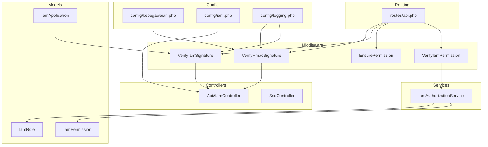
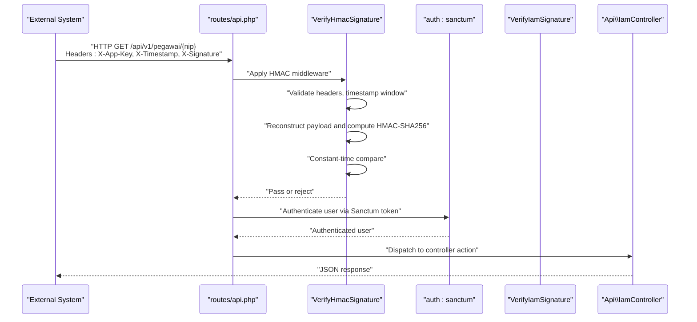
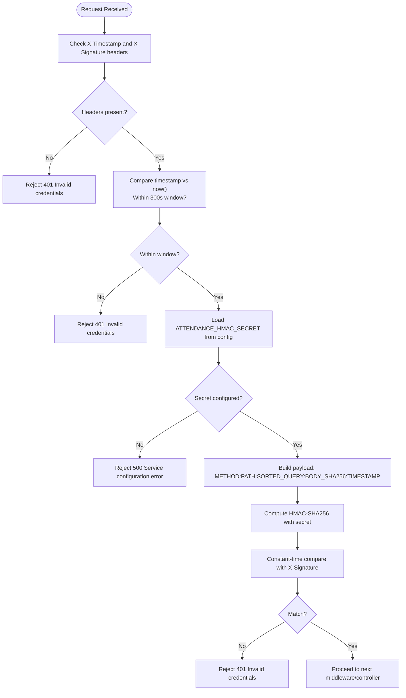
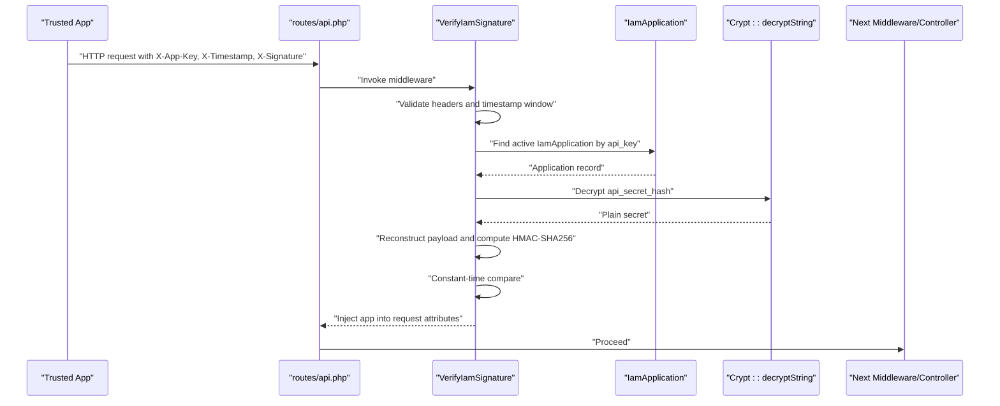
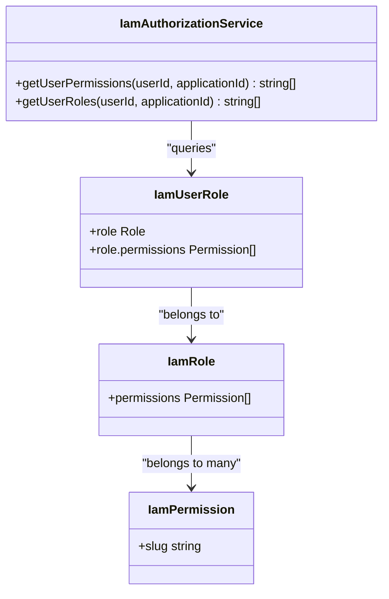
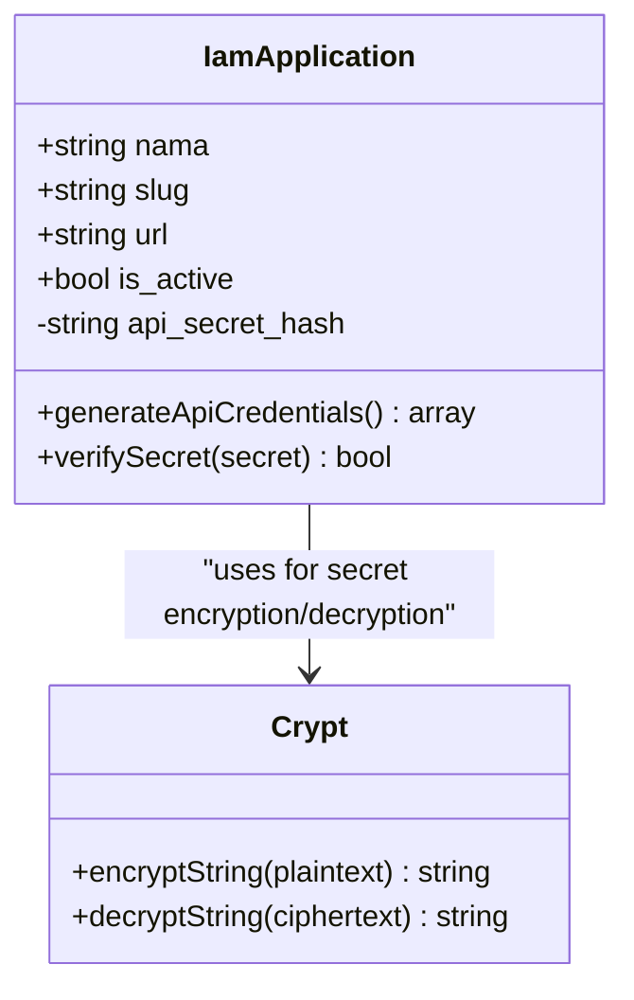
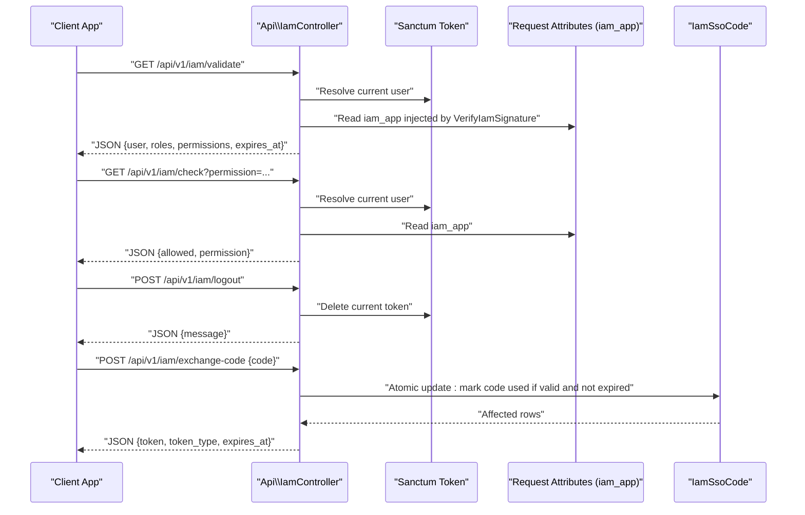
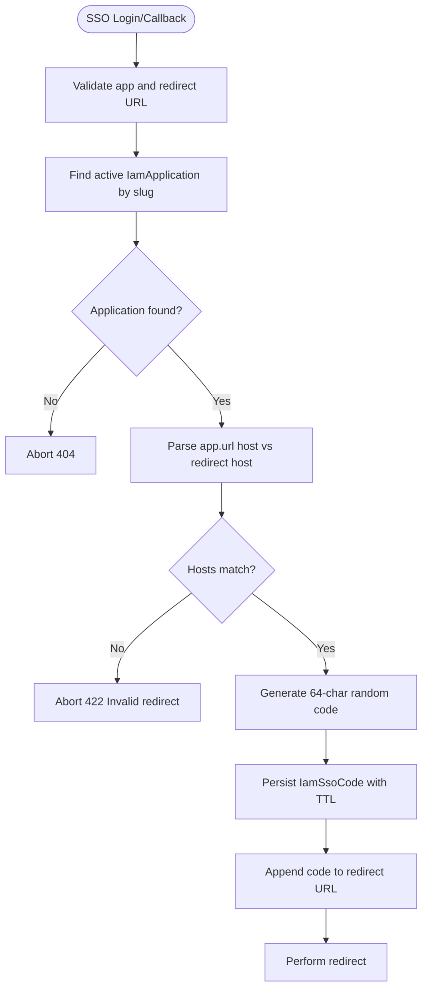
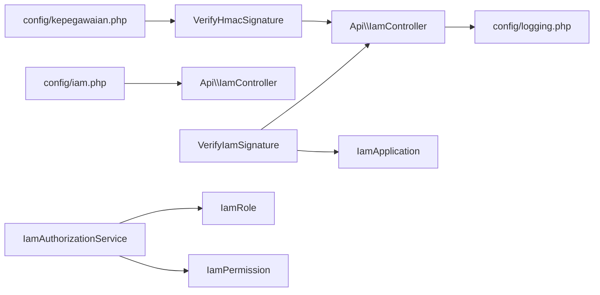

# Security Considerations

<cite>
**Referenced Files in This Document**
- [VerifyHmacSignature.php](file://app/Http/Middleware/VerifyHmacSignature.php)
- [VerifyIamSignature.php](file://app/Http/Middleware/VerifyIamSignature.php)
- [EnsurePermission.php](file://app/Http/Middleware/EnsurePermission.php)
- [VerifyIamPermission.php](file://app/Http/Middleware/VerifyIamPermission.php)
- [IamAuthorizationService.php](file://app/Services/IamAuthorizationService.php)
- [IamApplication.php](file://app/Models/IamApplication.php)
- [IamPermission.php](file://app/Models/IamPermission.php)
- [IamRole.php](file://app/Models/IamRole.php)
- [IamController.php](file://app/Http/Controllers/Api/IamController.php)
- [SsoController.php](file://app/Http/Controllers/SsoController.php)
- [routes/api.php](file://routes/api.php)
- [config/kepegawaian.php](file://config/kepegawaian.php)
- [config/iam.php](file://config/iam.php)
- [config/logging.php](file://config/logging.php)
- [SecurityController.php](file://app/Http/Controllers/Settings/SecurityController.php)
</cite>

## Table of Contents
1. [Introduction](#introduction)
2. [Project Structure](#project-structure)
3. [Core Components](#core-components)
4. [Architecture Overview](#architecture-overview)
5. [Detailed Component Analysis](#detailed-component-analysis)
6. [Dependency Analysis](#dependency-analysis)
7. [Performance Considerations](#performance-considerations)
8. [Troubleshooting Guide](#troubleshooting-guide)
9. [Conclusion](#conclusion)
10. [Appendices](#appendices)

## Introduction
This document presents the security architecture and implementation details for the Kepegawaian Apps system with a focus on authentication, authorization, and data protection. It explains how HMAC signature verification, API key management, permission validation, and security middleware work together to protect integrations and internal APIs. It also provides practical guidance for secure API integration, access control enforcement, and security monitoring, aligned with the codebase terminology such as HMAC verification, permission validation, and security middleware.

## Project Structure
Security-related components are organized across middleware, models, services, controllers, configuration, and routing layers. The middleware enforces integrity and permission checks, models encapsulate IAM credentials and RBAC metadata, services centralize permission computation, controllers expose validated endpoints, and configuration defines secrets and operational parameters.

**Diagram sources**
- [routes/api.php:1-48](file://routes/api.php#L1-L48)
- [VerifyHmacSignature.php:1-65](file://app/Http/Middleware/VerifyHmacSignature.php#L1-L65)
- [VerifyIamSignature.php:1-61](file://app/Http/Middleware/VerifyIamSignature.php#L1-L61)
- [EnsurePermission.php:1-37](file://app/Http/Middleware/EnsurePermission.php#L1-L37)
- [VerifyIamPermission.php:1-54](file://app/Http/Middleware/VerifyIamPermission.php#L1-L54)
- [IamAuthorizationService.php:1-45](file://app/Services/IamAuthorizationService.php#L1-L45)
- [IamApplication.php:1-96](file://app/Models/IamApplication.php#L1-L96)
- [IamRole.php:1-38](file://app/Models/IamRole.php#L1-L38)
- [IamPermission.php:1-22](file://app/Models/IamPermission.php#L1-L22)
- [IamController.php:1-91](file://app/Http/Controllers/Api/IamController.php#L1-L91)
- [SsoController.php:1-85](file://app/Http/Controllers/SsoController.php#L1-L85)
- [config/kepegawaian.php:1-17](file://config/kepegawaian.php#L1-L17)
- [config/iam.php:1-9](file://config/iam.php#L1-L9)
- [config/logging.php:1-133](file://config/logging.php#L1-L133)

**Section sources**
- [routes/api.php:1-48](file://routes/api.php#L1-L48)
- [config/kepegawaian.php:1-17](file://config/kepegawaian.php#L1-L17)
- [config/iam.php:1-9](file://config/iam.php#L1-L9)

## Core Components
- HMAC verification middleware for external integrations:
  - Validates presence of required headers, enforces timestamp freshness, reconstructs payload deterministically, computes HMAC-SHA256, and performs constant-time comparison.
- IAM signature middleware for trusted applications:
  - Authenticates API clients via API key and verifies HMAC signatures using encrypted secrets stored server-side.
- Permission enforcement middleware:
  - Ensures authenticated users possess required permissions or roles for protected routes.
- Authorization service:
  - Centralized logic to compute effective permissions and roles for a user within a specific application context.
- IAM models:
  - Encapsulate application credentials, roles, and permissions with secure secret handling and hidden sensitive fields.
- API controllers:
  - Expose validated endpoints for IAM operations, including token validation, permission checks, logout, and SSO code exchange.
- Routing and throttling:
  - Applies layered protections including Sanctum tokens, HMAC verification, and rate limiting.

**Section sources**
- [VerifyHmacSignature.php:17-63](file://app/Http/Middleware/VerifyHmacSignature.php#L17-L63)
- [VerifyIamSignature.php:11-59](file://app/Http/Middleware/VerifyIamSignature.php#L11-L59)
- [EnsurePermission.php:9-35](file://app/Http/Middleware/EnsurePermission.php#L9-L35)
- [VerifyIamPermission.php:12-52](file://app/Http/Middleware/VerifyIamPermission.php#L12-L52)
- [IamAuthorizationService.php:7-44](file://app/Services/IamAuthorizationService.php#L7-L44)
- [IamApplication.php:12-96](file://app/Models/IamApplication.php#L12-L96)
- [IamController.php:13-91](file://app/Http/Controllers/Api/IamController.php#L13-L91)
- [routes/api.php:21-47](file://routes/api.php#L21-L47)

## Architecture Overview
The system employs a four-layer security model for integrations:
- Transport security: HTTPS enforced by deployment.
- Authentication: Sanctum personal access tokens for user sessions.
- Integrity: HMAC-SHA256 signatures with deterministic payload construction and timestamp validation.
- Availability: Rate limiting to mitigate DDoS.

**Diagram sources**
- [routes/api.php:21-31](file://routes/api.php#L21-L31)
- [VerifyHmacSignature.php:25-63](file://app/Http/Middleware/VerifyHmacSignature.php#L25-L63)
- [IamController.php:17-29](file://app/Http/Controllers/Api/IamController.php#L17-L29)

**Section sources**
- [routes/api.php:13-17](file://routes/api.php#L13-L17)
- [VerifyHmacSignature.php:9-16](file://app/Http/Middleware/VerifyHmacSignature.php#L9-L16)
- [VerifyIamSignature.php:11-13](file://app/Http/Middleware/VerifyIamSignature.php#L11-L13)

## Detailed Component Analysis

### HMAC Signature Verification (External Integrations)
Purpose:
- Ensure request integrity and origin authenticity for external systems.
Key behaviors:
- Header validation and timestamp freshness (five-minute window).
- Deterministic payload construction: method, path, sorted query string, body SHA-256 digest, and timestamp.
- Constant-time HMAC comparison to prevent timing attacks.
- Configuration-driven shared secret for integrity verification.

**Diagram sources**
- [VerifyHmacSignature.php:25-63](file://app/Http/Middleware/VerifyHmacSignature.php#L25-L63)
- [config/kepegawaian.php:14-16](file://config/kepegawaian.php#L14-L16)

**Section sources**
- [VerifyHmacSignature.php:17-63](file://app/Http/Middleware/VerifyHmacSignature.php#L17-L63)
- [config/kepegawaian.php:3-16](file://config/kepegawaian.php#L3-L16)

### IAM Signature Verification (Trusted Applications)
Purpose:
- Authenticate trusted applications and verify request integrity using encrypted API secrets.
Key behaviors:
- Extract API key from headers and validate timestamp window.
- Resolve active application and decrypt stored API secret.
- Reconstruct payload and compute HMAC-SHA256 using decrypted secret.
- Inject resolved application into request attributes for downstream use.

**Diagram sources**
- [VerifyIamSignature.php:15-59](file://app/Http/Middleware/VerifyIamSignature.php#L15-L59)
- [IamApplication.php:37-49](file://app/Models/IamApplication.php#L37-L49)
- [IamApplication.php:85-94](file://app/Models/IamApplication.php#L85-L94)

**Section sources**
- [VerifyIamSignature.php:11-59](file://app/Http/Middleware/VerifyIamSignature.php#L11-L59)
- [IamApplication.php:24-26](file://app/Models/IamApplication.php#L24-L26)
- [IamApplication.php:72-79](file://app/Models/IamApplication.php#L72-L79)

### Permission Validation and Enforcement
Purpose:
- Enforce authorization for internal routes and IAM endpoints.
Key behaviors:
- Ensure user is authenticated; otherwise redirect to login or return 401.
- Parse required permissions from route definition and check against user’s permissions.
- IAM-specific variant validates user membership in target application and optional permission presence.

**Diagram sources**
- [EnsurePermission.php:11-35](file://app/Http/Middleware/EnsurePermission.php#L11-L35)
- [VerifyIamPermission.php:16-52](file://app/Http/Middleware/VerifyIamPermission.php#L16-L52)

**Section sources**
- [EnsurePermission.php:9-35](file://app/Http/Middleware/EnsurePermission.php#L9-L35)
- [VerifyIamPermission.php:12-52](file://app/Http/Middleware/VerifyIamPermission.php#L12-L52)

### Authorization Service
Purpose:
- Centralize permission and role resolution for a given application context.
Key behaviors:
- Retrieve all permission slugs for a user within an application.
- Retrieve all role slugs for a user within an application.

**Diagram sources**
- [IamAuthorizationService.php:16-43](file://app/Services/IamAuthorizationService.php#L16-L43)
- [IamRole.php:28-36](file://app/Models/IamRole.php#L28-L36)
- [IamPermission.php:13-21](file://app/Models/IamPermission.php#L13-L21)

**Section sources**
- [IamAuthorizationService.php:7-44](file://app/Services/IamAuthorizationService.php#L7-L44)

### IAM Application Credentials and Secrets
Purpose:
- Securely manage API keys and secrets for trusted applications.
Key behaviors:
- Hidden sensitive field in responses.
- Automatic generation of API key and encrypted secret during creation.
- Decryption for signature verification and constant-time comparison for secret validation.

**Diagram sources**
- [IamApplication.php:16-26](file://app/Models/IamApplication.php#L16-L26)
- [IamApplication.php:37-49](file://app/Models/IamApplication.php#L37-L49)
- [IamApplication.php:72-79](file://app/Models/IamApplication.php#L72-L79)
- [IamApplication.php:85-94](file://app/Models/IamApplication.php#L85-L94)

**Section sources**
- [IamApplication.php:24-26](file://app/Models/IamApplication.php#L24-L26)
- [IamApplication.php:72-79](file://app/Models/IamApplication.php#L72-L79)
- [IamApplication.php:85-94](file://app/Models/IamApplication.php#L85-L94)

### IAM API Endpoints and SSO Integration
Purpose:
- Provide validated user context, permission checks, logout, and SSO code exchange with strict validation and scoping.
Key behaviors:
- Validate endpoint returns user roles and permissions scoped to the requesting application.
- Check endpoint evaluates a single permission against the user’s permissions.
- Logout invalidates the current token.
- Exchange code endpoint atomically marks a code as used, validates expiry and ownership, and issues a scoped token.

**Diagram sources**
- [IamController.php:17-89](file://app/Http/Controllers/Api/IamController.php#L17-L89)
- [VerifyIamSignature.php:55-58](file://app/Http/Middleware/VerifyIamSignature.php#L55-L58)

**Section sources**
- [IamController.php:17-89](file://app/Http/Controllers/Api/IamController.php#L17-L89)

### SSO Code Generation and Redirect Validation
Purpose:
- Safely issue short-lived SSO codes bound to a specific application and redirect host.
Key behaviors:
- Validate application existence and active status.
- Enforce redirect host equality with registered application host.
- Generate cryptographically random 64-character code with configured TTL.
- Append code to redirect URL and perform final redirect.

**Diagram sources**
- [SsoController.php:15-83](file://app/Http/Controllers/SsoController.php#L15-L83)

**Section sources**
- [SsoController.php:15-83](file://app/Http/Controllers/SsoController.php#L15-L83)

## Dependency Analysis
Security middleware and controllers depend on:
- Configuration for secrets and application parameters.
- Models for credential storage and RBAC metadata.
- Services for centralized authorization computations.
- Database transactions for atomic SSO code updates.

**Diagram sources**
- [config/kepegawaian.php:14-16](file://config/kepegawaian.php#L14-L16)
- [config/iam.php:5-8](file://config/iam.php#L5-L8)
- [VerifyHmacSignature.php:40-44](file://app/Http/Middleware/VerifyHmacSignature.php#L40-L44)
- [VerifyIamSignature.php:29-33](file://app/Http/Middleware/VerifyIamSignature.php#L29-L33)
- [IamAuthorizationService.php:18-25](file://app/Services/IamAuthorizationService.php#L18-L25)
- [IamController.php:17-29](file://app/Http/Controllers/Api/IamController.php#L17-L29)
- [config/logging.php:1-133](file://config/logging.php#L1-L133)

**Section sources**
- [VerifyHmacSignature.php:40-44](file://app/Http/Middleware/VerifyHmacSignature.php#L40-L44)
- [VerifyIamSignature.php:29-33](file://app/Http/Middleware/VerifyIamSignature.php#L29-L33)
- [IamAuthorizationService.php:18-25](file://app/Services/IamAuthorizationService.php#L18-L25)
- [IamController.php:17-29](file://app/Http/Controllers/Api/IamController.php#L17-L29)

## Performance Considerations
- HMAC verification cost is minimal and constant-time; overhead dominated by hashing and cryptographic operations.
- Caching application records reduces repeated database lookups for IAM permission checks.
- Transactional SSO code updates ensure atomicity with minimal contention under normal load.
- Rate limiting prevents abuse while maintaining responsiveness for legitimate traffic.

[No sources needed since this section provides general guidance]

## Troubleshooting Guide
Common issues and resolutions:
- Invalid credentials (401):
  - Missing or incorrect headers, expired timestamp, or mismatched signature.
  - Verify header presence and timestamp window; recompute payload and HMAC using the correct shared secret.
- Service configuration error (500):
  - Missing HMAC secret in configuration.
  - Ensure the ATTENDANCE_HMAC_SECRET is set and loaded.
- Invalid signature:
  - Incorrect API secret or tampered payload.
  - Confirm decrypted secret matches the one used by the client; verify deterministic payload construction.
- Permission denied (403):
  - User lacks required permissions or is not part of the target application.
  - Check user roles and permissions scoped to the application; ensure correct application context injection.
- SSO redirect rejected:
  - Redirect host does not match registered application host.
  - Align redirect URL with the application’s registered URL host.

**Section sources**
- [VerifyHmacSignature.php:31-44](file://app/Http/Middleware/VerifyHmacSignature.php#L31-L44)
- [VerifyIamSignature.php:21-33](file://app/Http/Middleware/VerifyIamSignature.php#L21-L33)
- [VerifyIamPermission.php:20-42](file://app/Http/Middleware/VerifyIamPermission.php#L20-L42)
- [SsoController.php:62-68](file://app/Http/Controllers/SsoController.php#L62-L68)

## Conclusion
The Kepegawaian Apps system implements a robust, layered security model combining transport, authentication, integrity, and availability controls. HMAC verification and encrypted API secrets protect integrations, while centralized authorization and middleware enforce strict access control. Configuration-driven parameters and transactional operations further strengthen reliability and security posture.

[No sources needed since this section summarizes without analyzing specific files]

## Appendices

### Practical Examples

- Secure API Integration (External System)
  - Construct headers: include X-App-Key, X-Timestamp, and X-Signature.
  - Compute payload deterministically: METHOD:PATH:SORTED_QUERY:BODY_SHA256:TIMESTAMP.
  - Use the shared secret from ATTENDANCE_HMAC_SECRET to compute HMAC-SHA256.
  - Perform constant-time comparison against X-Signature.
  - Include rate limiting and HTTPS in deployment.

- Access Control Implementation
  - Define route middleware requiring specific permissions.
  - Use EnsurePermission to gate protected endpoints.
  - For IAM-scoped checks, use VerifyIamPermission to validate application membership and permissions.

- Security Monitoring
  - Enable structured logging and configure appropriate channels.
  - Monitor critical events such as configuration errors and unauthorized access attempts.

**Section sources**
- [VerifyHmacSignature.php:46-58](file://app/Http/Middleware/VerifyHmacSignature.php#L46-L58)
- [EnsurePermission.php:11-35](file://app/Http/Middleware/EnsurePermission.php#L11-L35)
- [VerifyIamPermission.php:16-52](file://app/Http/Middleware/VerifyIamPermission.php#L16-L52)
- [config/logging.php:53-133](file://config/logging.php#L53-L133)

### Threat Mitigation Strategies
- Replay attacks: timestamp window validation.
- Tampering: deterministic payload construction and HMAC verification.
- Credential exposure: encrypted API secrets and hidden sensitive fields.
- Privilege escalation: centralized permission checks and application-scoped tokens.
- Cross-origin misuse: strict redirect host validation for SSO.

**Section sources**
- [VerifyHmacSignature.php:23-38](file://app/Http/Middleware/VerifyHmacSignature.php#L23-L38)
- [VerifyIamSignature.php:25-27](file://app/Http/Middleware/VerifyIamSignature.php#L25-L27)
- [IamApplication.php:24-26](file://app/Models/IamApplication.php#L24-L26)
- [SsoController.php:62-68](file://app/Http/Controllers/SsoController.php#L62-L68)

### Compliance and Audit Procedures
- Maintain audit trails for authentication and authorization events.
- Review configuration for secrets and ensure least-privilege principle.
- Periodically rotate API secrets and invalidate compromised tokens.
- Validate middleware chain adherence and rate-limiting effectiveness.

[No sources needed since this section provides general guidance]