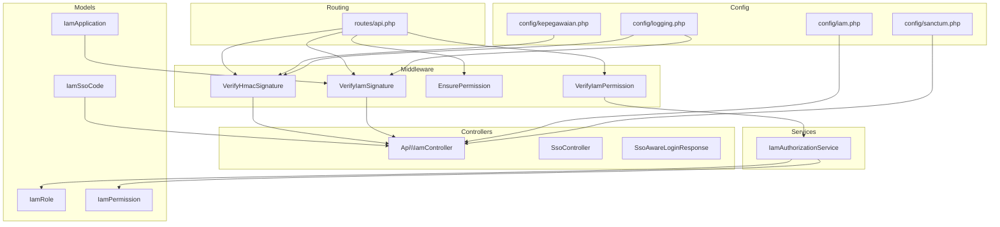
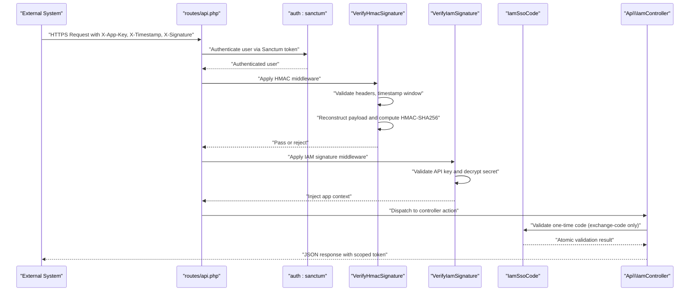
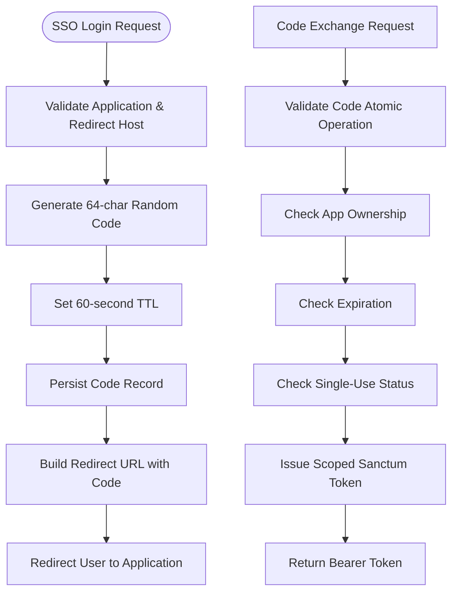
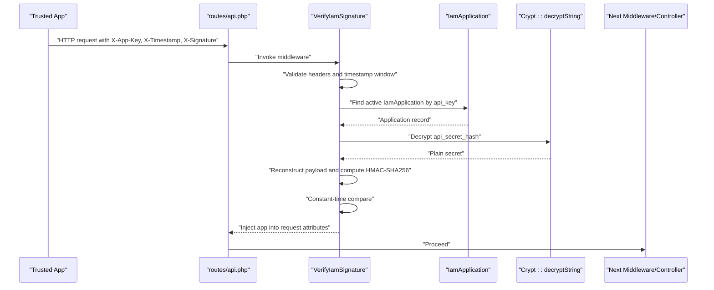
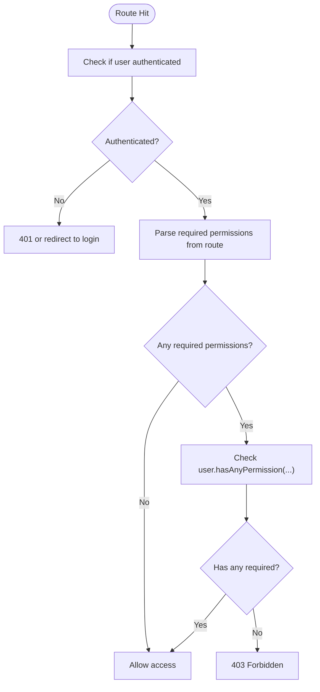
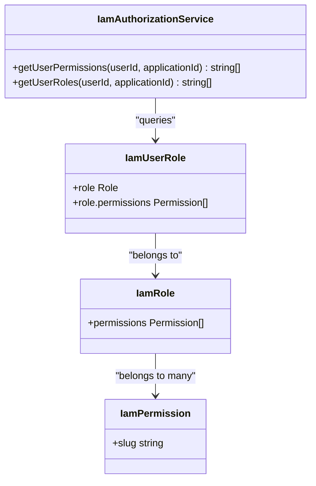
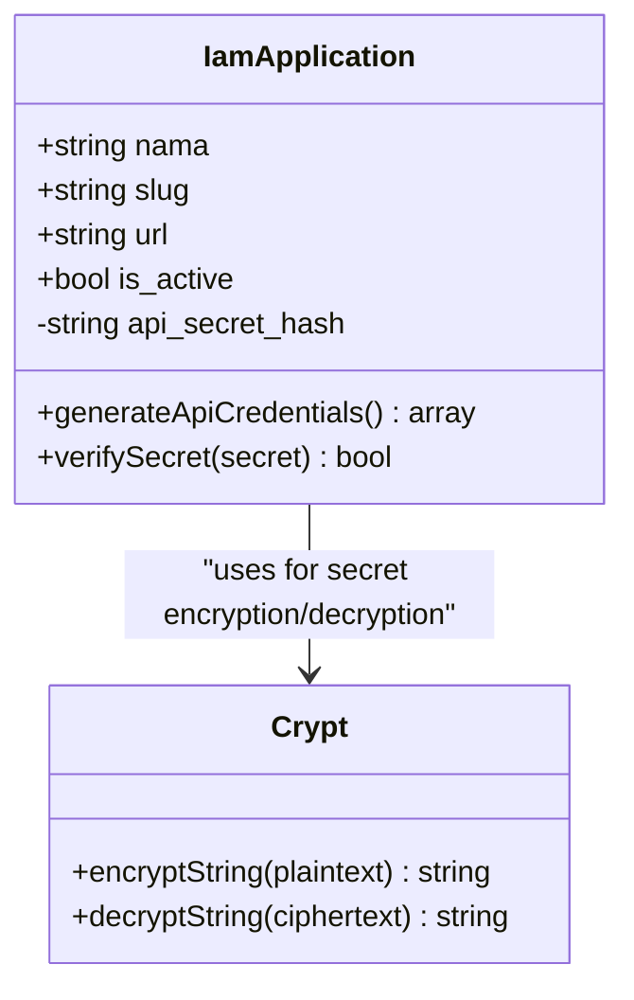
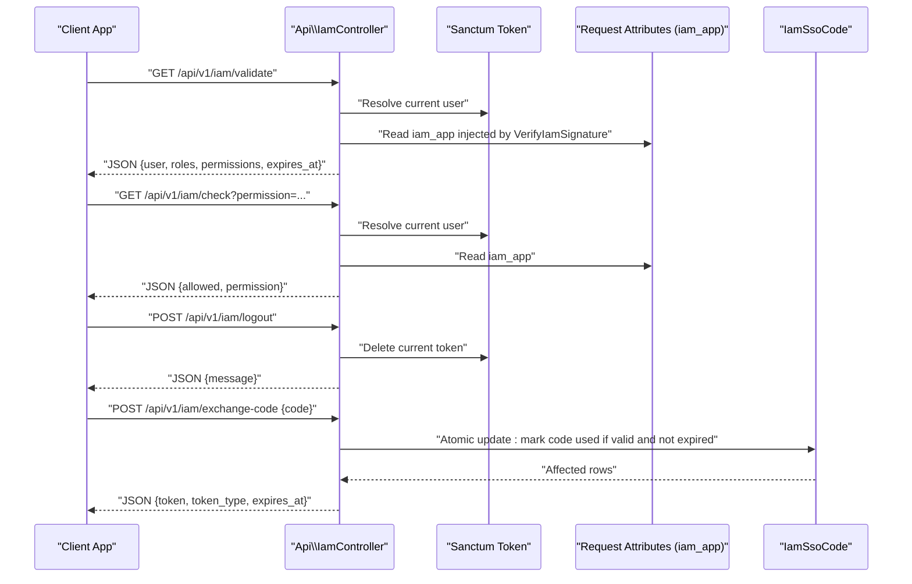
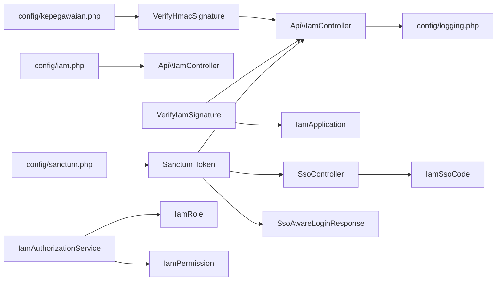

# Security Considerations

<cite>
**Referenced Files in This Document**
- [VerifyHmacSignature.php](file://app/Http/Middleware/VerifyHmacSignature.php)
- [VerifyIamSignature.php](file://app/Http/Middleware/VerifyIamSignature.php)
- [EnsurePermission.php](file://app/Http/Middleware/EnsurePermission.php)
- [VerifyIamPermission.php](file://app/Http/Middleware/VerifyIamPermission.php)
- [IamAuthorizationService.php](file://app/Services/IamAuthorizationService.php)
- [IamApplication.php](file://app/Models/IamApplication.php)
- [IamSsoCode.php](file://app/Models/IamSsoCode.php)
- [IamController.php](file://app/Http/Controllers/Api/IamController.php)
- [SsoController.php](file://app/Http/Controllers/SsoController.php)
- [SsoAwareLoginResponse.php](file://app/Http/Responses/SsoAwareLoginResponse.php)
- [routes/api.php](file://routes/api.php)
- [config/kepegawaian.php](file://config/kepegawaian.php)
- [config/iam.php](file://config/iam.php)
- [config/sanctum.php](file://config/sanctum.php)
- [config/logging.php](file://config/logging.php)
- [SecurityController.php](file://app/Http/Controllers/Settings/SecurityController.php)
</cite>

## Update Summary
**Changes Made**
- Enhanced SSO security model documentation with four-layer security approach
- Added detailed coverage of one-time SSO codes implementation
- Expanded Sanctum token security documentation
- Updated architecture diagrams to reflect comprehensive security layers
- Added practical SSO integration examples and threat mitigation strategies

## Table of Contents
1. [Introduction](#introduction)
2. [Project Structure](#project-structure)
3. [Core Components](#core-components)
4. [Architecture Overview](#architecture-overview)
5. [Detailed Component Analysis](#detailed-component-analysis)
6. [Dependency Analysis](#dependency-analysis)
7. [Performance Considerations](#performance-considerations)
8. [Troubleshooting Guide](#troubleshooting-guide)
9. [Conclusion](#conclusion)
10. [Appendices](#appendices)

## Introduction
This document presents the security architecture and implementation details for the Kepegawaian Apps system with a focus on authentication, authorization, and data protection. The system implements a comprehensive four-layer security model that combines transport security, authentication, integrity verification, and availability controls. It explains how Sanctum tokens, API key management, HMAC signature verification, one-time SSO codes, and permission validation work together to protect integrations and internal APIs. The documentation provides practical guidance for secure API integration, access control enforcement, and security monitoring, aligned with the codebase terminology such as HMAC verification, permission validation, and security middleware.

## Project Structure
Security-related components are organized across middleware, models, services, controllers, configuration, and routing layers. The middleware enforces integrity and permission checks, models encapsulate IAM credentials, SSO codes, and RBAC metadata, services centralize permission computation, controllers expose validated endpoints, and configuration defines secrets and operational parameters.

**Diagram sources**
- [routes/api.php:1-48](file://routes/api.php#L1-L48)
- [VerifyHmacSignature.php:1-65](file://app/Http/Middleware/VerifyHmacSignature.php#L1-L65)
- [VerifyIamSignature.php:1-61](file://app/Http/Middleware/VerifyIamSignature.php#L1-L61)
- [EnsurePermission.php:1-42](file://app/Http/Middleware/EnsurePermission.php#L1-L42)
- [VerifyIamPermission.php:1-59](file://app/Http/Middleware/VerifyIamPermission.php#L1-L59)
- [IamAuthorizationService.php:1-45](file://app/Services/IamAuthorizationService.php#L1-L45)
- [IamApplication.php:1-100](file://app/Models/IamApplication.php#L1-L100)
- [IamSsoCode.php:1-53](file://app/Models/IamSsoCode.php#L1-L53)
- [IamController.php:1-91](file://app/Http/Controllers/Api/IamController.php#L1-L91)
- [SsoController.php:1-92](file://app/Http/Controllers/SsoController.php#L1-L92)
- [SsoAwareLoginResponse.php:1-28](file://app/Http/Responses/SsoAwareLoginResponse.php#L1-L28)
- [config/kepegawaian.php:1-17](file://config/kepegawaian.php#L1-L17)
- [config/iam.php:1-9](file://config/iam.php#L1-L9)
- [config/sanctum.php:1-88](file://config/sanctum.php#L1-L88)
- [config/logging.php:1-133](file://config/logging.php#L1-L133)

**Section sources**
- [routes/api.php:1-48](file://routes/api.php#L1-L48)
- [config/kepegawaian.php:1-17](file://config/kepegawaian.php#L1-L17)
- [config/iam.php:1-9](file://config/iam.php#L1-L9)
- [config/sanctum.php:1-88](file://config/sanctum.php#L1-L88)

## Core Components
- **Transport Security**: HTTPS enforcement at deployment level to protect data in transit
- **Sanctum Token Authentication**: Personal access tokens for user session management with configurable expiration
- **API Key Management**: X-App-Key header validation for trusted application identification
- **HMAC Signature Verification**: HMAC-SHA256 signatures with deterministic payload construction and timestamp validation
- **One-Time SSO Codes**: Cryptographically random 64-character codes with 60-second TTL and single-use validation
- **Permission Enforcement**: Middleware-based authorization with role and permission validation
- **Authorization Service**: Centralized logic for computing effective permissions and roles within application context
- **IAM Models**: Secure credential management with encrypted secrets and hidden sensitive fields
- **SSO Controllers**: Comprehensive SSO flow management with redirect validation and code generation
- **Rate Limiting**: Throttling mechanisms to prevent abuse and DDoS attacks

**Section sources**
- [VerifyHmacSignature.php:17-63](file://app/Http/Middleware/VerifyHmacSignature.php#L17-L63)
- [VerifyIamSignature.php:11-59](file://app/Http/Middleware/VerifyIamSignature.php#L11-L59)
- [EnsurePermission.php:9-35](file://app/Http/Middleware/EnsurePermission.php#L9-L42)
- [VerifyIamPermission.php:12-52](file://app/Http/Middleware/VerifyIamPermission.php#L12-L59)
- [IamAuthorizationService.php:7-44](file://app/Services/IamAuthorizationService.php#L7-L45)
- [IamApplication.php:12-96](file://app/Models/IamApplication.php#L12-L100)
- [IamSsoCode.php:13-52](file://app/Models/IamSsoCode.php#L13-L53)
- [IamController.php:13-91](file://app/Http/Controllers/Api/IamController.php#L13-L91)
- [SsoController.php:15-92](file://app/Http/Controllers/SsoController.php#L15-L92)
- [routes/api.php:21-47](file://routes/api.php#L21-L48)

## Architecture Overview
The system employs a comprehensive four-layer security model designed to provide defense-in-depth protection:

**Layer 1: Transport Security** - HTTPS enforcement to protect data in transit
**Layer 2: Authentication** - Sanctum personal access tokens for user identity verification
**Layer 3: Integrity & Authorization** - X-App-Key for application identification and HMAC-SHA256 for request integrity
**Layer 4: Availability & Session Management** - One-time SSO codes with 60-second TTL and rate limiting

**Diagram sources**
- [routes/api.php:21-47](file://routes/api.php#L21-L48)
- [VerifyHmacSignature.php:25-63](file://app/Http/Middleware/VerifyHmacSignature.php#L25-L63)
- [VerifyIamSignature.php:15-59](file://app/Http/Middleware/VerifyIamSignature.php#L15-L59)
- [IamController.php:53-89](file://app/Http/Controllers/Api/IamController.php#L53-L89)
- [IamSsoCode.php:42-45](file://app/Models/IamSsoCode.php#L42-L45)

**Section sources**
- [routes/api.php:13-17](file://routes/api.php#L13-L18)
- [VerifyHmacSignature.php:9-16](file://app/Http/Middleware/VerifyHmacSignature.php#L9-L16)
- [VerifyIamSignature.php:11-13](file://app/Http/Middleware/VerifyIamSignature.php#L11-L13)

## Detailed Component Analysis

### Four-Layer Security Model Implementation

#### Layer 1: Transport Security (HTTPS)
All API communications are protected by HTTPS, ensuring confidentiality and integrity of data in transit. This foundational layer protects against man-in-the-middle attacks and eavesdropping.

#### Layer 2: Authentication (Sanctum Tokens)
Personal access tokens provide robust user authentication with configurable expiration periods. Tokens are scoped to specific applications and can be invalidated centrally.

#### Layer 3: Integrity & Authorization (API Keys + HMAC)
Multi-layered verification ensures both application authenticity and request integrity:
- **X-App-Key**: Identifies trusted applications
- **HMAC-SHA256**: Prevents tampering and replay attacks
- **Timestamp Validation**: 5-minute window prevents replay attacks

#### Layer 4: Availability & Session Management (One-Time SSO Codes)
Short-lived, single-use codes provide secure session establishment with minimal risk exposure.

**Diagram sources**
- [SsoController.php:67-90](file://app/Http/Controllers/SsoController.php#L67-L90)
- [IamController.php:53-89](file://app/Http/Controllers/Api/IamController.php#L53-L89)
- [IamSsoCode.php:42-45](file://app/Models/IamSsoCode.php#L42-L45)

**Section sources**
- [SsoController.php:15-92](file://app/Http/Controllers/SsoController.php#L15-L92)
- [IamController.php:53-89](file://app/Http/Controllers/Api/IamController.php#L53-L89)
- [IamSsoCode.php:13-52](file://app/Models/IamSsoCode.php#L13-L52)

### HMAC Signature Verification (External Integrations)
Purpose:
- Ensure request integrity and origin authenticity for external systems.
Key behaviors:
- Header validation and timestamp freshness (five-minute window).
- Deterministic payload construction: method, path, sorted query string, body SHA-256 digest, and timestamp.
- Constant-time HMAC comparison to prevent timing attacks.
- Configuration-driven shared secret for integrity verification.

**Diagram sources**
- [VerifyHmacSignature.php:25-63](file://app/Http/Middleware/VerifyHmacSignature.php#L25-L63)
- [config/kepegawaian.php:14-16](file://config/kepegawaian.php#L14-L16)

**Section sources**
- [VerifyHmacSignature.php:17-63](file://app/Http/Middleware/VerifyHmacSignature.php#L17-L63)
- [config/kepegawaian.php:3-16](file://config/kepegawaian.php#L3-L16)

### IAM Signature Verification (Trusted Applications)
Purpose:
- Authenticate trusted applications and verify request integrity using encrypted API secrets.
Key behaviors:
- Extract API key from headers and validate timestamp window.
- Resolve active application and decrypt stored API secret.
- Reconstruct payload and compute HMAC-SHA256 using decrypted secret.
- Inject resolved application into request attributes for downstream use.

**Diagram sources**
- [VerifyIamSignature.php:15-59](file://app/Http/Middleware/VerifyIamSignature.php#L15-L59)
- [IamApplication.php:37-49](file://app/Models/IamApplication.php#L37-L49)
- [IamApplication.php:85-94](file://app/Models/IamApplication.php#L85-L94)

**Section sources**
- [VerifyIamSignature.php:11-59](file://app/Http/Middleware/VerifyIamSignature.php#L11-L59)
- [IamApplication.php:24-26](file://app/Models/IamApplication.php#L24-L26)
- [IamApplication.php:72-79](file://app/Models/IamApplication.php#L72-L79)

### Permission Validation and Enforcement
Purpose:
- Enforce authorization for internal routes and IAM endpoints.
Key behaviors:
- Ensure user is authenticated; otherwise redirect to login or return 401.
- Parse required permissions from route definition and check against user's permissions.
- IAM-specific variant validates user membership in target application and optional permission presence.

**Diagram sources**
- [EnsurePermission.php:11-42](file://app/Http/Middleware/EnsurePermission.php#L11-L42)
- [VerifyIamPermission.php:16-52](file://app/Http/Middleware/VerifyIamPermission.php#L16-L59)

**Section sources**
- [EnsurePermission.php:9-42](file://app/Http/Middleware/EnsurePermission.php#L9-L42)
- [VerifyIamPermission.php:12-59](file://app/Http/Middleware/VerifyIamPermission.php#L12-L59)

### Authorization Service
Purpose:
- Centralize permission and role resolution for a given application context.
Key behaviors:
- Retrieve all permission slugs for a user within an application.
- Retrieve all role slugs for a user within an application.

**Diagram sources**
- [IamAuthorizationService.php:16-43](file://app/Services/IamAuthorizationService.php#L16-L45)
- [IamRole.php:28-36](file://app/Models/IamRole.php#L28-L36)
- [IamPermission.php:13-21](file://app/Models/IamPermission.php#L13-L21)

**Section sources**
- [IamAuthorizationService.php:7-44](file://app/Services/IamAuthorizationService.php#L7-L45)

### IAM Application Credentials and Secrets
Purpose:
- Securely manage API keys and secrets for trusted applications.
Key behaviors:
- Hidden sensitive field in responses.
- Automatic generation of API key and encrypted secret during creation.
- Decryption for signature verification and constant-time comparison for secret validation.

**Diagram sources**
- [IamApplication.php:16-26](file://app/Models/IamApplication.php#L16-L26)
- [IamApplication.php:37-49](file://app/Models/IamApplication.php#L37-L49)
- [IamApplication.php:72-79](file://app/Models/IamApplication.php#L72-L79)
- [IamApplication.php:85-94](file://app/Models/IamApplication.php#L85-L94)

**Section sources**
- [IamApplication.php:24-26](file://app/Models/IamApplication.php#L24-L26)
- [IamApplication.php:72-79](file://app/Models/IamApplication.php#L72-L79)
- [IamApplication.php:85-94](file://app/Models/IamApplication.php#L85-L94)

### IAM API Endpoints and SSO Integration
Purpose:
- Provide validated user context, permission checks, logout, and SSO code exchange with strict validation and scoping.
Key behaviors:
- Validate endpoint returns user roles and permissions scoped to the requesting application.
- Check endpoint evaluates a single permission against the user's permissions.
- Logout invalidates the current token.
- Exchange code endpoint atomically marks a code as used, validates expiry and ownership, and issues a scoped token.

**Diagram sources**
- [IamController.php:17-89](file://app/Http/Controllers/Api/IamController.php#L17-L89)
- [VerifyIamSignature.php:55-58](file://app/Http/Middleware/VerifyIamSignature.php#L55-L59)

**Section sources**
- [IamController.php:17-89](file://app/Http/Controllers/Api/IamController.php#L17-L89)

### SSO Code Generation and Redirect Validation
Purpose:
- Safely issue short-lived SSO codes bound to a specific application and redirect host.
Key behaviors:
- Validate application existence and active status.
- Enforce redirect host equality with registered application host.
- Generate cryptographically random 64-character code with configured TTL.
- Persist code with expiration timestamp and append to redirect URL.

**Diagram sources**
- [SsoController.php:15-92](file://app/Http/Controllers/SsoController.php#L15-L92)

**Section sources**
- [SsoController.php:15-92](file://app/Http/Controllers/SsoController.php#L15-L92)

### Sanctum Token Security Configuration
Purpose:
- Manage token lifecycle, expiration, and security policies.
Key behaviors:
- Configurable expiration periods for different token types.
- Stateful domain configuration for cookie-based authentication.
- Token prefixing for security scanning compatibility.

**Section sources**
- [config/sanctum.php:21-53](file://config/sanctum.php#L21-L53)
- [config/sanctum.php:67-68](file://config/sanctum.php#L67-L68)

## Dependency Analysis
Security middleware and controllers depend on:
- Configuration for secrets and application parameters.
- Models for credential storage, SSO codes, and RBAC metadata.
- Services for centralized authorization computations.
- Database transactions for atomic SSO code updates.

**Diagram sources**
- [config/kepegawaian.php:14-16](file://config/kepegawaian.php#L14-L16)
- [config/iam.php:5-8](file://config/iam.php#L5-L8)
- [config/sanctum.php:21-53](file://config/sanctum.php#L21-L53)
- [VerifyHmacSignature.php:40-44](file://app/Http/Middleware/VerifyHmacSignature.php#L40-L44)
- [VerifyIamSignature.php:29-33](file://app/Http/Middleware/VerifyIamSignature.php#L29-L33)
- [IamAuthorizationService.php:18-25](file://app/Services/IamAuthorizationService.php#L18-L25)
- [IamController.php:17-29](file://app/Http/Controllers/Api/IamController.php#L17-L29)
- [config/logging.php:1-133](file://config/logging.php#L1-L133)

**Section sources**
- [VerifyHmacSignature.php:40-44](file://app/Http/Middleware/VerifyHmacSignature.php#L40-L44)
- [VerifyIamSignature.php:29-33](file://app/Http/Middleware/VerifyIamSignature.php#L29-L33)
- [IamAuthorizationService.php:18-25](file://app/Services/IamAuthorizationService.php#L18-L25)
- [IamController.php:17-29](file://app/Http/Controllers/Api/IamController.php#L17-L29)

## Performance Considerations
- HMAC verification cost is minimal and constant-time; overhead dominated by hashing and cryptographic operations.
- Caching application records reduces repeated database lookups for IAM permission checks.
- Transactional SSO code updates ensure atomicity with minimal contention under normal load.
- Rate limiting prevents abuse while maintaining responsiveness for legitimate traffic.
- Sanctum token caching reduces database queries for authenticated requests.
- One-time SSO codes are stored with automatic pruning to prevent database bloat.

## Troubleshooting Guide
Common issues and resolutions:
- **Invalid credentials (401)**:
  - Missing or incorrect headers, expired timestamp, or mismatched signature.
  - Verify header presence and timestamp window; recompute payload and HMAC using the correct shared secret.
- **Service configuration error (500)**:
  - Missing HMAC secret in configuration.
  - Ensure the ATTENDANCE_HMAC_SECRET is set and loaded.
- **Invalid signature**:
  - Incorrect API secret or tampered payload.
  - Confirm decrypted secret matches the one used by the client; verify deterministic payload construction.
- **Permission denied (403)**:
  - User lacks required permissions or is not part of the target application.
  - Check user roles and permissions scoped to the application; ensure correct application context injection.
- **SSO redirect rejected**:
  - Redirect host does not match registered application host.
  - Align redirect URL with the application's registered URL host.
- **One-time code invalid/expired**:
  - Code already used or beyond 60-second TTL.
  - Generate new code and ensure server time synchronization.
- **Token not found**:
  - Sanctum token invalid or expired.
  - Re-authenticate user and obtain new token.

**Section sources**
- [VerifyHmacSignature.php:31-44](file://app/Http/Middleware/VerifyHmacSignature.php#L31-L44)
- [VerifyIamSignature.php:21-33](file://app/Http/Middleware/VerifyIamSignature.php#L21-L33)
- [VerifyIamPermission.php:20-42](file://app/Http/Middleware/VerifyIamPermission.php#L20-L59)
- [SsoController.php:62-75](file://app/Http/Controllers/SsoController.php#L62-L75)
- [IamController.php:67-69](file://app/Http/Controllers/Api/IamController.php#L67-L69)

## Conclusion
The Kepegawaian Apps system implements a robust, layered security model combining transport, authentication, integrity, and availability controls. The four-layer approach (Sanctum tokens, X-App-Key, X-Signature HMAC-SHA256, one-time SSO codes) provides comprehensive protection against common attack vectors while maintaining usability and performance. HMAC verification and encrypted API secrets protect integrations, while centralized authorization and middleware enforce strict access control. Configuration-driven parameters, transactional operations, and rate limiting further strengthen the security posture and reliability of the system.

## Appendices

### Practical Examples

#### Secure API Integration (External System)
- Construct headers: include X-App-Key, X-Timestamp, and X-Signature.
- Compute payload deterministically: METHOD:PATH:SORTED_QUERY:BODY_SHA256:TIMESTAMP.
- Use the shared secret from ATTENDANCE_HMAC_SECRET to compute HMAC-SHA256.
- Perform constant-time comparison against X-Signature.
- Include rate limiting and HTTPS in deployment.

#### Access Control Implementation
- Define route middleware requiring specific permissions.
- Use EnsurePermission to gate protected endpoints.
- For IAM-scoped checks, use VerifyIamPermission to validate application membership and permissions.

#### SSO Integration Implementation
- Implement one-time code exchange pattern for server-to-server communication.
- Never expose tokens in URLs or browser history.
- Use 60-second TTL codes with single-use validation.
- Implement proper error handling for expired or invalid codes.

#### Security Monitoring
- Enable structured logging and configure appropriate channels.
- Monitor critical events such as configuration errors and unauthorized access attempts.
- Track SSO code generation and exchange activities.
- Monitor rate limit violations and authentication failures.

**Section sources**
- [VerifyHmacSignature.php:46-58](file://app/Http/Middleware/VerifyHmacSignature.php#L46-L58)
- [EnsurePermission.php:11-42](file://app/Http/Middleware/EnsurePermission.php#L11-L42)
- [VerifyIamPermission.php:16-52](file://app/Http/Middleware/VerifyIamPermission.php#L16-L59)
- [config/logging.php:53-133](file://config/logging.php#L53-L133)

### Threat Mitigation Strategies
- **Replay Attacks**: Timestamp window validation (5-minute window) and one-time SSO codes (60-second TTL).
- **Tampering**: Deterministic payload construction and HMAC verification with constant-time comparison.
- **Credential Exposure**: Encrypted API secrets and hidden sensitive fields in responses.
- **Privilege Escalation**: Centralized permission checks and application-scoped tokens.
- **Cross-Origin Misuse**: Strict redirect host validation for SSO and application-specific token scoping.
- **DDoS Protection**: Rate limiting on sensitive endpoints (10 req/min for exchange-code, 120 req/min for others).
- **Token Theft Prevention**: One-time codes instead of long-lived tokens in URLs, atomic code validation.

**Section sources**
- [VerifyHmacSignature.php:23-38](file://app/Http/Middleware/VerifyHmacSignature.php#L23-L38)
- [VerifyIamSignature.php:25-27](file://app/Http/Middleware/VerifyIamSignature.php#L25-L27)
- [IamApplication.php:24-26](file://app/Models/IamApplication.php#L24-L26)
- [SsoController.php:62-75](file://app/Http/Controllers/SsoController.php#L62-L75)
- [IamController.php:67-69](file://app/Http/Controllers/Api/IamController.php#L67-L69)

### Compliance and Audit Procedures
- Maintain audit trails for authentication, authorization, and SSO activities.
- Review configuration for secrets and ensure least-privilege principle.
- Periodically rotate API secrets and invalidate compromised tokens.
- Validate middleware chain adherence and rate-limiting effectiveness.
- Monitor SSO code lifecycle and automatic pruning of expired records.
- Ensure proper token expiration and cleanup procedures.
- Regular security assessments of HMAC implementation and cryptographic practices.

### SSO Security Best Practices
- **Code Generation**: Use cryptographically secure random generators for 64-character codes.
- **Storage**: Store codes with expiration timestamps and automatic cleanup.
- **Validation**: Implement atomic operations to prevent race conditions during code exchange.
- **Scope**: Issue tokens scoped to specific applications to minimize blast radius.
- **Logging**: Log SSO activities while avoiding sensitive data exposure.
- **Monitoring**: Track SSO success rates, failure reasons, and suspicious activities.

**Section sources**
- [IamSsoCode.php:47-51](file://app/Models/IamSsoCode.php#L47-L51)
- [IamController.php:76-81](file://app/Http/Controllers/Api/IamController.php#L76-L81)
- [SsoAwareLoginResponse.php:15-26](file://app/Http/Responses/SsoAwareLoginResponse.php#L15-L26)