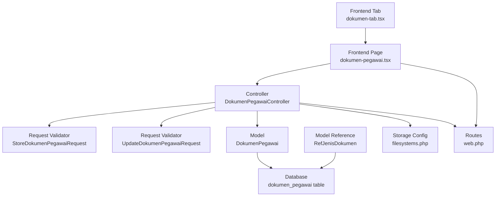
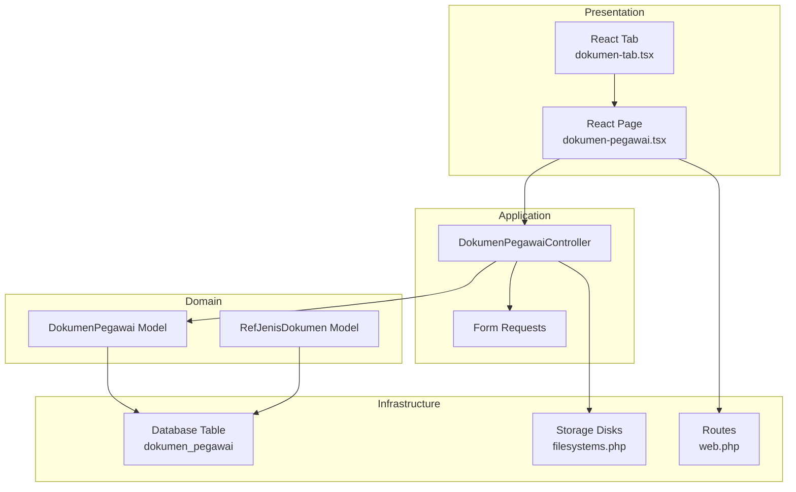
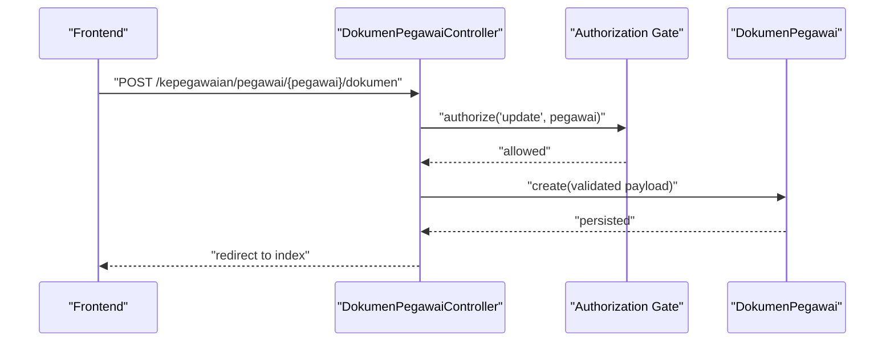
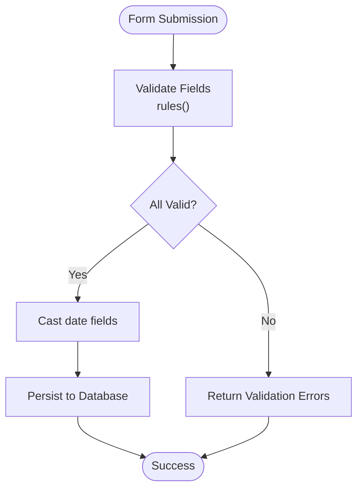
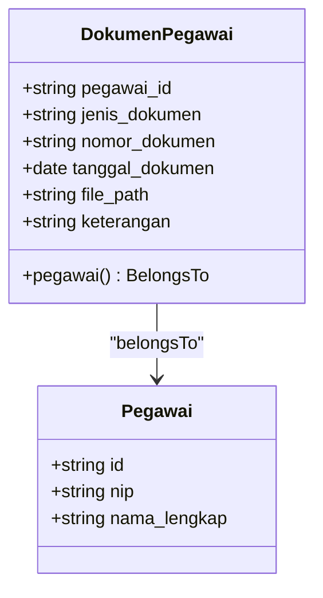
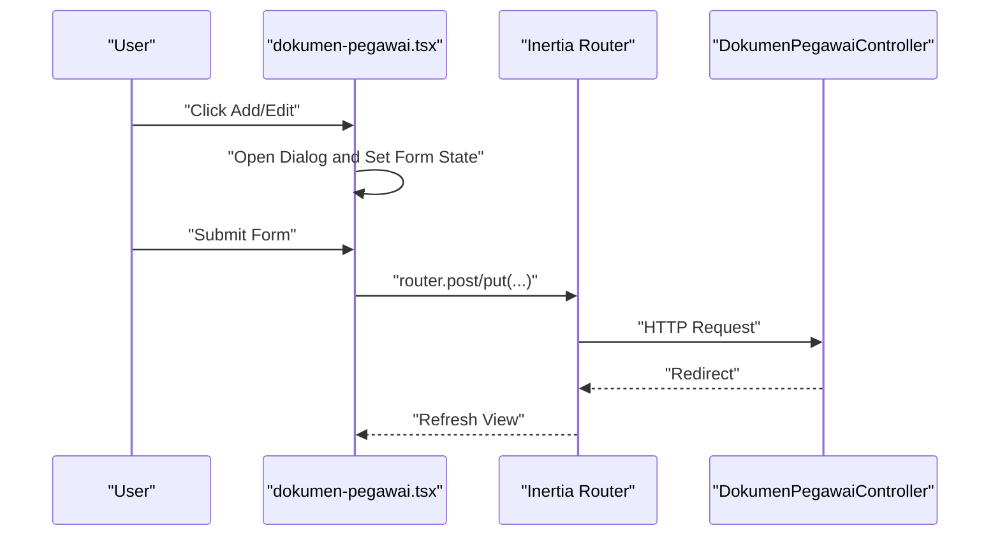
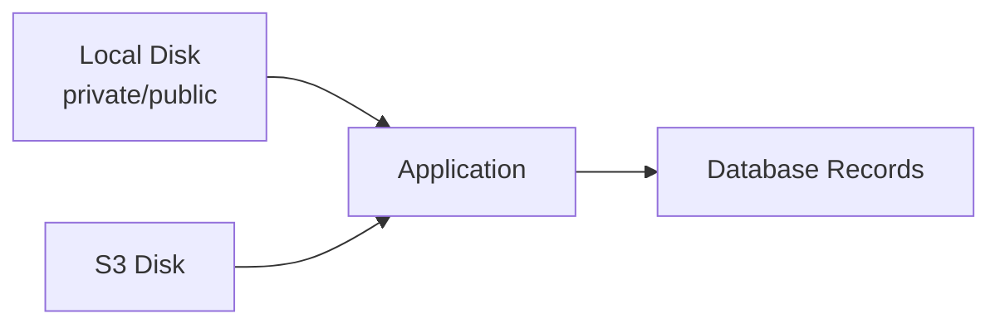
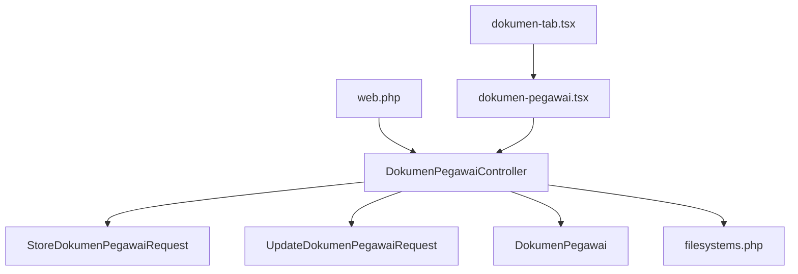

# Document Handling System

<cite>
**Referenced Files in This Document**
- [DokumenPegawaiController.php](file://app/Http/Controllers/Kepegawaian/DokumenPegawaiController.php)
- [StoreDokumenPegawaiRequest.php](file://app/Http/Requests/Kepegawaian/StoreDokumenPegawaiRequest.php)
- [UpdateDokumenPegawaiRequest.php](file://app/Http/Requests/Kepegawaian/UpdateDokumenPegawaiRequest.php)
- [DokumenPegawai.php](file://app/Models/DokumenPegawai.php)
- [RefJenisDokumen.php](file://app/Models/RefJenisDokumen.php)
- [dokumen-pegawai.tsx](file://resources/js/pages/kepegawaian/pegawai/dokumen-pegawai.tsx)
- [dokumen-tab.tsx](file://resources/js/components/pegawai-tabs/dokumen-tab.tsx)
- [filesystems.php](file://config/filesystems.php)
- [2026_03_15_032846_create_dokumen_pegawai_table.php](file://database/migrations/2026_03_15_032846_create_dokumen_pegawai_table.php)
- [DokumenPegawaiFactory.php](file://database/factories/DokumenPegawaiFactory.php)
- [web.php](file://routes/web.php)
- [api.php](file://routes/api.php)
- [DokumenPegawaiTest.php](file://tests/Feature/Kepegawaian/DokumenPegawaiTest.php)
- [kepegawaian.php](file://config/kepegawaian.php)
</cite>

## Table of Contents
1. [Introduction](#introduction)
2. [Project Structure](#project-structure)
3. [Core Components](#core-components)
4. [Architecture Overview](#architecture-overview)
5. [Detailed Component Analysis](#detailed-component-analysis)
6. [Dependency Analysis](#dependency-analysis)
7. [Performance Considerations](#performance-considerations)
8. [Troubleshooting Guide](#troubleshooting-guide)
9. [Conclusion](#conclusion)
10. [Appendices](#appendices)

## Introduction
This document explains the Document Handling System for employee document uploads, management, and access control. It covers how documents are stored, validated, and accessed, along with frontend patterns for document upload interfaces, backend validation rules, and storage integration. It also documents configuration options for supported file formats, storage locations, and access permissions, and outlines relationships with cloud storage services and document metadata management. Practical examples are drawn from the actual codebase to illustrate upload processes, file type restrictions, size limits, and approval workflows.

## Project Structure
The Document Handling System spans backend controllers and requests, frontend pages and components, database migrations and factories, routing, and configuration. The following diagram shows the primary components involved in document management.

**Diagram sources**
- [dokumen-pegawai.tsx:1-402](file://resources/js/pages/kepegawaian/pegawai/dokumen-pegawai.tsx#L1-L402)
- [dokumen-tab.tsx:1-52](file://resources/js/components/pegawai-tabs/dokumen-tab.tsx#L1-L52)
- [DokumenPegawaiController.php:1-92](file://app/Http/Controllers/Kepegawaian/DokumenPegawaiController.php#L1-L92)
- [StoreDokumenPegawaiRequest.php:1-36](file://app/Http/Requests/Kepegawaian/StoreDokumenPegawaiRequest.php#L1-L36)
- [UpdateDokumenPegawaiRequest.php:1-6](file://app/Http/Requests/Kepegawaian/UpdateDokumenPegawaiRequest.php#L1-L6)
- [DokumenPegawai.php:1-38](file://app/Models/DokumenPegawai.php#L1-L38)
- [RefJenisDokumen.php:1-29](file://app/Models/RefJenisDokumen.php#L1-L29)
- [2026_03_15_032846_create_dokumen_pegawai_table.php:1-29](file://database/migrations/2026_03_15_032846_create_dokumen_pegawai_table.php#L1-L29)
- [filesystems.php:1-81](file://config/filesystems.php#L1-L81)
- [web.php:65-104](file://routes/web.php#L65-L104)

**Section sources**
- [DokumenPegawaiController.php:1-92](file://app/Http/Controllers/Kepegawaian/DokumenPegawaiController.php#L1-L92)
- [web.php:65-104](file://routes/web.php#L65-L104)

## Core Components
- Controller: Handles listing, creating, updating, and deleting employee documents. Enforces authorization via gates and ensures ownership for updates/deletes.
- Request Validators: Define validation rules and messages for document creation and updates.
- Model: Represents document records with typed casts and belongs-to relationship to employees.
- Frontend Pages and Tabs: Provide CRUD UI for document entries and display associated file indicators.
- Storage Configuration: Defines local and cloud storage disks and visibility.
- Routing: Exposes REST endpoints for document management under the kepegawaian namespace.

**Section sources**
- [DokumenPegawaiController.php:15-92](file://app/Http/Controllers/Kepegawaian/DokumenPegawaiController.php#L15-L92)
- [StoreDokumenPegawaiRequest.php:14-35](file://app/Http/Requests/Kepegawaian/StoreDokumenPegawaiRequest.php#L14-L35)
- [UpdateDokumenPegawaiRequest.php:5-5](file://app/Http/Requests/Kepegawaian/UpdateDokumenPegawaiRequest.php#L5-L5)
- [DokumenPegawai.php:10-38](file://app/Models/DokumenPegawai.php#L10-L38)
- [dokumen-pegawai.tsx:86-402](file://resources/js/pages/kepegawaian/pegawai/dokumen-pegawai.tsx#L86-L402)
- [dokumen-tab.tsx:8-52](file://resources/js/components/pegawai-tabs/dokumen-tab.tsx#L8-L52)
- [filesystems.php:31-63](file://config/filesystems.php#L31-L63)
- [web.php:93-97](file://routes/web.php#L93-L97)

## Architecture Overview
The system follows a layered architecture:
- Presentation Layer: Inertia-driven React pages and components render forms and lists.
- Application Layer: Controllers coordinate requests, enforce policies, and orchestrate persistence.
- Domain Layer: Eloquent models encapsulate document metadata and relationships.
- Infrastructure Layer: Storage configuration integrates local and cloud disks; routes define entry points.

**Diagram sources**
- [dokumen-pegawai.tsx:1-402](file://resources/js/pages/kepegawaian/pegawai/dokumen-pegawai.tsx#L1-L402)
- [dokumen-tab.tsx:1-52](file://resources/js/components/pegawai-tabs/dokumen-tab.tsx#L1-L52)
- [DokumenPegawaiController.php:1-92](file://app/Http/Controllers/Kepegawaian/DokumenPegawaiController.php#L1-L92)
- [StoreDokumenPegawaiRequest.php:1-36](file://app/Http/Requests/Kepegawaian/StoreDokumenPegawaiRequest.php#L1-L36)
- [DokumenPegawai.php:1-38](file://app/Models/DokumenPegawai.php#L1-L38)
- [RefJenisDokumen.php:1-29](file://app/Models/RefJenisDokumen.php#L1-L29)
- [2026_03_15_032846_create_dokumen_pegawai_table.php:1-29](file://database/migrations/2026_03_15_032846_create_dokumen_pegawai_table.php#L1-L29)
- [filesystems.php:1-81](file://config/filesystems.php#L1-L81)
- [web.php:1-139](file://routes/web.php#L1-L139)

## Detailed Component Analysis

### Backend Controller: DokumenPegawaiController
Responsibilities:
- Index: Loads employee documents with ordering and renders the page with store/update/delete URLs.
- Store: Authorizes and persists validated document data.
- Update: Ensures document belongs to the employee, authorizes, and updates.
- Destroy: Ensures document belongs to the employee, authorizes, and deletes.
- Ownership Guard: Private method enforces that a document record belongs to the current employee.

**Diagram sources**
- [DokumenPegawaiController.php:53-60](file://app/Http/Controllers/Kepegawaian/DokumenPegawaiController.php#L53-L60)
- [web.php:93-97](file://routes/web.php#L93-L97)

**Section sources**
- [DokumenPegawaiController.php:17-90](file://app/Http/Controllers/Kepegawaian/DokumenPegawaiController.php#L17-L90)

### Request Validation: StoreDokumenPegawaiRequest and UpdateDokumenPegawaiRequest
Validation rules:
- Required and length constraints for textual fields.
- Optional date field for document date.
- Optional string path for file location.
- Custom messages for improved UX.

**Diagram sources**
- [StoreDokumenPegawaiRequest.php:14-35](file://app/Http/Requests/Kepegawaian/StoreDokumenPegawaiRequest.php#L14-L35)
- [DokumenPegawai.php:25-31](file://app/Models/DokumenPegawai.php#L25-L31)

**Section sources**
- [StoreDokumenPegawaiRequest.php:14-35](file://app/Http/Requests/Kepegawaian/StoreDokumenPegawaiRequest.php#L14-L35)
- [UpdateDokumenPegawaiRequest.php:5-5](file://app/Http/Requests/Kepegawaian/UpdateDokumenPegawaiRequest.php#L5-L5)

### Model: DokumenPegawai
Fields and behavior:
- Fillable attributes include employee foreign key, document type, number, date, file path, and description.
- Typed casts for document date and soft-deleted timestamps.
- Relationship to Pegawai model.

**Diagram sources**
- [DokumenPegawai.php:10-38](file://app/Models/DokumenPegawai.php#L10-L38)

**Section sources**
- [DokumenPegawai.php:16-36](file://app/Models/DokumenPegawai.php#L16-L36)

### Frontend: Dokumen Pegawai Page and Tab
Patterns:
- Page renders a table of documents with actions to add/edit/delete.
- Tab displays a summarized view with a link to the full page.
- Form fields include document type, number, date, file path, and description.
- Uses Inertia navigation for seamless interactions.

**Diagram sources**
- [dokumen-pegawai.tsx:113-144](file://resources/js/pages/kepegawaian/pegawai/dokumen-pegawai.tsx#L113-L144)
- [web.php:93-97](file://routes/web.php#L93-L97)

**Section sources**
- [dokumen-pegawai.tsx:86-402](file://resources/js/pages/kepegawaian/pegawai/dokumen-pegawai.tsx#L86-L402)
- [dokumen-tab.tsx:8-52](file://resources/js/components/pegawai-tabs/dokumen-tab.tsx#L8-L52)

### Storage Integration and Cloud Services
Configuration:
- Local disks: private and public directories for secure and public file serving.
- S3 disk: configurable AWS credentials and endpoint for cloud storage.
- Visibility and URL generation are handled per disk.

**Diagram sources**
- [filesystems.php:31-63](file://config/filesystems.php#L31-L63)

**Section sources**
- [filesystems.php:16-63](file://config/filesystems.php#L16-L63)

### Database Schema and Factories
Schema:
- Table stores document metadata with ulid primary key, foreign key to employee, and optional file path.
- Timestamps and soft deletes support auditability.

Factories:
- Generate realistic sample data including document types, numbers, dates, and optional file paths.

**Section sources**
- [2026_03_15_032846_create_dokumen_pegawai_table.php:11-21](file://database/migrations/2026_03_15_032846_create_dokumen_pegawai_table.php#L11-L21)
- [DokumenPegawaiFactory.php:10-31](file://database/factories/DokumenPegawaiFactory.php#L10-L31)

### Access Control and Approvals
- Authorization: Controllers use gates to authorize view/update actions against the employee resource.
- Ownership: Controller enforces that a document belongs to the current employee during updates/deletes.
- Approval Workflow: No explicit approval steps are present in the controller or routes; approvals would require extending the model and controller.

**Section sources**
- [DokumenPegawaiController.php:19-90](file://app/Http/Controllers/Kepegawaian/DokumenPegawaiController.php#L19-L90)

## Dependency Analysis
The following diagram maps key dependencies among components.

**Diagram sources**
- [web.php:93-97](file://routes/web.php#L93-L97)
- [DokumenPegawaiController.php:1-92](file://app/Http/Controllers/Kepegawaian/DokumenPegawaiController.php#L1-L92)
- [StoreDokumenPegawaiRequest.php:1-36](file://app/Http/Requests/Kepegawaian/StoreDokumenPegawaiRequest.php#L1-L36)
- [UpdateDokumenPegawaiRequest.php:1-6](file://app/Http/Requests/Kepegawaian/UpdateDokumenPegawaiRequest.php#L1-L6)
- [DokumenPegawai.php:1-38](file://app/Models/DokumenPegawai.php#L1-L38)
- [filesystems.php:1-81](file://config/filesystems.php#L1-L81)
- [dokumen-pegawai.tsx:1-402](file://resources/js/pages/kepegawaian/pegawai/dokumen-pegawai.tsx#L1-L402)
- [dokumen-tab.tsx:1-52](file://resources/js/components/pegawai-tabs/dokumen-tab.tsx#L1-L52)

**Section sources**
- [web.php:93-97](file://routes/web.php#L93-L97)
- [DokumenPegawaiController.php:1-92](file://app/Http/Controllers/Kepegawaian/DokumenPegawaiController.php#L1-L92)

## Performance Considerations
- Pagination: For large datasets, consider paginating document listings on the backend and frontend.
- Sorting and Filtering: Apply database indexes on frequently filtered columns (e.g., employee ID, document type).
- File Serving: Serve large files from cloud storage to reduce server load; ensure signed URLs for controlled access.
- Validation: Keep validation rules minimal and efficient; avoid heavy computations in request validators.
- Soft Deletes: Use soft deletes to maintain audit trails without expensive cascading operations.

## Troubleshooting Guide
Common issues and resolutions:
- Upload Failures
  - Symptoms: Validation errors on submission, redirects with error messages.
  - Causes: Missing required fields, invalid date formats, or unauthorized access.
  - Resolution: Ensure required fields are filled, use proper date formats, and verify user permissions.
  - Evidence: Tests assert required field validation and successful storage.
- File Corruption
  - Symptoms: Broken links or inaccessible files.
  - Causes: Incorrect file paths or missing files in storage.
  - Resolution: Verify file paths and storage disk configuration; ensure files exist in the configured storage location.
- Access Denials
  - Symptoms: Forbidden responses when viewing or editing documents.
  - Causes: Insufficient permissions or mismatched employee context.
  - Resolution: Confirm user roles and gate authorizations; ensure the document belongs to the current employee.

**Section sources**
- [DokumenPegawaiTest.php:35-43](file://tests/Feature/Kepegawaian/DokumenPegawaiTest.php#L35-L43)
- [DokumenPegawaiTest.php:114-125](file://tests/Feature/Kepegawaian/DokumenPegawaiTest.php#L114-L125)
- [DokumenPegawaiController.php:55-90](file://app/Http/Controllers/Kepegawaian/DokumenPegawaiController.php#L55-L90)

## Conclusion
The Document Handling System provides a robust foundation for managing employee documents with clear separation of concerns across presentation, application, domain, and infrastructure layers. It supports essential CRUD operations, strong validation, and secure storage integration. While the current implementation focuses on metadata and file paths, extending it to include formal approval workflows and enhanced file validation would further strengthen compliance and governance for sensitive government documents.

## Appendices

### Configuration Options
- Storage Disks
  - local: Secure private storage with optional serving.
  - public: Publicly accessible storage with URL generation.
  - s3: Cloud storage with configurable credentials and endpoint.
- Filesystem Disk Defaults and Links
  - Default disk selection via environment variable.
  - Symbolic link from public storage to private app storage.

**Section sources**
- [filesystems.php:16-81](file://config/filesystems.php#L16-L81)

### API Security Context
- The system employs layered security for external APIs, including HTTPS, Sanctum tokens, HMAC signatures, and rate limiting. These controls are distinct from internal document management but inform overall security posture.

**Section sources**
- [api.php:21-47](file://routes/api.php#L21-L47)
- [kepegawaian.php:14-16](file://config/kepegawaian.php#L14-L16)