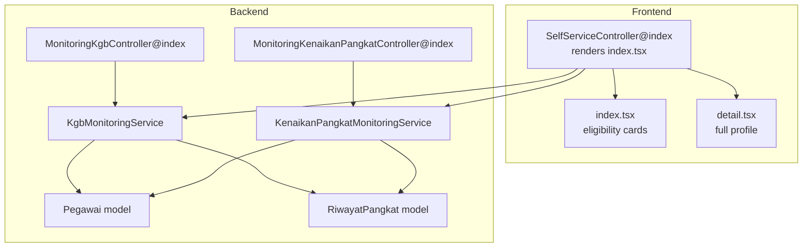
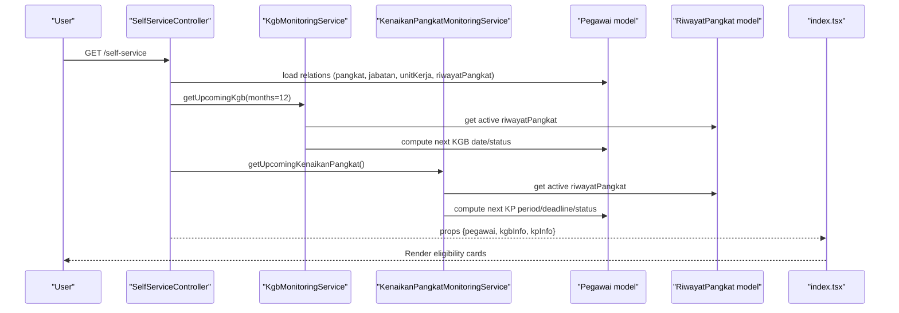
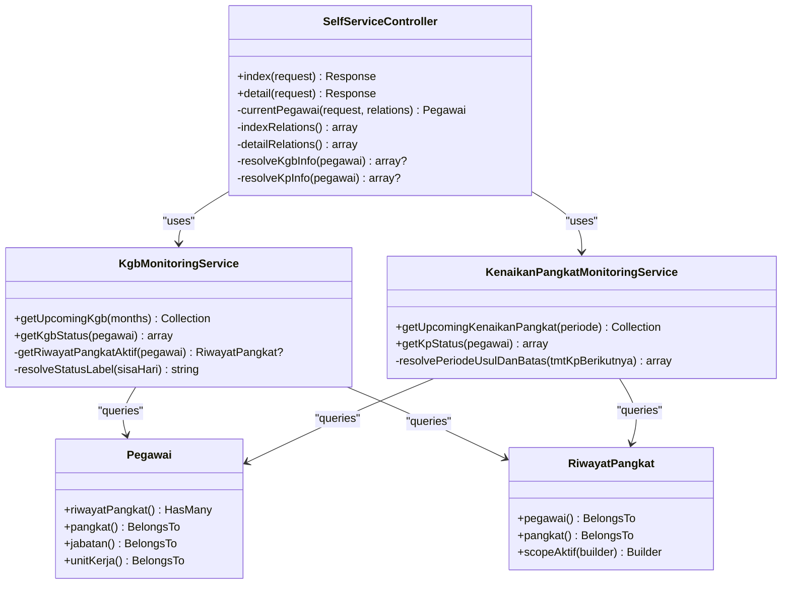
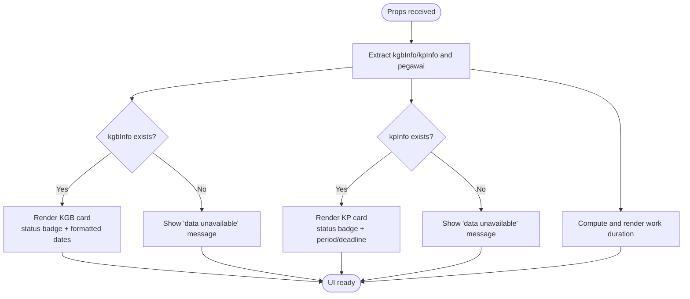
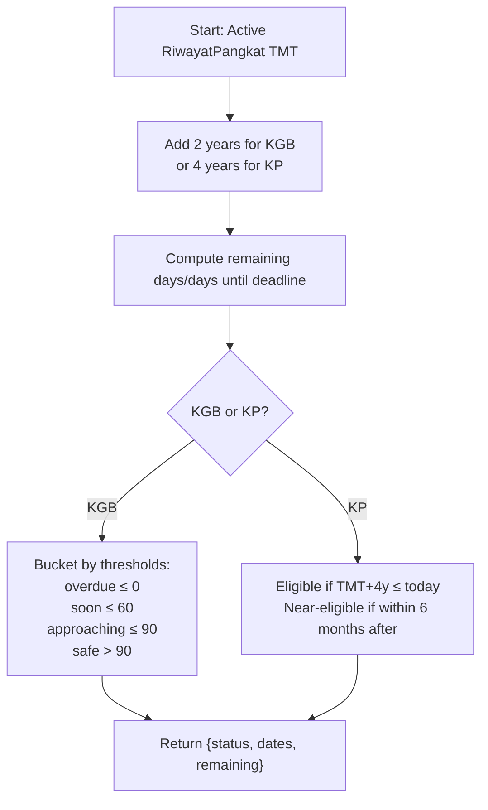
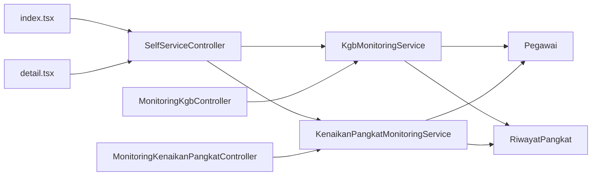

# Eligibility Monitoring Integration

<cite>
**Referenced Files in This Document**
- [SelfServiceController.php](file://app/Http/Controllers/Kepegawaian/SelfServiceController.php)
- [MonitoringKgbController.php](file://app/Http/Controllers/Monitoring/MonitoringKgbController.php)
- [MonitoringKenaikanPangkatController.php](file://app/Http/Controllers/Monitoring/MonitoringKenaikanPangkatController.php)
- [KgbMonitoringService.php](file://app/Services/KgbMonitoringService.php)
- [KenaikanPangkatMonitoringService.php](file://app/Services/KenaikanPangkatMonitoringService.php)
- [Pegawai.php](file://app/Models/Pegawai.php)
- [RiwayatPangkat.php](file://app/Models/RiwayatPangkat.php)
- [StatusPegawai.php](file://app/Enums/StatusPegawai.php)
- [index.tsx](file://resources/js/pages/self-service/index.tsx)
- [detail.tsx](file://resources/js/pages/self-service/detail.tsx)
</cite>

## Table of Contents
1. [Introduction](#introduction)
2. [Project Structure](#project-structure)
3. [Core Components](#core-components)
4. [Architecture Overview](#architecture-overview)
5. [Detailed Component Analysis](#detailed-component-analysis)
6. [Dependency Analysis](#dependency-analysis)
7. [Performance Considerations](#performance-considerations)
8. [Troubleshooting Guide](#troubleshooting-guide)
9. [Conclusion](#conclusion)
10. [Appendices](#appendices)

## Introduction
This document explains the Eligibility Monitoring Integration that powers KGB and Kenaikan Pangkat (KP) eligibility displays within the self-service portal. It covers how monitoring services calculate eligibility, how backend controllers and services coordinate with the frontend, and how data is aggregated and presented. It also documents configuration options exposed by the codebase, common issues, and best practices for reliable operation.

## Project Structure
The integration spans three layers:
- Backend services and controllers that compute eligibility and expose data to the UI.
- Frontend pages that render summaries and detailed views for the logged-in pegawai.
- Employee data models that provide the facts used in eligibility calculations.

**Diagram sources**
- [SelfServiceController.php:20-29](file://app/Http/Controllers/Kepegawaian/SelfServiceController.php#L20-L29)
- [index.tsx:150-408](file://resources/js/pages/self-service/index.tsx#L150-L408)
- [detail.tsx:26-90](file://resources/js/pages/self-service/detail.tsx#L26-L90)
- [MonitoringKgbController.php:16-30](file://app/Http/Controllers/Monitoring/MonitoringKgbController.php#L16-L30)
- [MonitoringKenaikanPangkatController.php:13-29](file://app/Http/Controllers/Monitoring/MonitoringKenaikanPangkatController.php#L13-L29)
- [KgbMonitoringService.php:14-52](file://app/Services/KgbMonitoringService.php#L14-L52)
- [KenaikanPangkatMonitoringService.php:13-62](file://app/Services/KenaikanPangkatMonitoringService.php#L13-L62)
- [Pegawai.php:98-137](file://app/Models/Pegawai.php#L98-L137)
- [RiwayatPangkat.php:44-57](file://app/Models/RiwayatPangkat.php#L44-L57)

**Section sources**
- [SelfServiceController.php:13-95](file://app/Http/Controllers/Kepegawaian/SelfServiceController.php#L13-L95)
- [index.tsx:150-408](file://resources/js/pages/self-service/index.tsx#L150-L408)
- [detail.tsx:26-90](file://resources/js/pages/self-service/detail.tsx#L26-L90)
- [MonitoringKgbController.php:10-31](file://app/Http/Controllers/Monitoring/MonitoringKgbController.php#L10-L31)
- [MonitoringKenaikanPangkatController.php:11-31](file://app/Http/Controllers/Monitoring/MonitoringKenaikanPangkatController.php#L11-L31)
- [KgbMonitoringService.php:12-99](file://app/Services/KgbMonitoringService.php#L12-L99)
- [KenaikanPangkatMonitoringService.php:11-121](file://app/Services/KenaikanPangkatMonitoringService.php#L11-L121)
- [Pegawai.php:24-137](file://app/Models/Pegawai.php#L24-L137)
- [RiwayatPangkat.php:11-58](file://app/Models/RiwayatPangkat.php#L11-L58)

## Core Components
- SelfServiceController: Orchestrates the self-service page, loads the current pegawai with relations, and resolves KGB/KP summary info for display.
- KgbMonitoringService: Computes upcoming KGB dates, remaining days, and status buckets for eligibility windows.
- KenaikanPangkatMonitoringService: Computes KP eligibility, period windows, deadlines, and status labels.
- Frontend pages: index.tsx renders KGB and KP summaries and a work duration card; detail.tsx shows the full profile.

Key responsibilities:
- Data aggregation: Services filter and map employee records with active pay grade history.
- Real-time calculation: Dates and statuses are computed per-request using Carbon-based arithmetic.
- Presentation logic: Frontend applies status variants and localized date formatting.

**Section sources**
- [SelfServiceController.php:20-94](file://app/Http/Controllers/Kepegawaian/SelfServiceController.php#L20-L94)
- [KgbMonitoringService.php:14-98](file://app/Services/KgbMonitoringService.php#L14-L98)
- [KenaikanPangkatMonitoringService.php:13-94](file://app/Services/KenaikanPangkatMonitoringService.php#L13-L94)
- [index.tsx:31-117](file://resources/js/pages/self-service/index.tsx#L31-L117)

## Architecture Overview
The integration follows a clean separation of concerns:
- Controllers prepare data for Inertia-rendered pages.
- Services encapsulate eligibility logic and data shaping.
- Models define relationships and scopes used by services.
- Frontend components focus on rendering and UX.

**Diagram sources**
- [SelfServiceController.php:20-94](file://app/Http/Controllers/Kepegawaian/SelfServiceController.php#L20-L94)
- [KgbMonitoringService.php:14-98](file://app/Services/KgbMonitoringService.php#L14-L98)
- [KenaikanPangkatMonitoringService.php:13-94](file://app/Services/KenaikanPangkatMonitoringService.php#L13-L94)
- [index.tsx:150-408](file://resources/js/pages/self-service/index.tsx#L150-L408)

## Detailed Component Analysis

### Backend Services and Controllers
- SelfServiceController@index:
  - Loads current pegawai with relations for summary display.
  - Resolves KGB info using a 12-month lookahead window.
  - Resolves KP info without filtering by period.
- MonitoringKgbController@index:
  - Builds a list of upcoming KGBs within a default window.
  - Aggregates status counts for dashboards.
- MonitoringKenaikanPangkatController@index:
  - Accepts optional period filter (e.g., April/October).
  - Aggregates eligibility status counts for dashboards.

**Diagram sources**
- [SelfServiceController.php:13-95](file://app/Http/Controllers/Kepegawaian/SelfServiceController.php#L13-L95)
- [KgbMonitoringService.php:12-99](file://app/Services/KgbMonitoringService.php#L12-L99)
- [KenaikanPangkatMonitoringService.php:11-121](file://app/Services/KenaikanPangkatMonitoringService.php#L11-L121)
- [Pegawai.php:98-137](file://app/Models/Pegawai.php#L98-L137)
- [RiwayatPangkat.php:44-57](file://app/Models/RiwayatPangkat.php#L44-L57)

**Section sources**
- [SelfServiceController.php:20-94](file://app/Http/Controllers/Kepegawaian/SelfServiceController.php#L20-L94)
- [MonitoringKgbController.php:16-30](file://app/Http/Controllers/Monitoring/MonitoringKgbController.php#L16-L30)
- [MonitoringKenaikanPangkatController.php:13-29](file://app/Http/Controllers/Monitoring/MonitoringKenaikanPangkatController.php#L13-L29)
- [KgbMonitoringService.php:14-98](file://app/Services/KgbMonitoringService.php#L14-L98)
- [KenaikanPangkatMonitoringService.php:13-94](file://app/Services/KenaikanPangkatMonitoringService.php#L13-L94)

### Frontend Component Architecture
- index.tsx:
  - Declares typed props for pegawai summary and KGB/KP info.
  - Provides status variant mapping for badges.
  - Formats dates and remaining days for user-friendly display.
  - Renders three summary cards: KGB, KP, and work duration.
- detail.tsx:
  - Renders a comprehensive profile view with tabs for detailed sections.

**Diagram sources**
- [index.tsx:150-408](file://resources/js/pages/self-service/index.tsx#L150-L408)

**Section sources**
- [index.tsx:31-117](file://resources/js/pages/self-service/index.tsx#L31-L117)
- [index.tsx:220-378](file://resources/js/pages/self-service/index.tsx#L220-L378)
- [detail.tsx:26-90](file://resources/js/pages/self-service/detail.tsx#L26-L90)

### Real-time Eligibility Calculations
- KGB:
  - Next KGB date is derived from the active pay grade’s TMT plus 2 years.
  - Remaining days are calculated using Carbon arithmetic.
  - Status bucket determined by thresholds (e.g., overdue, soon, approaching, safe).
- KP:
  - Next KP period is derived from the active pay grade’s TMT plus 4 years.
  - Period and deadline are resolved based on the month of the next KP date.
  - Eligibility status depends on whether the next KP date is reached or within a near-eligibility window.

**Diagram sources**
- [KgbMonitoringService.php:54-98](file://app/Services/KgbMonitoringService.php#L54-L98)
- [KenaikanPangkatMonitoringService.php:64-94](file://app/Services/KenaikanPangkatMonitoringService.php#L64-L94)

**Section sources**
- [KgbMonitoringService.php:54-98](file://app/Services/KgbMonitoringService.php#L54-L98)
- [KenaikanPangkatMonitoringService.php:64-94](file://app/Services/KenaikanPangkatMonitoringService.php#L64-L94)

### Data Aggregation and Presentation Logic
- SelfServiceController@index:
  - Loads pegawai with relations for summary display.
  - Resolves single-employee KGB/KP info using service results filtered by ID.
- Monitoring controllers:
  - Build lists of employees meeting eligibility criteria.
  - Compute statistics per status category for dashboards.

**Section sources**
- [SelfServiceController.php:82-94](file://app/Http/Controllers/Kepegawaian/SelfServiceController.php#L82-L94)
- [MonitoringKgbController.php:16-30](file://app/Http/Controllers/Monitoring/MonitoringKgbController.php#L16-L30)
- [MonitoringKenaikanPangkatController.php:13-29](file://app/Http/Controllers/Monitoring/MonitoringKenaikanPangkatController.php#L13-L29)

## Dependency Analysis
- Controllers depend on services for eligibility computation.
- Services depend on models and their relations/scopes.
- Frontend depends on typed props passed from controllers/services.

**Diagram sources**
- [SelfServiceController.php:15-18](file://app/Http/Controllers/Kepegawaian/SelfServiceController.php#L15-L18)
- [MonitoringKgbController.php:12-14](file://app/Http/Controllers/Monitoring/MonitoringKgbController.php#L12-L14)
- [MonitoringKenaikanPangkatController.php:13](file://app/Http/Controllers/Monitoring/MonitoringKenaikanPangkatController.php#L13)
- [KgbMonitoringService.php:18-27](file://app/Services/KgbMonitoringService.php#L18-L27)
- [KenaikanPangkatMonitoringService.php:17-31](file://app/Services/KenaikanPangkatMonitoringService.php#L17-L31)
- [index.tsx:150-408](file://resources/js/pages/self-service/index.tsx#L150-L408)
- [detail.tsx:26-90](file://resources/js/pages/self-service/detail.tsx#L26-L90)

**Section sources**
- [SelfServiceController.php:15-18](file://app/Http/Controllers/Kepegawaian/SelfServiceController.php#L15-L18)
- [MonitoringKgbController.php:12-14](file://app/Http/Controllers/Monitoring/MonitoringKgbController.php#L12-L14)
- [MonitoringKenaikanPangkatController.php:13](file://app/Http/Controllers/Monitoring/MonitoringKenaikanPangkatController.php#L13)
- [KgbMonitoringService.php:18-27](file://app/Services/KgbMonitoringService.php#L18-L27)
- [KenaikanPangkatMonitoringService.php:17-31](file://app/Services/KenaikanPangkatMonitoringService.php#L17-L31)

## Performance Considerations
- Calculation timing: Eligibility is computed per request. For high traffic, consider caching results keyed by pegawai ID and expiration aligned with policy periods.
- Query efficiency: Services already eager-load relations and apply scopes. Keep filters minimal and avoid N+1 queries.
- Frontend rendering: Formatting functions are lightweight but can be memoized if reused frequently.
- Refresh intervals: There is no built-in polling. If real-time updates are required, implement client-side polling or server-sent events.

[No sources needed since this section provides general guidance]

## Troubleshooting Guide
Common issues and resolutions:
- No KGB/KP data shown:
  - Verify the employee has an active pay grade record. Services skip employees without an active RiwayatPangkat.
  - Confirm the employee’s status allows eligibility checks (e.g., not retired or terminated).
- Incorrect status labels:
  - Review thresholds in the services’ status resolution logic.
  - Ensure date parsing and timezone assumptions align with application expectations.
- Delayed updates:
  - Since calculations are per-request, stale data often indicates missing or outdated RiwayatPangkat entries.
  - Confirm TMT dates and pay grade transitions are correctly recorded.
- Display inconsistencies:
  - Check date formatting helpers and ensure invalid dates fall back to placeholders.
  - Validate that the frontend receives the expected props shape.

**Section sources**
- [KgbMonitoringService.php:28-51](file://app/Services/KgbMonitoringService.php#L28-L51)
- [KenaikanPangkatMonitoringService.php:32-61](file://app/Services/KenaikanPangkatMonitoringService.php#L32-L61)
- [index.tsx:91-117](file://resources/js/pages/self-service/index.tsx#L91-L117)

## Conclusion
The Eligibility Monitoring Integration cleanly separates eligibility computation from presentation. Services encapsulate business rules for KGB and KP, controllers assemble per-user summaries, and frontend components deliver a user-friendly display. While calculations are performed on-demand, the architecture supports straightforward enhancements for caching and real-time updates.

[No sources needed since this section summarizes without analyzing specific files]

## Appendices

### Configuration Options Exposed by the Codebase
- KGB lookahead window:
  - Controlled by the months parameter in KgbMonitoringService.getUpcomingKgb. SelfServiceController currently passes a 12-month window.
- KP period filtering:
  - MonitoringKenaikanPangkatController accepts an optional period parameter (e.g., April/October) to filter results.
- Status thresholds:
  - KGB status buckets are derived from hardcoded thresholds in the service.
  - KP eligibility and near-eligibility windows are derived from the next KP date and a fixed 6-month range.

**Section sources**
- [SelfServiceController.php:84-86](file://app/Http/Controllers/Kepegawaian/SelfServiceController.php#L84-L86)
- [MonitoringKenaikanPangkatController.php:15-16](file://app/Http/Controllers/Monitoring/MonitoringKenaikanPangkatController.php#L15-L16)
- [KgbMonitoringService.php:14](file://app/Services/KgbMonitoringService.php#L14)
- [KgbMonitoringService.php:83-98](file://app/Services/KgbMonitoringService.php#L83-L98)
- [KenaikanPangkatMonitoringService.php:82-83](file://app/Services/KenaikanPangkatMonitoringService.php#L82-L83)

### Relationships with Monitoring Services and Employee Data Models
- KgbMonitoringService relies on:
  - Pegawai relations: pangkat, riwayatPangkat (active, latest TMT).
  - RiwayatPangkat attributes: TMT for next KGB computation.
- KenaikanPangkatMonitoringService relies on:
  - Pegawai relations: pangkat, riwayatPangkat (active, with pangkat).
  - RiwayatPangkat attributes: TMT for next KP period and deadline computation.

**Section sources**
- [KgbMonitoringService.php:18-27](file://app/Services/KgbMonitoringService.php#L18-L27)
- [KgbMonitoringService.php:72-81](file://app/Services/KgbMonitoringService.php#L72-L81)
- [KenaikanPangkatMonitoringService.php:17-31](file://app/Services/KenaikanPangkatMonitoringService.php#L17-L31)
- [KenaikanPangkatMonitoringService.php:66-71](file://app/Services/KenaikanPangkatMonitoringService.php#L66-L71)
- [Pegawai.php:98-137](file://app/Models/Pegawai.php#L98-L137)
- [RiwayatPangkat.php:44-57](file://app/Models/RiwayatPangkat.php#L44-L57)