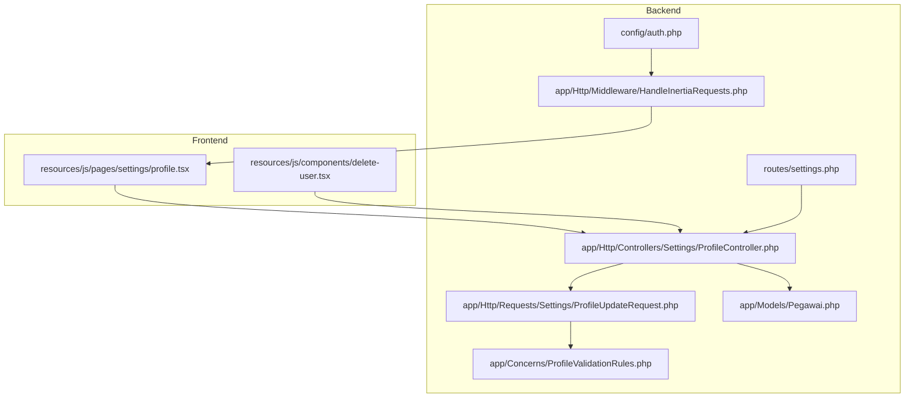
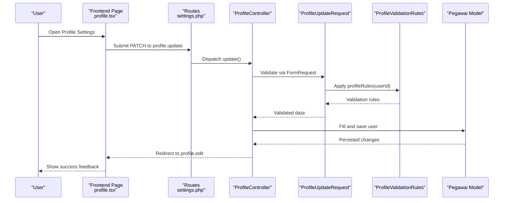
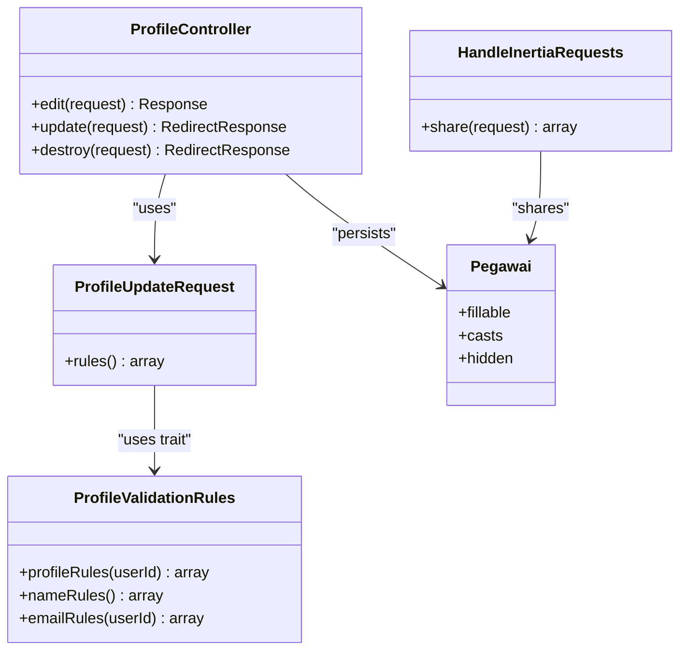

# Employee Profile Management

<cite>
**Referenced Files in This Document**
- [ProfileController.php](file://app/Http/Controllers/Settings/ProfileController.php)
- [ProfileUpdateRequest.php](file://app/Http/Requests/Settings/ProfileUpdateRequest.php)
- [ProfileValidationRules.php](file://app/Concerns/ProfileValidationRules.php)
- [profile.tsx](file://resources/js/pages/settings/profile.tsx)
- [Pegawai.php](file://app/Models/Pegawai.php)
- [auth.php](file://config/auth.php)
- [HandleInertiaRequests.php](file://app/Http/Middleware/HandleInertiaRequests.php)
- [settings.php](file://routes/settings.php)
- [SelfServiceController.php](file://app/Http/Controllers/Kepegawaian/SelfServiceController.php)
- [delete-user.tsx](file://resources/js/components/delete-user.tsx)
- [ProfileUpdateTest.php](file://tests/Feature/Settings/ProfileUpdateTest.php)
</cite>

## Table of Contents
1. [Introduction](#introduction)
2. [Project Structure](#project-structure)
3. [Core Components](#core-components)
4. [Architecture Overview](#architecture-overview)
5. [Detailed Component Analysis](#detailed-component-analysis)
6. [Dependency Analysis](#dependency-analysis)
7. [Performance Considerations](#performance-considerations)
8. [Troubleshooting Guide](#troubleshooting-guide)
9. [Conclusion](#conclusion)
10. [Appendices](#appendices)

## Introduction
This document explains the Employee Profile Management sub-feature with a focus on self-service profile updates and personal information maintenance. It covers how employees can update their profile (name and email), the validation rules applied, data protection measures, and how the frontend and backend integrate. It also documents relationships with the authentication system, user roles, and common issues such as validation errors, data conflicts, and security considerations.

## Project Structure
The profile management feature spans backend controllers and requests, frontend pages and components, and configuration/middleware that tie authentication and data exposure together.

**Diagram sources**
- [profile.tsx:1-151](file://resources/js/pages/settings/profile.tsx#L1-L151)
- [delete-user.tsx:1-121](file://resources/js/components/delete-user.tsx#L1-L121)
- [ProfileController.php:1-61](file://app/Http/Controllers/Settings/ProfileController.php#L1-L61)
- [ProfileValidationRules.php:1-51](file://app/Concerns/ProfileValidationRules.php#L1-L51)
- [ProfileUpdateRequest.php:1-23](file://app/Http/Requests/Settings/ProfileUpdateRequest.php#L1-L23)
- [Pegawai.php:1-209](file://app/Models/Pegawai.php#L1-L209)
- [HandleInertiaRequests.php:1-45](file://app/Http/Middleware/HandleInertiaRequests.php#L1-L45)
- [auth.php:1-118](file://config/auth.php#L1-L118)
- [settings.php:1-25](file://routes/settings.php#L1-L25)

**Section sources**
- [profile.tsx:1-151](file://resources/js/pages/settings/profile.tsx#L1-L151)
- [ProfileController.php:1-61](file://app/Http/Controllers/Settings/ProfileController.php#L1-L61)
- [ProfileUpdateRequest.php:1-23](file://app/Http/Requests/Settings/ProfileUpdateRequest.php#L1-L23)
- [ProfileValidationRules.php:1-51](file://app/Concerns/ProfileValidationRules.php#L1-L51)
- [Pegawai.php:1-209](file://app/Models/Pegawai.php#L1-L209)
- [HandleInertiaRequests.php:1-45](file://app/Http/Middleware/HandleInertiaRequests.php#L1-L45)
- [auth.php:1-118](file://config/auth.php#L1-L118)
- [settings.php:1-25](file://routes/settings.php#L1-L25)

## Core Components
- Backend controller for profile operations: handles rendering the profile page, updating profile fields, and deleting the account.
- Request validator: encapsulates validation rules for profile updates.
- Validation trait: centralizes validation rule definitions for name and email.
- Frontend page: renders the profile form, displays verification prompts, and shows success feedback.
- Frontend delete component: manages account deletion with confirmation and password prompt.
- Authentication configuration and middleware: defines the user provider and shares user data to the frontend.
- Routes: secure endpoints for profile editing, updating, and deletion.

Key behaviors:
- Name and email are validated and persisted to the authenticated user’s record.
- Changing the email resets the email verification state.
- Deleting the account logs out the user, invalidates the session, regenerates CSRF tokens, and soft-deletes the employee record.

**Section sources**
- [ProfileController.php:15-61](file://app/Http/Controllers/Settings/ProfileController.php#L15-L61)
- [ProfileUpdateRequest.php:9-22](file://app/Http/Requests/Settings/ProfileUpdateRequest.php#L9-L22)
- [ProfileValidationRules.php:8-51](file://app/Concerns/ProfileValidationRules.php#L8-L51)
- [profile.tsx:23-151](file://resources/js/pages/settings/profile.tsx#L23-L151)
- [delete-user.tsx:19-121](file://resources/js/components/delete-user.tsx#L19-L121)
- [auth.php:64-74](file://config/auth.php#L64-L74)
- [HandleInertiaRequests.php:17-43](file://app/Http/Middleware/HandleInertiaRequests.php#L17-L43)
- [settings.php:7-24](file://routes/settings.php#L7-L24)

## Architecture Overview
The profile update workflow connects the frontend form to the backend controller via Inertia, with validation enforced by a dedicated request class and shared user data provided by middleware.

**Diagram sources**
- [profile.tsx:46-143](file://resources/js/pages/settings/profile.tsx#L46-L143)
- [settings.php:10-11](file://routes/settings.php#L10-L11)
- [ProfileController.php:31-42](file://app/Http/Controllers/Settings/ProfileController.php#L31-L42)
- [ProfileUpdateRequest.php:18-21](file://app/Http/Requests/Settings/ProfileUpdateRequest.php#L18-L21)
- [ProfileValidationRules.php:15-21](file://app/Concerns/ProfileValidationRules.php#L15-L21)
- [Pegawai.php:24-65](file://app/Models/Pegawai.php#L24-L65)

## Detailed Component Analysis

### Backend Controller: ProfileController
Responsibilities:
- Render the profile settings page with verification status and optional status messages.
- Update the authenticated user’s profile with validated data.
- Reset email verification when the email changes.
- Delete the user account, log out, invalidate session, regenerate CSRF token, and soft-delete the employee record.

Processing logic highlights:
- Uses the authenticated user instance to fill and persist validated attributes.
- Checks whether the email field was modified to clear verification timestamp.
- Returns to the profile edit route after successful update.

Security and data protection:
- Deletion flow ensures logout, session invalidation, and token regeneration.
- Soft deletes the employee record, preserving audit trails.

**Section sources**
- [ProfileController.php:20-61](file://app/Http/Controllers/Settings/ProfileController.php#L20-L61)

### Request Validator: ProfileUpdateRequest
Responsibilities:
- Enforce validation rules for profile updates using a shared trait.
- Delegate rule composition to the trait method that accepts the current user ID.

Validation linkage:
- Rules returned by the trait depend on the current user ID to enforce uniqueness constraints.

**Section sources**
- [ProfileUpdateRequest.php:9-22](file://app/Http/Requests/Settings/ProfileUpdateRequest.php#L9-L22)

### Validation Trait: ProfileValidationRules
Validation rules:
- Name: required, string, max length constraint.
- Email: nullable, string, email format, max length constraint, and unique constraint against the employee table. When updating, ignores the current user ID to avoid false positives.

Uniqueness behavior:
- Unique rule uses the employee table and column for email.
- During updates, ignores the current user ID to allow self-update without triggering uniqueness violations.

**Section sources**
- [ProfileValidationRules.php:15-49](file://app/Concerns/ProfileValidationRules.php#L15-L49)

### Frontend Page: settings/profile.tsx
Form rendering:
- Displays “Profile information” heading and description.
- Renders name and email inputs pre-filled from the authenticated user data shared by middleware.
- Shows verification notice and resend link when email is unverified.
- Provides a submit button with success feedback after saving.

Integration:
- Uses Inertia form helpers bound to the controller action.
- Preserves scroll position during submission.
- Displays per-field validation errors.

**Section sources**
- [profile.tsx:23-151](file://resources/js/pages/settings/profile.tsx#L23-L151)

### Frontend Component: delete-user.tsx
Account deletion UX:
- Confirmation dialog with warning.
- Password input prompt for confirmation.
- Submits to the destroy endpoint with error handling and focus restoration on error.
- Resets form on success.

**Section sources**
- [delete-user.tsx:19-121](file://resources/js/components/delete-user.tsx#L19-L121)

### Authentication and Middleware
Authentication provider:
- Defines the user provider to use the employee model for authentication.

Shared user data:
- Middleware shares user attributes (including roles and permissions) to the frontend, enabling role-aware UI and behavior.

**Section sources**
- [auth.php:64-74](file://config/auth.php#L64-L74)
- [HandleInertiaRequests.php:17-43](file://app/Http/Middleware/HandleInertiaRequests.php#L17-L43)

### Routes: settings.php
Endpoints:
- GET profile edit page.
- PATCH profile update endpoint.
- DELETE profile destroy endpoint (requires verified email).

Middleware:
- Profile edit/update require authentication.
- Destroy requires verified email.

**Section sources**
- [settings.php:7-24](file://routes/settings.php#L7-L24)

### Self-Service Context
While the profile update feature focuses on name and email, the self-service area provides broader access to personal data (biodata, family, education, training, awards, penalties, and documents). This complements profile management by offering read-only visibility into comprehensive personnel records.

**Section sources**
- [SelfServiceController.php:20-38](file://app/Http/Controllers/Kepegawaian/SelfServiceController.php#L20-L38)

## Dependency Analysis
The profile update feature exhibits clear separation of concerns with low coupling between UI and business logic.

**Diagram sources**
- [ProfileController.php:15-61](file://app/Http/Controllers/Settings/ProfileController.php#L15-L61)
- [ProfileUpdateRequest.php:9-22](file://app/Http/Requests/Settings/ProfileUpdateRequest.php#L9-L22)
- [ProfileValidationRules.php:8-51](file://app/Concerns/ProfileValidationRules.php#L8-L51)
- [Pegawai.php:24-65](file://app/Models/Pegawai.php#L24-L65)
- [HandleInertiaRequests.php:17-43](file://app/Http/Middleware/HandleInertiaRequests.php#L17-L43)

**Section sources**
- [ProfileController.php:15-61](file://app/Http/Controllers/Settings/ProfileController.php#L15-L61)
- [ProfileUpdateRequest.php:9-22](file://app/Http/Requests/Settings/ProfileUpdateRequest.php#L9-L22)
- [ProfileValidationRules.php:8-51](file://app/Concerns/ProfileValidationRules.php#L8-L51)
- [Pegawai.php:24-65](file://app/Models/Pegawai.php#L24-L65)
- [HandleInertiaRequests.php:17-43](file://app/Http/Middleware/HandleInertiaRequests.php#L17-L43)

## Performance Considerations
- Minimal overhead: validations are lightweight and operate on a small set of fields.
- Persistence cost: single model save operation per update; email change triggers verification reset.
- Frontend: Inertia reduces round-trips by sharing user data server-side and preserving scroll positions client-side.

## Troubleshooting Guide
Common issues and resolutions:
- Validation errors on update
  - Symptoms: Errors displayed for name or email fields after submission.
  - Causes: Missing required fields, invalid email format, or duplicate email.
  - Resolution: Ensure name is present and email is unique; review per-field error messages shown in the form.
  - Evidence: Tests assert successful update without session errors and verify persisted values.
  - Section sources
    - [ProfileValidationRules.php:28-49](file://app/Concerns/ProfileValidationRules.php#L28-L49)
    - [ProfileUpdateTest.php:15-34](file://tests/Feature/Settings/ProfileUpdateTest.php#L15-L34)

- Email verification reset unexpectedly
  - Symptoms: Unverified email notice appears after saving profile.
  - Cause: Email changed during update; controller clears verification timestamp.
  - Resolution: Resend verification email from the profile page if needed.
  - Section sources
    - [ProfileController.php:35-37](file://app/Http/Controllers/Settings/ProfileController.php#L35-L37)
    - [profile.tsx:94-119](file://resources/js/pages/settings/profile.tsx#L94-L119)

- Email unchanged retains verification status
  - Behavior: When email remains the same, verification status is preserved.
  - Section sources
    - [ProfileUpdateTest.php:36-51](file://tests/Feature/Settings/ProfileUpdateTest.php#L36-L51)

- Account deletion failures
  - Symptoms: Errors on delete submission.
  - Causes: Incorrect password or missing confirmation.
  - Resolution: Enter the correct password in the confirmation dialog; errors are surfaced and the form is refocused.
  - Section sources
    - [delete-user.tsx:57-114](file://resources/js/components/delete-user.tsx#L57-L114)
    - [ProfileUpdateTest.php:72-87](file://tests/Feature/Settings/ProfileUpdateTest.php#L72-L87)

- Security considerations
  - Email verification: Controller clears verification timestamp when email changes; UI supports resending verification.
  - Session safety: Destroy action logs out the user, invalidates the session, and regenerates CSRF tokens.
  - Soft deletes: Employee records are soft-deleted, maintaining auditability.
  - Section sources
    - [ProfileController.php:47-59](file://app/Http/Controllers/Settings/ProfileController.php#L47-L59)
    - [Pegawai.php:13-26](file://app/Models/Pegawai.php#L13-L26)

## Conclusion
The Employee Profile Management feature provides a secure, user-friendly mechanism for updating personal information with robust validation and clear feedback. The backend enforces minimal yet effective rules, while the frontend delivers a responsive experience powered by Inertia. Integration with the authentication system ensures proper user context and role awareness, and the destroy flow prioritizes user safety and session integrity.

## Appendices

### Configuration Options and Return Values
- Profile fields supported for update
  - Name: required string, max length constraint.
  - Email: nullable string, email format, max length constraint, unique constraint.
- Return values
  - Update success: Redirects to the profile edit route with no errors.
  - Delete success: Redirects to home, logs out the user, invalidates session, regenerates CSRF token, and soft-deletes the employee record.
- Section sources
  - [ProfileValidationRules.php:28-49](file://app/Concerns/ProfileValidationRules.php#L28-L49)
  - [ProfileController.php:31-59](file://app/Http/Controllers/Settings/ProfileController.php#L31-L59)
  - [settings.php:10-15](file://routes/settings.php#L10-L15)

### Relationships with Authentication and Roles
- Authentication provider
  - Uses the employee model as the user provider.
- Shared user data
  - Middleware shares user identity, roles, and permissions to the frontend.
- Section sources
  - [auth.php:64-74](file://config/auth.php#L64-L74)
  - [HandleInertiaRequests.php:24-42](file://app/Http/Middleware/HandleInertiaRequests.php#L24-L42)