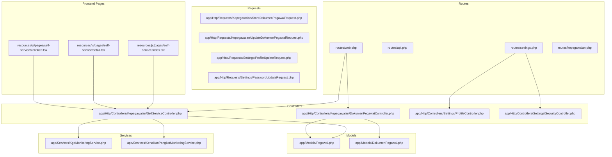
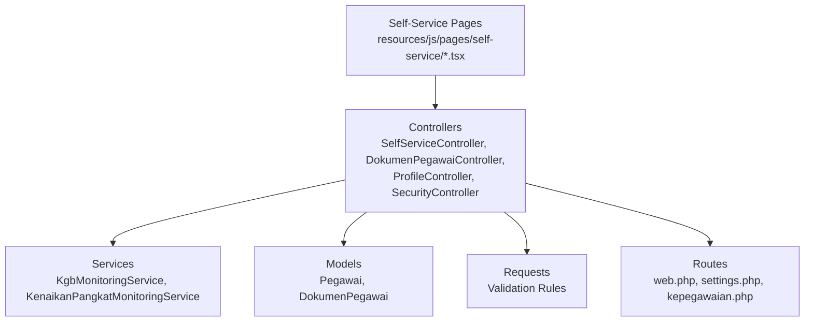
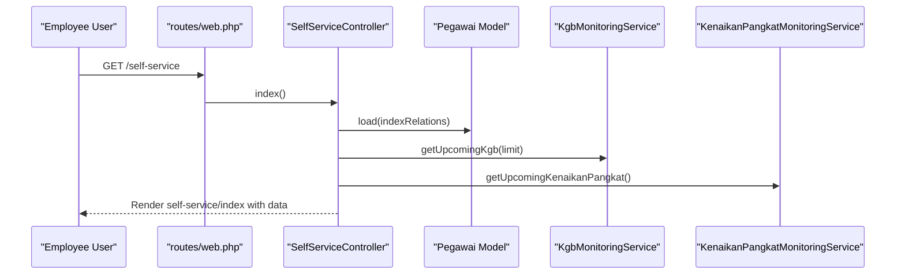
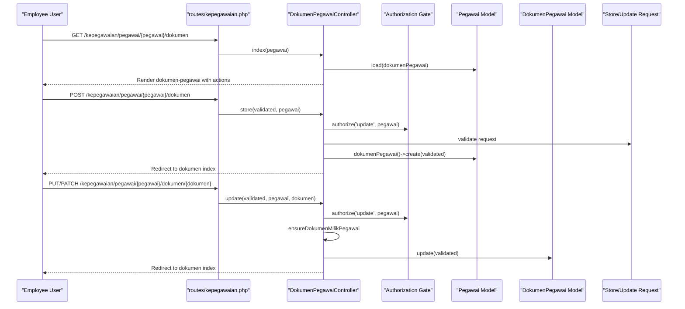
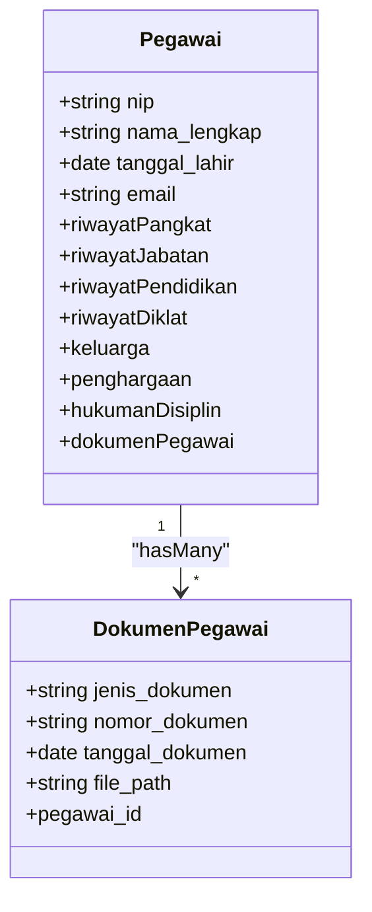
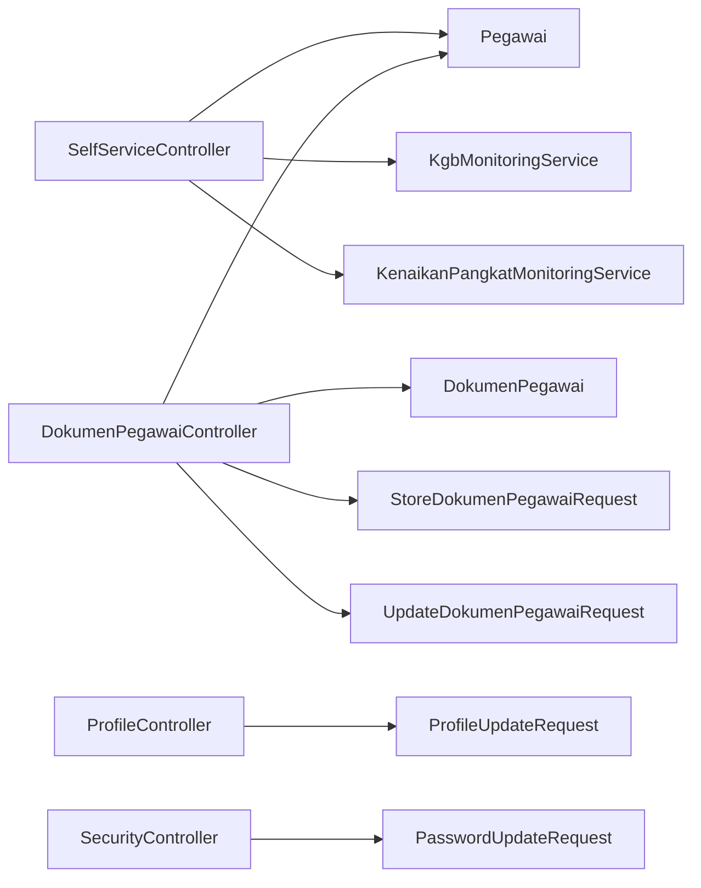

# Self-Service Portal

<cite>
**Referenced Files in This Document**
- [SelfServiceController.php](file://app/Http/Controllers/Kepegawaian/SelfServiceController.php)
- [Pegawai.php](file://app/Models/Pegawai.php)
- [DokumenPegawai.php](file://app/Models/DokumenPegawai.php)
- [DokumenPegawaiController.php](file://app/Http/Controllers/Kepegawaian/DokumenPegawaiController.php)
- [StoreDokumenPegawaiRequest.php](file://app/Http/Requests/Kepegawaian/StoreDokumenPegawaiRequest.php)
- [UpdateDokumenPegawaiRequest.php](file://app/Http/Requests/Kepegawaian/UpdateDokumenPegawaiRequest.php)
- [ProfileController.php](file://app/Http/Controllers/Settings/ProfileController.php)
- [SecurityController.php](file://app/Http/Controllers/Settings/SecurityController.php)
- [ProfileUpdateRequest.php](file://app/Http/Requests/Settings/ProfileUpdateRequest.php)
- [PasswordUpdateRequest.php](file://app/Http/Requests/Settings/PasswordUpdateRequest.php)
- [routes/web.php](file://routes/web.php)
- [routes/api.php](file://routes/api.php)
- [routes/settings.php](file://routes/settings.php)
- [routes/kepegawaian.php](file://routes/kepegawaian.php)
- [index.tsx](file://resources/js/pages/self-service/index.tsx)
- [detail.tsx](file://resources/js/pages/self-service/detail.tsx)
- [unlinked.tsx](file://resources/js/pages/self-service/unlinked.tsx)
- [app.js](file://resources/js/app.tsx)
- [app-layout.tsx](file://resources/js/layouts/app-layout.tsx)
- [auth-layout.tsx](file://resources/js/layouts/auth-layout.tsx)
- [KgbMonitoringService.php](file://app/Services/KgbMonitoringService.php)
- [KenaikanPangkatMonitoringService.php](file://app/Services/KenaikanPangkatMonitoringService.php)
</cite>

## Table of Contents
1. [Introduction](#introduction)
2. [Project Structure](#project-structure)
3. [Core Components](#core-components)
4. [Architecture Overview](#architecture-overview)
5. [Detailed Component Analysis](#detailed-component-analysis)
6. [Dependency Analysis](#dependency-analysis)
7. [Performance Considerations](#performance-considerations)
8. [Troubleshooting Guide](#troubleshooting-guide)
9. [Conclusion](#conclusion)
10. [Appendices](#appendices)

## Introduction
The Self-Service Portal empowers civil servants (employees) to manage their personal data and documents independently. It focuses on three pillars:
- Employee-centric profile management: updating personal details, managing account security, and deleting profiles.
- Document handling: uploading, viewing, editing, and removing official documents linked to the employee record.
- Self-service workflows: accessing structured views of career progression indicators such as upcoming KGB (annual salary increase) and promotion eligibility.

The portal integrates tightly with core employee data (Pegawai model) and enforces access controls so that employees can only act on their own records. Backend validation ensures data integrity, while frontend components provide responsive, accessible user experiences.

## Project Structure
The Self-Service Portal spans backend controllers, models, requests, services, and frontend pages. Routes define entry points for web and API access, while layouts and pages render the user interface.



**Diagram sources**
- [routes/web.php](file://routes/web.php)
- [routes/api.php](file://routes/api.php)
- [routes/settings.php](file://routes/settings.php)
- [routes/kepegawaian.php](file://routes/kepegawaian.php)
- [SelfServiceController.php](file://app/Http/Controllers/Kepegawaian/SelfServiceController.php)
- [DokumenPegawaiController.php](file://app/Http/Controllers/Kepegawaian/DokumenPegawaiController.php)
- [ProfileController.php](file://app/Http/Controllers/Settings/ProfileController.php)
- [SecurityController.php](file://app/Http/Controllers/Settings/SecurityController.php)
- [Pegawai.php](file://app/Models/Pegawai.php)
- [DokumenPegawai.php](file://app/Models/DokumenPegawai.php)
- [StoreDokumenPegawaiRequest.php](file://app/Http/Requests/Kepegawaian/StoreDokumenPegawaiRequest.php)
- [UpdateDokumenPegawaiRequest.php](file://app/Http/Requests/Kepegawaian/UpdateDokumenPegawaiRequest.php)
- [ProfileUpdateRequest.php](file://app/Http/Requests/Settings/ProfileUpdateRequest.php)
- [PasswordUpdateRequest.php](file://app/Http/Requests/Settings/PasswordUpdateRequest.php)
- [KgbMonitoringService.php](file://app/Services/KgbMonitoringService.php)
- [KenaikanPangkatMonitoringService.php](file://app/Services/KenaikanPangkatMonitoringService.php)
- [index.tsx](file://resources/js/pages/self-service/index.tsx)
- [detail.tsx](file://resources/js/pages/self-service/detail.tsx)
- [unlinked.tsx](file://resources/js/pages/self-service/unlinked.tsx)

**Section sources**
- [routes/web.php](file://routes/web.php)
- [routes/settings.php](file://routes/settings.php)
- [routes/kepegawaian.php](file://routes/kepegawaian.php)

## Core Components
- SelfServiceController: Renders self-service dashboards and detail views for the authenticated employee, loading relational data and resolving upcoming KGB and promotion indicators.
- DokumenPegawaiController: Manages CRUD operations for employee documents with authorization checks and URL generation for actions.
- ProfileController and SecurityController: Provide profile update and security settings pages, including password updates and two-factor authentication management.
- Models: Pegawai encapsulates employee identity and relations; DokumenPegawai stores document metadata linked to an employee.
- Requests: Strong typing for validation rules for document creation/update and profile/password updates.
- Services: KgbMonitoringService and KenaikanPangkatMonitoringService supply curated data for self-service displays.

Practical outcomes:
- Employees can view their profile, update personal details, change passwords, enable/disable two-factor authentication, upload and manage documents, and see upcoming KGB/promotion-related information.

**Section sources**
- [SelfServiceController.php](file://app/Http/Controllers/Kepegawaian/SelfServiceController.php)
- [DokumenPegawaiController.php](file://app/Http/Controllers/Kepegawaian/DokumenPegawaiController.php)
- [ProfileController.php](file://app/Http/Controllers/Settings/ProfileController.php)
- [SecurityController.php](file://app/Http/Controllers/Settings/SecurityController.php)
- [Pegawai.php](file://app/Models/Pegawai.php)
- [DokumenPegawai.php](file://app/Models/DokumenPegawai.php)
- [StoreDokumenPegawaiRequest.php](file://app/Http/Requests/Kepegawaian/StoreDokumenPegawaiRequest.php)
- [UpdateDokumenPegawaiRequest.php](file://app/Http/Requests/Kepegawaian/UpdateDokumenPegawaiRequest.php)
- [ProfileUpdateRequest.php](file://app/Http/Requests/Settings/ProfileUpdateRequest.php)
- [PasswordUpdateRequest.php](file://app/Http/Requests/Settings/PasswordUpdateRequest.php)
- [KgbMonitoringService.php](file://app/Services/KgbMonitoringService.php)
- [KenaikanPangkatMonitoringService.php](file://app/Services/KenaikanPangkatMonitoringService.php)

## Architecture Overview
The Self-Service Portal follows a layered architecture:
- Presentation Layer: Inertia-driven React pages under resources/js/pages/self-service.
- Application Layer: Controllers orchestrate requests, enforce authorization, and delegate to services for business logic.
- Domain Layer: Eloquent models represent employee and document entities with relations and scopes.
- Infrastructure Layer: Requests define validation rules; routes bind URLs to controllers.



**Diagram sources**
- [SelfServiceController.php](file://app/Http/Controllers/Kepegawaian/SelfServiceController.php)
- [DokumenPegawaiController.php](file://app/Http/Controllers/Kepegawaian/DokumenPegawaiController.php)
- [ProfileController.php](file://app/Http/Controllers/Settings/ProfileController.php)
- [SecurityController.php](file://app/Http/Controllers/Settings/SecurityController.php)
- [Pegawai.php](file://app/Models/Pegawai.php)
- [DokumenPegawai.php](file://app/Models/DokumenPegawai.php)
- [StoreDokumenPegawaiRequest.php](file://app/Http/Requests/Kepegawaian/StoreDokumenPegawaiRequest.php)
- [UpdateDokumenPegawaiRequest.php](file://app/Http/Requests/Kepegawaian/UpdateDokumenPegawaiRequest.php)
- [routes/web.php](file://routes/web.php)
- [routes/settings.php](file://routes/settings.php)
- [routes/kepegawaian.php](file://routes/kepegawaian.php)

## Detailed Component Analysis

### Self-Service Dashboard and Detail Views
SelfServiceController provides:
- index: Loads current employee with key relations (pangkat, jabatan, unitKerja, latest aktif riwayatPangkat) and resolves upcoming KGB and Kenaikan Pangkat info via services.
- detail: Loads comprehensive employee history and documents for detailed review.
- unlinked: Renders a dedicated page for unlinked scenarios.



**Diagram sources**
- [SelfServiceController.php](file://app/Http/Controllers/Kepegawaian/SelfServiceController.php)
- [Pegawai.php](file://app/Models/Pegawai.php)
- [KgbMonitoringService.php](file://app/Services/KgbMonitoringService.php)
- [KenaikanPangkatMonitoringService.php](file://app/Services/KenaikanPangkatMonitoringService.php)
- [routes/web.php](file://routes/web.php)

**Section sources**
- [SelfServiceController.php](file://app/Http/Controllers/Kepegawaian/SelfServiceController.php)
- [index.tsx](file://resources/js/pages/self-service/index.tsx)
- [detail.tsx](file://resources/js/pages/self-service/detail.tsx)
- [unlinked.tsx](file://resources/js/pages/self-service/unlinked.tsx)

### Document Handling Workflow
DokumenPegawaiController manages document lifecycle:
- index: Loads employee with dokumenPegawai sorted by type and date; prepares store/update/delete URLs.
- store: Validates and creates a new document record for the employee.
- update: Updates existing document after authorization and ownership check.
- destroy: Deletes document after authorization and ownership check.



**Diagram sources**
- [DokumenPegawaiController.php](file://app/Http/Controllers/Kepegawaian/DokumenPegawaiController.php)
- [StoreDokumenPegawaiRequest.php](file://app/Http/Requests/Kepegawaian/StoreDokumenPegawaiRequest.php)
- [UpdateDokumenPegawaiRequest.php](file://app/Http/Requests/Kepegawaian/UpdateDokumenPegawaiRequest.php)
- [Pegawai.php](file://app/Models/Pegawai.php)
- [DokumenPegawai.php](file://app/Models/DokumenPegawai.php)
- [routes/kepegawaian.php](file://routes/kepegawaian.php)

**Section sources**
- [DokumenPegawaiController.php](file://app/Http/Controllers/Kepegawaian/DokumenPegawaiController.php)
- [StoreDokumenPegawaiRequest.php](file://app/Http/Requests/Kepegawaian/StoreDokumenPegawaiRequest.php)
- [UpdateDokumenPegawaiRequest.php](file://app/Http/Requests/Kepegawaian/UpdateDokumenPegawaiRequest.php)
- [Pegawai.php](file://app/Models/Pegawai.php)
- [DokumenPegawai.php](file://app/Models/DokumenPegawai.php)

### Profile Management and Security
ProfileController and SecurityController provide:
- Profile editing and updates with validation rules.
- Password updates with current password verification.
- Security settings page with optional two-factor authentication management.

```mermaid
sequenceDiagram
participant U as "Employee User"
participant R as "routes/settings.php"
participant PC as "ProfileController"
participant SC as "SecurityController"
participant PR as "ProfileUpdateRequest"
participant PaR as "PasswordUpdateRequest"
U->>R : GET /settings/profile
R->>PC : edit()
PC-->>U : Render settings/profile
U->>R : POST /settings/profile
R->>PC : update(PR validated)
PC->>PR : rules() using ProfileValidationRules
PC->>U : Save and redirect
U->>R : GET /settings/security
R->>SC : edit()
SC-->>U : Render settings/security
U->>R : POST /settings/security
R->>SC : update(PaR validated)
SC->>PaR : rules() using PasswordValidationRules
SC-->>U : Back to security page
```

**Diagram sources**
- [ProfileController.php](file://app/Http/Controllers/Settings/ProfileController.php)
- [SecurityController.php](file://app/Http/Controllers/Settings/SecurityController.php)
- [ProfileUpdateRequest.php](file://app/Http/Requests/Settings/ProfileUpdateRequest.php)
- [PasswordUpdateRequest.php](file://app/Http/Requests/Settings/PasswordUpdateRequest.php)
- [routes/settings.php](file://routes/settings.php)

**Section sources**
- [ProfileController.php](file://app/Http/Controllers/Settings/ProfileController.php)
- [SecurityController.php](file://app/Http/Controllers/Settings/SecurityController.php)
- [ProfileUpdateRequest.php](file://app/Http/Requests/Settings/ProfileUpdateRequest.php)
- [PasswordUpdateRequest.php](file://app/Http/Requests/Settings/PasswordUpdateRequest.php)

### Data Models and Relationships
The domain model connects employees to their documents and related career history.



**Diagram sources**
- [Pegawai.php](file://app/Models/Pegawai.php)
- [DokumenPegawai.php](file://app/Models/DokumenPegawai.php)

**Section sources**
- [Pegawai.php](file://app/Models/Pegawai.php)
- [DokumenPegawai.php](file://app/Models/DokumenPegawai.php)

## Dependency Analysis
Key dependencies and coupling:
- Controllers depend on models and services for data retrieval and business logic.
- DokumenPegawaiController depends on Gate authorization and request validation.
- SelfServiceController depends on monitoring services for KGB and promotion indicators.
- Frontend pages depend on controller-provided props and routes.



**Diagram sources**
- [SelfServiceController.php](file://app/Http/Controllers/Kepegawaian/SelfServiceController.php)
- [DokumenPegawaiController.php](file://app/Http/Controllers/Kepegawaian/DokumenPegawaiController.php)
- [ProfileController.php](file://app/Http/Controllers/Settings/ProfileController.php)
- [SecurityController.php](file://app/Http/Controllers/Settings/SecurityController.php)
- [Pegawai.php](file://app/Models/Pegawai.php)
- [DokumenPegawai.php](file://app/Models/DokumenPegawai.php)
- [StoreDokumenPegawaiRequest.php](file://app/Http/Requests/Kepegawaian/StoreDokumenPegawaiRequest.php)
- [UpdateDokumenPegawaiRequest.php](file://app/Http/Requests/Kepegawaian/UpdateDokumenPegawaiRequest.php)
- [ProfileUpdateRequest.php](file://app/Http/Requests/Settings/ProfileUpdateRequest.php)
- [PasswordUpdateRequest.php](file://app/Http/Requests/Settings/PasswordUpdateRequest.php)

**Section sources**
- [SelfServiceController.php](file://app/Http/Controllers/Kepegawaian/SelfServiceController.php)
- [DokumenPegawaiController.php](file://app/Http/Controllers/Kepegawaian/DokumenPegawaiController.php)
- [ProfileController.php](file://app/Http/Controllers/Settings/ProfileController.php)
- [SecurityController.php](file://app/Http/Controllers/Settings/SecurityController.php)

## Performance Considerations
- Eager loading: SelfServiceController loads only necessary relations for dashboard performance.
- Sorting and ordering: DokumenPegawaiController sorts documents to improve UX and reduce client-side work.
- Validation reuse: Shared validation rules minimize redundant checks and keep payloads small.
- Service separation: Monitoring services encapsulate heavy computations, keeping controllers lean.

[No sources needed since this section provides general guidance]

## Troubleshooting Guide
Common issues and resolutions:
- Authorization failures: Ensure the current user matches the target employee record when updating documents.
- Validation errors: Review request rules for document fields and profile/password updates.
- Route mismatches: Confirm routes in web.php and kepegawaian.php match controller actions.
- Two-factor settings: Verify feature toggles and password confirmation middleware when accessing security settings.

**Section sources**
- [DokumenPegawaiController.php](file://app/Http/Controllers/Kepegawaian/DokumenPegawaiController.php)
- [StoreDokumenPegawaiRequest.php](file://app/Http/Requests/Kepegawaian/StoreDokumenPegawaiRequest.php)
- [UpdateDokumenPegawaiRequest.php](file://app/Http/Requests/Kepegawaian/UpdateDokumenPegawaiRequest.php)
- [ProfileUpdateRequest.php](file://app/Http/Requests/Settings/ProfileUpdateRequest.php)
- [PasswordUpdateRequest.php](file://app/Http/Requests/Settings/PasswordUpdateRequest.php)
- [routes/web.php](file://routes/web.php)
- [routes/kepegawaian.php](file://routes/kepegawaian.php)

## Conclusion
The Self-Service Portal delivers a cohesive, secure, and efficient platform for employees to manage personal data and documents. By leveraging strong authorization, validation, and service-layer abstractions, it ensures data integrity while providing a smooth user experience. The modular architecture supports future enhancements such as expanded document categories, richer monitoring insights, and advanced self-service workflows.

[No sources needed since this section summarizes without analyzing specific files]

## Appendices

### User Interface Design Notes
- Layouts: app-layout.tsx and auth-layout.tsx provide consistent navigation and branding.
- Pages: self-service pages render dashboards and detail views with minimal server-side rendering, relying on Inertia for seamless transitions.
- Forms: Validation feedback is surfaced through request classes and UI components.

**Section sources**
- [app-layout.tsx](file://resources/js/layouts/app-layout.tsx)
- [auth-layout.tsx](file://resources/js/layouts/auth-layout.tsx)
- [index.tsx](file://resources/js/pages/self-service/index.tsx)
- [detail.tsx](file://resources/js/pages/self-service/detail.tsx)
- [unlinked.tsx](file://resources/js/pages/self-service/unlinked.tsx)

### Security Measures
- Authorization gates: Controllers enforce that employees can only operate on their own records.
- Validation rules: Strict field constraints prevent malformed data.
- Two-factor management: Optional two-factor authentication with password confirmation middleware.
- Hidden attributes: Sensitive fields are hidden from model serialization.

**Section sources**
- [DokumenPegawaiController.php](file://app/Http/Controllers/Kepegawaian/DokumenPegawaiController.php)
- [SecurityController.php](file://app/Http/Controllers/Settings/SecurityController.php)
- [Pegawai.php](file://app/Models/Pegawai.php)

### Integration with Core Employee Data
- Employee identity: Pegawai model centralizes identity and relations.
- Document linkage: DokumenPegawai belongs to Pegawai, ensuring ownership and referential integrity.
- Career history: Riwayat relations support detailed self-service views.

**Section sources**
- [Pegawai.php](file://app/Models/Pegawai.php)
- [DokumenPegawai.php](file://app/Models/DokumenPegawai.php)