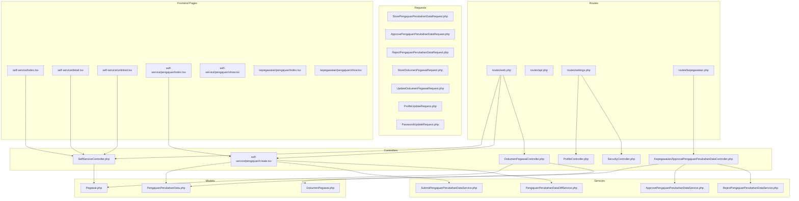
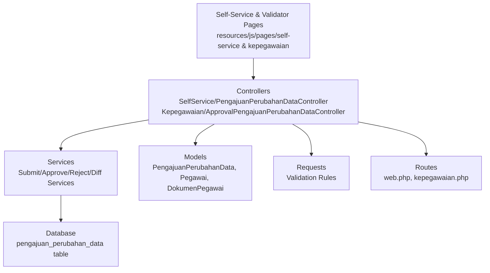
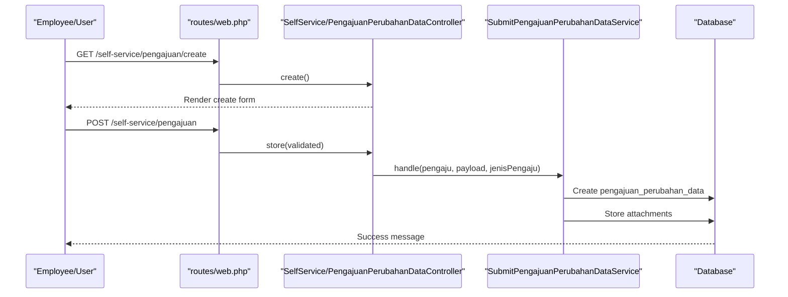
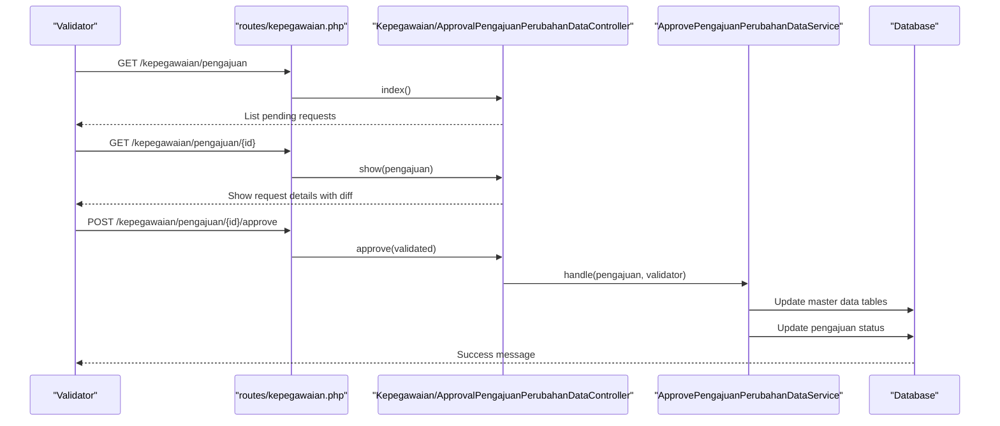
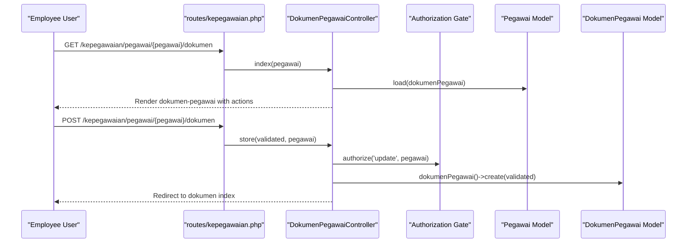
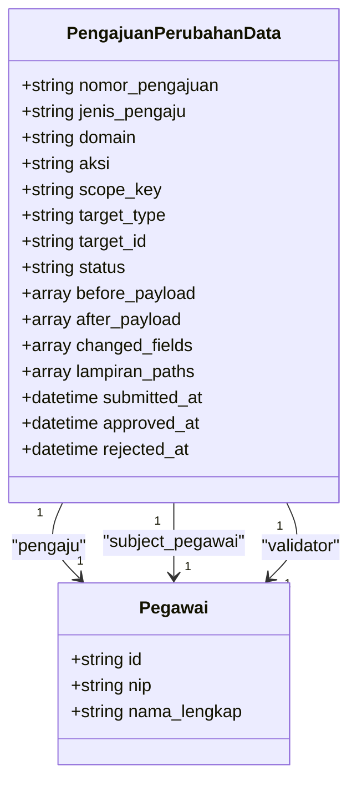
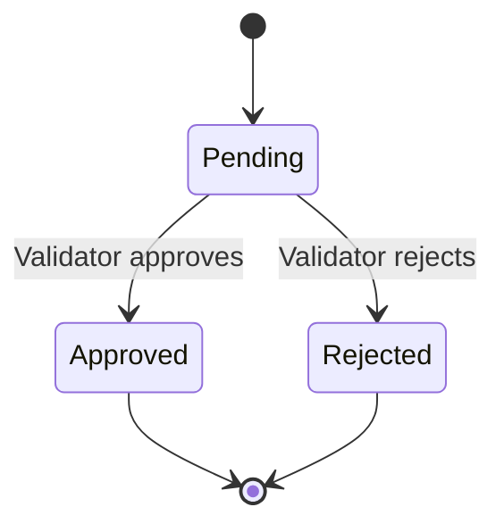
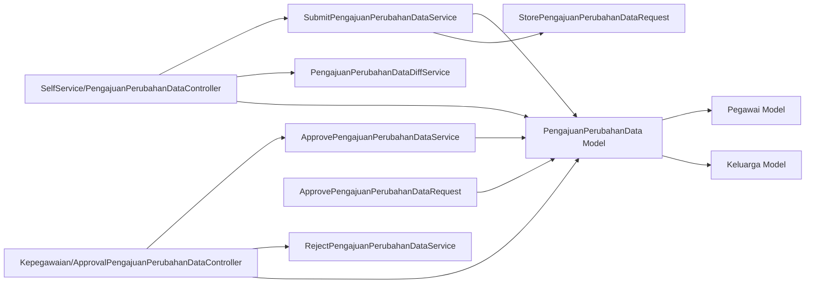

# Self-Service Portal

<cite>
**Referenced Files in This Document**
- [SelfServiceController.php](file://app/Http/Controllers/Kepegawaian/SelfServiceController.php)
- [PengajuanPerubahanDataController.php](file://app/Http/Controllers/SelfService/PengajuanPerubahanDataController.php)
- [ApprovalPengajuanPerubahanDataController.php](file://app/Http/Controllers/Kepegawaian/ApprovalPengajuanPerubahanDataController.php)
- [PengajuanPerubahanData.php](file://app/Models/PengajuanPerubahanData.php)
- [Pegawai.php](file://app/Models/Pegawai.php)
- [DokumenPegawai.php](file://app/Models/DokumenPegawai.php)
- [DokumenPegawaiController.php](file://app/Http/Controllers/Kepegawaian/DokumenPegawaiController.php)
- [SubmitPengajuanPerubahanDataService.php](file://app/Services/PengajuanPerubahanData/SubmitPengajuanPerubahanDataService.php)
- [ApprovePengajuanPerubahanDataService.php](file://app/Services/PengajuanPerubahanData/ApprovePengajuanPerubahanDataService.php)
- [RejectPengajuanPerubahanDataService.php](file://app/Services/PengajuanPerubahanData/RejectPengajuanPerubahanDataService.php)
- [PengajuanPerubahanDataDiffService.php](file://app/Services/PengajuanPerubahanData/PengajuanPerubahanDataDiffService.php)
- [StorePengajuanPerubahanDataRequest.php](file://app/Http/Requests/SelfService/StorePengajuanPerubahanDataRequest.php)
- [ApprovePengajuanPerubahanDataRequest.php](file://app/Http/Requests/Kepegawaian/ApprovePengajuanPerubahanDataRequest.php)
- [RejectPengajuanPerubahanDataRequest.php](file://app/Http/Requests/Kepegawaian/RejectPengajuanPerubahanDataRequest.php)
- [StatusPengajuanPerubahanData.php](file://app/Enums/StatusPengajuanPerubahanData.php)
- [2026_04_17_151459_create_pengajuan_perubahan_data_table.php](file://database/migrations/2026_04_17_151459_create_pengajuan_perubahan_data_table.php)
- [ProfileController.php](file://app/Http/Controllers/Settings/ProfileController.php)
- [SecurityController.php](file://app/Http/Controllers/Settings/SecurityController.php)
- [ProfileUpdateRequest.php](file://app/Http/Requests/Settings/ProfileUpdateRequest.php)
- [PasswordUpdateRequest.php](file://app/Http/Requests/Settings/PasswordUpdateRequest.php)
- [routes/web.php](file://routes/web.php)
- [routes/api.php](file://routes/api.php)
- [routes/settings.php](file://routes/settings.php)
- [routes/kepegawaian.php](file://routes/kepegawaian.php)
- [index.tsx](file://resources/js/pages/self-service/index.tsx)
- [detail.tsx](file://resources/js/pages/self-service/detail.tsx)
- [unlinked.tsx](file://resources/js/pages/self-service/unlinked.tsx)
- [pengajuan/index.tsx](file://resources/js/pages/self-service/pengajuan/index.tsx)
- [pengajuan/create.tsx](file://resources/js/pages/self-service/pengajuan/create.tsx)
- [pengajuan/show.tsx](file://resources/js/pages/self-service/pengajuan/show.tsx)
- [kepegawaian/pengajuan/index.tsx](file://resources/js/pages/kepegawaian/pengajuan/index.tsx)
- [kepegawaian/pengajuan/show.tsx](file://resources/js/pages/kepegawaian/pengajuan/show.tsx)
- [app.js](file://resources/js/app.tsx)
- [app-layout.tsx](file://resources/js/layouts/app-layout.tsx)
- [auth-layout.tsx](file://resources/js/layouts/auth-layout.tsx)
- [KgbMonitoringService.php](file://app/Services/KgbMonitoringService.php)
- [KenaikanPangkatMonitoringService.php](file://app/Services/KenaikanPangkatMonitoringService.php)
</cite>

## Update Summary
**Changes Made**
- Added comprehensive documentation for the new self-service data change approval workflow system
- Documented PengajuanPerubahanData model and its approval lifecycle
- Added approval controllers for both self-service and validator workflows
- Documented validation services for submission, approval, rejection, and diff calculations
- Added operator interception mechanisms and permission-based access control
- Updated architecture diagrams to reflect the new approval workflow system

## Table of Contents
1. [Introduction](#introduction)
2. [Project Structure](#project-structure)
3. [Core Components](#core-components)
4. [Architecture Overview](#architecture-overview)
5. [Detailed Component Analysis](#detailed-component-analysis)
6. [Data Change Approval Workflow](#data-change-approval-workflow)
7. [Dependency Analysis](#dependency-analysis)
8. [Performance Considerations](#performance-considerations)
9. [Troubleshooting Guide](#troubleshooting-guide)
10. [Conclusion](#conclusion)
11. [Appendices](#appendices)

## Introduction
The Self-Service Portal empowers civil servants (employees) to manage their personal data and documents independently through a comprehensive approval workflow system. The portal now features three interconnected pillars:

- **Employee-centric profile management**: Updating personal details, managing account security, and deleting profiles
- **Document handling**: Uploading, viewing, editing, and removing official documents linked to employee records
- **Self-service data change approval workflow**: Submitting, reviewing, and approving data modifications with operator interception and validation

The new approval workflow system introduces a sophisticated three-tier architecture where employees and operators can propose data changes, validators review and approve/reject them, and the system automatically applies approved changes to the master data. This ensures data integrity while maintaining operational efficiency.

## Project Structure
The Self-Service Portal spans backend controllers, models, requests, services, and frontend pages. The approval workflow system adds new components for managing data change proposals and their lifecycle.

**Diagram sources**
- [routes/web.php](file://routes/web.php)
- [routes/api.php](file://routes/api.php)
- [routes/settings.php](file://routes/settings.php)
- [routes/kepegawaian.php](file://routes/kepegawaian.php)
- [SelfServiceController.php](file://app/Http/Controllers/Kepegawaian/SelfServiceController.php)
- [PengajuanPerubahanDataController.php](file://app/Http/Controllers/SelfService/PengajuanPerubahanDataController.php)
- [ApprovalPengajuanPerubahanDataController.php](file://app/Http/Controllers/Kepegawaian/ApprovalPengajuanPerubahanDataController.php)
- [DokumenPegawaiController.php](file://app/Http/Controllers/Kepegawaian/DokumenPegawaiController.php)
- [ProfileController.php](file://app/Http/Controllers/Settings/ProfileController.php)
- [SecurityController.php](file://app/Http/Controllers/Settings/SecurityController.php)
- [PengajuanPerubahanData.php](file://app/Models/PengajuanPerubahanData.php)
- [Pegawai.php](file://app/Models/Pegawai.php)
- [DokumenPegawai.php](file://app/Models/DokumenPegawai.php)
- [SubmitPengajuanPerubahanDataService.php](file://app/Services/PengajuanPerubahanData/SubmitPengajuanPerubahanDataService.php)
- [ApprovePengajuanPerubahanDataService.php](file://app/Services/PengajuanPerubahanData/ApprovePengajuanPerubahanDataService.php)
- [RejectPengajuanPerubahanDataService.php](file://app/Services/PengajuanPerubahanData/RejectPengajuanPerubahanDataService.php)
- [PengajuanPerubahanDataDiffService.php](file://app/Services/PengajuanPerubahanData/PengajuanPerubahanDataDiffService.php)
- [StorePengajuanPerubahanDataRequest.php](file://app/Http/Requests/SelfService/StorePengajuanPerubahanDataRequest.php)
- [ApprovePengajuanPerubahanDataRequest.php](file://app/Http/Requests/Kepegawaian/ApprovePengajuanPerubahanDataRequest.php)
- [RejectPengajuanPerubahanDataRequest.php](file://app/Http/Requests/Kepegawaian/RejectPengajuanPerubahanDataRequest.php)

**Section sources**
- [routes/web.php](file://routes/web.php)
- [routes/settings.php](file://routes/settings.php)
- [routes/kepegawaian.php](file://routes/kepegawaian.php)

## Core Components
The Self-Service Portal now includes several key components for the approval workflow system:

- **SelfService/PengajuanPerubahanDataController**: Handles self-service data change submissions, viewing submitted requests, and creating new proposals
- **Kepegawaian/ApprovalPengajuanPerubahanDataController**: Manages the validator workflow for reviewing and approving/rejecting data change requests
- **PengajuanPerubahanData model**: Central entity representing data change proposals with full audit trail and status tracking
- **Submission service**: Validates and processes incoming data change requests with conflict prevention
- **Approval services**: Handle the application of approved changes and rejection with proper audit trails
- **Diff calculation service**: Generates human-readable differences between before/after payloads
- **Enhanced validation**: Document attachment requirements based on change type and sensitive field modifications

Practical outcomes:
- Employees can submit data change requests with supporting documentation
- Operators can intercept and propose changes on behalf of employees
- Validators review and approve/reject requests with full audit trail
- Approved changes are automatically applied to master data tables
- Comprehensive diff visualization shows exactly what changed
- Conflict prevention ensures only one pending request per scope

**Section sources**
- [PengajuanPerubahanDataController.php](file://app/Http/Controllers/SelfService/PengajuanPerubahanDataController.php)
- [ApprovalPengajuanPerubahanDataController.php](file://app/Http/Controllers/Kepegawaian/ApprovalPengajuanPerubahanDataController.php)
- [PengajuanPerubahanData.php](file://app/Models/PengajuanPerubahanData.php)
- [SubmitPengajuanPerubahanDataService.php](file://app/Services/PengajuanPerubahanData/SubmitPengajuanPerubahanDataService.php)
- [ApprovePengajuanPerubahanDataService.php](file://app/Services/PengajuanPerubahanData/ApprovePengajuanPerubahanDataService.php)
- [RejectPengajuanPerubahanDataService.php](file://app/Services/PengajuanPerubahanData/RejectPengajuanPerubahanDataService.php)
- [PengajuanPerubahanDataDiffService.php](file://app/Services/PengajuanPerubahanData/PengajuanPerubahanDataDiffService.php)

## Architecture Overview
The Self-Service Portal follows a layered architecture with the new approval workflow system integrated seamlessly:

- **Presentation Layer**: Inertia-driven React pages for both self-service and validator interfaces
- **Application Layer**: Controllers orchestrate requests, enforce authorization, and delegate to specialized services
- **Domain Layer**: Eloquent models represent employee data, documents, and approval workflow entities
- **Infrastructure Layer**: Services encapsulate business logic for submission, approval, rejection, and diff calculation
- **Workflow Layer**: Specialized controllers and services manage the approval lifecycle

**Diagram sources**
- [PengajuanPerubahanDataController.php](file://app/Http/Controllers/SelfService/PengajuanPerubahanDataController.php)
- [ApprovalPengajuanPerubahanDataController.php](file://app/Http/Controllers/Kepegawaian/ApprovalPengajuanPerubahanDataController.php)
- [SubmitPengajuanPerubahanDataService.php](file://app/Services/PengajuanPerubahanData/SubmitPengajuanPerubahanDataService.php)
- [ApprovePengajuanPerubahanDataService.php](file://app/Services/PengajuanPerubahanData/ApprovePengajuanPerubahanDataService.php)
- [RejectPengajuanPerubahanDataService.php](file://app/Services/PengajuanPerubahanData/RejectPengajuanPerubahanDataService.php)
- [PengajuanPerubahanDataDiffService.php](file://app/Services/PengajuanPerubahanData/PengajuanPerubahanDataDiffService.php)
- [PengajuanPerubahanData.php](file://app/Models/PengajuanPerubahanData.php)
- [routes/web.php](file://routes/web.php)
- [routes/kepegawaian.php](file://routes/kepegawaian.php)

## Detailed Component Analysis

### Self-Service Data Change Submission
The self-service controller manages the employee-facing workflow for submitting data change requests:

- **index**: Lists all submitted requests with status, domain, and action type
- **create**: Renders the form for creating new data change proposals
- **store**: Processes submissions through the specialized submission service
- **show**: Displays detailed view with diff visualization for individual requests

**Diagram sources**
- [PengajuanPerubahanDataController.php](file://app/Http/Controllers/SelfService/PengajuanPerubahanDataController.php)
- [SubmitPengajuanPerubahanDataService.php](file://app/Services/PengajuanPerubahanData/SubmitPengajuanPerubahanDataService.php)
- [routes/web.php](file://routes/web.php)

**Section sources**
- [PengajuanPerubahanDataController.php](file://app/Http/Controllers/SelfService/PengajuanPerubahanDataController.php)
- [StorePengajuanPerubahanDataRequest.php](file://app/Http/Requests/SelfService/StorePengajuanPerubahanDataRequest.php)
- [pengajuan/index.tsx](file://resources/js/pages/self-service/pengajuan/index.tsx)
- [pengajuan/create.tsx](file://resources/js/pages/self-service/pengajuan/create.tsx)
- [pengajuan/show.tsx](file://resources/js/pages/self-service/pengajuan/show.tsx)

### Validator Approval Workflow
The approval controller manages the validator-facing workflow for reviewing and processing data change requests:

- **index**: Shows all pending requests requiring validation
- **show**: Displays detailed request information with diff visualization
- **approve**: Applies approved changes to master data tables
- **reject**: Records rejection with reason and maintains audit trail

**Diagram sources**
- [ApprovalPengajuanPerubahanDataController.php](file://app/Http/Controllers/Kepegawaian/ApprovalPengajuanPerubahanDataController.php)
- [ApprovePengajuanPerubahanDataService.php](file://app/Services/PengajuanPerubahanData/ApprovePengajuanPerubahanDataService.php)
- [routes/kepegawaian.php](file://routes/kepegawaian.php)

**Section sources**
- [ApprovalPengajuanPerubahanDataController.php](file://app/Http/Controllers/Kepegawaian/ApprovalPengajuanPerubahanDataController.php)
- [ApprovePengajuanPerubahanDataRequest.php](file://app/Http/Requests/Kepegawaian/ApprovePengajuanPerubahanDataRequest.php)
- [RejectPengajuanPerubahanDataRequest.php](file://app/Http/Requests/Kepegawaian/RejectPengajuanPerubahanDataRequest.php)
- [kepegawaian/pengajuan/index.tsx](file://resources/js/pages/kepegawaian/pengajuan/index.tsx)
- [kepegawaian/pengajuan/show.tsx](file://resources/js/pages/kepegawaian/pengajuan/show.tsx)

### Document Handling Workflow
DokumenPegawaiController manages document lifecycle with enhanced validation for the approval workflow:

- **index**: Loads employee with dokumenPegawai sorted by type and date
- **store**: Validates and creates documents with approval workflow awareness
- **update**: Updates existing documents with proper authorization checks
- **destroy**: Deletes documents with ownership verification

**Diagram sources**
- [DokumenPegawaiController.php](file://app/Http/Controllers/Kepegawaian/DokumenPegawaiController.php)
- [routes/kepegawaian.php](file://routes/kepegawaian.php)

**Section sources**
- [DokumenPegawaiController.php](file://app/Http/Controllers/Kepegawaian/DokumenPegawaiController.php)
- [StoreDokumenPegawaiRequest.php](file://app/Http/Requests/Kepegawaian/StoreDokumenPegawaiRequest.php)
- [UpdateDokumenPegawaiRequest.php](file://app/Http/Requests/Kepegawaian/UpdateDokumenPegawaiRequest.php)

### Profile Management and Security
ProfileController and SecurityController provide standard profile management functionality:

- **Profile editing and updates** with validation rules
- **Password updates** with current password verification
- **Security settings** with optional two-factor authentication management

**Section sources**
- [ProfileController.php](file://app/Http/Controllers/Settings/ProfileController.php)
- [SecurityController.php](file://app/Http/Controllers/Settings/SecurityController.php)
- [ProfileUpdateRequest.php](file://app/Http/Requests/Settings/ProfileUpdateRequest.php)
- [PasswordUpdateRequest.php](file://app/Http/Requests/Settings/PasswordUpdateRequest.php)

## Data Change Approval Workflow
The new approval workflow system introduces a comprehensive three-stage process for managing data changes:

### Core Entities and Relationships
The system centers around the PengajuanPerubahanData model with its approval lifecycle:

**Diagram sources**
- [PengajuanPerubahanData.php](file://app/Models/PengajuanPerubahanData.php)
- [Pegawai.php](file://app/Models/Pegawai.php)

### Approval Lifecycle States
The workflow operates through three distinct states with clear transitions:

**Diagram sources**
- [StatusPengajuanPerubahanData.php](file://app/Enums/StatusPengajuanPerubahanData.php)

### Submission Process
The submission service handles complex validation and conflict prevention:

1. **Subject Resolution**: Determines which employee record is affected
2. **Snapshot Creation**: Captures current data state for audit trail
3. **Conflict Prevention**: Ensures no duplicate pending requests
4. **Scope Key Generation**: Creates unique identifiers for conflict detection
5. **Attachment Processing**: Stores supporting documents securely

### Approval Process
The approval service applies changes to master data tables:

1. **Field Validation**: Ensures only allowed fields are modified
2. **Domain-specific Application**: Handles different data types appropriately
3. **Transaction Safety**: Wraps all operations in database transactions
4. **Audit Trail**: Updates status and timestamps

**Section sources**
- [PengajuanPerubahanData.php](file://app/Models/PengajuanPerubahanData.php)
- [SubmitPengajuanPerubahanDataService.php](file://app/Services/PengajuanPerubahanData/SubmitPengajuanPerubahanDataService.php)
- [ApprovePengajuanPerubahanDataService.php](file://app/Services/PengajuanPerubahanData/ApprovePengajuanPerubahanDataService.php)
- [RejectPengajuanPerubahanDataService.php](file://app/Services/PengajuanPerubahanData/RejectPengajuanPerubahanDataService.php)
- [PengajuanPerubahanDataDiffService.php](file://app/Services/PengajuanPerubahanData/PengajuanPerubahanDataDiffService.php)
- [2026_04_17_151459_create_pengajuan_perubahan_data_table.php](file://database/migrations/2026_04_17_151459_create_pengajuan_perubahan_data_table.php)

## Dependency Analysis
The approval workflow system introduces new dependencies and relationships:

**Diagram sources**
- [PengajuanPerubahanDataController.php](file://app/Http/Controllers/SelfService/PengajuanPerubahanDataController.php)
- [ApprovalPengajuanPerubahanDataController.php](file://app/Http/Controllers/Kepegawaian/ApprovalPengajuanPerubahanDataController.php)
- [SubmitPengajuanPerubahanDataService.php](file://app/Services/PengajuanPerubahanData/SubmitPengajuanPerubahanDataService.php)
- [ApprovePengajuanPerubahanDataService.php](file://app/Services/PengajuanPerubahanData/ApprovePengajuanPerubahanDataService.php)
- [RejectPengajuanPerubahanDataService.php](file://app/Services/PengajuanPerubahanData/RejectPengajuanPerubahanDataService.php)
- [PengajuanPerubahanDataDiffService.php](file://app/Services/PengajuanPerubahanData/PengajuanPerubahanDataDiffService.php)
- [PengajuanPerubahanData.php](file://app/Models/PengajuanPerubahanData.php)
- [Pegawai.php](file://app/Models/Pegawai.php)

**Section sources**
- [PengajuanPerubahanDataController.php](file://app/Http/Controllers/SelfService/PengajuanPerubahanDataController.php)
- [ApprovalPengajuanPerubahanDataController.php](file://app/Http/Controllers/Kepegawaian/ApprovalPengajuanPerubahanDataController.php)
- [SubmitPengajuanPerubahanDataService.php](file://app/Services/PengajuanPerubahanData/SubmitPengajuanPerubahanDataService.php)
- [ApprovePengajuanPerubahanDataService.php](file://app/Services/PengajuanPerubahanData/ApprovePengajuanPerubahanDataService.php)
- [RejectPengajuanPerubahanDataService.php](file://app/Services/PengajuanPerubahanData/RejectPengajuanPerubahanDataService.php)
- [PengajuanPerubahanDataDiffService.php](file://app/Services/PengajuanPerubahanData/PengajuanPerubahanDataDiffService.php)

## Performance Considerations
The approval workflow system implements several performance optimizations:

- **Conflict Prevention**: Database-level locking prevents race conditions during concurrent submissions
- **Efficient Queries**: Eager loading of related data reduces N+1 query problems
- **Transaction Safety**: All approval operations occur within atomic database transactions
- **Index Optimization**: Strategic indexing on scope_key and status fields improves query performance
- **File Storage**: Secure file storage with proper cleanup mechanisms
- **Pagination**: Built-in pagination for large approval queues

## Troubleshooting Guide
Common issues and resolutions for the approval workflow system:

### Submission Issues
- **Duplicate Pending Requests**: Ensure scope_key uniqueness prevents concurrent submissions
- **Missing Attachments**: Document requirements vary by domain and action type
- **Invalid Target Records**: Verify target_id exists and belongs to correct employee

### Approval Issues
- **Authorization Failures**: Validators must have proper permissions (`pengajuan-perubahan.validate`)
- **Field Validation Errors**: Only allowed fields can be modified according to domain rules
- **Transaction Rollbacks**: Database errors during approval revert all changes safely

### Frontend Issues
- **Diff Visualization**: Ensure before/after payloads contain valid data for comparison
- **Form Validation**: Client-side validation mirrors server-side rules
- **Route Access**: Self-service and validator routes have appropriate middleware protection

**Section sources**
- [SubmitPengajuanPerubahanDataService.php](file://app/Services/PengajuanPerubahanData/SubmitPengajuanPerubahanDataService.php)
- [ApprovePengajuanPerubahanDataService.php](file://app/Services/PengajuanPerubahanData/ApprovePengajuanPerubahanDataService.php)
- [StorePengajuanPerubahanDataRequest.php](file://app/Http/Requests/SelfService/StorePengajuanPerubahanDataRequest.php)
- [ApprovePengajuanPerubahanDataRequest.php](file://app/Http/Requests/Kepegawaian/ApprovePengajuanPerubahanDataRequest.php)
- [routes/web.php](file://routes/web.php)
- [routes/kepegawaian.php](file://routes/kepegawaian.php)

## Conclusion
The Self-Service Portal now provides a comprehensive, secure, and efficient platform for employees to manage personal data and documents through a robust approval workflow system. The new data change approval system ensures data integrity while maintaining operational efficiency through:

- **Three-tier approval system**: Employees, operators, and validators with clear responsibilities
- **Comprehensive audit trail**: Full visibility into all data changes with before/after comparisons
- **Conflict prevention**: Database-level safeguards against duplicate or conflicting requests
- **Flexible domain support**: Extensible framework for handling various data change scenarios
- **Secure document handling**: Proper validation and storage of supporting documentation

The modular architecture supports future enhancements including multi-level approvals, domain expansion, and advanced notification systems while maintaining the core principles of security, transparency, and operational efficiency.

## Appendices

### User Interface Design Notes
- **Dual Interfaces**: Separate self-service and validator interfaces with appropriate navigation
- **Approval Workflows**: Dedicated pages for pending requests, detailed views, and action buttons
- **Diff Visualization**: Clear presentation of changes with color-coded indicators
- **Document Uploads**: Integrated file handling with validation and preview capabilities
- **Responsive Design**: Mobile-friendly interfaces for all approval workflow stages

**Section sources**
- [app-layout.tsx](file://resources/js/layouts/app-layout.tsx)
- [auth-layout.tsx](file://resources/js/layouts/auth-layout.tsx)
- [pengajuan/index.tsx](file://resources/js/pages/self-service/pengajuan/index.tsx)
- [pengajuan/create.tsx](file://resources/js/pages/self-service/pengajuan/create.tsx)
- [pengajuan/show.tsx](file://resources/js/pages/self-service/pengajuan/show.tsx)
- [kepegawaian/pengajuan/index.tsx](file://resources/js/pages/kepegawaian/pengajuan/index.tsx)
- [kepegawaian/pengajuan/show.tsx](file://resources/js/pages/kepegawaian/pengajuan/show.tsx)

### Security Measures
- **Role-based Access Control**: Distinct permissions for employees, operators, and validators
- **Document Validation**: MIME type and size restrictions for uploaded files
- **Audit Trail Security**: Immutable record of all approval actions and changes
- **Conflict Prevention**: Database locks prevent concurrent modification conflicts
- **Data Validation**: Strict field-level validation prevents unauthorized modifications

**Section sources**
- [StorePengajuanPerubahanDataRequest.php](file://app/Http/Requests/SelfService/StorePengajuanPerubahanDataRequest.php)
- [ApprovePengajuanPerubahanDataRequest.php](file://app/Http/Requests/Kepegawaian/ApprovePengajuanPerubahanDataRequest.php)
- [RejectPengajuanPerubahanDataRequest.php](file://app/Http/Requests/Kepegawaian/RejectPengajuanPerubahanDataRequest.php)
- [PengajuanPerubahanData.php](file://app/Models/PengajuanPerubahanData.php)

### Integration with Core Employee Data
- **Master Data Integrity**: Approved changes are applied to original employee records
- **Relationship Preservation**: Family relationships and employment history remain intact
- **Historical Tracking**: Complete audit trail maintains historical context
- **Conflict Resolution**: System prevents conflicting changes through scope-based locking

**Section sources**
- [PengajuanPerubahanData.php](file://app/Models/PengajuanPerubahanData.php)
- [Pegawai.php](file://app/Models/Pegawai.php)
- [DokumenPegawai.php](file://app/Models/DokumenPegawai.php)