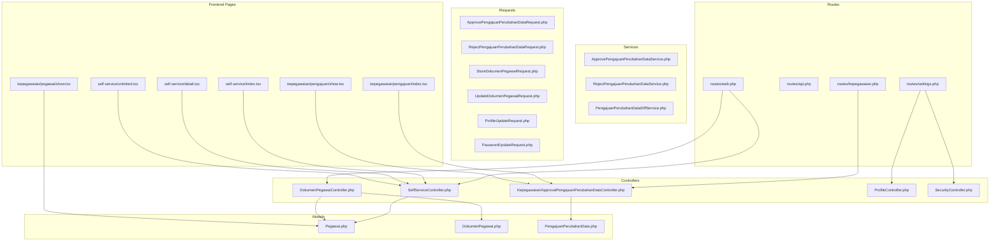
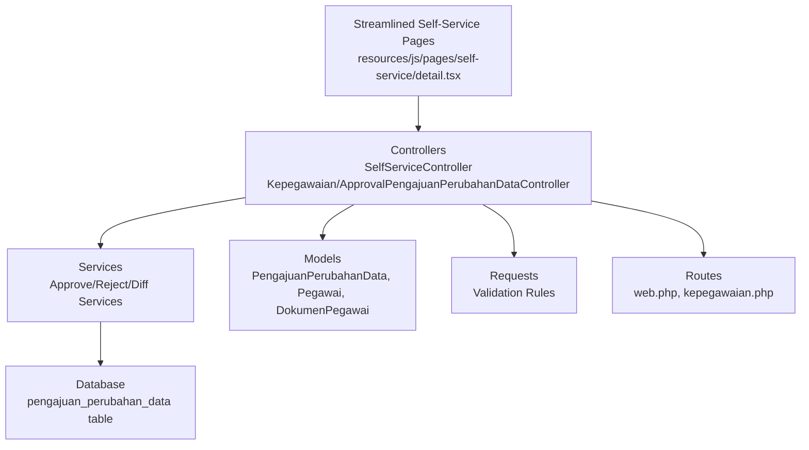
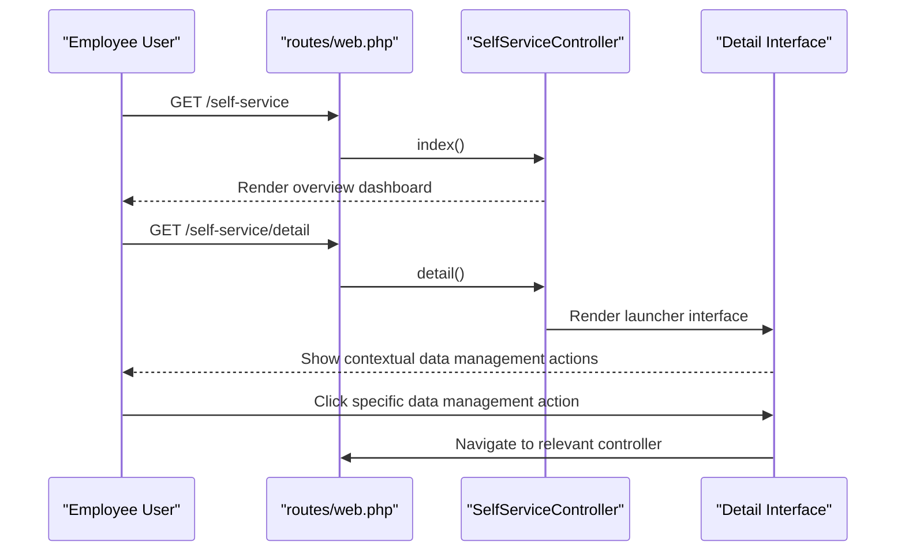
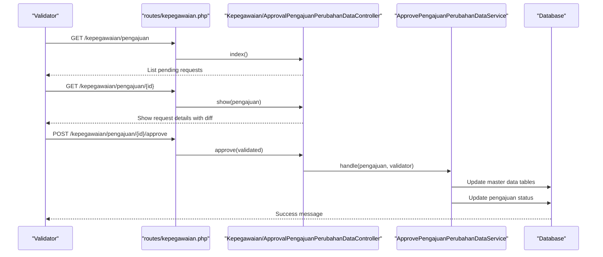
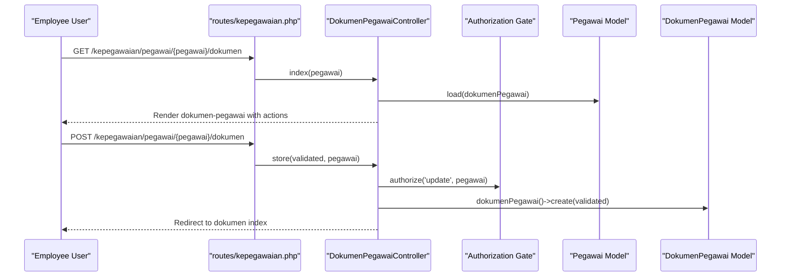
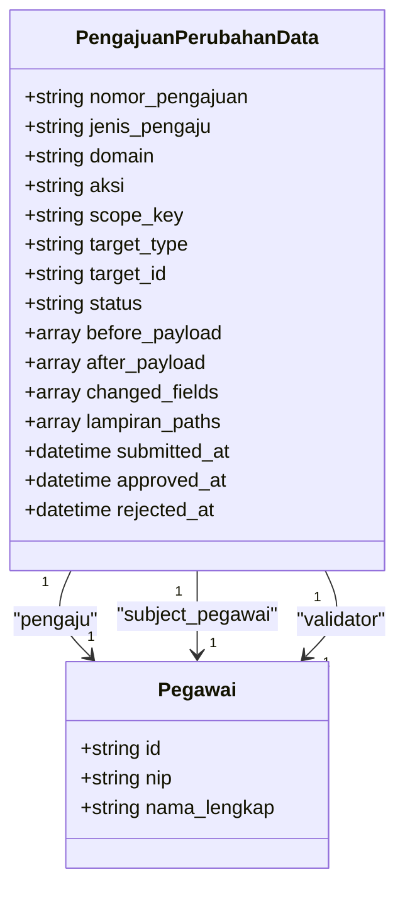
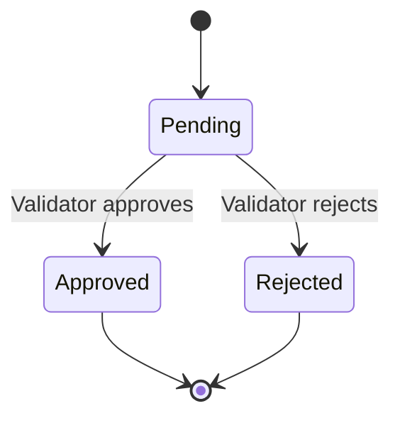
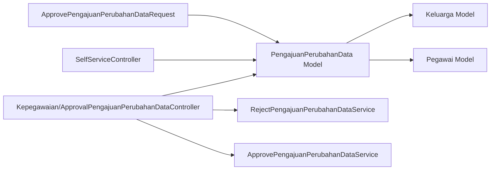

# Self-Service Portal

<cite>
**Referenced Files in This Document**
- [SelfServiceController.php](file://app/Http/Controllers/Kepegawaian/SelfServiceController.php)
- [ApprovalPengajuanPerubahanDataController.php](file://app/Http/Controllers/Kepegawaian/ApprovalPengajuanPerubahanDataController.php)
- [PengajuanPerubahanData.php](file://app/Models/PengajuanPerubahanData.php)
- [Pegawai.php](file://app/Models/Pegawai.php)
- [DokumenPegawai.php](file://app/Models/DokumenPegawai.php)
- [DokumenPegawaiController.php](file://app/Http/Controllers/Kepegawaian/DokumenPegawaiController.php)
- [ApprovePengajuanPerubahanDataService.php](file://app/Services/PengajuanPerubahanData/ApprovePengajuanPerubahanDataService.php)
- [RejectPengajuanPerubahanDataService.php](file://app/Services/PengajuanPerubahanData/RejectPengajuanPerubahanDataService.php)
- [PengajuanPerubahanDataDiffService.php](file://app/Services/PengajuanPerubahanData/PengajuanPerubahanDataDiffService.php)
- [ApprovePengajuanPerubahanDataRequest.php](file://app/Http/Requests/Kepegawaian/ApprovePengajuanPerubahanDataRequest.php)
- [RejectPengajuanPerubahanDataRequest.php](file://app/Http/Requests/Kepegawaian/RejectPengajuanPerubahanDataRequest.php)
- [StatusPengajuanPerubahanData.php](file://app/Enums/StatusPengajuanPerubahanData.php)
- [2026_04_17_151459_create_pengajuan_perubahan_data_table.php](file://database/migrations/2026_04_17_151459_create_pengajuan_perubahan_data_table.php)
- [ProfileController.php](file://app/Http/Controllers/Settings/ProfileController.php)
- [SecurityController.php](file://app/Http/Controllers/Settings/SecurityController.php)
- [ProfileUpdateRequest.php](file://app/Http/Requests/Settings/ProfileUpdateRequest.php)
- [PasswordUpdateRequest.php](file://app/Http/Requests/Settings/PasswordUpdateRequest.php)
- [routes/web.php](file://routes/web.php)
- [routes/api.php](file://routes/api.php)
- [routes/settings.php](file://routes/settings.php)
- [routes/kepegawaian.php](file://routes/kepegawaian.php)
- [index.tsx](file://resources/js/pages/self-service/index.tsx)
- [detail.tsx](file://resources/js/pages/self-service/detail.tsx)
- [unlinked.tsx](file://resources/js/pages/self-service/unlinked.tsx)
- [kepegawaian/pengajuan/index.tsx](file://resources/js/pages/kepegawaian/pengajuan/index.tsx)
- [kepegawaian/pengajuan/show.tsx](file://resources/js/pages/kepegawaian/pengajuan/show.tsx)
- [kepegawaian/pegawai/show.tsx](file://resources/js/pages/kepegawaian/pegawai/show.tsx)
- [app.js](file://resources/js/app.tsx)
- [app-layout.tsx](file://resources/js/layouts/app-layout.tsx)
- [auth-layout.tsx](file://resources/js/layouts/auth-layout.tsx)
- [KgbMonitoringService.php](file://app/Services/KgbMonitoringService.php)
- [KenaikanPangkatMonitoringService.php](file://app/Services/KenaikanPangkatMonitoringService.php)
</cite>

## Update Summary
**Changes Made**
- Removed documentation for the standalone self-service pengajuan system
- Updated architecture to reflect streamlined contextual updates within Detail Pegawai interface
- Clarified that approval workflow system still exists but manual pengajuan forms are removed
- Revised frontend navigation to show data management actions directly from employee detail view
- Updated UI flow to eliminate separate pengajuan creation pages in favor of contextual actions

## Table of Contents
1. [Introduction](#introduction)
2. [Project Structure](#project-structure)
3. [Core Components](#core-components)
4. [Architecture Overview](#architecture-overview)
5. [Detailed Component Analysis](#detailed-component-analysis)
6. [Data Change Approval Workflow](#data-change-approval-workflow)
7. [Streamlined Employee Data Management](#streamlined-employee-data-management)
8. [Dependency Analysis](#dependency-analysis)
9. [Performance Considerations](#performance-considerations)
10. [Troubleshooting Guide](#troubleshooting-guide)
11. [Conclusion](#conclusion)
12. [Appendices](#appendices)

## Introduction
The Self-Service Portal empowers civil servants (employees) to manage their personal data and documents through a streamlined, contextual approach. The portal now features three interconnected pillars:

- **Employee-centric profile management**: Direct access to comprehensive data management through contextual actions
- **Document handling**: Integrated document upload, viewing, editing, and removal within data management flows
- **Self-service data change approval workflow**: Maintained approval system for data modifications with operator interception and validation

**Updated** The self-service pengajuan system has been removed and replaced with streamlined contextual updates within the Detail Pegawai interface. Employees now access data management functions directly from their profile detail view, eliminating the separate manual pengajuan forms while preserving the approval workflow system.

## Project Structure
The Self-Service Portal spans backend controllers, models, requests, services, and frontend pages. The approval workflow system remains intact but operates through streamlined interfaces.

**Diagram sources**
- [routes/web.php](file://routes/web.php)
- [routes/api.php](file://routes/api.php)
- [routes/settings.php](file://routes/settings.php)
- [routes/kepegawaian.php](file://routes/kepegawaian.php)
- [SelfServiceController.php](file://app/Http/Controllers/Kepegawaian/SelfServiceController.php)
- [ApprovalPengajuanPerubahanDataController.php](file://app/Http/Controllers/Kepegawaian/ApprovalPengajuanPerubahanDataController.php)
- [DokumenPegawaiController.php](file://app/Http/Controllers/Kepegawaian/DokumenPegawaiController.php)
- [ProfileController.php](file://app/Http/Controllers/Settings/ProfileController.php)
- [SecurityController.php](file://app/Http/Controllers/Settings/SecurityController.php)
- [PengajuanPerubahanData.php](file://app/Models/PengajuanPerubahanData.php)
- [Pegawai.php](file://app/Models/Pegawai.php)
- [DokumenPegawai.php](file://app/Models/DokumenPegawai.php)
- [ApprovePengajuanPerubahanDataService.php](file://app/Services/PengajuanPerubahanData/ApprovePengajuanPerubahanDataService.php)
- [RejectPengajuanPerubahanDataService.php](file://app/Services/PengajuanPerubahanData/RejectPengajuanPerubahanDataService.php)
- [PengajuanPerubahanDataDiffService.php](file://app/Services/PengajuanPerubahanData/PengajuanPerubahanDataDiffService.php)
- [ApprovePengajuanPerubahanDataRequest.php](file://app/Http/Requests/Kepegawaian/ApprovePengajuanPerubahanDataRequest.php)
- [RejectPengajuanPerubahanDataRequest.php](file://app/Http/Requests/Kepegawaian/RejectPengajuanPerubahanDataRequest.php)

**Section sources**
- [routes/web.php](file://routes/web.php)
- [routes/settings.php](file://routes/settings.php)
- [routes/kepegawaian.php](file://routes/kepegawaian.php)

## Core Components
The Self-Service Portal now focuses on streamlined employee data management through contextual actions:

- **SelfServiceController**: Provides employee overview and detail access with contextual data management links
- **Kepegawaian/ApprovalPengajuanPerubahanDataController**: Manages the validator workflow for reviewing and processing data change requests
- **PengajuanPerubahanData model**: Central entity representing data change proposals with full audit trail and status tracking
- **Approval services**: Handle the application of approved changes and rejection with proper audit trails
- **Diff calculation service**: Generates human-readable differences between before/after payloads
- **Enhanced validation**: Document attachment requirements based on change type and sensitive field modifications

**Updated** The self-service pengajuan system has been eliminated. Employees now access data management functions directly through contextual actions from the Detail Pegawai interface, reducing navigation complexity while maintaining the approval workflow system.

Practical outcomes:
- Employees access comprehensive data management through contextual actions from their profile detail view
- Operators can intercept and propose changes on behalf of employees
- Validators review and approve/reject requests with full audit trail
- Approved changes are automatically applied to master data tables
- Comprehensive diff visualization shows exactly what changed
- Conflict prevention ensures only one pending request per scope

**Section sources**
- [SelfServiceController.php](file://app/Http/Controllers/Kepegawaian/SelfServiceController.php)
- [ApprovalPengajuanPerubahanDataController.php](file://app/Http/Controllers/Kepegawaian/ApprovalPengajuanPerubahanDataController.php)
- [PengajuanPerubahanData.php](file://app/Models/PengajuanPerubahanData.php)
- [ApprovePengajuanPerubahanDataService.php](file://app/Services/PengajuanPerubahanData/ApprovePengajuanPerubahanDataService.php)
- [RejectPengajuanPerubahanDataService.php](file://app/Services/PengajuanPerubahanData/RejectPengajuanPerubahanDataService.php)
- [PengajuanPerubahanDataDiffService.php](file://app/Services/PengajuanPerubahanData/PengajuanPerubahanDataDiffService.php)

## Architecture Overview
The Self-Service Portal follows a streamlined layered architecture with the approval workflow system integrated through contextual interfaces:

- **Presentation Layer**: Inertia-driven React pages with streamlined navigation from employee detail view
- **Application Layer**: Controllers orchestrate requests, enforce authorization, and delegate to specialized services
- **Domain Layer**: Eloquent models represent employee data, documents, and approval workflow entities
- **Infrastructure Layer**: Services encapsulate business logic for approval, rejection, and diff calculation
- **Workflow Layer**: Specialized controllers and services manage the approval lifecycle with contextual access

**Updated** The architecture now emphasizes contextual access patterns where data management functions are directly accessible from the employee detail view, eliminating the separate pengajuan creation workflow.

**Diagram sources**
- [SelfServiceController.php](file://app/Http/Controllers/Kepegawaian/SelfServiceController.php)
- [ApprovalPengajuanPerubahanDataController.php](file://app/Http/Controllers/Kepegawaian/ApprovalPengajuanPerubahanDataController.php)
- [ApprovePengajuanPerubahanDataService.php](file://app/Services/PengajuanPerubahanData/ApprovePengajuanPerubahanDataService.php)
- [RejectPengajuanPerubahanDataService.php](file://app/Services/PengajuanPerubahanData/RejectPengajuanPerubahanDataService.php)
- [PengajuanPerubahanDataDiffService.php](file://app/Services/PengajuanPerubahanData/PengajuanPerubahanDataDiffService.php)
- [PengajuanPerubahanData.php](file://app/Models/PengajuanPerubahanData.php)
- [routes/web.php](file://routes/web.php)
- [routes/kepegawaian.php](file://routes/kepegawaian.php)

## Detailed Component Analysis

### Streamlined Employee Data Management
The SelfServiceController now provides comprehensive access to employee data management through contextual actions:

- **index**: Displays employee overview with quick access to detailed management options
- **detail**: Provides launcher-style interface with direct links to all data management functions
- **unlinked**: Handles cases where employee accounts are not yet linked to personnel records

**Updated** The detail interface now serves as the central hub for all data management activities, replacing the previous separate pengajuan creation workflow with contextual action links.

**Diagram sources**
- [SelfServiceController.php](file://app/Http/Controllers/Kepegawaian/SelfServiceController.php)
- [routes/web.php](file://routes/web.php)
- [detail.tsx](file://resources/js/pages/self-service/detail.tsx)

**Section sources**
- [SelfServiceController.php](file://app/Http/Controllers/Kepegawaian/SelfServiceController.php)
- [index.tsx](file://resources/js/pages/self-service/index.tsx)
- [detail.tsx](file://resources/js/pages/self-service/detail.tsx)
- [unlinked.tsx](file://resources/js/pages/self-service/unlinked.tsx)

### Validator Approval Workflow
The approval controller manages the validator-facing workflow for reviewing and processing data change requests:

- **index**: Shows all pending requests requiring validation
- **show**: Displays detailed request information with diff visualization
- **approve**: Applies approved changes to master data tables
- **reject**: Records rejection with reason and maintains audit trail

**Diagram sources**
- [ApprovalPengajuanPerubahanDataController.php](file://app/Http/Controllers/Kepegawaian/ApprovalPengajuanPerubahanDataController.php)
- [ApprovePengajuanPerubahanDataService.php](file://app/Services/PengajuanPerubahanData/ApprovePengajuanPerubahanDataService.php)
- [routes/kepegawaian.php](file://routes/kepegawaian.php)

**Section sources**
- [ApprovalPengajuanPerubahanDataController.php](file://app/Http/Controllers/Kepegawaian/ApprovalPengajuanPerubahanDataController.php)
- [ApprovePengajuanPerubahanDataRequest.php](file://app/Http/Requests/Kepegawaian/ApprovePengajuanPerubahanDataRequest.php)
- [RejectPengajuanPerubahanDataRequest.php](file://app/Http/Requests/Kepegawaian/RejectPengajuanPerubahanDataRequest.php)
- [kepegawaian/pengajuan/index.tsx](file://resources/js/pages/kepegawaian/pengajuan/index.tsx)
- [kepegawaian/pengajuan/show.tsx](file://resources/js/pages/kepegawaian/pengajuan/show.tsx)

### Document Handling Workflow
DokumenPegawaiController manages document lifecycle with enhanced validation for the approval workflow:

- **index**: Loads employee with dokumenPegawai sorted by type and date
- **store**: Validates and creates documents with approval workflow awareness
- **update**: Updates existing documents with proper authorization checks
- **destroy**: Deletes documents with ownership verification

**Diagram sources**
- [DokumenPegawaiController.php](file://app/Http/Controllers/Kepegawaian/DokumenPegawaiController.php)
- [routes/kepegawaian.php](file://routes/kepegawaian.php)

**Section sources**
- [DokumenPegawaiController.php](file://app/Http/Controllers/Kepegawaian/DokumenPegawaiController.php)
- [StoreDokumenPegawaiRequest.php](file://app/Http/Requests/Kepegawaian/StoreDokumenPegawaiRequest.php)
- [UpdateDokumenPegawaiRequest.php](file://app/Http/Requests/Kepegawaian/UpdateDokumenPegawaiRequest.php)

### Profile Management and Security
ProfileController and SecurityController provide standard profile management functionality:

- **Profile editing and updates** with validation rules
- **Password updates** with current password verification
- **Security settings** with optional two-factor authentication management

**Section sources**
- [ProfileController.php](file://app/Http/Controllers/Settings/ProfileController.php)
- [SecurityController.php](file://app/Http/Controllers/Settings/SecurityController.php)
- [ProfileUpdateRequest.php](file://app/Http/Requests/Settings/ProfileUpdateRequest.php)
- [PasswordUpdateRequest.php](file://app/Http/Requests/Settings/PasswordUpdateRequest.php)

## Data Change Approval Workflow
The approval workflow system remains intact but operates through streamlined interfaces:

### Core Entities and Relationships
The system centers around the PengajuanPerubahanData model with its approval lifecycle:

**Diagram sources**
- [PengajuanPerubahanData.php](file://app/Models/PengajuanPerubahanData.php)
- [Pegawai.php](file://app/Models/Pegawai.php)

### Approval Lifecycle States
The workflow operates through three distinct states with clear transitions:

**Diagram sources**
- [StatusPengajuanPerubahanData.php](file://app/Enums/StatusPengajuanPerubahanData.php)

### Approval Process
The approval service applies changes to master data tables:

1. **Field Validation**: Ensures only allowed fields are modified according to domain rules
2. **Domain-specific Application**: Handles different data types appropriately
3. **Transaction Safety**: Wraps all operations in database transactions
4. **Audit Trail**: Updates status and timestamps

**Section sources**
- [PengajuanPerubahanData.php](file://app/Models/PengajuanPerubahanData.php)
- [ApprovePengajuanPerubahanDataService.php](file://app/Services/PengajuanPerubahanData/ApprovePengajuanPerubahanDataService.php)
- [RejectPengajuanPerubahanDataService.php](file://app/Services/PengajuanPerubahanData/RejectPengajuanPerubahanDataService.php)
- [PengajuanPerubahanDataDiffService.php](file://app/Services/PengajuanPerubahanData/PengajuanPerubahanDataDiffService.php)
- [2026_04_17_151459_create_pengajuan_perubahan_data_table.php](file://database/migrations/2026_04_17_151459_create_pengajuan_perubahan_data_table.php)

## Streamlined Employee Data Management
**New** The portal now provides a streamlined approach to employee data management through contextual actions:

### Contextual Data Management Interface
The Detail Pegawai interface serves as the central hub for all data management activities:

- **Direct Action Links**: Each data category (biodata, keluarga, riwayat jabatan, dll.) provides direct links to management functions
- **Reduced Navigation**: Eliminates the need for separate pengajuan creation pages
- **Integrated Experience**: All data management functions are accessible from a single, comprehensive interface

### Supported Data Categories
Employees can manage the following data categories directly:

- **Biodata Pribadi**: Personal identification and contact information
- **Keluarga**: Spouse, children, and other family members
- **Riwayat Jabatan**: Position and promotion history
- **Riwayat Pangkat**: Rank and grade progression
- **Pendidikan**: Academic qualifications and training
- **Riwayat Diklat**: Professional development courses
- **Penghargaan**: Awards and recognition
- **Hukuman Disiplin**: Disciplinary records
- **Dokumen Digital**: Official documents and certificates

**Section sources**
- [detail.tsx](file://resources/js/pages/self-service/detail.tsx)
- [kepegawaian/pegawai/show.tsx](file://resources/js/pages/kepegawaian/pegawai/show.tsx)

## Dependency Analysis
The approval workflow system maintains its core dependencies while supporting the streamlined interface:

**Diagram sources**
- [SelfServiceController.php](file://app/Http/Controllers/Kepegawaian/SelfServiceController.php)
- [ApprovalPengajuanPerubahanDataController.php](file://app/Http/Controllers/Kepegawaian/ApprovalPengajuanPerubahanDataController.php)
- [ApprovePengajuanPerubahanDataService.php](file://app/Services/PengajuanPerubahanData/ApprovePengajuanPerubahanDataService.php)
- [RejectPengajuanPerubahanDataService.php](file://app/Services/PengajuanPerubahanData/RejectPengajuanPerubahanDataService.php)
- [PengajuanPerubahanData.php](file://app/Models/PengajuanPerubahanData.php)
- [Pegawai.php](file://app/Models/Pegawai.php)

**Section sources**
- [SelfServiceController.php](file://app/Http/Controllers/Kepegawaian/SelfServiceController.php)
- [ApprovalPengajuanPerubahanDataController.php](file://app/Http/Controllers/Kepegawaian/ApprovalPengajuanPerubahanDataController.php)
- [ApprovePengajuanPerubahanDataService.php](file://app/Services/PengajuanPerubahanData/ApprovePengajuanPerubahanDataService.php)
- [RejectPengajuanPerubahanDataService.php](file://app/Services/PengajuanPerubahanData/RejectPengajuanPerubahanDataService.php)
- [PengajuanPerubahanDataDiffService.php](file://app/Services/PengajuanPerubahanData/PengajuanPerubahanDataDiffService.php)

## Performance Considerations
The streamlined approval workflow system implements several performance optimizations:

- **Efficient Queries**: Eager loading of related data reduces N+1 query problems
- **Transaction Safety**: All approval operations occur within atomic database transactions
- **Index Optimization**: Strategic indexing on scope_key and status fields improves query performance
- **File Storage**: Secure file storage with proper cleanup mechanisms
- **Pagination**: Built-in pagination for large approval queues
- **Reduced Navigation**: Streamlined interface eliminates redundant page loads

**Updated** The removal of separate pengajuan creation pages reduces server load and improves user experience through direct access to data management functions.

## Troubleshooting Guide
Common issues and resolutions for the streamlined approval workflow system:

### Access Issues
- **Unlinked Accounts**: Users with unlinked accounts see the unlinked.tsx page with guidance
- **Permission Denied**: Validators need proper permissions (`pengajuan-perubahan.validate`)
- **Contextual Access**: Ensure employees have proper role assignments for data management access

### Approval Issues
- **Authorization Failures**: Validators must have proper permissions (`pengajuan-perubahan.validate`)
- **Field Validation Errors**: Only allowed fields can be modified according to domain rules
- **Transaction Rollbacks**: Database errors during approval revert all changes safely

### Frontend Issues
- **Diff Visualization**: Ensure before/after payloads contain valid data for comparison
- **Form Validation**: Client-side validation mirrors server-side rules
- **Route Access**: Self-service and validator routes have appropriate middleware protection
- **Contextual Navigation**: Ensure proper linking to data management functions from detail interface

**Section sources**
- [SelfServiceController.php](file://app/Http/Controllers/Kepegawaian/SelfServiceController.php)
- [ApprovalPengajuanPerubahanDataController.php](file://app/Http/Controllers/Kepegawaian/ApprovalPengajuanPerubahanDataController.php)
- [ApprovePengajuanPerubahanDataRequest.php](file://app/Http/Requests/Kepegawaian/ApprovePengajuanPerubahanDataRequest.php)
- [RejectPengajuanPerubahanDataRequest.php](file://app/Http/Requests/Kepegawaian/RejectPengajuanPerubahanDataRequest.php)
- [routes/web.php](file://routes/web.php)
- [routes/kepegawaian.php](file://routes/kepegawaian.php)

## Conclusion
The Self-Service Portal now provides a streamlined, efficient platform for employees to manage personal data and documents through contextual access patterns. The new streamlined approach ensures data integrity while maintaining operational efficiency through:

- **Contextual Access**: Direct access to data management functions from the employee detail view
- **Simplified Navigation**: Elimination of separate pengajuan creation pages reduces complexity
- **Maintained Approval System**: The approval workflow system remains intact for data modifications
- **Comprehensive Audit Trail**: Full visibility into all data changes with before/after comparisons
- **Conflict Prevention**: Database-level safeguards against duplicate or conflicting requests
- **Flexible Domain Support**: Extensible framework for handling various data change scenarios
- **Secure Document Handling**: Proper validation and storage of supporting documentation

**Updated** The removal of the standalone self-service pengajuan system and replacement with streamlined contextual updates within the Detail Pegawai interface creates a more intuitive user experience while preserving the robust approval workflow system that ensures data integrity and operational efficiency.

## Appendices

### User Interface Design Notes
- **Streamlined Navigation**: Single interface for all data management functions
- **Contextual Access**: Direct links to specific data management actions
- **Approval Workflows**: Dedicated pages for pending requests, detailed views, and action buttons
- **Diff Visualization**: Clear presentation of changes with color-coded indicators
- **Document Uploads**: Integrated file handling with validation and preview capabilities
- **Responsive Design**: Mobile-friendly interfaces for all approval workflow stages

**Section sources**
- [app-layout.tsx](file://resources/js/layouts/app-layout.tsx)
- [auth-layout.tsx](file://resources/js/layouts/auth-layout.tsx)
- [detail.tsx](file://resources/js/pages/self-service/detail.tsx)
- [kepegawaian/pengajuan/index.tsx](file://resources/js/pages/kepegawaian/pengajuan/index.tsx)
- [kepegawaian/pengajuan/show.tsx](file://resources/js/pages/kepegawaian/pengajuan/show.tsx)

### Security Measures
- **Role-based Access Control**: Distinct permissions for employees, operators, and validators
- **Document Validation**: MIME type and size restrictions for uploaded files
- **Audit Trail Security**: Immutable record of all approval actions and changes
- **Conflict Prevention**: Database locks prevent concurrent modification conflicts
- **Data Validation**: Strict field-level validation prevents unauthorized modifications
- **Contextual Security**: Direct access links respect user permissions and role assignments

**Section sources**
- [ApprovePengajuanPerubahanDataRequest.php](file://app/Http/Requests/Kepegawaian/ApprovePengajuanPerubahanDataRequest.php)
- [RejectPengajuanPerubahanDataRequest.php](file://app/Http/Requests/Kepegawaian/RejectPengajuanPerubahanDataRequest.php)
- [PengajuanPerubahanData.php](file://app/Models/PengajuanPerubahanData.php)

### Integration with Core Employee Data
- **Master Data Integrity**: Approved changes are applied to original employee records
- **Relationship Preservation**: Family relationships and employment history remain intact
- **Historical Tracking**: Complete audit trail maintains historical context
- **Conflict Resolution**: System prevents conflicting changes through scope-based locking
- **Contextual Updates**: Streamlined interface ensures proper data management workflows

**Section sources**
- [PengajuanPerubahanData.php](file://app/Models/PengajuanPerubahanData.php)
- [Pegawai.php](file://app/Models/Pegawai.php)
- [DokumenPegawai.php](file://app/Models/DokumenPegawai.php)