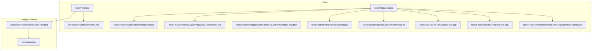
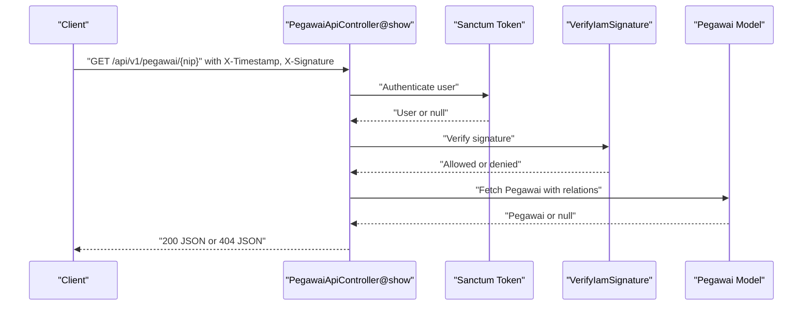
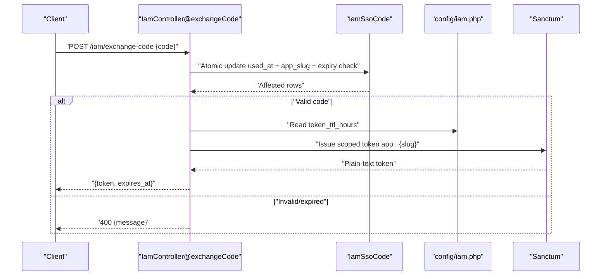
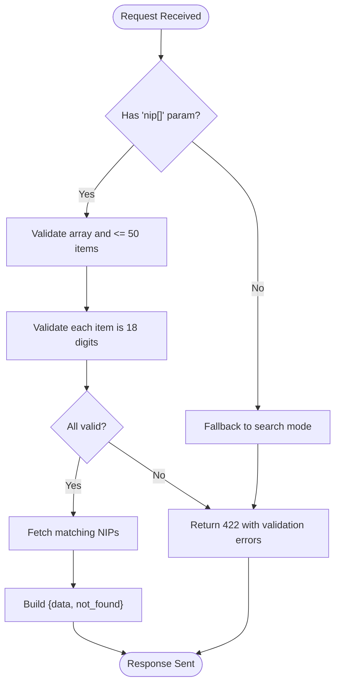
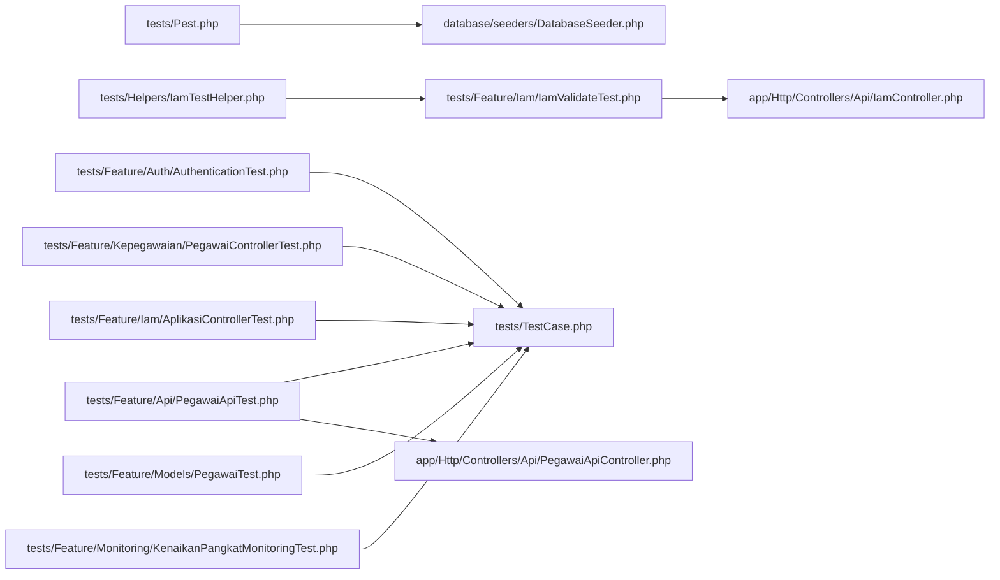

# Feature Testing

<cite>
**Referenced Files in This Document**
- [tests/TestCase.php](file://tests/TestCase.php)
- [tests/Pest.php](file://tests/Pest.php)
- [tests/Helpers/IamTestHelper.php](file://tests/Helpers/IamTestHelper.php)
- [database/seeders/DatabaseSeeder.php](file://database/seeders/DatabaseSeeder.php)
- [config/iam.php](file://config/iam.php)
- [tests/Feature/Auth/AuthenticationTest.php](file://tests/Feature/Auth/AuthenticationTest.php)
- [tests/Feature/Kepegawaian/PegawaiControllerTest.php](file://tests/Feature/Kepegawaian/PegawaiControllerTest.php)
- [tests/Feature/Kepegawaian/FormRequestAuthorizationTest.php](file://tests/Feature/Kepegawaian/FormRequestAuthorizationTest.php)
- [tests/Feature/Api/PegawaiApiTest.php](file://tests/Feature/Api/PegawaiApiTest.php)
- [tests/Feature/Iam/AplikasiControllerTest.php](file://tests/Feature/Iam/AplikasiControllerTest.php)
- [tests/Feature/Iam/IamValidateTest.php](file://tests/Feature/Iam/IamValidateTest.php)
- [tests/Feature/Models/PegawaiTest.php](file://tests/Feature/Models/PegawaiTest.php)
- [tests/Feature/Monitoring/KenaikanPangkatMonitoringTest.php](file://tests/Feature/Monitoring/KenaikanPangkatMonitoringTest.php)
- [app/Http/Controllers/Api/IamController.php](file://app/Http/Controllers/Api/IamController.php)
- [app/Http/Controllers/Api/PegawaiApiController.php](file://app/Http/Controllers/Api/PegawaiApiController.php)
</cite>

## Table of Contents
1. [Introduction](#introduction)
2. [Project Structure](#project-structure)
3. [Core Components](#core-components)
4. [Architecture Overview](#architecture-overview)
5. [Detailed Component Analysis](#detailed-component-analysis)
6. [Dependency Analysis](#dependency-analysis)
7. [Performance Considerations](#performance-considerations)
8. [Troubleshooting Guide](#troubleshooting-guide)
9. [Conclusion](#conclusion)
10. [Appendices](#appendices)

## Introduction
This document describes the feature testing methodology implemented across major application modules. It focuses on integration testing patterns for authentication, employee management, IAM system validation, and model-level verification. The guide explains controller testing, API endpoint validation, business logic verification, and end-to-end workflow validation. It also documents test setup, database seeding strategies, and request/response validation patterns, along with best practices for complex business processes.

## Project Structure
The repository organizes tests under the Feature, Unit, and Helpers namespaces. Feature tests exercise integration scenarios across controllers, middleware, and services. The Pest bootstrap seeds IAM data globally for middleware and factories to function consistently during tests.

**Diagram sources**
- [tests/Pest.php:1-16](file://tests/Pest.php#L1-L16)
- [tests/Helpers/IamTestHelper.php:1-34](file://tests/Helpers/IamTestHelper.php#L1-L34)
- [database/seeders/DatabaseSeeder.php:1-105](file://database/seeders/DatabaseSeeder.php#L1-L105)
- [config/iam.php:1-9](file://config/iam.php#L1-L9)

**Section sources**
- [tests/Pest.php:1-16](file://tests/Pest.php#L1-L16)
- [tests/Helpers/IamTestHelper.php:1-34](file://tests/Helpers/IamTestHelper.php#L1-L34)
- [database/seeders/DatabaseSeeder.php:1-105](file://database/seeders/DatabaseSeeder.php#L1-L105)
- [config/iam.php:1-9](file://config/iam.php#L1-L9)

## Core Components
- Test base and helpers:
  - Abstract test case provides a helper to conditionally skip tests when Fortify features are disabled.
  - Pest bootstrap sets up RefreshDatabase, seeds IAM data, and scopes test discovery to Feature.
  - IAM test helper generates HMAC signature headers for API requests.
- Seeding strategy:
  - DatabaseSeeder creates reference tables, IAM applications, and assigns admin/operator users with IAM roles in the target application slug.
- Configuration:
  - IAM-related configuration defines token TTL, SSO code TTL, and application slug used in tests and controllers.

**Section sources**
- [tests/TestCase.php:1-17](file://tests/TestCase.php#L1-L17)
- [tests/Pest.php:1-16](file://tests/Pest.php#L1-L16)
- [tests/Helpers/IamTestHelper.php:1-34](file://tests/Helpers/IamTestHelper.php#L1-L34)
- [database/seeders/DatabaseSeeder.php:1-105](file://database/seeders/DatabaseSeeder.php#L1-L105)
- [config/iam.php:1-9](file://config/iam.php#L1-L9)

## Architecture Overview
The feature tests validate end-to-end flows spanning authentication, authorization, controllers, middleware, and services. The IAM signature validation middleware and Sanctum tokens secure API endpoints. Controllers orchestrate business logic and resource serialization. Factories and seeders populate test data consistently.

**Diagram sources**
- [app/Http/Controllers/Api/PegawaiApiController.php:27-41](file://app/Http/Controllers/Api/PegawaiApiController.php#L27-L41)
- [tests/Feature/Api/PegawaiApiTest.php:37-41](file://tests/Feature/Api/PegawaiApiTest.php#L37-L41)

**Section sources**
- [app/Http/Controllers/Api/PegawaiApiController.php:1-112](file://app/Http/Controllers/Api/PegawaiApiController.php#L1-L112)
- [tests/Feature/Api/PegawaiApiTest.php:1-230](file://tests/Feature/Api/PegawaiApiTest.php#L1-L230)

## Detailed Component Analysis

### Authentication Testing
Focus areas:
- Login rendering, successful login, two-factor redirection, invalid credentials, logout, and rate limiting.
- Conditional skipping of two-factor tests based on Fortify feature flags.

Key behaviors validated:
- Redirects to dashboard after successful login.
- Two-factor challenge page when two-factor is enabled.
- Unauthorized attempts blocked and guest remains guest.
- Rate limiting triggers appropriate HTTP status.

Best practices:
- Use factory-generated users for deterministic test data.
- Clear rate limiter keys in beforeEach to avoid cross-test interference.
- Leverage skipUnlessFortifyFeature for optional features.

**Section sources**
- [tests/Feature/Auth/AuthenticationTest.php:1-82](file://tests/Feature/Auth/AuthenticationTest.php#L1-L82)
- [tests/TestCase.php:10-15](file://tests/TestCase.php#L10-L15)

### Employee Management Testing
Focus areas:
- Access control: guests redirected, viewers forbidden, admins authorized.
- Index filtering and sorting by reference data.
- Create, update, and soft-delete operations with validation and redirects.
- Relationship loading in detail views.

Key behaviors validated:
- Paginated index loads eager relationships.
- Filters and sorts produce expected results.
- Validation errors surface appropriately on create/update.
- Soft deletes hide records but preserve tombstones.

Best practices:
- Use factory helpers to construct payloads and references.
- Assert inertia responses for frontend-rendered pages.
- Prefer actingAs for role-based access checks.

**Section sources**
- [tests/Feature/Kepegawaian/PegawaiControllerTest.php:1-305](file://tests/Feature/Kepegawaian/PegawaiControllerTest.php#L1-L305)

### IAM System Testing
Focus areas:
- Application management: listing, creation, protection of system apps, and API key regeneration.
- Signature validation endpoint: unauthorized without auth, without IAM signature, with user without roles, and with user with roles.
- Signature generation helper for consistent header construction.

Key behaviors validated:
- Admins can manage applications; non-admins are forbidden.
- System applications cannot be deleted.
- API key regeneration produces a new key.
- Validate endpoint returns user roles and permissions when properly signed.

Best practices:
- Seed IAM data via IamSeeder before each Feature test.
- Use makeIamHeaders helper to generate valid signatures.
- Test both positive and negative scenarios for signature validation.

**Section sources**
- [tests/Feature/Iam/AplikasiControllerTest.php:1-79](file://tests/Feature/Iam/AplikasiControllerTest.php#L1-L79)
- [tests/Feature/Iam/IamValidateTest.php:1-119](file://tests/Feature/Iam/IamValidateTest.php#L1-L119)
- [tests/Helpers/IamTestHelper.php:17-32](file://tests/Helpers/IamTestHelper.php#L17-L32)

### API Endpoint Validation (Pegawai API)
Focus areas:
- Authentication and signature validation: missing token, wrong secret, tampered query, expired timestamp.
- Response shape and content for single and batch endpoints.
- Input validation: batch size limits, NIP length constraints, prioritization of nip[] over search.
- Business logic: active-only search, not_found collection for batch misses.

Key behaviors validated:
- 401 for unauthorized or invalid signature.
- 404 for unknown NIP.
- 422 for invalid inputs (format, count).
- Correct JSON structure and field mapping.

Best practices:
- Clear rate limiter keys in beforeEach to prevent throttling side effects.
- Use helper to compute signatures deterministically.
- Validate both success and failure paths for each endpoint.

**Section sources**
- [tests/Feature/Api/PegawaiApiTest.php:1-230](file://tests/Feature/Api/PegawaiApiTest.php#L1-L230)

### Form Request Authorization Testing
Focus areas:
- Role-based authorization for specific form requests.
- Viewer role is denied; admin and operator roles are permitted for targeted requests.

Key behaviors validated:
- authorize() returns correct booleans per role.
- Ensures controllers only process requests from authorized users.

Best practices:
- Instantiate requests with setUserResolver to simulate different users.
- Keep tests concise and focused on authorization logic.

**Section sources**
- [tests/Feature/Kepegawaian/FormRequestAuthorizationTest.php:1-76](file://tests/Feature/Kepegawaian/FormRequestAuthorizationTest.php#L1-L76)

### Model Validation Testing
Focus areas:
- Enum casting correctness.
- Nullable NIP for honorer status.
- Eloquent relationships: belongsTo and many-to-many.
- Scopes: active employees and unit filtering.
- Soft deletes behavior.

Key behaviors validated:
- Enum fields cast to proper enum instances.
- Honorer can have null NIP.
- Relationships resolve correctly.
- Scopes filter data as expected.
- Soft deletes preserve tombstones.

Best practices:
- Use factory defaults and overrides to cover edge cases.
- Assert relationship presence and related entity identity.

**Section sources**
- [tests/Feature/Models/PegawaiTest.php:1-134](file://tests/Feature/Models/PegawaiTest.php#L1-L134)

### Monitoring System Testing
Focus areas:
- Kenaikan Pangkat monitoring service calculations: next promotion date, proposal period, deadlines.
- Filtering out employees without active rank history and excluding retirees.
- Monitoring index returns inertia response with statistics.

Key behaviors validated:
- Date arithmetic produces correct future promotion dates.
- Period and deadline align with policy windows.
- Lists exclude ineligible employees.
- Inertia response includes expected stats.

Best practices:
- Use Carbon::setTestNow for deterministic date-based assertions.
- Compose test data with active rank histories and statuses.

**Section sources**
- [tests/Feature/Monitoring/KenaikanPangkatMonitoringTest.php:1-122](file://tests/Feature/Monitoring/KenaikanPangkatMonitoringTest.php#L1-L122)

### Controller Testing Patterns
Patterns demonstrated across controllers:
- API controllers enforce Sanctum and signature middleware externally; tests assert 401 and 404 responses.
- IAM controller exposes validate, check, logout, and exchangeCode endpoints; tests validate JSON shapes and permissions.
- Employee controllers integrate with Inertia and policies; tests assert component rendering and authorization.

Representative controller references:
- [IamController:17-91](file://app/Http/Controllers/Api/IamController.php#L17-L91)
- [PegawaiApiController:27-112](file://app/Http/Controllers/Api/PegawaiApiController.php#L27-L112)

**Section sources**
- [app/Http/Controllers/Api/IamController.php:1-91](file://app/Http/Controllers/Api/IamController.php#L1-L91)
- [app/Http/Controllers/Api/PegawaiApiController.php:1-112](file://app/Http/Controllers/Api/PegawaiApiController.php#L1-L112)

### API Workflows and Authorization

**Diagram sources**
- [app/Http/Controllers/Api/IamController.php:53-89](file://app/Http/Controllers/Api/IamController.php#L53-L89)
- [config/iam.php:5-7](file://config/iam.php#L5-L7)

**Section sources**
- [app/Http/Controllers/Api/IamController.php:1-91](file://app/Http/Controllers/Api/IamController.php#L1-L91)
- [config/iam.php:1-9](file://config/iam.php#L1-L9)

### Data Validation Flow (Batch NIP)

**Diagram sources**
- [app/Http/Controllers/Api/PegawaiApiController.php:66-87](file://app/Http/Controllers/Api/PegawaiApiController.php#L66-L87)
- [tests/Feature/Api/PegawaiApiTest.php:119-143](file://tests/Feature/Api/PegawaiApiTest.php#L119-L143)

**Section sources**
- [app/Http/Controllers/Api/PegawaiApiController.php:1-112](file://app/Http/Controllers/Api/PegawaiApiController.php#L1-L112)
- [tests/Feature/Api/PegawaiApiTest.php:178-229](file://tests/Feature/Api/PegawaiApiTest.php#L178-L229)

## Dependency Analysis
- Test bootstrap depends on Pest, RefreshDatabase, and IamSeeder.
- Controllers depend on services and models; tests assert controller behavior and middleware enforcement.
- IAM signature validation relies on application secrets and timestamps.
- Employee management tests rely on factory-generated references and role-based access checks.

**Diagram sources**
- [tests/Pest.php:1-16](file://tests/Pest.php#L1-L16)
- [tests/Helpers/IamTestHelper.php:1-34](file://tests/Helpers/IamTestHelper.php#L1-L34)
- [tests/Feature/Api/PegawaiApiTest.php:1-230](file://tests/Feature/Api/PegawaiApiTest.php#L1-L230)
- [app/Http/Controllers/Api/PegawaiApiController.php:1-112](file://app/Http/Controllers/Api/PegawaiApiController.php#L1-L112)
- [app/Http/Controllers/Api/IamController.php:1-91](file://app/Http/Controllers/Api/IamController.php#L1-L91)

**Section sources**
- [tests/Pest.php:1-16](file://tests/Pest.php#L1-L16)
- [tests/Helpers/IamTestHelper.php:1-34](file://tests/Helpers/IamTestHelper.php#L1-L34)
- [tests/Feature/Api/PegawaiApiTest.php:1-230](file://tests/Feature/Api/PegawaiApiTest.php#L1-L230)
- [app/Http/Controllers/Api/PegawaiApiController.php:1-112](file://app/Http/Controllers/Api/PegawaiApiController.php#L1-L112)
- [app/Http/Controllers/Api/IamController.php:1-91](file://app/Http/Controllers/Api/IamController.php#L1-L91)

## Performance Considerations
- Use factory-generated data to minimize database overhead.
- Clear rate limiter keys in beforeEach to avoid throttling side effects.
- Prefer lightweight assertions (JSON structure checks) for high-volume API tests.
- Limit batch sizes to reduce query load and improve response times.

## Troubleshooting Guide
Common issues and resolutions:
- Unauthorized or invalid signature errors:
  - Ensure Sanctum token is present and signature computed with correct secret and sorted query string.
  - Verify X-Timestamp freshness against server time.
- Rate limiting:
  - Clear throttle keys in beforeEach to avoid cross-test interference.
- Missing IAM roles:
  - Confirm IamSeeder ran and application slug matches config.
- Soft deletes:
  - Use withTrashed() when asserting deleted records.

**Section sources**
- [tests/Feature/Api/PegawaiApiTest.php:29-35](file://tests/Feature/Api/PegawaiApiTest.php#L29-L35)
- [tests/Feature/Iam/IamValidateTest.php:14-35](file://tests/Feature/Iam/IamValidateTest.php#L14-L35)
- [database/seeders/DatabaseSeeder.php:42-48](file://database/seeders/DatabaseSeeder.php#L42-L48)

## Conclusion
The feature tests establish robust integration coverage across authentication, employee management, IAM validation, and API endpoints. They leverage factories, seeders, and helper utilities to ensure consistent, deterministic scenarios. The documented patterns and best practices enable reliable testing of complex business processes and end-to-end workflows.

## Appendices
- Test setup checklist:
  - Run Pest with RefreshDatabase.
  - Seed IAM data via IamSeeder.
  - Use makeIamHeaders for signature generation.
  - Clear rate limiter keys in beforeEach for API tests.
- Configuration references:
  - [config/iam.php:1-9](file://config/iam.php#L1-L9)
  - [database/seeders/DatabaseSeeder.php:1-105](file://database/seeders/DatabaseSeeder.php#L1-L105)