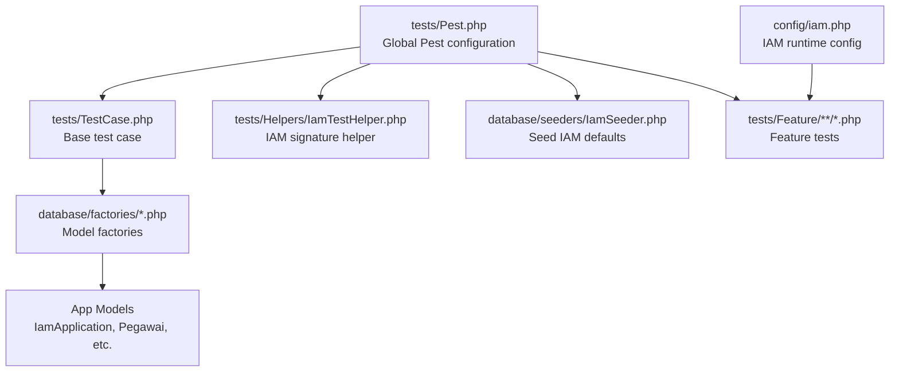
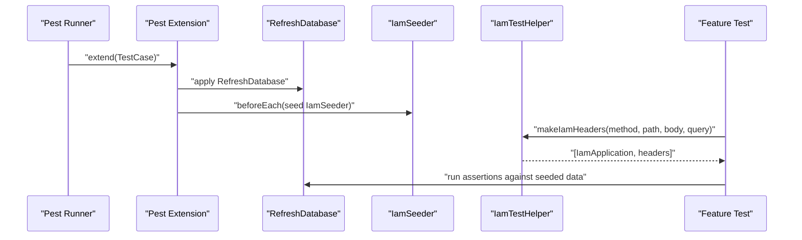
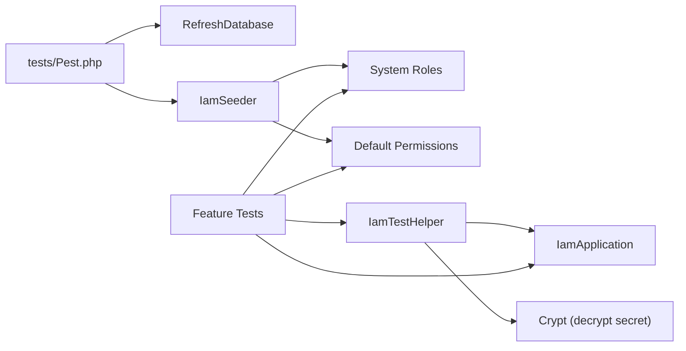

# Test Helpers and Utilities

<cite>
**Referenced Files in This Document**
- [IamTestHelper.php](file://tests/Helpers/IamTestHelper.php)
- [Pest.php](file://tests/Pest.php)
- [TestCase.php](file://tests/TestCase.php)
- [phpunit.xml](file://phpunit.xml)
- [IamValidateTest.php](file://tests/Feature/Iam/IamValidateTest.php)
- [AplikasiControllerTest.php](file://tests/Feature/Iam/AplikasiControllerTest.php)
- [VerifyIamSignatureTest.php](file://tests/Feature/Iam/VerifyIamSignatureTest.php)
- [VerifyIamPermissionTest.php](file://tests/Feature/Iam/VerifyIamPermissionTest.php)
- [IamModelsTest.php](file://tests/Feature/Iam/IamModelsTest.php)
- [AuthenticationTest.php](file://tests/Feature/Auth/AuthenticationTest.php)
- [IamSeeder.php](file://database/seeders/IamSeeder.php)
- [PegawaiFactory.php](file://database/factories/PegawaiFactory.php)
- [IamApplicationFactory.php](file://database/factories/IamApplicationFactory.php)
- [iam.php](file://config/iam.php)
- [composer.json](file://composer.json)
</cite>

## Table of Contents
1. [Introduction](#introduction)
2. [Project Structure](#project-structure)
3. [Core Components](#core-components)
4. [Architecture Overview](#architecture-overview)
5. [Detailed Component Analysis](#detailed-component-analysis)
6. [Dependency Analysis](#dependency-analysis)
7. [Performance Considerations](#performance-considerations)
8. [Troubleshooting Guide](#troubleshooting-guide)
9. [Conclusion](#conclusion)
10. [Appendices](#appendices)

## Introduction
This document explains the testing utilities and helper functions used across the Kepegawaian Apps testing framework. It focuses on:
- IamTestHelper for generating IAM signature headers in tests
- Pest configuration and extensions for consistent test setup
- Base TestCase functionality and reusable assertion patterns
- Test data generation via factories and seeders
- Database refresh strategies and beforeEach hooks
- Best practices for maintaining reliable and maintainable test helpers

## Project Structure
The testing stack centers around PestPHP, with shared helpers loaded globally and a base TestCase extending Laravel’s foundation. Feature tests live under tests/Feature, while helpers and configuration reside under tests/.

**Diagram sources**
- [Pest.php:1-16](file://tests/Pest.php#L1-L16)
- [TestCase.php:1-17](file://tests/TestCase.php#L1-L17)
- [IamTestHelper.php:1-34](file://tests/Helpers/IamTestHelper.php#L1-L34)
- [IamSeeder.php:1-170](file://database/seeders/IamSeeder.php#L1-L170)
- [PegawaiFactory.php:1-162](file://database/factories/PegawaiFactory.php#L1-L162)
- [IamApplicationFactory.php:1-69](file://database/factories/IamApplicationFactory.php#L1-L69)
- [iam.php:1-9](file://config/iam.php#L1-L9)

**Section sources**
- [Pest.php:1-16](file://tests/Pest.php#L1-L16)
- [TestCase.php:1-17](file://tests/TestCase.php#L1-L17)
- [IamTestHelper.php:1-34](file://tests/Helpers/IamTestHelper.php#L1-L34)
- [IamSeeder.php:1-170](file://database/seeders/IamSeeder.php#L1-L170)
- [PegawaiFactory.php:1-162](file://database/factories/PegawaiFactory.php#L1-L162)
- [IamApplicationFactory.php:1-69](file://database/factories/IamApplicationFactory.php#L1-L69)
- [iam.php:1-9](file://config/iam.php#L1-L9)

## Core Components
- IamTestHelper: Provides a helper to generate valid IAM signature headers for API tests, including application creation, secret decryption, payload construction, and HMAC signature computation.
- Pest configuration: Extends tests with RefreshDatabase, seeds IAM data in beforeEach, and scopes test discovery to Feature directory.
- Base TestCase: Adds a convenience method to skip tests when specific Fortify features are disabled.
- Factories and Seeders: Provide deterministic test data for IAM and user models, ensuring middleware and relations behave predictably.
- Runtime configuration: IAM-related environment variables influence token TTL and SSO code TTL.

**Section sources**
- [IamTestHelper.php:6-34](file://tests/Helpers/IamTestHelper.php#L6-L34)
- [Pest.php:9-15](file://tests/Pest.php#L9-L15)
- [TestCase.php:10-16](file://tests/TestCase.php#L10-L16)
- [IamSeeder.php:17-170](file://database/seeders/IamSeeder.php#L17-L170)
- [PegawaiFactory.php:88-161](file://database/factories/PegawaiFactory.php#L88-L161)
- [IamApplicationFactory.php:21-68](file://database/factories/IamApplicationFactory.php#L21-L68)
- [iam.php:4-8](file://config/iam.php#L4-L8)

## Architecture Overview
The testing architecture ensures:
- Global setup: Pest extends TestCase and enables RefreshDatabase, seeds IAM defaults, and discovers Feature tests.
- IAM-specific helpers: IamTestHelper encapsulates signature header generation for API endpoints requiring IAM verification.
- Data reliability: Factories auto-assign roles and seeders populate system roles and permissions for consistent middleware behavior.

**Diagram sources**
- [Pest.php:9-15](file://tests/Pest.php#L9-L15)
- [IamSeeder.php:17-34](file://database/seeders/IamSeeder.php#L17-L34)
- [IamTestHelper.php:17-32](file://tests/Helpers/IamTestHelper.php#L17-L32)

## Detailed Component Analysis

### IamTestHelper
Purpose:
- Generate valid IAM signature headers for testing IAM-protected endpoints.
- Create an active IamApplication with decrypted secret for HMAC signing.
- Build the canonical payload and compute the signature.

Key behaviors:
- Creates an active application via factory and decrypts the stored secret hash.
- Sorts query parameters by key and computes a SHA-256 body hash.
- Constructs the payload string and signs it with HMAC-SHA256 using the decrypted secret.
- Returns the application instance and a headers array containing X-App-Key, X-Timestamp, and X-Signature.

Usage patterns in tests:
- Signature generation for IAM validation and signature verification tests.
- Manual application creation with encrypted secrets for edge-case scenarios.

Best practices:
- Prefer the helper for consistent header generation across tests.
- Ensure timestamps are current and query parameters are sorted for deterministic signatures.

**Section sources**
- [IamTestHelper.php:6-34](file://tests/Helpers/IamTestHelper.php#L6-L34)
- [IamValidateTest.php:54-78](file://tests/Feature/Iam/IamValidateTest.php#L54-L78)
- [VerifyIamSignatureTest.php:83-118](file://tests/Feature/Iam/VerifyIamSignatureTest.php#L83-L118)

### Pest Configuration and Extensions
Purpose:
- Centralize test setup for all Feature tests.
- Ensure a clean, seeded database state per test run.

Key behaviors:
- Extends the base TestCase and applies RefreshDatabase.
- Seeds IamSeeder during beforeEach to guarantee system roles and permissions exist.
- Scopes test discovery to the Feature directory.

Integration points:
- Uses Laravel’s RefreshDatabase trait to rollback or refresh the database after each test.
- Depends on IamSeeder to create system roles and default permissions.

**Section sources**
- [Pest.php:9-15](file://tests/Pest.php#L9-L15)
- [IamSeeder.php:17-170](file://database/seeders/IamSeeder.php#L17-L170)

### Base TestCase Functionality
Purpose:
- Provide reusable test utilities and guardrails for optional features.

Key behaviors:
- Adds a helper to skip tests when a specific Fortify feature is disabled, preventing misleading failures.

Usage patterns:
- Call the helper in tests that depend on Fortify features like two-factor authentication.

**Section sources**
- [TestCase.php:8-16](file://tests/TestCase.php#L8-L16)
- [AuthenticationTest.php:25-49](file://tests/Feature/Auth/AuthenticationTest.php#L25-L49)

### Test Data Generation and Factories
Purpose:
- Produce realistic, consistent test data for models and relationships.

Key behaviors:
- PegawaiFactory auto-assigns a default viewer role post-creation and supports admin/operator/viewer specializations.
- IamApplicationFactory auto-populates api_key, api_secret_hash, and is_system fields for deterministic tests.
- Seeders populate system roles and default permissions for IAM middleware.

Patterns:
- Use factory macros (admin(), operator(), viewer()) to quickly attach roles to users.
- Use seeders to ensure baseline IAM data exists before running tests.

**Section sources**
- [PegawaiFactory.php:88-161](file://database/factories/PegawaiFactory.php#L88-L161)
- [IamApplicationFactory.php:21-68](file://database/factories/IamApplicationFactory.php#L21-L68)
- [IamSeeder.php:17-170](file://database/seeders/IamSeeder.php#L17-L170)

### Database Refresh Strategies and beforeEach Hooks
Purpose:
- Maintain isolation and determinism across tests.

Key behaviors:
- RefreshDatabase is applied globally via Pest extension.
- beforeEach seeds IAM data to ensure middleware and model relations work as expected.

Guidelines:
- Keep beforeEach lightweight; avoid heavy operations.
- Use factories and seeders to minimize duplication in individual tests.

**Section sources**
- [Pest.php:9-15](file://tests/Pest.php#L9-L15)
- [phpunit.xml:20-36](file://phpunit.xml#L20-L36)

### Common Assertion Patterns
Common patterns observed in tests:
- Use specific response assertions (assertSuccessful, assertUnauthorized, assertForbidden) for clarity.
- Assert JSON structure and path values for IAM validation endpoints.
- Use expect-style assertions for model relationships and credential verification.

Examples:
- IAM validation endpoint assertions for roles and permissions.
- Signature verification tests asserting 401 for invalid keys, wrong signatures, and expired timestamps.
- Permission middleware tests asserting redirects and forbidden responses.

**Section sources**
- [IamValidateTest.php:37-118](file://tests/Feature/Iam/IamValidateTest.php#L37-L118)
- [VerifyIamSignatureTest.php:14-118](file://tests/Feature/Iam/VerifyIamSignatureTest.php#L14-L118)
- [VerifyIamPermissionTest.php:36-59](file://tests/Feature/Iam/VerifyIamPermissionTest.php#L36-L59)

### IAM-Specific Test Examples
- IAM validation tests demonstrate how to construct signatures manually and via the helper, and how to assert user roles and permissions returned by the endpoint.
- Signature verification tests validate rejection for missing headers, unknown keys, incorrect signatures, and expired timestamps.
- Permission middleware tests validate access control using IAM roles and permissions.

**Section sources**
- [IamValidateTest.php:37-118](file://tests/Feature/Iam/IamValidateTest.php#L37-L118)
- [VerifyIamSignatureTest.php:14-118](file://tests/Feature/Iam/VerifyIamSignatureTest.php#L14-L118)
- [VerifyIamPermissionTest.php:10-34](file://tests/Feature/Iam/VerifyIamPermissionTest.php#L10-L34)

## Dependency Analysis
The testing utilities depend on:
- Laravel’s RefreshDatabase for database isolation.
- IamSeeder to bootstrap IAM roles and permissions.
- Factories to create related models with correct attributes and relationships.
- IAM configuration for runtime parameters affecting token lifetimes.

**Diagram sources**
- [Pest.php:9-15](file://tests/Pest.php#L9-L15)
- [IamSeeder.php:17-170](file://database/seeders/IamSeeder.php#L17-L170)
- [IamTestHelper.php:17-32](file://tests/Helpers/IamTestHelper.php#L17-L32)

**Section sources**
- [Pest.php:9-15](file://tests/Pest.php#L9-L15)
- [IamSeeder.php:17-170](file://database/seeders/IamSeeder.php#L17-L170)
- [IamTestHelper.php:17-32](file://tests/Helpers/IamTestHelper.php#L17-L32)

## Performance Considerations
- Keep beforeEach operations minimal; rely on seeders and factories to prepare data efficiently.
- Use SQLite in-memory database for speed during testing.
- Avoid redundant seeding by leveraging the global beforeEach hook.
- Prefer expect-style assertions for concise and readable validations.

[No sources needed since this section provides general guidance]

## Troubleshooting Guide
Common issues and resolutions:
- Unauthorized or forbidden responses:
  - Ensure IAM signature headers are generated with the helper or constructed correctly.
  - Confirm the application is active and the secret matches the stored hash.
  - Verify timestamps are current and query parameters are sorted.
- Missing roles or permissions:
  - Confirm IamSeeder ran in beforeEach and that the application slug matches expectations.
  - Ensure factory-generated roles are attached or seeders created default roles.
- Skipping tests due to disabled Fortify features:
  - Use the base TestCase helper to conditionally skip tests when features are off.

**Section sources**
- [VerifyIamSignatureTest.php:14-118](file://tests/Feature/Iam/VerifyIamSignatureTest.php#L14-L118)
- [VerifyIamPermissionTest.php:36-59](file://tests/Feature/Iam/VerifyIamPermissionTest.php#L36-L59)
- [TestCase.php:10-16](file://tests/TestCase.php#L10-L16)
- [Pest.php:11-13](file://tests/Pest.php#L11-L13)

## Conclusion
The Kepegawaian Apps testing framework leverages PestPHP for concise, expressive tests, backed by shared helpers, factories, and seeders. IamTestHelper streamlines IAM signature header generation, while Pest’s beforeEach hook ensures consistent database state and IAM data availability. Factories and seeders provide deterministic model states, and base TestCase adds guardrails for optional features. Following the patterns documented here improves reliability, readability, and maintainability of the test suite.

[No sources needed since this section summarizes without analyzing specific files]

## Appendices

### Pest Configuration Reference
- Global extension: extends base TestCase and applies RefreshDatabase.
- beforeEach hook: seeds IamSeeder to initialize system roles and permissions.
- Test discovery: scoped to Feature directory.

**Section sources**
- [Pest.php:9-15](file://tests/Pest.php#L9-L15)

### Environment and Configuration Notes
- Database: SQLite in-memory for speed.
- IAM runtime configuration: token TTL, SSO code TTL, and application slug.

**Section sources**
- [phpunit.xml:20-36](file://phpunit.xml#L20-L36)
- [iam.php:4-8](file://config/iam.php#L4-L8)

### Composer Dependencies for Testing
- PestPHP and Laravel plugin for Pest are included in require-dev.
- Scripts integrate testing into development workflows.

**Section sources**
- [composer.json:20-30](file://composer.json#L20-L30)
- [composer.json:74-78](file://composer.json#L74-L78)