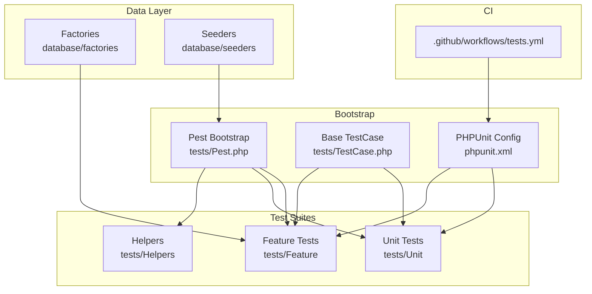
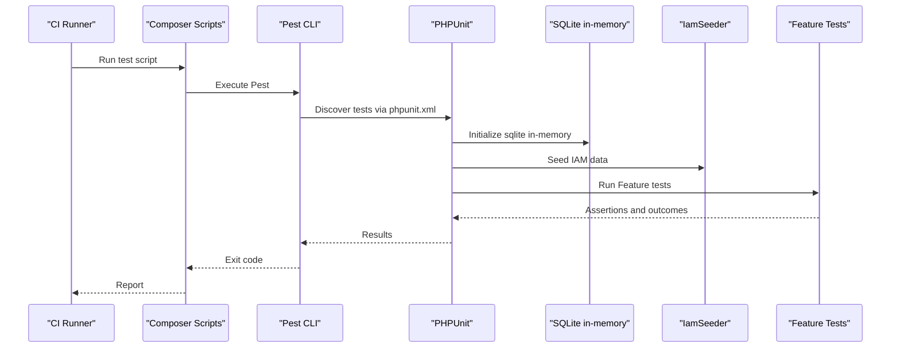
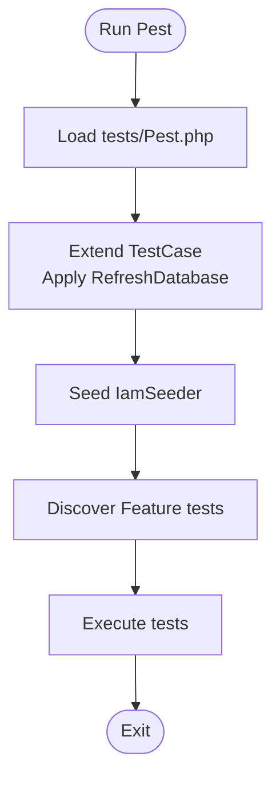
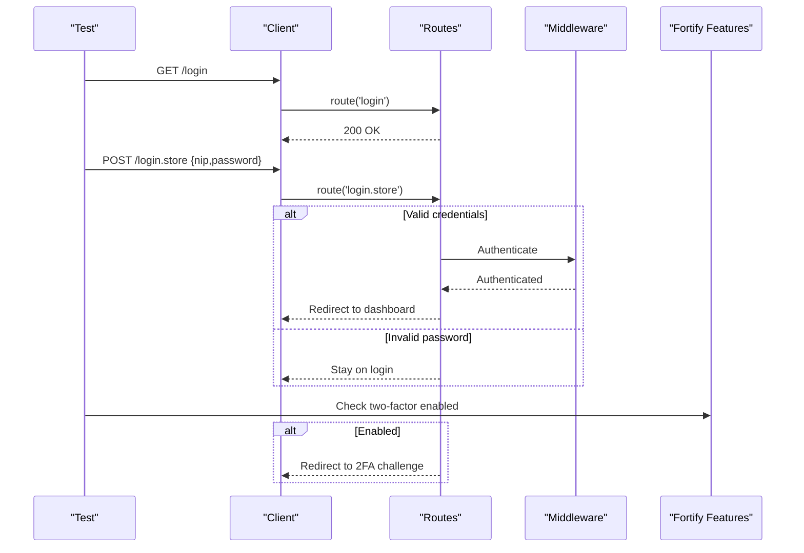
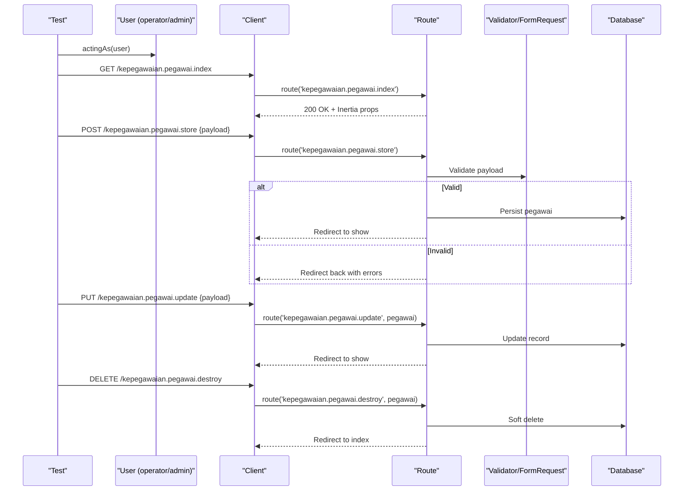
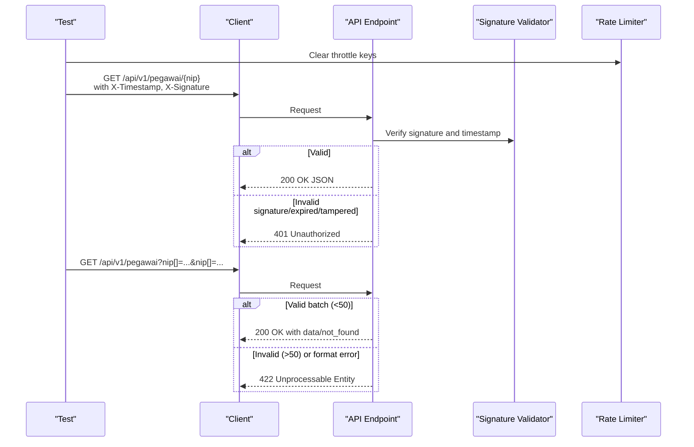
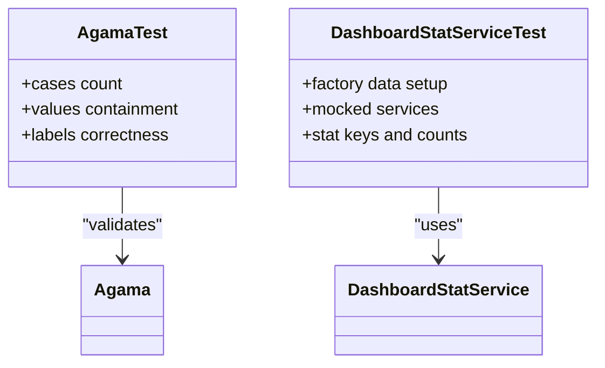
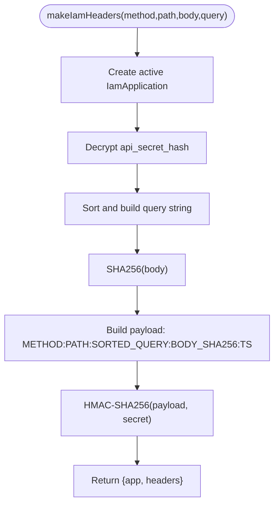
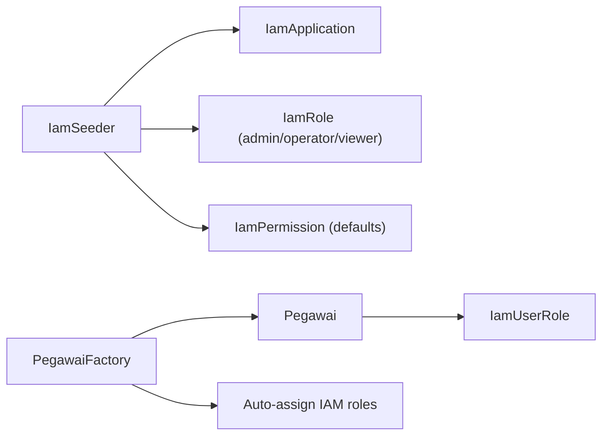
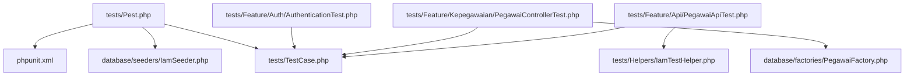

# Testing Strategy

<cite>
**Referenced Files in This Document**
- [tests/TestCase.php](file://tests/TestCase.php)
- [tests/Pest.php](file://tests/Pest.php)
- [phpunit.xml](file://phpunit.xml)
- [composer.json](file://composer.json)
- [tests/Feature/ExampleTest.php](file://tests/Feature/ExampleTest.php)
- [tests/Unit/ExampleTest.php](file://tests/Unit/ExampleTest.php)
- [tests/Feature/Auth/AuthenticationTest.php](file://tests/Feature/Auth/AuthenticationTest.php)
- [tests/Feature/Kepegawaian/PegawaiControllerTest.php](file://tests/Feature/Kepegawaian/PegawaiControllerTest.php)
- [tests/Feature/Api/PegawaiApiTest.php](file://tests/Feature/Api/PegawaiApiTest.php)
- [tests/Unit/Services/DashboardStatServiceTest.php](file://tests/Unit/Services/DashboardStatServiceTest.php)
- [tests/Unit/Enums/AgamaTest.php](file://tests/Unit/Enums/AgamaTest.php)
- [tests/Helpers/IamTestHelper.php](file://tests/Helpers/IamTestHelper.php)
- [database/factories/PegawaiFactory.php](file://database/factories/PegawaiFactory.php)
- [database/seeders/IamSeeder.php](file://database/seeders/IamSeeder.php)
- [.github/workflows/tests.yml](file://.github/workflows/tests.yml)
</cite>

## Table of Contents
1. [Introduction](#introduction)
2. [Project Structure](#project-structure)
3. [Core Components](#core-components)
4. [Architecture Overview](#architecture-overview)
5. [Detailed Component Analysis](#detailed-component-analysis)
6. [Dependency Analysis](#dependency-analysis)
7. [Performance Considerations](#performance-considerations)
8. [Troubleshooting Guide](#troubleshooting-guide)
9. [Conclusion](#conclusion)
10. [Appendices](#appendices)

## Introduction
This document describes the testing strategy for the Kepegawaian Apps project using PestPHP and PHPUnit. It explains the testing philosophy, architecture, and practical patterns for unit tests, feature tests, and test helpers. It also documents database testing with factories, API testing approaches, CI setup, and best practices for Laravel and React components.

## Project Structure
The testing suite is organized into:
- Unit tests under tests/Unit for isolated logic and enums/services.
- Feature tests under tests/Feature for HTTP/API flows, Inertia rendering, and policy checks.
- Test helpers under tests/Helpers for reusable utilities (e.g., IAM signature generation).
- Shared base TestCase and Pest extension configuration.

**Diagram sources**
- [tests/Pest.php:1-16](file://tests/Pest.php#L1-L16)
- [tests/TestCase.php:1-17](file://tests/TestCase.php#L1-L17)
- [phpunit.xml:1-38](file://phpunit.xml#L1-L38)
- [database/factories/PegawaiFactory.php:1-162](file://database/factories/PegawaiFactory.php#L1-L162)
- [database/seeders/IamSeeder.php:1-170](file://database/seeders/IamSeeder.php#L1-L170)
- [.github/workflows/tests.yml:1-57](file://.github/workflows/tests.yml#L1-L57)

**Section sources**
- [tests/Pest.php:1-16](file://tests/Pest.php#L1-L16)
- [tests/TestCase.php:1-17](file://tests/TestCase.php#L1-L17)
- [phpunit.xml:1-38](file://phpunit.xml#L1-L38)

## Core Components
- Base TestCase: Provides shared utilities like skipping tests when Fortify features are disabled.
- Pest Bootstrap: Extends the base test case, applies RefreshDatabase, seeds IAM data, and sets the test scope to Feature tests.
- PHPUnit Configuration: Defines test suites, environment variables, and source inclusion for coverage.
- Factories: Generate realistic model instances with related references and role assignments.
- Seeders: Prepare IAM application, roles, and permissions for middleware and authorization checks.
- Helpers: Provide signed headers for API tests and IAM signature generation.

**Section sources**
- [tests/TestCase.php:8-16](file://tests/TestCase.php#L8-L16)
- [tests/Pest.php:9-15](file://tests/Pest.php#L9-L15)
- [phpunit.xml:7-19](file://phpunit.xml#L7-L19)
- [database/factories/PegawaiFactory.php:88-161](file://database/factories/PegawaiFactory.php#L88-L161)
- [database/seeders/IamSeeder.php:17-168](file://database/seeders/IamSeeder.php#L17-L168)
- [tests/Helpers/IamTestHelper.php:6-33](file://tests/Helpers/IamTestHelper.php#L6-L33)

## Architecture Overview
The testing architecture leverages PestPHP for expressive, readable tests and PHPUnit for test discovery and coverage. The Pest bootstrap ensures a clean database per test and seeds IAM data so middleware and authorization checks function during tests. Feature tests exercise HTTP routes, Inertia rendering, and API endpoints with HMAC signatures. Unit tests validate enums, services, and pure logic. Factories and seeders provide deterministic, realistic datasets.

**Diagram sources**
- [.github/workflows/tests.yml:55-56](file://.github/workflows/tests.yml#L55-L56)
- [composer.json:74-78](file://composer.json#L74-L78)
- [phpunit.xml:26-28](file://phpunit.xml#L26-L28)
- [database/seeders/IamSeeder.php:17-34](file://database/seeders/IamSeeder.php#L17-L34)
- [tests/Pest.php:11-14](file://tests/Pest.php#L11-L14)

## Detailed Component Analysis

### PestPHP and PHPUnit Orchestration
- Pest bootstrap extends the base TestCase, applies RefreshDatabase, seeds IAM data before each test, and scopes test discovery to Feature tests.
- PHPUnit configuration defines Unit and Feature suites, sets environment variables for a fast SQLite in-memory database, and enables coverage on the app directory.

**Diagram sources**
- [tests/Pest.php:9-15](file://tests/Pest.php#L9-L15)
- [phpunit.xml:7-14](file://phpunit.xml#L7-L14)

**Section sources**
- [tests/Pest.php:9-15](file://tests/Pest.php#L9-L15)
- [phpunit.xml:20-36](file://phpunit.xml#L20-L36)

### Feature Tests: Authentication
- Demonstrates rendering login, authenticating users, two-factor challenges, invalid credentials, logout, and rate limiting.
- Uses factory-generated users and Fortify feature gating.

**Diagram sources**
- [tests/Feature/Auth/AuthenticationTest.php:7-82](file://tests/Feature/Auth/AuthenticationTest.php#L7-L82)

**Section sources**
- [tests/Feature/Auth/AuthenticationTest.php:13-23](file://tests/Feature/Auth/AuthenticationTest.php#L13-L23)
- [tests/Feature/Auth/AuthenticationTest.php:25-49](file://tests/Feature/Auth/AuthenticationTest.php#L25-L49)
- [tests/Feature/Auth/AuthenticationTest.php:51-60](file://tests/Feature/Auth/AuthenticationTest.php#L51-L60)
- [tests/Feature/Auth/AuthenticationTest.php:62-69](file://tests/Feature/Auth/AuthenticationTest.php#L62-L69)
- [tests/Feature/Auth/AuthenticationTest.php:71-82](file://tests/Feature/Auth/AuthenticationTest.php#L71-L82)

### Feature Tests: Kepegawaian CRUD and Filtering
- Exercises controller actions for listing, filtering, sorting, creating, updating, and soft-deleting pegawai.
- Validates Inertia rendering and relationship eager loading.
- Uses factory-generated references (jabatan, pangkat, unit kerja) and payload builders.

**Diagram sources**
- [tests/Feature/Kepegawaian/PegawaiControllerTest.php:38-76](file://tests/Feature/Kepegawaian/PegawaiControllerTest.php#L38-L76)
- [tests/Feature/Kepegawaian/PegawaiControllerTest.php:194-210](file://tests/Feature/Kepegawaian/PegawaiControllerTest.php#L194-L210)
- [tests/Feature/Kepegawaian/PegawaiControllerTest.php:212-238](file://tests/Feature/Kepegawaian/PegawaiControllerTest.php#L212-L238)
- [tests/Feature/Kepegawaian/PegawaiControllerTest.php:240-260](file://tests/Feature/Kepegawaian/PegawaiControllerTest.php#L240-L260)
- [tests/Feature/Kepegawaian/PegawaiControllerTest.php:262-288](file://tests/Feature/Kepegawaian/PegawaiControllerTest.php#L262-L288)
- [tests/Feature/Kepegawaian/PegawaiControllerTest.php:290-304](file://tests/Feature/Kepegawaian/PegawaiControllerTest.php#L290-L304)

**Section sources**
- [tests/Feature/Kepegawaian/PegawaiControllerTest.php:17-36](file://tests/Feature/Kepegawaian/PegawaiControllerTest.php#L17-L36)
- [tests/Feature/Kepegawaian/PegawaiControllerTest.php:78-117](file://tests/Feature/Kepegawaian/PegawaiControllerTest.php#L78-L117)
- [tests/Feature/Kepegawaian/PegawaiControllerTest.php:119-192](file://tests/Feature/Kepegawaian/PegawaiControllerTest.php#L119-L192)
- [tests/Feature/Kepegawaian/PegawaiControllerTest.php:194-210](file://tests/Feature/Kepegawaian/PegawaiControllerTest.php#L194-L210)
- [tests/Feature/Kepegawaian/PegawaiControllerTest.php:212-238](file://tests/Feature/Kepegawaian/PegawaiControllerTest.php#L212-L238)
- [tests/Feature/Kepegawaian/PegawaiControllerTest.php:240-260](file://tests/Feature/Kepegawaian/PegawaiControllerTest.php#L240-L260)
- [tests/Feature/Kepegawaian/PegawaiControllerTest.php:262-288](file://tests/Feature/Kepegawaian/PegawaiControllerTest.php#L262-L288)
- [tests/Feature/Kepegawaian/PegawaiControllerTest.php:290-304](file://tests/Feature/Kepegawaian/PegawaiControllerTest.php#L290-L304)

### API Tests: HMAC-Secured Endpoints
- Generates signed headers for API requests and validates rejection for missing tokens, wrong signatures, tampered queries, expired timestamps, and validation errors.
- Tests single and batch retrieval, search filters, and validation constraints.

**Diagram sources**
- [tests/Feature/Api/PegawaiApiTest.php:30-35](file://tests/Feature/Api/PegawaiApiTest.php#L30-L35)
- [tests/Feature/Api/PegawaiApiTest.php:37-41](file://tests/Feature/Api/PegawaiApiTest.php#L37-L41)
- [tests/Feature/Api/PegawaiApiTest.php:43-50](file://tests/Feature/Api/PegawaiApiTest.php#L43-L50)
- [tests/Feature/Api/PegawaiApiTest.php:52-64](file://tests/Feature/Api/PegawaiApiTest.php#L52-L64)
- [tests/Feature/Api/PegawaiApiTest.php:66-81](file://tests/Feature/Api/PegawaiApiTest.php#L66-L81)
- [tests/Feature/Api/PegawaiApiTest.php:108-117](file://tests/Feature/Api/PegawaiApiTest.php#L108-L117)
- [tests/Feature/Api/PegawaiApiTest.php:119-131](file://tests/Feature/Api/PegawaiApiTest.php#L119-L131)
- [tests/Feature/Api/PegawaiApiTest.php:178-189](file://tests/Feature/Api/PegawaiApiTest.php#L178-L189)
- [tests/Feature/Api/PegawaiApiTest.php:191-202](file://tests/Feature/Api/PegawaiApiTest.php#L191-L202)
- [tests/Feature/Api/PegawaiApiTest.php:217-229](file://tests/Feature/Api/PegawaiApiTest.php#L217-L229)

**Section sources**
- [tests/Feature/Api/PegawaiApiTest.php:8-27](file://tests/Feature/Api/PegawaiApiTest.php#L8-L27)
- [tests/Feature/Api/PegawaiApiTest.php:29-35](file://tests/Feature/Api/PegawaiApiTest.php#L29-L35)
- [tests/Feature/Api/PegawaiApiTest.php:37-81](file://tests/Feature/Api/PegawaiApiTest.php#L37-L81)
- [tests/Feature/Api/PegawaiApiTest.php:87-102](file://tests/Feature/Api/PegawaiApiTest.php#L87-L102)
- [tests/Feature/Api/PegawaiApiTest.php:108-158](file://tests/Feature/Api/PegawaiApiTest.php#L108-L158)
- [tests/Feature/Api/PegawaiApiTest.php:178-229](file://tests/Feature/Api/PegawaiApiTest.php#L178-L229)

### Unit Tests: Enums and Services
- Enum tests validate cases, values, and labels for domain enums.
- Service tests validate computed statistics using factories and mocked services.

**Diagram sources**
- [tests/Unit/Enums/AgamaTest.php:5-32](file://tests/Unit/Enums/AgamaTest.php#L5-L32)
- [tests/Unit/Services/DashboardStatServiceTest.php:19-127](file://tests/Unit/Services/DashboardStatServiceTest.php#L19-L127)

**Section sources**
- [tests/Unit/Enums/AgamaTest.php:6-32](file://tests/Unit/Enums/AgamaTest.php#L6-L32)
- [tests/Unit/Services/DashboardStatServiceTest.php:19-127](file://tests/Unit/Services/DashboardStatServiceTest.php#L19-L127)

### Test Helpers: IAM Signature Generation
- Generates valid IAM signature headers for testing IAM-secured endpoints.
- Creates an active IAM application, decrypts secret, builds payload, computes HMAC signature, and returns headers.

**Diagram sources**
- [tests/Helpers/IamTestHelper.php:17-32](file://tests/Helpers/IamTestHelper.php#L17-L32)

**Section sources**
- [tests/Helpers/IamTestHelper.php:6-33](file://tests/Helpers/IamTestHelper.php#L6-L33)

### Database Testing with Factories and Seeders
- Factories generate realistic pegawai records with related references and auto-assign IAM roles for middleware compatibility.
- Seeders prepare IAM application, roles, and default permissions, ensuring authorization checks work in tests.

**Diagram sources**
- [database/seeders/IamSeeder.php:17-168](file://database/seeders/IamSeeder.php#L17-L168)
- [database/factories/PegawaiFactory.php:88-161](file://database/factories/PegawaiFactory.php#L88-L161)

**Section sources**
- [database/seeders/IamSeeder.php:17-168](file://database/seeders/IamSeeder.php#L17-L168)
- [database/factories/PegawaiFactory.php:88-161](file://database/factories/PegawaiFactory.php#L88-L161)

## Dependency Analysis
- Pest bootstrap depends on the base TestCase and RefreshDatabase, and seeds IamSeeder before each Feature test.
- Feature tests depend on factories for model creation and helpers for signed headers.
- PHPUnit configuration depends on environment variables for a fast in-memory database and coverage scope.

**Diagram sources**
- [tests/Pest.php:9-15](file://tests/Pest.php#L9-L15)
- [tests/TestCase.php:8-16](file://tests/TestCase.php#L8-L16)
- [database/seeders/IamSeeder.php:17-34](file://database/seeders/IamSeeder.php#L17-L34)
- [phpunit.xml:20-36](file://phpunit.xml#L20-L36)
- [tests/Feature/Auth/AuthenticationTest.php:13-23](file://tests/Feature/Auth/AuthenticationTest.php#L13-L23)
- [tests/Feature/Kepegawaian/PegawaiControllerTest.php:17-36](file://tests/Feature/Kepegawaian/PegawaiControllerTest.php#L17-L36)
- [tests/Feature/Api/PegawaiApiTest.php:8-27](file://tests/Feature/Api/PegawaiApiTest.php#L8-L27)
- [database/factories/PegawaiFactory.php:88-161](file://database/factories/PegawaiFactory.php#L88-L161)
- [tests/Helpers/IamTestHelper.php:6-33](file://tests/Helpers/IamTestHelper.php#L6-L33)

**Section sources**
- [tests/Pest.php:9-15](file://tests/Pest.php#L9-L15)
- [phpunit.xml:20-36](file://phpunit.xml#L20-L36)

## Performance Considerations
- Use SQLite in-memory database for speed and isolation.
- Apply RefreshDatabase per test to avoid cross-test contamination.
- Keep factories lean; generate only necessary relations and attributes.
- Prefer small batches in API tests to avoid timeouts and excessive memory usage.
- Clear rate limiter keys before tests to prevent throttling side effects.

[No sources needed since this section provides general guidance]

## Troubleshooting Guide
- Fortify feature gating: Use the base TestCase helper to skip tests when features are disabled.
- IAM authorization failures: Ensure IamSeeder is executed and factories auto-assign roles.
- Signature validation errors: Verify timestamp freshness, correct secret, sorted query string, and SHA256 body hashing.
- Rate limiting: Clear throttle keys before tests to avoid unexpected 429 responses.

**Section sources**
- [tests/TestCase.php:10-15](file://tests/TestCase.php#L10-L15)
- [tests/Pest.php:11-14](file://tests/Pest.php#L11-L14)
- [tests/Feature/Api/PegawaiApiTest.php:30-35](file://tests/Feature/Api/PegawaiApiTest.php#L30-L35)

## Conclusion
The Kepegawaian Apps testing framework combines PestPHP’s expressive power with PHPUnit’s robustness. Feature tests cover HTTP flows, Inertia rendering, and API security with HMAC signatures. Unit tests validate enums and services. Factories and seeders provide reliable, realistic datasets. The CI pipeline runs Pest across supported PHP versions, ensuring consistent quality.

[No sources needed since this section summarizes without analyzing specific files]

## Appendices

### Practical Patterns and Examples
- Writing a basic feature test: See [tests/Feature/ExampleTest.php:3-7](file://tests/Feature/ExampleTest.php#L3-L7).
- Using factories and actingAs: See [tests/Feature/Auth/AuthenticationTest.php:14-22](file://tests/Feature/Auth/AuthenticationTest.php#L14-L22).
- Building payloads with references: See [tests/Feature/Kepegawaian/PegawaiControllerTest.php:26-36](file://tests/Feature/Kepegawaian/PegawaiControllerTest.php#L26-L36).
- Generating signed headers: See [tests/Helpers/IamTestHelper.php:17-32](file://tests/Helpers/IamTestHelper.php#L17-L32).
- API signature validation: See [tests/Feature/Api/PegawaiApiTest.php:11-27](file://tests/Feature/Api/PegawaiApiTest.php#L11-L27).
- Enum assertions: See [tests/Unit/Enums/AgamaTest.php:6-32](file://tests/Unit/Enums/AgamaTest.php#L6-L32).
- Service statistics validation: See [tests/Unit/Services/DashboardStatServiceTest.php:19-127](file://tests/Unit/Services/DashboardStatServiceTest.php#L19-L127).

### Continuous Integration and Coverage
- CI workflow runs Pest on multiple PHP versions and installs Node and Composer dependencies.
- PHPUnit configuration sets environment variables for a fast test database and enables coverage for the app directory.

**Section sources**
- [.github/workflows/tests.yml:17-56](file://.github/workflows/tests.yml#L17-L56)
- [phpunit.xml:20-36](file://phpunit.xml#L20-L36)