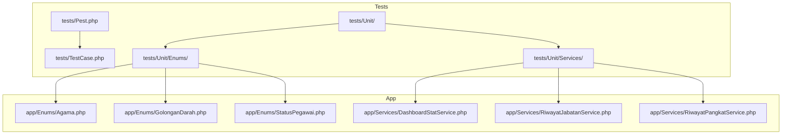
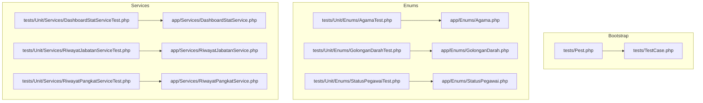
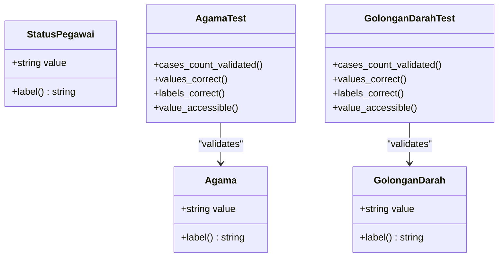
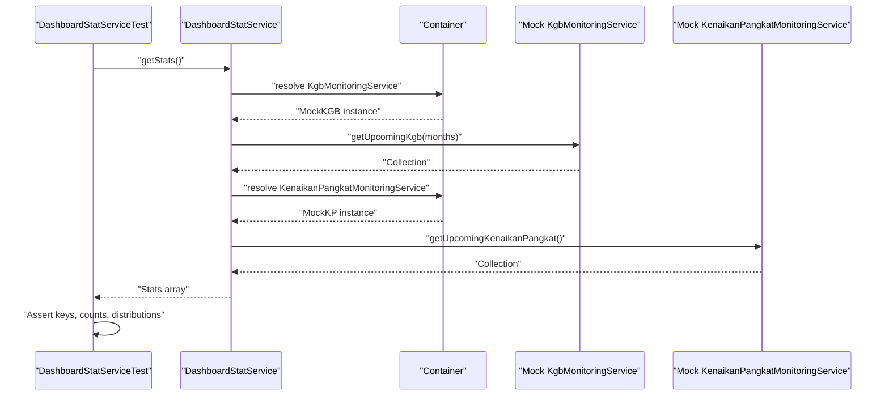
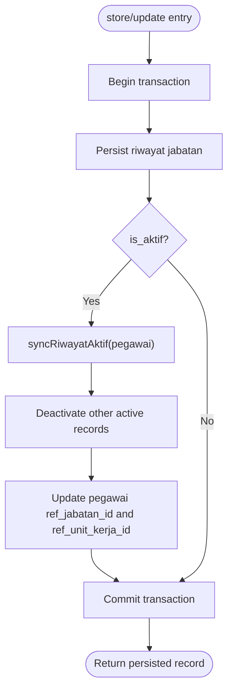
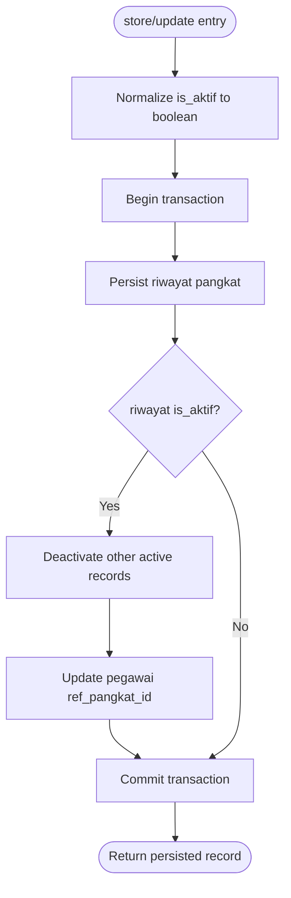
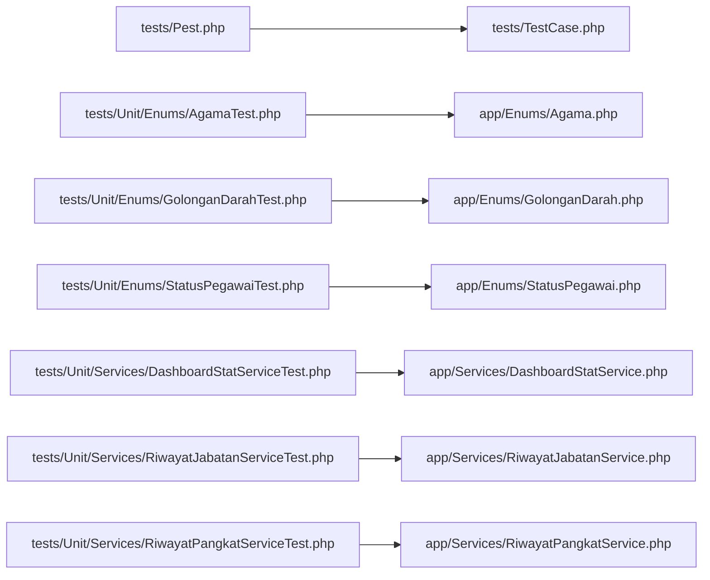

# Unit Testing

<cite>
**Referenced Files in This Document**
- [tests/TestCase.php](file://tests/TestCase.php)
- [tests/Pest.php](file://tests/Pest.php)
- [app/Enums/Agama.php](file://app/Enums/Agama.php)
- [app/Enums/GolonganDarah.php](file://app/Enums/GolonganDarah.php)
- [app/Enums/StatusPegawai.php](file://app/Enums/StatusPegawai.php)
- [tests/Unit/Enums/AgamaTest.php](file://tests/Unit/Enums/AgamaTest.php)
- [tests/Unit/Enums/GolonganDarahTest.php](file://tests/Unit/Enums/GolonganDarahTest.php)
- [tests/Unit/Enums/HubunganKeluargaTest.php](file://tests/Unit/Enums/HubunganKeluargaTest.php)
- [tests/Unit/Enums/JenisJabatanTest.php](file://tests/Unit/Enums/JenisJabatanTest.php)
- [tests/Unit/Enums/JenisKelaminTest.php](file://tests/Unit/Enums/JenisKelaminTest.php)
- [tests/Unit/Enums/JenjangPendidikanTest.php](file://tests/Unit/Enums/JenjangPendidikanTest.php)
- [tests/Unit/Enums/StatusKepegawaianTest.php](file://tests/Unit/Enums/StatusKepegawaianTest.php)
- [tests/Unit/Enums/StatusPegawaiTest.php](file://tests/Unit/Enums/StatusPegawaiTest.php)
- [tests/Unit/Enums/StatusPerkawinanTest.php](file://tests/Unit/Enums/StatusPerkawinanTest.php)
- [app/Services/DashboardStatService.php](file://app/Services/DashboardStatService.php)
- [app/Services/RiwayatJabatanService.php](file://app/Services/RiwayatJabatanService.php)
- [app/Services/RiwayatPangkatService.php](file://app/Services/RiwayatPangkatService.php)
- [tests/Unit/Services/DashboardStatServiceTest.php](file://tests/Unit/Services/DashboardStatServiceTest.php)
- [tests/Unit/Services/RiwayatJabatanServiceTest.php](file://tests/Unit/Services/RiwayatJabatanServiceTest.php)
- [tests/Unit/Services/RiwayatPangkatServiceTest.php](file://tests/Unit/Services/RiwayatPangkatServiceTest.php)
</cite>

## Table of Contents
1. [Introduction](#introduction)
2. [Project Structure](#project-structure)
3. [Core Components](#core-components)
4. [Architecture Overview](#architecture-overview)
5. [Detailed Component Analysis](#detailed-component-analysis)
6. [Dependency Analysis](#dependency-analysis)
7. [Performance Considerations](#performance-considerations)
8. [Troubleshooting Guide](#troubleshooting-guide)
9. [Conclusion](#conclusion)

## Introduction
This document describes the unit testing methodology used in the Kepegawaian Apps project. It focuses on how individual components are tested, including enum validation, service-layer testing, and model-related patterns. It also documents the unit test architecture, assertion patterns, and mocking strategies used throughout the application. Concrete examples are drawn from the actual codebase to illustrate testing approaches for enums such as Agama, GolonganDarah, and StatusPegawai, as well as for service classes DashboardStatService, RiwayatJabatanService, and RiwayatPangkatService.

## Project Structure
The unit tests are organized under the tests/Unit directory, grouped by domain:
- Enums: tests/Unit/Enums
- Services: tests/Unit/Services

The shared base class and bootstrapping are centralized in tests/TestCase.php and tests/Pest.php. The Pest framework is configured to automatically seed IAM data and apply database refresh per test run.

**Diagram sources**
- [tests/Pest.php:1-16](file://tests/Pest.php#L1-L16)
- [tests/TestCase.php:1-17](file://tests/TestCase.php#L1-L17)
- [app/Enums/Agama.php:1-26](file://app/Enums/Agama.php#L1-L26)
- [app/Enums/GolonganDarah.php:1-22](file://app/Enums/GolonganDarah.php#L1-L22)
- [app/Enums/StatusPegawai.php:1-24](file://app/Enums/StatusPegawai.php#L1-L24)
- [app/Services/DashboardStatService.php:1-148](file://app/Services/DashboardStatService.php#L1-L148)
- [app/Services/RiwayatJabatanService.php:1-50](file://app/Services/RiwayatJabatanService.php#L1-L50)
- [app/Services/RiwayatPangkatService.php:1-55](file://app/Services/RiwayatPangkatService.php#L1-L55)

**Section sources**
- [tests/Pest.php:1-16](file://tests/Pest.php#L1-L16)
- [tests/TestCase.php:1-17](file://tests/TestCase.php#L1-L17)

## Core Components
This section outlines the unit testing architecture and patterns used for enums and services.

- Test bootstrap and helpers
  - tests/TestCase.php defines a shared base class with a helper to conditionally skip tests based on Fortify feature flags.
  - tests/Pest.php configures Pest to extend the base TestCase, apply RefreshDatabase, seed IAM data before each Feature test run, and sets the default test scope to Feature. While this primarily targets Feature tests, the base class and RefreshDatabase are available to Unit tests via uses() declarations.

- Assertion patterns
  - Pest assertions are used extensively (expect, it, and uses) to validate enum cases, values, labels, and service outputs.
  - For collections and arrays, assertions check keys, counts, and nested values.

- Mocking and container binding
  - Service tests demonstrate replacing external dependencies via container binding to inject mocks that return deterministic data for assertions.

- Factory-driven data creation
  - Unit tests rely on Eloquent factories to create realistic test data, ensuring isolation and repeatability.

**Section sources**
- [tests/TestCase.php:1-17](file://tests/TestCase.php#L1-L17)
- [tests/Pest.php:1-16](file://tests/Pest.php#L1-L16)

## Architecture Overview
The unit test architecture centers around Pest with a shared base class and database refresh. Enum tests validate the shape and behavior of PHP backed enums. Service tests validate business logic, transaction boundaries, and synchronization of related model attributes.

**Diagram sources**
- [tests/Pest.php:1-16](file://tests/Pest.php#L1-L16)
- [tests/TestCase.php:1-17](file://tests/TestCase.php#L1-L17)
- [app/Enums/Agama.php:1-26](file://app/Enums/Agama.php#L1-L26)
- [app/Enums/GolonganDarah.php:1-22](file://app/Enums/GolonganDarah.php#L1-L22)
- [app/Enums/StatusPegawai.php:1-24](file://app/Enums/StatusPegawai.php#L1-L24)
- [tests/Unit/Enums/AgamaTest.php:1-33](file://tests/Unit/Enums/AgamaTest.php#L1-L33)
- [tests/Unit/Enums/GolonganDarahTest.php:1-29](file://tests/Unit/Enums/GolonganDarahTest.php#L1-L29)
- [tests/Unit/Enums/StatusPegawaiTest.php](file://tests/Unit/Enums/StatusPegawaiTest.php)
- [app/Services/DashboardStatService.php:1-148](file://app/Services/DashboardStatService.php#L1-L148)
- [app/Services/RiwayatJabatanService.php:1-50](file://app/Services/RiwayatJabatanService.php#L1-L50)
- [app/Services/RiwayatPangkatService.php:1-55](file://app/Services/RiwayatPangkatService.php#L1-L55)
- [tests/Unit/Services/DashboardStatServiceTest.php:1-128](file://tests/Unit/Services/DashboardStatServiceTest.php#L1-L128)
- [tests/Unit/Services/RiwayatJabatanServiceTest.php:1-92](file://tests/Unit/Services/RiwayatJabatanServiceTest.php#L1-L92)
- [tests/Unit/Services/RiwayatPangkatServiceTest.php:1-96](file://tests/Unit/Services/RiwayatPangkatServiceTest.php#L1-L96)

## Detailed Component Analysis

### Enum Testing Patterns
Enum tests validate:
- Presence and count of enum cases
- Correctness of underlying string values
- Consistency of label() outputs
- Access to scalar value property

Examples from the codebase:
- Agama enum tests assert the number of cases, presence of expected values, correctness of labels, and access to the value property.
- GolonganDarah enum tests mirror the Agama pattern with its own set of cases and labels.
- Additional enum tests exist for related enums under tests/Unit/Enums/*.

**Diagram sources**
- [app/Enums/Agama.php:1-26](file://app/Enums/Agama.php#L1-L26)
- [app/Enums/GolonganDarah.php:1-22](file://app/Enums/GolonganDarah.php#L1-L22)
- [app/Enums/StatusPegawai.php:1-24](file://app/Enums/StatusPegawai.php#L1-L24)
- [tests/Unit/Enums/AgamaTest.php:1-33](file://tests/Unit/Enums/AgamaTest.php#L1-L33)
- [tests/Unit/Enums/GolonganDarahTest.php:1-29](file://tests/Unit/Enums/GolonganDarahTest.php#L1-L29)

**Section sources**
- [tests/Unit/Enums/AgamaTest.php:1-33](file://tests/Unit/Enums/AgamaTest.php#L1-L33)
- [tests/Unit/Enums/GolonganDarahTest.php:1-29](file://tests/Unit/Enums/GolonganDarahTest.php#L1-L29)
- [app/Enums/Agama.php:1-26](file://app/Enums/Agama.php#L1-L26)
- [app/Enums/GolonganDarah.php:1-22](file://app/Enums/GolonganDarah.php#L1-L22)
- [app/Enums/StatusPegawai.php:1-24](file://app/Enums/StatusPegawai.php#L1-L24)

### Service Layer Testing: DashboardStatService
This service aggregates dashboard metrics by querying related models and delegating eligibility checks to monitoring services. Unit tests validate:
- Output structure and keys
- Counts and distributions for active employees, units, genders, positions, education
- Upcoming KGB and Kenaikan Pangkat counts derived from injected mocks

Mocking strategy:
- Uses the container to bind mock instances of KgbMonitoringService and KenaikanPangkatMonitoringService, returning predefined collections for assertions.

**Diagram sources**
- [tests/Unit/Services/DashboardStatServiceTest.php:1-128](file://tests/Unit/Services/DashboardStatServiceTest.php#L1-L128)
- [app/Services/DashboardStatService.php:1-148](file://app/Services/DashboardStatService.php#L1-L148)

**Section sources**
- [tests/Unit/Services/DashboardStatServiceTest.php:1-128](file://tests/Unit/Services/DashboardStatServiceTest.php#L1-L128)
- [app/Services/DashboardStatService.php:1-148](file://app/Services/DashboardStatService.php#L1-L148)

### Service Layer Testing: RiwayatJabatanService
This service manages jabatan (position) history for pegawai (staff), enforcing that only one active record exists per person and synchronizing the pegawai’s current position references. Unit tests validate:
- Creating an active riwayat jabatan and deactivating previous active records
- Updating an existing record to activate it and synchronize pegawai references
- Explicitly syncing active records to deactivate others and update pegawai references

**Diagram sources**
- [app/Services/RiwayatJabatanService.php:1-50](file://app/Services/RiwayatJabatanService.php#L1-L50)
- [tests/Unit/Services/RiwayatJabatanServiceTest.php:1-92](file://tests/Unit/Services/RiwayatJabatanServiceTest.php#L1-L92)

**Section sources**
- [app/Services/RiwayatJabatanService.php:1-50](file://app/Services/RiwayatJabatanService.php#L1-L50)
- [tests/Unit/Services/RiwayatJabatanServiceTest.php:1-92](file://tests/Unit/Services/RiwayatJabatanServiceTest.php#L1-L92)

### Service Layer Testing: RiwayatPangkatService
This service manages pangkat (rank) history for pegawai, enforcing that only one active record exists per person and updating the pegawai’s current rank reference. Unit tests validate:
- Storing a new active record and deactivating other active records
- Handling missing or falsy is_aktif values by forcing inactive state
- Updating an existing record to activate it and synchronize pegawai references

**Diagram sources**
- [app/Services/RiwayatPangkatService.php:1-55](file://app/Services/RiwayatPangkatService.php#L1-L55)
- [tests/Unit/Services/RiwayatPangkatServiceTest.php:1-96](file://tests/Unit/Services/RiwayatPangkatServiceTest.php#L1-L96)

**Section sources**
- [app/Services/RiwayatPangkatService.php:1-55](file://app/Services/RiwayatPangkatService.php#L1-L55)
- [tests/Unit/Services/RiwayatPangkatServiceTest.php:1-96](file://tests/Unit/Services/RiwayatPangkatServiceTest.php#L1-L96)

### Test Organization, Naming Conventions, and Isolation Techniques
- Organization
  - Enum tests live under tests/Unit/Enums/*. Service tests live under tests/Unit/Services/*. This keeps concerns separated and makes it easy to locate tests for a given component.
- Naming conventions
  - Enum tests use descriptive names such as "memiliki kasus yang benar", "memiliki value yang benar", "memiliki label yang benar untuk setiap kasus", and "dapat mengakses value". These names clearly communicate the assertion being made.
  - Service tests use imperative phrasing like "store creates active riwayat jabatan and syncs pegawai data", "update activates riwayat jabatan and syncs pegawai data", and "syncRiwayatAktif deactivates other records and updates pegawai references".
- Isolation techniques
  - RefreshDatabase is applied via uses() declarations in service tests to ensure a clean database state per test.
  - Factories are used to create minimal, reproducible datasets for each scenario.
  - Container binding replaces external dependencies with mocks to isolate the service under test.

**Section sources**
- [tests/Unit/Enums/AgamaTest.php:1-33](file://tests/Unit/Enums/AgamaTest.php#L1-L33)
- [tests/Unit/Enums/GolonganDarahTest.php:1-29](file://tests/Unit/Enums/GolonganDarahTest.php#L1-L29)
- [tests/Unit/Services/DashboardStatServiceTest.php:1-128](file://tests/Unit/Services/DashboardStatServiceTest.php#L1-L128)
- [tests/Unit/Services/RiwayatJabatanServiceTest.php:1-92](file://tests/Unit/Services/RiwayatJabatanServiceTest.php#L1-L92)
- [tests/Unit/Services/RiwayatPangkatServiceTest.php:1-96](file://tests/Unit/Services/RiwayatPangkatServiceTest.php#L1-L96)

## Dependency Analysis
The unit tests depend on:
- Shared base class and Pest configuration for bootstrapping
- Eloquent factories for model data
- Container-bound mocks for external monitoring services
- Enum classes for validation

**Diagram sources**
- [tests/Pest.php:1-16](file://tests/Pest.php#L1-L16)
- [tests/TestCase.php:1-17](file://tests/TestCase.php#L1-L17)
- [tests/Unit/Enums/AgamaTest.php:1-33](file://tests/Unit/Enums/AgamaTest.php#L1-L33)
- [app/Enums/Agama.php:1-26](file://app/Enums/Agama.php#L1-L26)
- [tests/Unit/Enums/GolonganDarahTest.php:1-29](file://tests/Unit/Enums/GolonganDarahTest.php#L1-L29)
- [app/Enums/GolonganDarah.php:1-22](file://app/Enums/GolonganDarah.php#L1-L22)
- [tests/Unit/Enums/StatusPegawaiTest.php](file://tests/Unit/Enums/StatusPegawaiTest.php)
- [app/Enums/StatusPegawai.php:1-24](file://app/Enums/StatusPegawai.php#L1-L24)
- [tests/Unit/Services/DashboardStatServiceTest.php:1-128](file://tests/Unit/Services/DashboardStatServiceTest.php#L1-L128)
- [app/Services/DashboardStatService.php:1-148](file://app/Services/DashboardStatService.php#L1-L148)
- [tests/Unit/Services/RiwayatJabatanServiceTest.php:1-92](file://tests/Unit/Services/RiwayatJabatanServiceTest.php#L1-L92)
- [app/Services/RiwayatJabatanService.php:1-50](file://app/Services/RiwayatJabatanService.php#L1-L50)
- [tests/Unit/Services/RiwayatPangkatServiceTest.php:1-96](file://tests/Unit/Services/RiwayatPangkatServiceTest.php#L1-L96)
- [app/Services/RiwayatPangkatService.php:1-55](file://app/Services/RiwayatPangkatService.php#L1-L55)

**Section sources**
- [tests/Pest.php:1-16](file://tests/Pest.php#L1-L16)
- [tests/TestCase.php:1-17](file://tests/TestCase.php#L1-L17)

## Performance Considerations
- Use factories to minimize database overhead and keep tests fast.
- Prefer container binding for external services to avoid real network calls or heavy computations during unit tests.
- Keep assertions focused and avoid redundant queries inside loops; leverage collection helpers and precomputed aggregations.
- Use RefreshDatabase judiciously; while it ensures isolation, it can increase test runtime if overused. Group related tests to reuse prepared data when safe.

## Troubleshooting Guide
Common issues and resolutions:
- Missing IAM data causing middleware or factory failures
  - Ensure IAM seeder is loaded before Feature tests run. The Pest bootstrap seeds IAM data for Feature tests; Unit tests relying on IAM-related factories should either seed similarly or adjust expectations accordingly.
- Enum label mismatches
  - Validate enum label() method outputs against expected UI labels. Confirm enum cases and values align with application requirements.
- Transaction boundary errors
  - When testing services that use transactions, ensure the test does not prematurely commit or rollback the transaction. Use the provided uses() declarations to maintain proper lifecycle.
- Mocked service behavior
  - When asserting counts from monitoring services, verify that the bound mock returns the expected collection shape and items. Adjust mock return values to reflect edge cases (empty collections, single item, mixed statuses).

**Section sources**
- [tests/Pest.php:1-16](file://tests/Pest.php#L1-L16)
- [tests/TestCase.php:1-17](file://tests/TestCase.php#L1-L17)

## Conclusion
The Kepegawaian Apps unit testing strategy emphasizes clear separation of concerns, robust assertion patterns, and pragmatic isolation techniques. Enums are validated for completeness and label correctness. Services are tested for transactional integrity, synchronization logic, and integration points via container-bound mocks. By following the established patterns and conventions, contributors can reliably add and maintain unit tests that are fast, readable, and resilient.